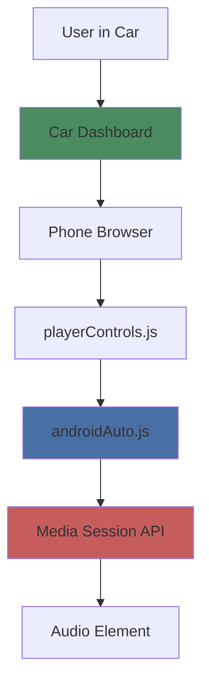
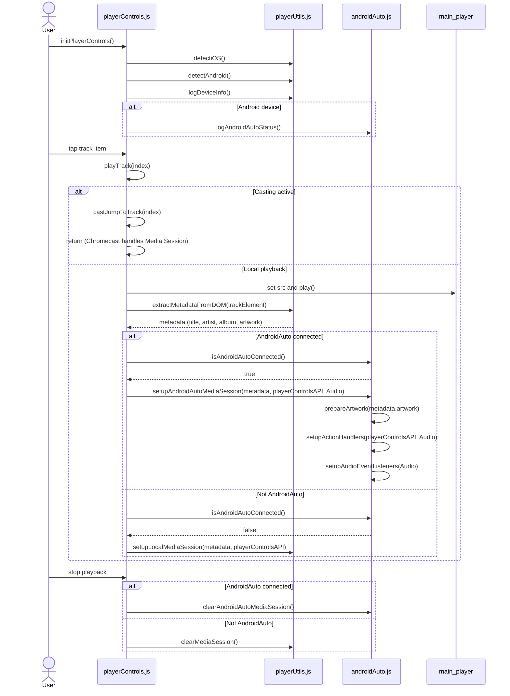
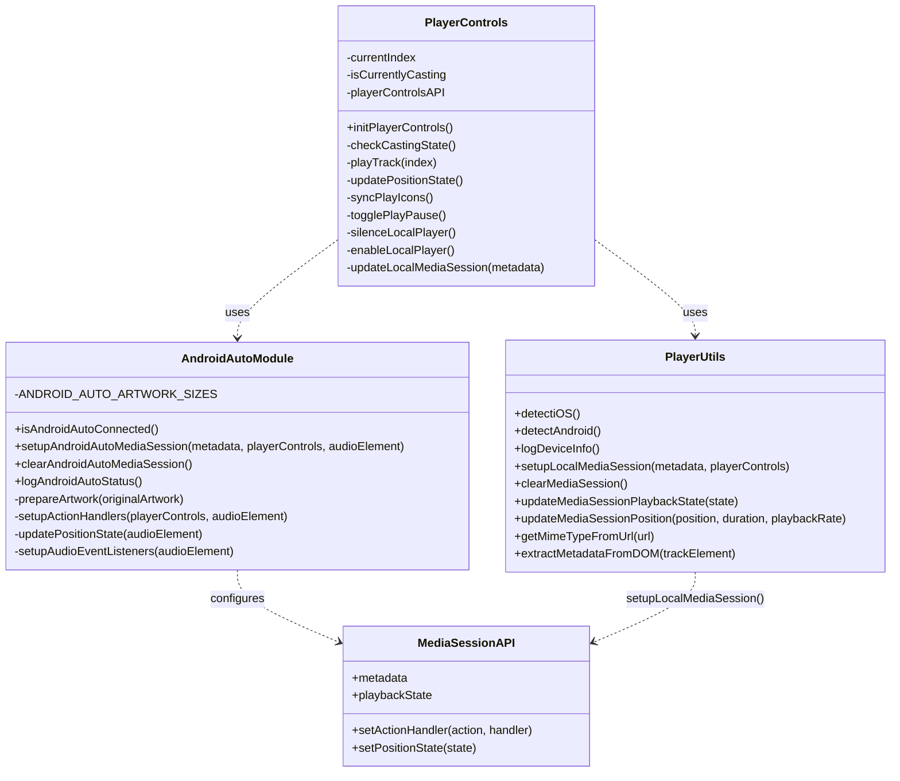

# Android Auto Integration

{ align=right width="90" }

Mixtape Society supports Android Auto for seamless in-car playback through the Media Session API, providing steering wheel controls, dashboard integration, and voice command support.

---

## 🎯 Overview

Android Auto integration enables:

- **Dashboard integration** - Control from car touchscreen
- **Voice commands** - "OK Google, pause", "next song"
- **Steering wheel controls** - Physical car buttons
- **Safe driving mode** - Simplified, distraction-free interface
- **Full metadata display** - Album art and track info on display
- **Automatic connection** - Works when phone connects to car

### Key Differences from Chromecast

| Feature | Android Auto | Chromecast |
|---------|-------------|------------|
| **Network** | Local playback | WiFi casting |
| **Setup** | Automatic | Manual device selection |
| **Server Reqs** | None | CORS + Range requests |
| **API** | Media Session only | Cast SDK + Media Session |
| **Artwork** | Platform-optimized | Single size |
| **Seeking** | Built-in | Requires range requests |

Android Auto is **simpler** - it's just enhanced Media Session API with no network complexity.

---

## 🏗️ Architecture

### System Overview



### Component Interaction



### Class Relationships



---

## 🚀 Quick Start

### Prerequisites

**User Requirements:**
- Android phone (Android 5.0+)
- Car with Android Auto support OR Android Auto app
- USB cable or wireless Android Auto

**Developer Requirements:**
- Media Session API support (already in Mixtape Society)
- Cover art optimization endpoints (already implemented)

### Testing Connection

1. **Connect phone to car** (USB or wireless)
2. **Open Mixtape Society** in browser
3. **Play a mixtape**
4. **Check car display** - should show track info
5. **Test controls** - steering wheel buttons, voice commands

### Verification

Check browser console for:
```
🚗 Android Auto Status:
   Connected: Yes ✅
   Media Session API: Available ✅
   User Agent: ... Android ... automotive ...
```

---

## 📦 Core Components

### 1. Detection Module

**File:** `static/js/player/androidAuto.js`

**Detection logic:**
```javascript
export function isAndroidAutoConnected() {
    const ua = navigator.userAgent.toLowerCase();
    const isAndroidAuto = ua.includes('android') && (
        ua.includes('vehicle') ||
        ua.includes('automotive') ||
        document.referrer.includes('android-auto')
    );

    const hasAutoAPIs = 'getInstalledRelatedApps' in navigator;

    return isAndroidAuto || hasAutoAPIs;
}
```

**User agent patterns:**
- Contains "android"
- Contains "vehicle" OR "automotive"
- Referrer includes "android-auto"

### 2. Media Session Setup

**Enhanced for Android Auto:**

```javascript
export function setupAndroidAutoMediaSession(metadata, playerControls, audioElement) {
    // 1. Set metadata with optimized artwork
    const artwork = prepareArtwork(metadata.artwork);

    navigator.mediaSession.metadata = new MediaMetadata({
        title: metadata.title || 'Unknown Track',
        artist: metadata.artist || 'Unknown Artist',
        album: metadata.album || 'Mixtape',
        artwork: artwork  // Multiple sizes for Android Auto
    });

    // 2. Set playback state
    navigator.mediaSession.playbackState = audioElement.paused ? 'paused' : 'playing';

    // 3. Set ALL action handlers (including seek)
    setupActionHandlers(playerControls, audioElement);

    // 4. Set position state (CRITICAL for seeking)
    updatePositionState(audioElement);

    // 5. Listen for audio events
    setupAudioEventListeners(audioElement);
}
```

### 3. Artwork Optimization

**Android Auto requires multiple sizes:**

```javascript
const ANDROID_AUTO_ARTWORK_SIZES = [
    { size: '96x96', type: 'image/jpeg' },    // Required minimum
    { size: '128x128', type: 'image/jpeg' },  // Recommended
    { size: '192x192', type: 'image/jpeg' },  // Optimal
    { size: '256x256', type: 'image/jpeg' },  // High quality
    { size: '512x512', type: 'image/jpeg' }   // Maximum
];
```

**Platform detection in playerUtils.js:**

```javascript
export function extractMetadataFromDOM(trackElement) {
    const android = detectAndroid();

    if (android && android.isAndroidAuto) {
        // Request all sizes for Android Auto
        artwork = [
            { src: `/covers/${slug}_96x96.jpg`, sizes: '96x96', type: mimeType },
            { src: `/covers/${slug}_128x128.jpg`, sizes: '128x128', type: mimeType },
            { src: `/covers/${slug}_192x192.jpg`, sizes: '192x192', type: mimeType },
            { src: `/covers/${slug}_256x256.jpg`, sizes: '256x256', type: mimeType },
            { src: `/covers/${slug}_512x512.jpg`, sizes: '512x512', type: mimeType }
        ];
    }
}
```

### 4. Action Handlers

**Complete set for Android Auto:**

```javascript
function setupActionHandlers(playerControls, audioElement) {
    // Basic playback
    navigator.mediaSession.setActionHandler('play', () => playerControls.play());
    navigator.mediaSession.setActionHandler('pause', () => playerControls.pause());
    navigator.mediaSession.setActionHandler('stop', () => {
        playerControls.pause();
        audioElement.currentTime = 0;
    });

    // Track navigation
    navigator.mediaSession.setActionHandler('previoustrack', () => playerControls.previous());
    navigator.mediaSession.setActionHandler('nexttrack', () => playerControls.next());

    // Seeking (CRITICAL for Android Auto)
    navigator.mediaSession.setActionHandler('seekto', (details) => {
        if (details.seekTime !== undefined) {
            audioElement.currentTime = details.seekTime;
            updatePositionState(audioElement);
        }
    });

    // Optional: Seek forward/backward (10 seconds)
    navigator.mediaSession.setActionHandler('seekforward', () => {
        audioElement.currentTime = Math.min(
            audioElement.currentTime + 10,
            audioElement.duration
        );
    });

    navigator.mediaSession.setActionHandler('seekbackward', () => {
        audioElement.currentTime = Math.max(
            audioElement.currentTime - 10,
            0
        );
    });
}
```

### 5. Position State Management

**Updates every second during playback:**

```javascript
function updatePositionState(audioElement) {
    if (!('setPositionState' in navigator.mediaSession)) return;

    if (audioElement.duration && !isNaN(audioElement.duration)) {
        try {
            navigator.mediaSession.setPositionState({
                duration: audioElement.duration,
                playbackRate: audioElement.playbackRate,
                position: Math.min(audioElement.currentTime, audioElement.duration)
            });
        } catch (error) {
            console.warn('Could not set position state:', error);
        }
    }
}

// Update automatically during playback
let positionUpdateInterval;

audioElement.addEventListener('play', () => {
    positionUpdateInterval = setInterval(() => {
        updatePositionState(audioElement);
    }, 1000);  // Update every second
});

audioElement.addEventListener('pause', () => {
    clearInterval(positionUpdateInterval);
});
```

---

## 🎨 How It Works

### User Journey

1. **User connects phone to car**
   - USB cable or wireless Android Auto
   - Car recognizes Android Auto device

2. **User opens Mixtape Society**
   - Browser detects Android Auto environment
   - `isAndroidAutoConnected()` returns true

3. **User plays a mixtape**
   - `setupAndroidAutoMediaSession()` called
   - Enhanced metadata with multiple cover sizes
   - All action handlers configured

4. **Track displays on car dashboard**
   - Cover art (optimal size selected)
   - Track title and artist
   - Album name

5. **User controls playback**
   - Steering wheel buttons → action handlers
   - Voice commands → Media Session API
   - Touchscreen → browser controls

6. **Seeking works seamlessly**
   - Car scrubs timeline → `seekto` handler
   - Position updates every second
   - Accurate progress display

### Technical Flow

**Initialization:**
```
initPlayerControls()
  → detectAndroid()
  → logAndroidAutoStatus()
  → Ready for playback
```

**Track Change:**
```
playTrack(index)
  → extractMetadataFromDOM()
    → Detect Android Auto
    → Build artwork array (5 sizes)
  → setupAndroidAutoMediaSession()
    → Set metadata
    → Configure action handlers
    → Start position updates
```

**User Interaction:**
```
User presses steering wheel button
  → Car sends Media Session event
  → Action handler fires
  → Player responds (play/pause/next/etc)
  → UI updates
```

---

## 🔧 Backend Requirements

### Cover Art Endpoints

**Required endpoints** (already implemented):

```
GET /covers/{slug}_96x96.jpg
GET /covers/{slug}_128x128.jpg
GET /covers/{slug}_192x192.jpg
GET /covers/{slug}_256x256.jpg
GET /covers/{slug}_512x512.jpg
```

**Implementation:** See [Backend Implementation Guide](backend-implementation.md)

### No Special Server Requirements

Unlike Chromecast, Android Auto requires **no server changes**:

- ❌ No CORS headers needed (local playback)
- ❌ No range request handling needed
- ❌ No special MIME types
- ✅ Just standard audio streaming

The complexity is all client-side.

---

## 📱 Platform Support

### Android Auto (In-Car)

**Full support:**
- ✅ Dashboard integration
- ✅ Steering wheel controls
- ✅ Voice commands
- ✅ Position state and seeking
- ✅ Multiple cover art sizes

**Requirements:**
- Android 5.0+ phone
- Android Auto compatible car OR Android Auto app
- Media Session API support (all modern Android)

### Android (Not in Car)

**Standard Media Session:**
- ✅ Notification controls
- ✅ Lock screen controls
- ✅ Basic metadata
- ✅ Single cover art size

**Difference:**
Android Auto detection returns false, so it falls back to standard Media Session setup via `playerUtils.setupLocalMediaSession()`.

### Other Platforms

**iOS, Desktop:**
- Standard Media Session API
- No Android Auto enhancements
- Single cover art size

---

## 🧪 Testing

For complete testing procedures, see the [Testing Guide](testing-guide.md).

**Quick checklist:**
- [ ] Detection works (console shows "Android Auto Connected")
- [ ] Cover art displays on dashboard
- [ ] Metadata shows correctly (title, artist, album)
- [ ] Play/pause from steering wheel
- [ ] Next/previous track from controls
- [ ] Voice commands work ("OK Google, pause")
- [ ] Seeking from dashboard timeline
- [ ] Position updates in real-time

---

## 🐛 Troubleshooting

### Detection Issues

**Symptom:** Android Auto not detected when connected

**Check:**
```javascript
// In browser console:
navigator.userAgent
// Should contain "android" and ("vehicle" OR "automotive")
```

**Solutions:**
- Verify car is in Android Auto mode
- Check USB connection (or wireless pairing)
- Restart browser
- Check console for detection logs

### Cover Art Not Showing

**Symptom:** No album art on dashboard

**Check network tab:**
```
GET /covers/artist_album_96x96.jpg - Should return 200
GET /covers/artist_album_192x192.jpg - Should return 200
```

**Solutions:**
- Verify cover optimization is enabled
- Check cover endpoints return correct MIME type
- Ensure slugs match between frontend and backend

### Seeking Not Working

**Symptom:** Timeline scrubbing doesn't work

**Check:**
- Position state being set: `navigator.mediaSession.setPositionState(...)`
- Duration is valid: `audioElement.duration` is not NaN
- `seekto` handler is registered

**Debug:**
```javascript
// Add to setupActionHandlers:
navigator.mediaSession.setActionHandler('seekto', (details) => {
    console.log('🎯 Seek to:', details.seekTime);
    audioElement.currentTime = details.seekTime;
});
```

---

## 📚 Implementation Guides

### Detailed Documentation

- **[Frontend Integration](frontend-integration.md)**
  - JavaScript code changes
  - Platform detection
  - Metadata extraction
  - Action handler setup

- **[Backend Implementation](backend-implementation.md)**
  - Cover art optimization
  - Size generation
  - Endpoint configuration

- **[Testing Guide](testing-guide.md)**
  - Test environment setup
  - Validation procedures
  - Common test cases
  - Debug logging

### Related Technologies

- **[Chromecast Integration](../chromecast/integration.md)**
  - Alternative casting method
  - Network-based playback
  - Different use case

- **[Player Controls](../routes/play/modules/playerControls.md)**
  - UI control coordination
  - State management

- **[Cover Art System](../cover-art/overview.md)**
  - Size optimization
  - Image processing

---

## 🎯 Future Enhancements

### Planned

- **Lyrics sync** - Display synchronized lyrics on dashboard
- **Playlist editing** - Reorder queue from car interface
- **Enhanced voice** - Natural language commands

### Under Consideration

- **Multiple queues** - Save different playlists for different trips
- **Offline mode** - Download mixtapes for offline in-car playback
- **Car profile** - Remember settings per vehicle

---

*For implementation details, see the [Frontend Integration Guide](frontend-integration.md) and [Backend Implementation Guide](backend-implementation.md).*
