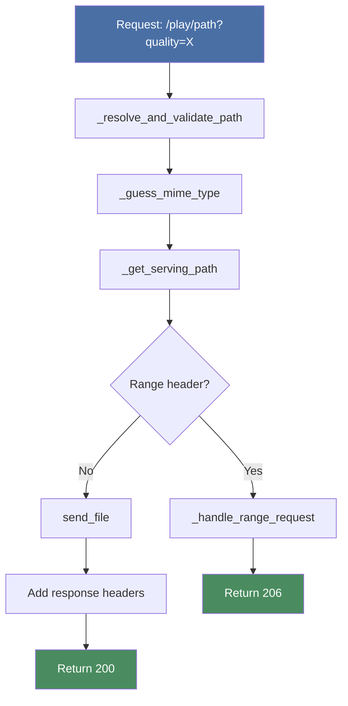
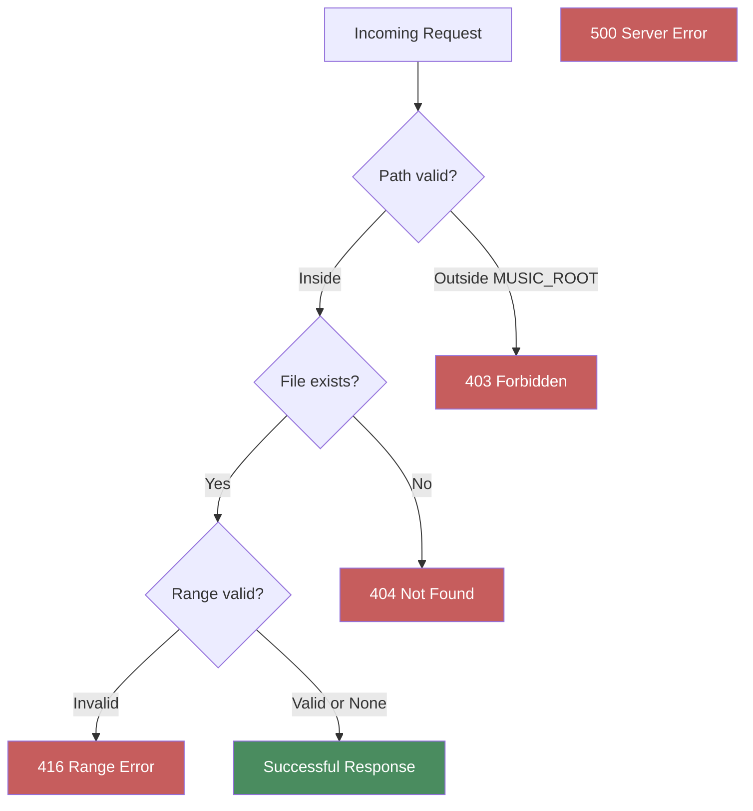

# Audio Streaming

{ align=right width="90" }

> Part of [Playback Routes](index.md)

This page documents the core audio streaming implementation in Mixtape Society, including path validation, MIME type detection, file serving, and the public mixtape player page.

---

## 🎯 Overview

The `stream_audio()` function is the central handler for audio file requests. It orchestrates path validation, MIME type detection, quality selection, and response construction.

**Key responsibilities:**

- Validate file paths (prevent directory traversal attacks)
- Detect correct MIME type for audio files
- Select appropriate file version (original or cached)
- Construct proper HTTP responses with security headers
- Handle errors gracefully with appropriate status codes

---

## 🔒 Path Validation

### _resolve_and_validate_path()

**Purpose:** Ensure requested path is safe and exists

**Signature:**

```python
def _resolve_and_validate_path(file_path: str) -> Path
```

**Implementation:**

```python
def _resolve_and_validate_path(file_path: str) -> Path:
    """
    Validate and resolve audio file path

    Security: Prevents directory traversal attacks
    Returns: Absolute path if valid
    Raises: 403 if outside MUSIC_ROOT, 404 if not found
    """
    music_root = Path(current_app.config["MUSIC_ROOT"]).resolve()
    full_path = (music_root / file_path).resolve()

    # Security check: Ensure path is within MUSIC_ROOT
    if not str(full_path).startswith(str(music_root)):
        logger.warning(f"Path traversal attempt: {file_path}")
        abort(403)

    # Existence check
    if not full_path.exists():
        logger.warning(f"File not found: {full_path}")
        abort(404)

    return full_path
```

**Security features:**

1. **Path resolution:** Resolves symlinks and `..` references
2. **Boundary check:** Ensures result stays within `MUSIC_ROOT`
3. **Existence validation:** Confirms file exists before serving

**Attack prevention:**

```python
# These malicious paths are blocked:
../../../etc/passwd              # → 403 (outside MUSIC_ROOT)
../../app/config.py              # → 403 (outside MUSIC_ROOT)
artist/../../../sensitive.file   # → 403 (resolves outside boundary)
nonexistent.mp3                  # → 404 (doesn't exist)
```

**Logging:**

- **WARNING:** Path traversal attempts and missing files
- Includes attempted path for security auditing

---

## 🎵 MIME Type Detection

### _guess_mime_type()

**Purpose:** Determine correct Content-Type header for audio file

**Signature:**

```python
def _guess_mime_type(full_path: Path) -> str
```

**Implementation:**

```python
def _guess_mime_type(full_path: Path) -> str:
    """
    Guess MIME type from file extension

    Uses Python's mimetypes module with fallback map
    for less common audio formats
    """
    mime_type, _ = mimetypes.guess_type(str(full_path))

    # Fallback for audio formats not in standard mimetypes
    if not mime_type:
        extension = full_path.suffix.lower()
        fallback_map = {
            '.flac': 'audio/flac',
            '.m4a': 'audio/mp4',
            '.aac': 'audio/aac',
            '.ogg': 'audio/ogg',
            '.mp3': 'audio/mpeg',
            '.wav': 'audio/wav',
            '.opus': 'audio/opus',
        }
        mime_type = fallback_map.get(extension, 'application/octet-stream')

    return mime_type
```

**Supported formats:**

| Extension | MIME Type | Detection |
| --------- | --------- | --------- |
| `.mp3` | `audio/mpeg` | Standard mimetypes |
| `.flac` | `audio/flac` | Fallback map |
| `.m4a` | `audio/mp4` | Fallback map |
| `.aac` | `audio/aac` | Fallback map |
| `.ogg` | `audio/ogg` | Fallback map |
| `.wav` | `audio/wav` | Standard mimetypes |
| `.opus` | `audio/opus` | Fallback map |

**Why fallback map?**

Python's standard `mimetypes` module doesn't recognize some audio formats (FLAC, M4A) by default. The fallback ensures correct MIME types for all supported formats.

**Default fallback:**

Unknown extensions return `application/octet-stream` which browsers typically download rather than play.

---

## 🎛️ Streaming Logic

### stream_audio()

**Purpose:** Main route handler for audio streaming

**Route:**

```python
@play.route("/play/<path:file_path>")
def stream_audio(file_path: str) -> Response
```

**Flow diagram:**



**Implementation:**

```python
@play.route("/play/<path:file_path>")
def stream_audio(file_path: str) -> Response:
    """
    Stream audio file with quality selection and range support
    """
    # 1. Validate path
    full_path = _resolve_and_validate_path(file_path)

    # 2. Detect MIME type
    mime_type = _guess_mime_type(full_path)

    # 3. Get quality parameter
    quality = request.args.get("quality", "original")

    # 4. Select file to serve (original or cached)
    serve_path = _get_serving_path(
        full_path,
        quality,
        current_app.audio_cache,
        logger
    )

    # 5. Log streaming info
    logger.info(
        f"Streaming: {file_path} | "
        f"Quality: {quality} | "
        f"Serving: {serve_path.name}"
    )

    # 6. Handle range requests (for seeking)
    if request.headers.get("Range"):
        return _handle_range_request(
            serve_path,
            mime_type,
            request.headers.get("Range"),
            serve_path.stat().st_size
        )

    # 7. Serve full file
    response = send_file(
        serve_path,
        mimetype=mime_type,
        as_attachment=False,
        conditional=True
    )

    # 8. Add required headers
    response.headers["Accept-Ranges"] = "bytes"
    response.headers["Access-Control-Allow-Origin"] = "*"
    response.headers["Access-Control-Expose-Headers"] = \
        "Content-Type, Accept-Encoding, Range"
    response.headers["Cache-Control"] = "public, max-age=3600"

    return response
```

**Quality parameter:**

- `original` - Serve original file (default)
- `high` - Serve 256kbps MP3 (if cached)
- `medium` - Serve 192kbps MP3 (if cached)
- `low` - Serve 128kbps MP3 (if cached)

See [Quality & Caching](quality-caching.md) for details.

---

## 📋 Response Headers

### Required Headers

| Header | Value | Purpose |
| ------ | ----- | ------- |
| `Content-Type` | `audio/mpeg`, `audio/flac`, etc. | Tells browser how to play file |
| `Accept-Ranges` | `bytes` | Advertises range request support |
| `Access-Control-Allow-Origin` | `*` | Enables Chromecast (CORS) |
| `Access-Control-Expose-Headers` | `Content-Type, Accept-Encoding, Range` | Allows Chromecast to read range info |
| `Cache-Control` | `public, max-age=3600` | Caches response for 1 hour |

### Why CORS Headers?

**Problem:** Chromecast devices make cross-origin requests to your server

**Solution:** Allow all origins with wildcard CORS headers

```python
response.headers["Access-Control-Allow-Origin"] = "*"
response.headers["Access-Control-Expose-Headers"] = \
    "Content-Type, Accept-Encoding, Range"
```

**Security consideration:**

This is safe because:

- Audio files are intentionally public (shared mixtapes)
- No authentication credentials in responses
- Read-only operation (no state changes)

See [Chromecast Integration](../../device-integration/chromecast/integration.md#-backend-requirements) for details.

### Why Accept-Ranges?

**Purpose:** Tells clients seeking is supported

**Value:** `bytes` indicates byte-range requests are accepted

**Used by:**

- HTML5 `<audio>` element for seek bar
- Chromecast for seeking
- Video players for timeline scrubbing

---

## 🎭 Public Mixtape Page

### public_play()

**Purpose:** Render public player page for shared mixtapes

**Route:**

```python
@play.route("/share/<slug>")
def public_play(slug: str) -> Response
```

**Implementation:**

```python
@play.route("/share/<slug>")
def public_play(slug: str) -> Response:
    """
    Render public player page for a shared mixtape

    Returns 404 if mixtape doesn't exist
    """
    mixtape_manager = current_app.mixtape_manager

    # Load mixtape metadata
    mixtape = mixtape_manager.get(slug)

    if not mixtape:
        logger.warning(f"Mixtape not found: {slug}")
        abort(404)

    # Render player template
    return render_template(
        'play_mixtape.html',
        mixtape=mixtape,
        slug=slug
    )
```

**Template data:**

```python
{
    'mixtape': {
        'title': 'My Mixtape',
        'description': 'A collection of...',
        'tracks': [
            {
                'title': 'Song Title',
                'artist': 'Artist Name',
                'album': 'Album Name',
                'file_path': 'artist/album/song.mp3',
                'duration': 245
            },
            # ... more tracks
        ],
        'cover': 'slug.jpg',
        'liner_notes': 'Markdown formatted notes'
    },
    'slug': 'mixtape-slug'
}
```

**Frontend integration:**

The template includes JavaScript that:

- Initializes player controls
- Sets up Chromecast integration
- Configures Android Auto Media Session
- Handles adaptive theming from cover art

See: [Player Controls](../play/modules/playerControls.md)

---

## ⚠️ Error Handling

### HTTP Status Codes

| Code | Situation | Response |
| ---- | --------- | -------- |
| 200 | Successful full file stream | Complete audio file |
| 206 | Successful partial stream | Byte range of file |
| 403 | Path outside MUSIC_ROOT | `abort(403)` |
| 404 | File not found | `abort(404)` |
| 404 | Mixtape slug not found | `abort(404)` |
| 416 | Invalid range request | Range Not Satisfiable |
| 500 | Unexpected error | Internal Server Error |

### Error Flow



### Error Examples

**403 Forbidden:**

```bash
# Request
GET /play/../../etc/passwd

# Response
HTTP/1.1 403 Forbidden

# Log
WARNING: Path traversal attempt: ../../etc/passwd
```

**404 Not Found:**

```bash
# Request
GET /play/artist/album/nonexistent.mp3

# Response
HTTP/1.1 404 Not Found

# Log
WARNING: File not found: /music/artist/album/nonexistent.mp3
```

**416 Range Not Satisfiable:**

```bash
# Request
GET /play/artist/album/song.mp3
Range: bytes=9999999-

# Response (if file is 1000 bytes)
HTTP/1.1 416 Range Not Satisfiable
Content-Range: bytes */1000

# Log
WARNING: Invalid range request: bytes=9999999-
```

---

## 📊 Logging

### Log Levels

**INFO:** Normal operations

```log
INFO: Streaming: artist/album/song.mp3 | Quality: medium | Serving: song.mp3
INFO: Cache hit: artist/album/song.flac → medium quality
```

**WARNING:** Recoverable issues

```log
WARNING: Path traversal attempt: ../../etc/passwd
WARNING: File not found: artist/album/missing.mp3
WARNING: Cache miss: artist/album/song.flac (medium) - serving original
```

**ERROR:** Unexpected failures

```log
ERROR: Failed to read file: artist/album/song.mp3
ERROR: Exception in stream_audio: [exception details]
```

### Log Format

All logs include:

- **Timestamp:** ISO 8601 format
- **Level:** INFO, WARNING, ERROR
- **Context:** Function name, file path, action
- **Details:** Quality parameter, cache status, error messages

**Example:**

```log
2025-01-16 18:30:15 INFO [routes.play.stream_audio] Streaming: jazz/miles-davis/so-what.flac | Quality: medium | Serving: so-what.mp3
2025-01-16 18:30:15 INFO [audio_cache] Cache hit: jazz/miles-davis/so-what.flac → medium quality
```

---

## 🔧 Helper Functions Reference

### Function Summary

| Function | Parameters | Returns | Purpose |
| -------- | ---------- | ------- | ------- |
| `_resolve_and_validate_path` | `file_path: str` | `Path` | Validate and resolve file path |
| `_guess_mime_type` | `full_path: Path` | `str` | Detect MIME type from extension |
| `_get_serving_path` | `original_path: Path`<br>`quality: str`<br>`cache: AudioCache`<br>`logger: Logger` | `Path` | Select original or cached file |
| `stream_audio` | `file_path: str` | `Response` | Main streaming route handler |
| `public_play` | `slug: str` | `Response` | Render public player page |

For `_get_serving_path` details, see [Quality & Caching](quality-caching.md).

---

## 🧪 Testing

### Manual Testing

**Test basic streaming:**

```bash
curl -I http://localhost:5000/play/artist/album/track.mp3
```

**Expected response:**

```http
HTTP/1.1 200 OK
Content-Type: audio/mpeg
Accept-Ranges: bytes
Access-Control-Allow-Origin: *
Cache-Control: public, max-age=3600
```

**Test with quality parameter:**

```bash
curl -I http://localhost:5000/play/artist/album/track.flac?quality=medium
```

**Test public player:**

```bash
curl http://localhost:5000/share/my-mixtape
# Should return HTML
```

**Test error handling:**

```bash
# Path traversal (should get 403)
curl -I http://localhost:5000/play/../../etc/passwd

# Nonexistent file (should get 404)
curl -I http://localhost:5000/play/artist/album/missing.mp3
```

### Integration Testing

See [Range Requests](range-requests.md#-testing) for testing seeking functionality.

---

## 📚 Related Documentation

- **[Range Requests](range-requests.md)** - HTTP range support for seeking
- **[Quality & Caching](quality-caching.md)** - Quality selection and cache logic
- **[Media Integration](media-integration.md)** - How playback modes use these routes
- **[Chromecast Integration](../../device-integration/chromecast/integration.md)** - CORS requirements
- **[Audio Caching](server-cache-system.md)** - Cache implementation details

---

*Implementation: `src/routes/play.py`*
