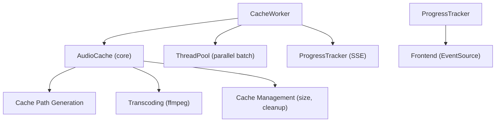
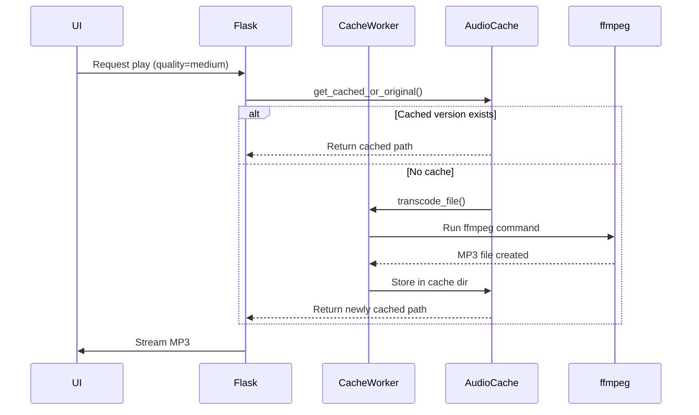
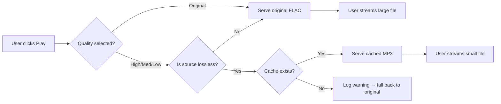

{ align=right width="90" }

# Audio Caching System

The audio‑caching subsystem automatically converts large lossless audio files (FLAC, WAV, AIFF, …) into smaller MP3 streams, dramatically reducing bandwidth while preserving a pleasant listening experience.

> **TL;DR** – The cache turns a 40 MB FLAC track into a ~5 MB MP3 (≈ 87 % bandwidth saving) and serves the MP3 via HTTP range requests.

## 📖 Overview

When streaming lossless audio over the web, bandwidth quickly becomes a bottleneck:

| Format | Approx. size (4‑min track) | Typical bitrate |
| ------ | ------------------------- | --------------- |
| **FLAC (original)** | **40‑50 MB** | ~1 000 kbps |
| **MP3 – High (256 kbps)** | **≈ 8 MB** | 256 kbps |
| **MP3 – Medium (192 kbps)** | **≈ 5 MB** | 192 kbps |
| **MP3 – Low (128 kbps)** | **≈ 3 MB** | 128 kbps |

> **Result:** A 4‑minute track drops from ~45 MB to ~5 MB (≈ 87 % bandwidth reduction) with negligible audible loss for casual listening.

The cache is **transparent** to the rest of the application:

* The UI requests a track → the Flask route asks `AudioCache` for a cached version.
* If a suitable MP3 exists, it is streamed via HTTP range requests.
* If not, the original file is streamed (or a background job creates the cache for the next request).

## 🏛️ Architecture Overview


```mermaid
graph TD
    A["AudioCache (core)"] --> B["Cache Path Generation"]
    A --> C["Transcoding (ffmpeg)"]
    A --> D["Cache Management (size, cleanup)"]

    E[CacheWorker] --> A
    E --> F["ThreadPool (parallel batch)"]
    E --> G["ProgressTracker (SSE)"]

    H[ProgressTracker] --> I["Frontend (EventSource)"]
```

* **`audio_cache.py`** – core logic (hash‑based filenames, transcoding, cache look‑ups).
* **`cache_worker.py`** – batch processing, thread‑pool parallelism, progress callbacks.
* **`progress_tracker.py`** – Server‑Sent Events (SSE) emitter that feeds the UI’s “caching progress” modal.

---

## ✨ Key Features

| Feature | Description |
| ------- | ----------- |
| **Automatic transcoding** | FLAC, WAV, AIFF, APE, ALAC → MP3 (high/medium/low). |
| **Multiple quality levels** | `high` (256 kbps), `medium` (192 kbps), `low` (128 kbps). |
| **Smart caching** | Only creates a cached file when the source is lossless and the cache is missing/out-of-date. |
| **Pre-caching on upload** | When a mixtape is saved, the system can generate caches automatically. |
| **Parallel batch processing** | Thread-pool (configurable workers) for fast bulk transcoding. |
| **Progress tracking** | Real-time SSE updates displayed in a Bootstrap modal. |
| **Cache management utilities** | Size calculation, age-based cleanup, full purge. |
| **Config-driven** | All knobs live in `src/config/config.py` (`AUDIO_CACHE_*`). |

## 📋 How It Works (Step‑by‑Step)

### Cache Path Generation


```mermaid
flowchart LR
    A[Original file path] --> B[Normalize & resolve]
    B --> C[MD5 hash of full path]
    C --> D[Compose filename: `<hash>_<quality>_<bitrate>.mp3`]
    D --> E["Cache directory (`AUDIO_CACHE_DIR`)"]
```

* The hash guarantees **collision‑free** filenames, even for identically named tracks in different folders.
* Example:
    *Original*: `/music/Radiohead/OK Computer/01 Airbag.flac`
    *Hash*: `a1b2c3…` → Cache file `a1b2c3_medium_192k.mp3`.

### Transcoding Flow


```mermaid
sequenceDiagram
    participant UI
    participant Flask
    participant CacheWorker
    participant AudioCache
    participant ffmpeg

    UI->>Flask: Request play (quality=medium)
    Flask->>AudioCache: get_cached_or_original()
    alt Cached version exists
        AudioCache-->>Flask: Return cached path
    else No cache
        AudioCache->>CacheWorker: transcode_file()
        CacheWorker->>ffmpeg: Run ffmpeg command
        ffmpeg-->>CacheWorker: MP3 file created
        CacheWorker->>AudioCache: Store in cache dir
        AudioCache-->>Flask: Return newly cached path
    end
    Flask->>UI: Stream MP3
```

* If a cached file is present, it is served immediately.
* Otherwise the worker **spawns ffmpeg**, writes the MP3, and returns the new path.

### Playback Flow


```mermaid
graph LR
    A[User clicks Play] --> B{Quality selected?}
    B -->|Original| C[Serve original FLAC]
    B -->|High/Med/Low| D{Is source lossless?}
    D -->|No| C
    D -->|Yes| E{Cache exists?}
    E -->|Yes| F[Serve cached MP3]
    E -->|No| G[Log warning → fall back to original]
    F --> H[User streams small file]
    C --> I[User streams large file]
```

## 🔌 API Reference

### AudioCache (core)

#### ::: src.audio_cache.audio_cache.AudioCache

### CacheWorker (batch & async)

#### ::: src.audio_cache.cache_worker.CacheWorker

### Convenience Scheduler

#### ::: src.audio_cache.cache_worker.schedule_mixtape_caching

### Progress Tracker (SSE)

#### ::: src.audio_cache.progress_tracker.get_progress_tracker

#### ::: src.audio_cache.progress_tracker.ProgressTracker

#### ::: src.audio_cache.progress_tracker.ProgressCallback

## 🛠️ Configuration Options

| Option | Default | Description |
| ------ | ------- | ----------- |
| `AUDIO_CACHE_DIR` | `"cache/audio"` | Directory where MP3 caches are stored (relative to DATA_ROOT). |
| `AUDIO_CACHE_ENABLED` | `True` | Master switch – set to `False` to bypass the entire subsystem. |
| `AUDIO_CACHE_DEFAULT_QUALITY` | `"medium"` | Quality used when a client does not specify one. |
| `AUDIO_CACHE_MAX_WORKERS` | `4` | Number of parallel threads for batch transcoding. |
| `AUDIO_CACHE_PRECACHE_ON_UPLOAD` | `True` | Auto-cache mixtape tracks when a mixtape is saved. |
| `AUDIO_CACHE_PRECACHE_QUALITIES` | `["medium"]` | List of qualities to pre-generate (e.g., `["low", "medium", "high"]`). |

> These values are defined in `src/config/config.py` and can be overridden with environment variables (e.g., `AUDIO_CACHE_MAX_WORKERS=8`).

---

## ⏳ Progress Tracking (SSE)

The progress modal in the editor UI subscribes to the endpoint:

```text
GET /editor/progress/<slug>
```

The server returns a **Server‑Sent Events** stream. Each event looks like:

```json
{
  "task_id": "summer-vibes",
  "step": "caching",
  "status": "in_progress",
  "message": "Caching track 3 of 15",
  "current": 3,
  "total": 15,
  "timestamp": "2024-09-28T12:34:56.789012"
}
```

The modal updates the progress bar, logs messages, and shows a final summary when the `status` becomes `completed` or `failed`.

> Implementation note:`ProgressCallback.track_cached()`, `track_skipped()`, and `track_failed()` are called from `CacheWorker` to emit the above events.

## 🔧 Troubleshooting FAQ

### Cache Misses – “Why isn’t my file being cached?”

| Symptom | Check | Fix |
| ------- | ----- | --- |
| Cache miss warning in logs | `grep -i "cache miss" app.log` | Verify `AUDIO_CACHE_ENABLED=True` and that the file’s suffix is in `should_transcode` (FLAC, WAV, AIFF, APE, ALAC). |
| Cache file exists but not found | `ls collection-data/cache/audio/` | Ensure the hash matches the current absolute path. If you moved the music folder, run `python debug_cache.py <MUSIC_ROOT> <REL_PATH> <CACHE_DIR>` (see debug_cache.py). |
| Cache never generated | `AUDIO_CACHE_PRECACHE_ON_UPLOAD=False` | Enable pre-caching or trigger it manually via `schedule_mixtape_caching`. |
| ffmpeg not found | `ffmpeg -version` | Install ffmpeg on the host (Ubuntu: `apt install ffmpeg`; Alpine: `apk add ffmpeg`). |
| Permission denied on cache dir | `ls -ld collection-data/cache/audio` | The Flask process must have write permission (owner UID = the container user). |
| High CPU usage during batch caching | `top while caching` | Reduce `AUDIO_CACHE_MAX_WORKERS` (e.g., `export AUDIO_CACHE_MAX_WORKERS=2`). |
| Stale cache after source file change | Compare timestamps (`stat -c %Y file`) | Run `cache.clear_cache()` or set `overwrite=True` in `transcode_file`. |

###  Transcoding Failures – “ffmpeg exited with error code 1”"

1. **Inspect the ffmpeg stderr** – it is logged by `AudioCache.transcode_file`.
2. Common culprits:
   * **Corrupt source file** – try re‑encoding the source with `ffmpeg -i inut.flac -c copy output.flac`.
   * **Unsupported codec** – ensure the source is a supported lossless format.
   * **Insufficient** disk space – check free space on the cache volume.
3. Manual test:

    ```bash
    ffmpeg -i "/music/Artist/Album/BadTrack.flac" -b:a 192k -y "/tmp/test.mp3"
    ```

    If this works, the problem is likely in the path handling (hash mismatch).

4. **Fix path mismatches** – run **debug_cache.py** (see the script in the repo) to compare the hash generated by the app vs. the one you expect.
