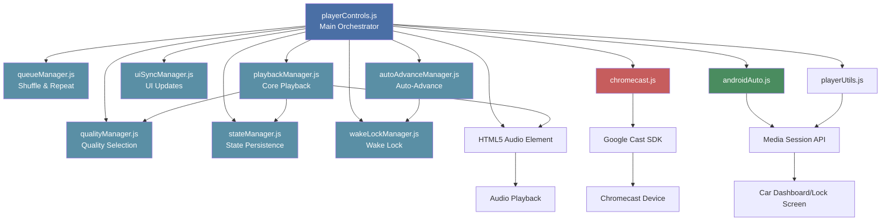
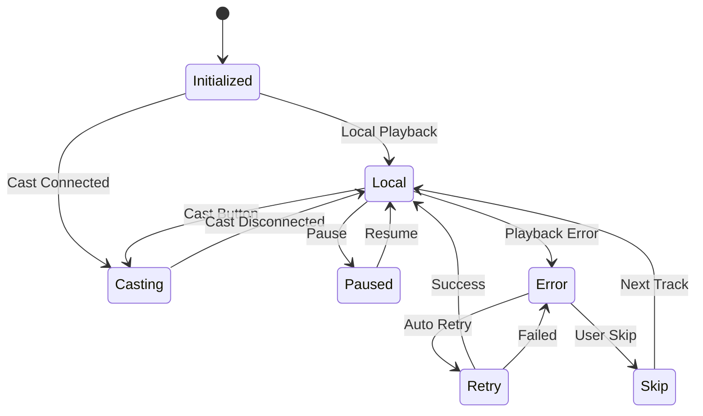

# Player Controls - Complete Documentation

{ align=right width="90" }

The Player Controls system is a modular architecture that manages all playback functionality in Mixtape Society. It consists of specialized managers coordinated by the main `playerControls.js` orchestrator, handling local playback, Chromecast casting, and Android Auto integration with a unified user experience.

---

## 🎯 Purpose

**Primary Responsibilities:**

- Coordinate playback across multiple modes (local, Chromecast, Android Auto)
- Manage track selection and queue navigation with shuffle and repeat modes
- Handle quality settings and preferences
- Synchronize UI state across all controls
- Route user actions to appropriate playback system
- Prevent conflicting playback states
- Manage playback state persistence (resume on reload)
- Handle errors gracefully with recovery options
- Maintain wake lock during playback to prevent app suspension
- Ensure seamless auto-advance on mobile devices with autoplay restrictions

**Key Design Principle:**
Modular architecture with specialized managers, each handling a specific concern, coordinated by a central orchestrator.

---

## 🏗️ Architecture

### Modular Structure

The player controls system is organized into focused managers:

```bash
player/
├── playerControls.js         Main orchestrator (1,000 lines)
├── queueManager.js           Shuffle & repeat logic (306 lines)
├── playbackManager.js        Core playback operations (192 lines)
├── uiSyncManager.js          UI updates & synchronization (178 lines)
├── autoAdvanceManager.js     Mobile auto-advance (137 lines)
├── qualityManager.js         Audio quality selection (93 lines)
├── stateManager.js           Playback state persistence (88 lines)
├── wakeLockManager.js        Wake lock management (75 lines)
├── playerUtils.js            Platform utilities
├── androidAuto.js            Android Auto integration
└── chromecast.js             Chromecast integration
```

### Component Relationships



### State Flow



---

## 🚀 Initialization

### Entry Point

```javascript
export function initPlayerControls() {
    // Initialization sequence:
    // 1. Get DOM elements
    // 2. Initialize managers (queue, state, wake lock, quality, UI, playback, auto-advance)
    // 3. Set up audio control interception
    // 4. Initialize cast listeners
    // 5. Initialize event listeners
    // 6. Restore queue state (shuffle & repeat)
    // 7. Restore playback state (if available)
    // 8. Set up Media Session
}
```

### Manager Initialization

The main orchestrator creates and coordinates specialized managers:

```javascript
// Extract mixtape slug from URL for unique storage keys
const getMixtapeSlug = () => {
    const match = window.location.pathname.match(/\/share\/([^\/]+)/);
    return match ? match[1] : 'default';
};

const mixtapeSlug = getMixtapeSlug();  // e.g., "summer-vibes-2024"

// Initialize managers with per-mixtape storage
const queueManager = new QueueManager(trackItems.length, mixtapeSlug);
const stateManager = new StateManager(mixtapeSlug);
const wakeLockManager = new WakeLockManager();
const qualityManager = new QualityManager('audioQuality');
const uiManager = new UISyncManager(container, trackItems, bottomTitle, bottomArtistAlbum, bottomCover);
const playbackManager = new PlaybackManager(player, qualityManager, stateManager);
const autoAdvanceManager = new AutoAdvanceManager(player, wakeLockManager);
```

**Note:** `QueueManager` and `StateManager` now require the mixtape slug for isolated storage per mixtape.

---

## 📦 Manager Modules

### QueueManager (`queueManager.js`)

**Purpose:** Manages track queue navigation with shuffle and repeat functionality.

**Responsibilities:**

- Generate and maintain shuffle order using Fisher-Yates algorithm
- Handle repeat modes (Off, All, One)
- Calculate next/previous track indices
- Persist queue state to localStorage

**Key Methods:**

```javascript
enableShuffle()              // Enable shuffle mode
disableShuffle()             // Disable shuffle mode
toggleShuffle()              // Toggle shuffle on/off
cycleRepeatMode()            // Cycle through repeat modes
getNextTrack(index, options) // Get next track respecting shuffle/repeat
getPreviousTrack(index)      // Get previous track
saveState() / restoreState() // Persist state
```

**Constants:**

- `REPEAT_MODES` - Off, All, One
- `REPEAT_MODE_LABELS` - UI labels
- `REPEAT_MODE_ICONS` - Bootstrap icon classes
- `REPEAT_MODE_STYLES` - Button style classes

**Example Usage:**

```javascript
const queue = new QueueManager(20); // 20 tracks
queue.enableShuffle();
const nextIdx = queue.getNextTrack(5); // Get next after track 5
```

---

### PlaybackManager (`playbackManager.js`)

**Purpose:** Manages core audio playback operations.

**Responsibilities:**

- Load tracks into HTML5 audio player
- Control playback (play, pause, stop, seek)
- Track current playback position
- Auto-save playback state
- Manage playback timing

**Key Methods:**

```javascript
loadTrack(index, trackPath, metadata) // Load track into player
play() / pause() / stop()              // Playback controls
seek(time)                             // Seek to position
getCurrentTime() / getDuration()       // Get playback info
getCurrentIndex() / setCurrentIndex()  // Track index management
hasSource()                            // Check if track loaded
startAutoSave() / stopAutoSave()       // State persistence
seekWhenReady(targetTime)              // Seek when metadata ready
```

**Integration:**

- Uses `QualityManager` to build audio URLs with quality parameters
- Uses `StateManager` to save playback position every 5 seconds

**Example Usage:**

```javascript
playbackManager.loadTrack(5, 'path/to/song.flac', metadata);
await playbackManager.play();
```

---

### UISyncManager (`uiSyncManager.js`)

**Purpose:** Handles all UI updates and synchronization.

**Responsibilities:**

- Update bottom player info (title, artist, album, cover)
- Sync play/pause icons across all track items
- Update progress bar and time display
- Scroll to active track
- Highlight restored tracks

**Key Methods:**

```javascript
updateBottomPlayerInfo(track)           // Update bottom player display
setActiveTrack(track)                   // Mark track as active
scrollToCurrentTrack(element)           // Scroll track into view
syncPlayIcons(currentIndex, isPlaying)  // Update all play icons
updateUIForTrack(index)                 // Complete UI update
updateProgress(currentTime, duration)   // Update progress bar
formatTime(seconds)                     // Format time as mm:ss
applyRestoredUIState(trackIndex)        // Restore with highlight
showPlayer() / hidePlayer()             // Show/hide player container
```

**No Dependencies:** Pure DOM manipulation, no business logic.

---

### AutoAdvanceManager (`autoAdvanceManager.js`)

**Purpose:** Handles mobile-optimized automatic track advancement.

**Responsibilities:**

- Manage track transition state
- Implement retry logic for blocked autoplay
- Handle Media Session API fallback
- Coordinate with wake lock during transitions

**Key Methods:**

```javascript
isTransitioningTracks()                      // Check transition state
setTransitioning(value)                      // Set transition flag
attemptAutoAdvancePlay(onSuccess, onFailure) // Auto-advance with retries
attemptStandardPlay(onSuccess, onFailure)    // Standard playback
```

**Retry Strategy:**

1. Immediate play attempt
2. Update Media Session state if blocked
3. Retry after 50ms
4. Retry after 100ms
5. Retry after 200ms

**Integration:**

- Uses `WakeLockManager` to maintain wake lock during transitions
- Prevents wake lock release between tracks

---

### QualityManager (`qualityManager.js`)

**Purpose:** Manages audio quality selection and URL building.

**Responsibilities:**

- Store current quality setting
- Build audio URLs with quality parameters
- Persist quality preference to localStorage
- Provide quality level metadata

**Key Methods:**

```javascript
getQuality()                        // Get current quality
setQuality(quality)                 // Set quality level
getQualityLevels()                  // Get available levels
getQualityLabel(quality)            // Get quality label
buildAudioUrl(basePath, quality)    // Build URL with quality param
saveQuality() / restoreQuality()    // Persist preference
```

**Quality Levels:**

- `high` - 256kbps
- `medium` - 192kbps (default)
- `low` - 128kbps
- `original` - No transcoding

---

### StateManager (`stateManager.js`)

**Purpose:** Handles playback state persistence using localStorage with **per-mixtape isolation**.

**Responsibilities:**

- Save current playback position per mixtape
- Restore playback state on page load
- Track last played position for each mixtape
- Validate state age (24-hour expiry)
- Prevent cross-mixtape state pollution

**Key Methods:**

```javascript
savePlaybackState(trackIndex, currentTime, paused, title)
restorePlaybackState()  // Returns saved state or null
clearPlaybackState()    // Clear saved position
```

**Storage Keys (Per-Mixtape):**

Storage keys are **unique per mixtape** using the slug from the URL:

```javascript
// Example for mixtape with slug "summer-vibes-2024"
- summer-vibes-2024_playback_position  // Full state object
- summer-vibes-2024_current_track      // Track index
- summer-vibes-2024_current_time       // Playback position
- summer-vibes-2024_shuffle_state      // Shuffle state
- summer-vibes-2024_repeat_mode        // Repeat mode
```

**Initialization:**

```javascript
// Extract slug from URL: /play/share/summer-vibes-2024
const getMixtapeSlug = () => {
    const match = window.location.pathname.match(/\/share\/([^\/]+)/);
    return match ? match[1] : 'default';
};

const mixtapeSlug = getMixtapeSlug();  // "summer-vibes-2024"
const stateManager = new StateManager(mixtapeSlug);
```

**State Object:**

```javascript
{
    track: 5,               // Track index
    time: 123.45,           // Playback position in seconds
    title: "Song Name",     // Track title for validation
    timestamp: 1234567890,  // Save timestamp (ms)
    paused: false           // Playback state
}
```

**State Validation:**

When restoring state, the system validates that the saved track title matches the actual track at that index to prevent issues when mixtapes are edited:

```javascript
const savedState = stateManager.restorePlaybackState();
const actualTrack = trackItems[savedState.track];

// Validate title matches
if (savedState.title !== actualTrack.dataset.title) {
    console.warn('⚠️ Saved state invalid, clearing');
    stateManager.clearPlaybackState();
    // Start fresh from beginning
}
```

**Benefits of Per-Mixtape Storage:**

- ✅ Each mixtape remembers its own position
- ✅ Switching mixtapes doesn't cause confusion
- ✅ Can resume multiple mixtapes independently
- ✅ Prevents stale state from affecting wrong mixtape

---

### WakeLockManager (`wakeLockManager.js`)

**Purpose:** Manages Screen Wake Lock API to prevent app suspension.

**Responsibilities:**

- Acquire wake lock during playback
- Release wake lock when paused
- Handle system-initiated releases
- Check browser support

**Key Methods:**

```javascript
isWakeLockSupported() // Check API availability
isActive()            // Check if wake lock held
acquire()             // Request wake lock
release()             // Release wake lock
```

**Why It's Critical:**

- Prevents JavaScript suspension when phone is locked
- Ensures auto-advance works with screen off
- Maintains media notifications
- Essential for background playback

**Browser Support:**

- Chrome 84+
- Safari 16.4+ (iOS)
- Requires HTTPS (secure context)

---

## 🎮 Core Functions (Main Orchestrator)

The main orchestrator (`playerControls.js`) coordinates all managers and handles:

- Event routing
- Casting integration
- Media Session updates
- DOM event listeners

### playTrack(index, isAutoAdvance = false)

**Purpose:** Primary function to start playback of a track. Coordinates all managers to load and play audio.

**Parameters:**

- `index` - Track index to play
- `isAutoAdvance` - (Optional) True if this is an automatic track transition (not user-initiated)

**Behavior:**

- Routes to Chromecast if casting
- Uses `PlaybackManager` to load track with quality settings
- Uses `UISyncManager` to update UI
- Uses `AutoAdvanceManager` for playback strategy
- Prefetches next track for smooth transitions

**Implementation:**

```javascript
const playTrack = (index, isAutoAdvance = false) => {
    if (checkCastingState()) {
        castJumpToTrack(index);
        uiManager.updateUIForTrack(index);
        playbackManager.setCurrentIndex(index);
        return;
    }

    const track = trackItems[index];

    // Load track via PlaybackManager
    playbackManager.loadTrack(index, track.dataset.path, null);

    // Update UI via UISyncManager
    uiManager.updateUIForTrack(index);

    // Update Media Session
    const metadata = extractMetadataFromDOM(track);
    updateLocalMediaSession(metadata);

    // Use appropriate playback strategy via AutoAdvanceManager
    if (isAutoAdvance) {
        autoAdvanceManager.attemptAutoAdvancePlay();
    } else {
        autoAdvanceManager.attemptStandardPlay();
    }

    // Prefetch next track
    prefetchNextTrack(index);
};
```

**Auto-Advance Strategy:**

When a track ends naturally on mobile devices, browsers may block auto-playing. The `AutoAdvanceManager` handles this with retry logic:

1. **Immediate play attempt**
2. **Update Media Session state** if blocked
3. **Retry attempts** with delays: 50ms, 100ms, 200ms
4. **Media Session fallback** - Keeps controls active for user

**Error Handling:**

- Retries up to 3 times automatically with exponential backoff
- Shows non-blocking error toast
- Provides "Skip Track" action button
- Saves state before handling error

---

## 🎵 Playback Modes

### Shuffle Mode

**Purpose:** Randomize playback order

**Implementation via QueueManager:**

```javascript
// Toggle shuffle
const toggleShuffle = () => {
    queueManager.toggleShuffle();
    updateShuffleButton();
};
```

**Key Features:**

- Fisher-Yates shuffle algorithm
- Preserves current track position
- Persistent across sessions
- Works seamlessly with repeat modes

**Shuffle Order Generation:**

The `QueueManager` uses Fisher-Yates algorithm for true random shuffle:

```javascript
// Inside QueueManager
_generateShuffleOrder() {
    const order = Array.from({ length: this.trackCount }, (_, i) => i);

    for (let i = order.length - 1; i > 0; i--) {
        const j = Math.floor(Math.random() * (i + 1));
        [order[i], order[j]] = [order[j], order[i]];
    }

    return order;
}
```

### Repeat Mode

**Purpose:** Control playlist looping behavior

**Modes:**

- **🔁 Repeat Off** - Play once, stop at end
- **🔁 Repeat All** - Loop entire playlist
- **🔁₁ Repeat One** - Loop current track

**Implementation via QueueManager:**

```javascript
// Cycle through repeat modes
const cycleRepeatMode = () => {
    queueManager.cycleRepeatMode();
    updateRepeatButton();
};
```

**Context Normalization:**

The `QueueManager` automatically normalizes repeat mode based on context:

```javascript
// Inside QueueManager
_normalizeRepeatMode(mode) {
    // Force OFF when 0-1 tracks (repeat doesn't make sense)
    if (this.trackCount <= 1) {
        return REPEAT_MODES.OFF;
    }
    return mode;
}
```

**Next Track Logic:**

```javascript
// QueueManager handles all navigation logic
const nextIndex = queueManager.getNextTrack(currentIndex, {
    skipRepeatOne: false  // For prefetch, set to true
});
```

**Key Features:**

- ✅ Centralized constants for modes
- ✅ Data-driven button updates
- ✅ Defensive programming with validation
- ✅ Context-aware restoration
- ✅ Persistent across sessions via `QueueManager`
- ✅ Works seamlessly with shuffle

---

## 🔒 Wake Lock Management

**Purpose:** Prevent app suspension during playback, especially when phone is locked

### Why Wake Lock is Critical

Mobile devices aggressively suspend background apps to save battery. Without wake lock:

- JavaScript execution may pause when screen locks
- Auto-advance to next track fails
- Media notifications disappear
- Playback interrupts unexpectedly

### Implementation via WakeLockManager

The `WakeLockManager` encapsulates all wake lock logic:

```javascript
// Acquire wake lock
player.addEventListener('play', () => {
    wakeLockManager.acquire();
});

// Release wake lock (only when truly paused, not during transitions)
player.addEventListener('pause', () => {
    if (!autoAdvanceManager.isTransitioningTracks()) {
        wakeLockManager.release();
    }
});
```

### Wake Lock Lifecycle

**Acquire when:**

- Playback starts (`play` event)
- App is backgrounded while playing (`visibilitychange`)

**Release when:**

- Playback is explicitly paused by user
- Playlist completes entirely

**NOT released when:**

- Auto-advancing between tracks
- Quality changes mid-playback
- Track fails and retries

### Visibility Change Handling

```javascript
document.addEventListener('visibilitychange', () => {
    if (document.hidden) {
        if (player && !player.paused && !checkCastingState()) {
            wakeLockManager.acquire();

            // Reinforce Media Session state
            if ('mediaSession' in navigator) {
                navigator.mediaSession.playbackState = 'playing';
            }
        }
    }
});
```

**Key Behaviors:**

- ✅ Requires HTTPS (secure context)
- ✅ Gracefully degrades if unavailable
- ✅ Automatically re-requested if system releases it
- ✅ Essential for locked-screen playback
- ✅ Works with both Android and iOS (iOS 16.4+)

---

## 🔄 Track Auto-Advance

### Overview

Auto-advance ensures seamless transitions between tracks. This is challenging on mobile devices due to autoplay restrictions, which is why the `AutoAdvanceManager` uses sophisticated retry logic.

### 'ended' Event Handler

```javascript
player.addEventListener('ended', () => {
    syncPlayIcons();
    const currentIndex = playbackManager.getCurrentIndex();
    const trackTitle = trackItems[currentIndex]?.dataset.title;

    if (!checkCastingState()) {
        // Save completion state via StateManager
        playbackManager.saveCurrentState(trackTitle);

        // Get next track via QueueManager
        const nextIndex = queueManager.getNextTrack(currentIndex);

        if (nextIndex >= 0 && nextIndex < trackItems.length) {
            // CRITICAL: Pass isAutoAdvance=true
            playTrack(nextIndex, true);

            // WakeLockManager keeps lock active during transition
        } else {
            stateManager.clearPlaybackState();
            wakeLockManager.release(); // Playlist finished
        }
    }
});
```

### Mobile Auto-Advance Strategy

**Problem:** Mobile browsers block automatic playback after track ends

**Solution:** Multi-layered approach via `AutoAdvanceManager`

1. **Flag auto-advance** - `playTrack(nextIndex, true)` enables special handling
2. **Immediate attempt** - Try standard `player.play()`
3. **Media Session update** - If blocked, update Media Session state
4. **Delayed retries** - Wait and try again (50ms, 100ms, 200ms)
5. **Notification controls** - User can resume from lock screen if needed

### Key Behaviors

✅ **Wake lock maintained** - `WakeLockManager` keeps lock during transitions
✅ **Respects repeat modes** - `QueueManager` handles All/One/Off
✅ **Respects shuffle** - Uses shuffle order if enabled
✅ **Prefetch ready** - Next track likely already cached
✅ **State saved** - `StateManager` saves position before advancing
✅ **Works offline** - Service worker serves cached audio

### Browser Compatibility

| Platform | Auto-Advance | Notes |
| -------- | ------------ | ----- |
| **Android Chrome** | ✅ Full support | Wake lock + Media Session |
| **Android Firefox** | ✅ Full support | Media Session fallback |
| **iOS Safari 15+** | ✅ Full support | Media Session supported |
| **iOS Safari <15** | ⚠️ Limited | May require user action |
| **Desktop Chrome** | ✅ Full support | No restrictions |
| **Desktop Firefox** | ✅ Full support | No restrictions |
| **Desktop Safari** | ✅ Full support | No restrictions |

---

## 📊 Constants & Configuration

### Timing Constants

```javascript
// In playbackManager.js
const TIMING = {
    AUTO_SAVE_INTERVAL: 5000,      // Save playback position every 5s
    PLAYBACK_RESUME_DELAY: 50      // Delay before resuming after restoration
};

// In uiSyncManager.js
const TIMING = {
    UI_RESTORE_DELAY: 500,          // Delay before scrolling to restored track
    HIGHLIGHT_DURATION: 3000        // Track highlight duration
};

// In autoAdvanceManager.js
const AUTO_ADVANCE_TIMING = {
    RETRY_DELAY_1: 50,              // First retry delay
    RETRY_DELAY_2: 100,             // Second retry delay
    RETRY_DELAY_3: 200,             // Third retry delay
    MAX_RETRIES: 3                  // Maximum retry attempts
};
```

### Quality Levels (QualityManager)

```javascript
const QUALITY_LEVELS = {
    high: { label: 'High (256k)', bandwidth: 'high' },
    medium: { label: 'Medium (192k)', bandwidth: 'medium' },
    low: { label: 'Low (128k)', bandwidth: 'low' },
    original: { label: 'Original', bandwidth: 'highest' }
};
```

### Repeat Mode Constants (QueueManager)

```javascript
const REPEAT_MODES = {
    OFF: 'off',
    ALL: 'all',
    ONE: 'one'
};

const REPEAT_MODE_LABELS = {
    [REPEAT_MODES.OFF]: 'Repeat Off',
    [REPEAT_MODES.ALL]: 'Repeat All',
    [REPEAT_MODES.ONE]: 'Repeat One'
};
```

---

## 🔧 Troubleshooting

### Playback Issues

**Problem:** Track won't play

- Check console for error messages
- Verify audio URL is valid (check `QualityManager`)
- Check network connectivity
- Try different quality setting
- Error toast will show with "Skip Track" option

**Problem:** Position not restored

- Check if saved state exists (`StateManager`)
- Verify state timestamp is within 24 hours
- Check console for restoration logs
- State saves correctly when paused

### Shuffle/Repeat Issues

**Problem:** Repeat mode not working with 1 track

- By design: `QueueManager` normalizes to OFF for 0-1 tracks
- Check console for normalization log

**Problem:** Prefetch not respecting modes

- `QueueManager` handles this with `skipRepeatOne` option
- Check console for prefetch logs showing correct mode

### Mobile Auto-Advance Issues

**Problem:** Playback stops after each track on mobile

- Check `AutoAdvanceManager` retry logs in console
- Verify wake lock is acquired (look for "🔒 Wake lock acquired")
- Ensure HTTPS is used (wake lock requires secure context)
- Check for "📱 Auto-advance mode" logs

**Problem:** Auto-advance works with screen on, fails when locked

- Check `WakeLockManager` status in console
- Verify Media Session is being set up correctly
- On iOS, requires iOS 15+ for Media Session support
- On Android, should work on Android 5.0+

**Problem:** Browser shows "Autoplay prevented" errors

- This is expected - `AutoAdvanceManager` handles this gracefully
- Look for follow-up "Retry attempt" logs
- Media Session API provides fallback
- User can use notification controls to resume

### Wake Lock Issues

**Problem:** Wake lock not acquired

- Requires HTTPS (secure context)
- Check browser support: Chrome 84+, Safari 16.4+, Firefox not supported
- Check console for wake lock warnings via `WakeLockManager`
- Gracefully degrades if unavailable

**Problem:** Playback suspends when screen locks

- Verify wake lock acquired before locking screen
- Check for "Page hidden" log when screen locks
- Media Session should be reinforced on visibility change
- May still require user interaction on first lock (browser policy)

---

## 📈 Performance Considerations

### Optimizations

1. **Prefetch Strategy**
   - Uses `requestIdleCallback` for low-priority
   - Checks cache before fetching
   - Only prefetches actual next track via `QueueManager`

2. **State Persistence**
   - Auto-save throttled to every 5s via `PlaybackManager`
   - Try-catch around localStorage calls in `StateManager`
   - Validates data before saving

3. **UI Updates**
   - Debounced position updates (1s) via `UISyncManager`
   - Minimal DOM manipulation
   - Event delegation where possible

4. **Memory Management**
   - Guard flags prevent duplicate listeners
   - Timeouts properly cleared
   - Managers are lightweight and focused

5. **Power Management**
   - Wake lock only during active playback via `WakeLockManager`
   - Released immediately when paused
   - Automatically re-acquired if system releases it
   - Not held during casting (Chromecast handles this)

---

## 🔐 Security Considerations

### XSS Prevention

- ✅ **No innerHTML usage** - `UISyncManager` uses `textContent` or DOM creation
- ✅ **Safe DOM manipulation** - createElement + appendChild pattern
- ✅ **Input validation** - All user inputs validated

### Storage Safety

All managers handle storage errors gracefully:

```javascript
// Example from StateManager
try {
    localStorage.setItem(key, value);
} catch (e) {
    console.warn('Storage failed:', e);
    // Graceful degradation
}
```

---

## 📝 Summary

### Key Features

- **Modular Architecture** - 8 focused managers, each under 310 lines
- **Unified Playback Control** across local, Chromecast, and Android Auto
- **Shuffle & Repeat Modes** via `QueueManager` with persistent state
- **Quality Management** via `QualityManager` with seamless switching
- **State Persistence** via `StateManager` - Resume playback across sessions
- **Error Recovery** - Automatic retries with user actions
- **Prefetch Intelligence** - Respects all playback modes
- **Wake Lock Support** via `WakeLockManager` - Prevents app suspension
- **Mobile Auto-Advance** via `AutoAdvanceManager` - Reliable track transitions
- **Memory Safe** - No leaks, proper cleanup
- **XSS Protected** - Safe DOM manipulation throughout
- **Testable** - Each manager independently testable

### Module Summary

| Module | Lines | Purpose |
| ------ | ----- | ------- |
| **playerControls.js** | 1,000 | Main orchestrator |
| **queueManager.js** | 306 | Shuffle & repeat |
| **playbackManager.js** | 192 | Core playback |
| **uiSyncManager.js** | 178 | UI updates |
| **autoAdvanceManager.js** | 137 | Auto-advance |
| **qualityManager.js** | 93 | Quality selection |
| **stateManager.js** | 88 | State persistence |
| **wakeLockManager.js** | 75 | Wake lock |

---

**Status:** Production Ready
**Dependencies:** Bootstrap 5, Chromecast SDK, Media Session API, Wake Lock API (optional)
