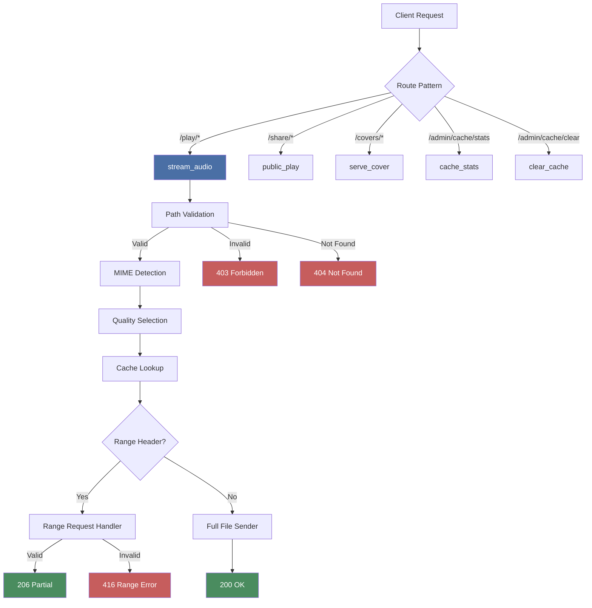

{ align=right width="90" }

# Playback Routes Overview

The playback system is the core of Mixtape Society's audio streaming infrastructure. It handles audio file delivery, quality management, range requests for seeking, and integrates with various playback technologies (Chromecast, Android Auto, AirPlay).

---

## 🎯 Purpose

The `play` Flask blueprint provides:

- **Audio streaming** with quality selection and caching
- **HTTP range support** for seeking and Chromecast
- **Public mixtape pages** for sharing
- **Cover image serving** with size optimization
- **Cache management** endpoints for administrators
- **QR code generation** for easy sharing

All routes live under the Flask Blueprint named `play`.

---

## 🗺️ Routes Reference

```python
play = Blueprint("play", __name__)   # registered in the main Flask app
```

| HTTP Method | URL Pattern | Handler | Description | Documentation |
| ----------- | ----------- | ------- | ----------- | ------------- |
| `GET` | `/play/<path:file_path>` | `stream_audio(file_path)` | Streams audio file with quality & range support | [Audio Streaming](backend/audio-streaming.md) |
| `GET` | `/share/<slug>` | `public_play(slug)` | Renders public mixtape player page | [Audio Streaming](backend/audio-streaming.md#-public-mixtape-page) |
| `GET` | `/covers/<filename>` | `serve_cover(filename)` | Serves cover images | [Covers Route](../media-assets/cover-art/routes.md) |
| `GET` | `/qr/<slug>.png` | `qr.generate_qr(slug)` | Simple QR code PNG | [QR Codes](../web-application/routes/qr-codes.md) |
| `GET` | `/qr/<slug>/download` | `qr.download_qr(slug)` | Enhanced QR with cover art | [QR Codes](../web-application/routes/qr-codes.md) |
| `GET` | `/admin/cache/stats` | `cache_stats()` | Returns cache statistics JSON | [Quality & Caching](backend/quality-caching.md#admin-endpoints) |
| `POST` | `/admin/cache/clear` | `clear_cache()` | Clears audio cache | [Quality & Caching](backend/quality-caching.md#admin-endpoints) |

---

## 🔄 High-Level Request Flow

```mermaid
sequenceDiagram
    participant Client
    participant FlaskApp
    participant stream_audio()
    participant _resolve_and_validate_path()
    participant _guess_mime_type()
    participant _get_serving_path()
    participant AudioCache
    participant _handle_range_request()
    participant send_file

    Client->>FlaskApp: GET /play/<file_path>?quality=medium [& Range]
    FlaskApp->>stream_audio(): Call with file_path + query
    stream_audio()->>_resolve_and_validate_path(): Validate & resolve
    _resolve_and_validate_path()-->>stream_audio(): full_path (or abort 403/404)
    stream_audio()->>_guess_mime_type(): Guess MIME
    _guess_mime_type()-->>stream_audio(): mime_type
    stream_audio()->>_get_serving_path(): Choose original or cached file (quality)
    _get_serving_path()->>AudioCache: cache.is_cached / cache.get_cache_path
    AudioCache-->>_get_serving_path(): serve_path
    alt Range header present
        stream_audio()->>_handle_range_request(): Serve partial bytes
        _handle_range_request()-->>stream_audio(): 206 Partial Content response
        stream_audio-->>FlaskApp: Return 206
    else No Range header
        stream_audio->>send_file: Send full file
        send_file-->>stream_audio(): 200 OK response
        stream_audio-->>FlaskApp: Return 200
    end
    FlaskApp-->>Client: Stream audio bytes
```

---

## 📚 Detailed Documentation

### Core Streaming

**[Audio Streaming](backend/audio-streaming.md)** - Complete audio streaming implementation

- Path validation and security
- MIME type detection
- File serving logic
- Public mixtape pages
- Response headers and CORS
- Error handling
- Logging

### Advanced Features

**[Range Requests](backend/range-requests.md)** - HTTP range support for seeking

- Range header parsing
- Partial content responses (206)
- Chromecast requirements
- Error handling (416)

**[Quality & Caching](backend/quality-caching.md)** - Quality selection and caching system

- Quality levels (high, medium, low, original)
- Cache lookup and serving
- Admin cache management endpoints
- Performance optimization

**[Media Integration](media-integration.md)** - Playback technology overview

- Local playback
- Chromecast casting
- Android Auto integration
- Mode comparison and coordination

---

## 🚀 Quick Reference

### Common Tasks

| task | example request |
| ---- | --------------- |
| **Stream audio file** | `GET /play/artist/album/track.mp3?quality=medium` |
| **Stream with seeking** | `GET /play/artist/album/track.mp3 Range: bytes=1000-2000` |
| **Get cache stats** | `GET /admin/cache/stats` |
| **Clear audio cache** | `POST /admin/cache/clear` |

### Response Codes

| Code | Meaning | When |
| ---- | ------- | ---- |
| 200 | OK | Full file served successfully |
| 206 | Partial Content | Range request served successfully |
| 403 | Forbidden | Path outside MUSIC_ROOT (security) |
| 404 | Not Found | File doesn't exist |
| 416 | Range Not Satisfiable | Invalid range request |
| 500 | Internal Server Error | Unexpected error |

### Key Headers

**Request:**

- `Range: bytes=start-end` - Request partial content

**Response:**

- `Accept-Ranges: bytes` - Server supports range requests
- `Access-Control-Allow-Origin: *` - CORS for Chromecast
- `Cache-Control: public, max-age=3600` - Enable caching
- `Content-Range: bytes start-end/total` - Partial content info (206 only)

---

## 🏗️ Architecture Components

### Flask Blueprint (`routes/play.py`)

Core implementation of all playback routes.

**Key responsibilities:**

- Route registration and request handling
- Path validation and security
- MIME type detection
- Quality and cache management
- Range request processing
- Response construction

**Dependencies:**

- `AudioCache` - Audio caching and transcoding
- `MixtapeManager` - Mixtape metadata and file management
- `Logger` - Structured logging

### Audio Cache (`audio_cache/`)

Handles audio transcoding and caching.

**Features:**

- Quality-based transcoding (FLAC → MP3)
- Cache hit/miss tracking
- Automatic cache management
- Size and age-based cleanup

See: [Audio Caching Documentation](backend/quality-caching.md)

### Player Integration

Frontend JavaScript that consumes these routes.

**Modules:**

- `playerControls.js` - Playback orchestration
- `chromecast.js` - Cast SDK integration
- `androidAuto.js` - Enhanced Media Session
- `sleepTimer.js` - Automatic playback shutdown

---

## 🔗 Related Documentation

### Backend Services

- **[Audio Caching](backend/quality-caching.md)** - Transcoding and cache management
- **[Mixtape Manager](../mixtape-system/manager-backend.md)** - Mixtape CRUD operations
- **[Cover Art System](../media-assets/cover-art/overview.md)** - Image optimization
- **[QR Code Generation](../web-application/routes/qr-codes.md)** - QR code routes

### Frontend Integration

- **[Player Controls](frontend/player-controls.md)** - Playback orchestration
- **[Sleep Timer](frontend/sleep-timer.md)** - Automatic playback shutdown
- **[Player Utilities](frontend/player-utilities.md)** - Uniforming platform experiences
- **[Chromecast Integration](../device-integration/chromecast/integration.md)** - Cast SDK setup
- **[Android Auto](../device-integration/android-auto/overview.md)** - Enhanced Media Session

### Configuration

- **[Configuration](../configuration.md)** - MUSIC_ROOT, DATA_ROOT, cache settings

---

## 🎓 For Developers

### Understanding the System

**New to the codebase?** Read in this order:

1. This overview (you are here)
2. [Audio Streaming](backend/audio-streaming.md) - Understand basic streaming
3. [Quality & Caching](backend/quality-caching.md) - Learn cache system
4. [Range Requests](backend/range-requests.md) - Understand seeking
5. [Media Integration](media-integration.md) - See how it all fits together

### Common Development Tasks

**Adding a new quality level:**

- Update `QUALITY_LEVELS` in frontend
- Update cache directory structure
- See: [Quality & Caching](backend/quality-caching.md)

**Debugging streaming issues:**

- Check logs for path validation errors
- Verify CORS headers for Chromecast
- Test range requests with curl
- See: [Audio Streaming](backend/audio-streaming.md#-logging)

**Performance optimization:**

- Monitor cache hit rates
- Adjust cache cleanup schedule
- Pre-populate cache for popular tracks
- See: [Quality & Caching](backend/quality-caching.md#-performance-optimization)

### Testing

**Manual testing:**

```bash
# Test basic streaming
curl -I http://localhost:5000/play/artist/album/track.mp3

# Test range request
curl -I -H "Range: bytes=0-1023" http://localhost:5000/play/artist/album/track.mp3

# Test quality parameter
curl -I http://localhost:5000/play/artist/album/track.flac?quality=medium

# Get cache stats
curl http://localhost:5000/admin/cache/stats
```

---

## 📊 System Flow Diagram

### Complete Request Flow



---

*This overview provides a high-level understanding of the playback system. For implementation details, see the detailed documentation pages linked above.*
