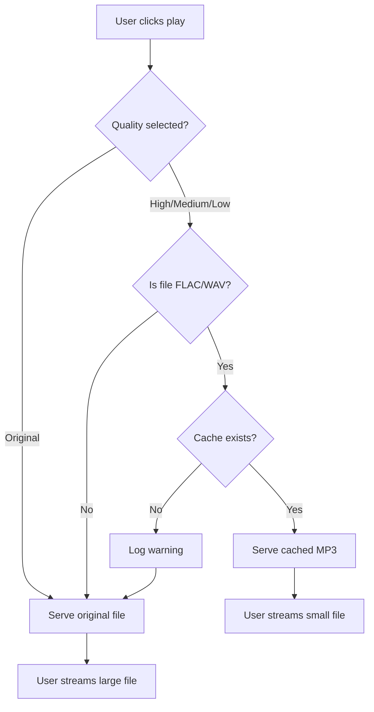

{ align=right width="90" }

# Audio Caching System

The audio caching system provides intelligent transcoding and bandwidth optimization for your mixtape application. It automatically converts large lossless audio files (like FLAC) to smaller MP3 formats, reducing bandwidth usage by up to 87% while maintaining good audio quality for web playback.

## Overview

When streaming large FLAC files over the web, bandwidth becomes a significant concern. A typical 4-minute FLAC track can be 40-50 MB, while a well-encoded MP3 at 192 kbps is only 5-6 MB. This system automates the conversion and caching process.

### Key Features

- **Automatic transcoding** of FLAC, WAV, AIFF, and other lossless formats to MP3
- **Multiple quality levels** - High (256k), Medium (192k), Low (128k)
- **Smart caching** - Only transcodes formats that benefit from it
- **Pre-caching support** - Generate caches when mixtapes are created
- **Parallel processing** - Fast batch transcoding with thread pools
- **Cache management** - Size tracking and cleanup utilities

### Main Purpose: Bandwidth Savings

| Format | Bitrate | Size/minute | Savings vs FLAC |
| ------ | ------- | ----------- | --------------- |
| FLAC (Original) | ~1000 kbps | 8-10 MB | - |
| High (MP3) | 256 kbps | ~2 MB | 80% |
| Medium (MP3) | 192 kbps | ~1.4 MB | 87% |
| Low (MP3) | 128 kbps | ~1 MB | 90% |

## Architecture

The system consists of three main components:

### `audio_cache.py` - Core Caching Module

Handles individual file transcoding, cache lookup, and file management.

**Key responsibilities:**

- Generate cache file paths using MD5 hashing
- Check if cached versions exist and are up-to-date
- Transcode files using ffmpeg
- Manage cache directory and cleanup

### `cache_worker.py` - Background Worker

Provides batch processing and parallel transcoding capabilities.

**Key responsibilities:**

- Pre-cache entire mixtapes
- Parallel processing with thread pools
- Progress tracking and callbacks
- Cache verification and regeneration

### `progress_tracker.py` - Progress Tracking System

The progress tracking system provides real-time Server-Sent Events (SSE) based progress updates for audio file transcoding. It enables the frontend to display live progress information to users during background tasks.

**Key responsibilities:**

- Progress tracking
- Reporting progress to the front end

#### Progress tracker structure

```mermaid
    graph TD
        A[Frontend (Browser)]
        B[EventSource Connection (SSE)]
        C[Flask Backend]
        D[Progress Tracker (Singleton)]
        E[Task Queues (dict)]
        F[Background Worker Thread]

        A -->|SSE Stream| B
        B --> C
        C --> D
        D --> E
        C --> F
        F -->|Calls tracker.emit() during processing| D
        F -->|Events queued for SSE delivery| B
        E -->|task_1: Queue[ProgressEvent]| D
        E -->|task_2: Queue[ProgressEvent]| D
        E -->|task_3: Queue[ProgressEvent]| D
```

## How It Works

### Cache Path Generation

Each cached file is stored with a unique filename generated from the original file path:

```python
# Original file path is hashed with MD5
original_path = "/music/Artist/Album/Song.flac"
path_hash = md5(original_path.resolve()) = "abc123..."

# Cache filename includes hash, quality, and bitrate
cache_filename = "abc123_medium_192k.mp3"
```

This ensures:

- No filename collisions
- No path traversal vulnerabilities
- Easy cache lookups
- Support for identically named files in different locations

### Transcoding Process

When a file needs to be cached:

1. **Check format** - Is it a lossless format that needs transcoding?
2. **Check cache** - Does a cached version already exist?
3. **Transcode** - Use ffmpeg to convert to MP3 at specified quality
4. **Metadata** - Copy ID3 tags from original to cached version
5. **Verify** - Ensure cached file was created successfully

### Playback Flow

When a user plays a track:



## Usage

### Basic Usage

```python
from pathlib import Path
from audio_cache import AudioCache

# Initialize cache
cache_dir = Path("collection-data/cache/audio")
cache = AudioCache(cache_dir, logger=app.logger)

# Check if file should be transcoded
audio_file = Path("/music/Artist/Album/Song.flac")
if cache.should_transcode(audio_file):
    print("This file will benefit from caching")

# Check if cached version exists
if cache.is_cached(audio_file, quality="medium"):
    cached_path = cache.get_cache_path(audio_file, "medium")
    print(f"Cached version available at: {cached_path}")
else:
    print("Not cached yet")

# Transcode a file
cached_path = cache.transcode_file(audio_file, quality="medium")
print(f"Cached to: {cached_path}")
```

### Pre-caching a Mixtape

```python
from pathlib import Path
from audio_cache import AudioCache
from cache_worker import schedule_mixtape_caching

# Your mixtape data
mixtape = {
    "title": "Summer Vibes",
    "tracks": [
        {"path": "Artist1/Album1/Song1.flac", "track": "Song1"},
        {"path": "Artist2/Album2/Song2.flac", "track": "Song2"},
        # ...
    ]
}

# Pre-cache all tracks
results = schedule_mixtape_caching(
    mixtape_tracks=mixtape["tracks"],
    music_root=Path("/music"),
    audio_cache=cache,
    logger=logger,
    qualities=["medium"],  # Can specify multiple: ["low", "medium", "high"]
    async_mode=True  # Use parallel processing
)

# Check results
for path, result in results.items():
    if result.get("medium"):
        print(f"✓ Cached: {path}")
    else:
        print(f"✗ Failed: {path}")
```

### Cache Management

```python
# Get cache statistics
cache_size = cache.get_cache_size()
print(f"Cache size: {cache_size / (1024**3):.2f} GB")

# Clear old cache files (older than 30 days)
deleted = cache.clear_cache(older_than_days=30)
print(f"Deleted {deleted} old cache files")

# Clear entire cache
deleted = cache.clear_cache()
print(f"Deleted {deleted} cache files")
```

### Parallel Processing

```python
from cache_worker import CacheWorker

# Initialize worker with 8 parallel threads
worker = CacheWorker(cache, logger=logger, max_workers=8)

# Get all FLAC files
flac_files = list(Path("/music").rglob("*.flac"))

# Cache them all in parallel
def progress_callback(current, total):
    print(f"Progress: {current}/{total} ({current/total*100:.1f}%)")

results = worker.cache_mixtape_async(
    track_paths=flac_files,
    qualities=["medium"],
    progress_callback=progress_callback
)
```

## API Reference

### AudioCache

### ::: src.audio_cache.audio_cache.AudioCache

---

### CacheWorker

### ::: src.audio_cache.cache_worker.CacheWorker

### ::: src.audio_cache.cache_worker.schedule_mixtape_caching

---

### Progress Tracking

### ::: src.audio_cache.progress_tracker.get_progress_tracker

### ::: src.audio_cache.progress_tracker.ProgressTracker

### ::: src.audio_cache.progress_tracker.ProgressStatus

### ::: src.audio_cache.progress_tracker.ProgressEvent

### ::: src.audio_cache.progress_tracker.ProgressCallback

---

## Configuration

### Configuration Options

| Option | Default | Description |
| ------ | ------- | ----------- |
| `AUDIO_CACHE_DIR` | `"cache/audio"` | Directory for cached files |
| `AUDIO_CACHE_ENABLED` | `True` | Enable/disable caching |
| `AUDIO_CACHE_DEFAULT_QUALITY` | `"medium"` | Default quality level |
| `AUDIO_CACHE_MAX_WORKERS` | `4` | Parallel transcoding threads |
| `AUDIO_CACHE_PRECACHE_ON_UPLOAD` | `True` | Auto-cache when mixtapes are created |
| `AUDIO_CACHE_PRECACHE_QUALITIES` | `["medium"]` | Which qualities to pre-generate |

## Performance

### Transcoding Performance

Typical transcoding times (single file, 4-minute track):

| CPU | FLAC → MP3 192k | Notes |
| --- | --------------- | ----- |
| Intel i5 (4 cores) | 5-8 seconds | Sequential |
| Intel i7 (8 cores) | 3-5 seconds | Sequential |
| AMD Ryzen 9 (16 cores) | 2-4 seconds | Sequential |

With parallel processing (4 workers):

- 40 files: ~50-100 seconds (vs 200-400 sequential)
- Speedup: ~4x

### Bandwidth Savings

For a typical mixtape with 15 FLAC tracks (4 min avg):

| Scenario | Total Size | Bandwidth |
| -------- | ---------- | --------- |
| No caching | ~600 MB | Full |
| Medium quality | ~80 MB | 87% reduction |
| Low quality | ~60 MB | 90% reduction |

For 100 users streaming the same mixtape:

- Without cache: 60 GB bandwidth
- With cache (medium): 8 GB bandwidth
- **Savings: 52 GB per 100 users**

## Troubleshooting

### Cache Misses

If you see frequent cache miss warnings:

1. **Check cache directory exists:**

   ```bash
   ls -la collection-data/cache/audio/
   ```

2. **Verify pre-caching is enabled:**

   ```python
   AUDIO_CACHE_PRECACHE_ON_UPLOAD = True
   ```

3. **Run debug script:**

   ```bash
   python debug_cache.py "/music" "Artist/Song.flac" "cache/audio"
   ```

4. **Check logs for transcoding errors:**

   ```bash
   grep -i "transcoding\|cache" app.log
   ```

### Path Mismatch Issues

If cache files exist but aren't being found:

1. **Check path resolution:**

   ```python
   # Paths must resolve to the same string
   original = Path("/music/Artist/Song.flac")
   print(original.resolve())  # Should always be the same
   ```

2. **Clear and regenerate cache:**

   ```python
   cache.clear_cache()  # Delete all
   # Then re-cache your mixtapes
   ```

### Transcoding Failures

If ffmpeg transcoding fails:

1. **Verify ffmpeg is installed:**

   ```bash
   ffmpeg -version
   ```

2. **Check file permissions:**

   ```bash
   ls -l /path/to/audio/file.flac
   ls -ld cache/audio/
   ```

3. **Test ffmpeg manually:**

   ```bash
   ffmpeg -i input.flac -b:a 192k output.mp3
   ```

4. **Check logs for errors:**

   ```bash
   grep -i "ffmpeg\|transcode" app.log
   ```

### High CPU Usage

If transcoding causes high CPU usage:

1. **Reduce parallel workers:**

   ```python
   AUDIO_CACHE_MAX_WORKERS = 2  # Instead of 4
   ```

2. **Use sequential processing:**

   ```python
   worker.cache_mixtape(...)  # Instead of cache_mixtape_async()
   ```

3. **Schedule transcoding during off-hours:**

   ```python
   # Use a task queue (Celery) to defer transcoding
   ```

## Best Practices

### 1. Pre-cache During Upload

Enable pre-caching when mixtapes are created:

```python
AUDIO_CACHE_PRECACHE_ON_UPLOAD = True
```

This ensures smooth playback from the first play, with no delays.

### 2. Use Medium Quality by Default

The "medium" quality (192 kbps) provides the best balance:

- Good audio quality for web playback
- Significant bandwidth savings (87% vs FLAC)
- Reasonable cache file sizes

### 3. Pre-cache Only What You Need

Don't pre-cache all quality levels unless needed:

```python
# Good - most users will use medium quality
AUDIO_CACHE_PRECACHE_QUALITIES = ["medium"]

# Overkill - uses 3x the disk space
AUDIO_CACHE_PRECACHE_QUALITIES = ["low", "medium", "high"]
```

### 4. Monitor Cache Size

Set up periodic monitoring:

```python
def monitor_cache_size():
    size_gb = cache.get_cache_size() / (1024**3)
    if size_gb > 100:  # Threshold
        logger.warning(f"Cache size is {size_gb:.2f} GB")
```

### 5. Clean Up Old Caches

Schedule periodic cleanup:

```python
# Daily cleanup of caches older than 30 days
scheduler.add_job(
    lambda: cache.clear_cache(older_than_days=30),
    'cron',
    hour=3
)
```

### 6. Use Async Mode for Batch Operations

Always use async mode when caching multiple files:

```python
# Fast - parallel processing
worker.cache_mixtape_async(files)

# Slow - sequential processing
worker.cache_mixtape(files)
```

### 7. Handle Errors Gracefully

Never let caching failures break mixtape operations:

```python
try:
    schedule_mixtape_caching(...)
except Exception as e:
    logger.error(f"Caching failed: {e}")
    # Continue - mixtape still works with original files
```

### 8. Log Cache Effectiveness

Track how well caching is working:

```python
if cache.is_cached(file, quality):
    logger.info(f"✓ Cache hit: {file.name}")
else:
    logger.warning(f"✗ Cache miss: {file.name}")
```

## Examples

### Example 1: Simple File Caching

```python
from pathlib import Path
from audio_cache import AudioCache

# Initialize
cache = AudioCache(Path("cache/audio"))

# Cache a single file
audio_file = Path("/music/Radiohead/OK Computer/01 Airbag.flac")
cached = cache.transcode_file(audio_file, quality="medium")

print(f"Original: {audio_file.stat().st_size / (1024**2):.1f} MB")
print(f"Cached:   {cached.stat().st_size / (1024**2):.1f} MB")
```

### Example 2: Batch Caching with Progress

```python
from pathlib import Path
from audio_cache import AudioCache
from cache_worker import CacheWorker

# Get all FLAC files in a directory
music_dir = Path("/music/New Albums")
flac_files = list(music_dir.rglob("*.flac"))

print(f"Found {len(flac_files)} FLAC files")

# Cache them all
cache = AudioCache(Path("cache/audio"))
worker = CacheWorker(cache, max_workers=8)

def show_progress(current, total):
    percent = (current / total) * 100
    print(f"Progress: {current}/{total} ({percent:.1f}%)")

results = worker.cache_mixtape_async(
    flac_files,
    qualities=["medium"],
    progress_callback=show_progress
)

print(f"Cached {len(results)} files")
```

### Example 3: Verify and Fix Cache

```python
from pathlib import Path
from audio_cache import AudioCache
from cache_worker import CacheWorker

cache = AudioCache(Path("cache/audio"))
worker = CacheWorker(cache)

# Get mixtape tracks
mixtape_tracks = [
    Path("/music/Artist1/Song1.flac"),
    Path("/music/Artist2/Song2.flac"),
]

# Verify cache status
status = worker.verify_mixtape_cache(mixtape_tracks, quality="medium")

missing = [path for path, cached in status.items() if not cached]

if missing:
    print(f"Found {len(missing)} uncached files")
    print("Caching now...")

    worker.cache_mixtape_async(missing, qualities=["medium"])
    print("Done!")
else:
    print("All files cached!")
```

### Example 4: Cache Management Script

```python
#!/usr/bin/env python3
"""Cache management CLI tool"""
import argparse
from pathlib import Path
from audio_cache import AudioCache

def main():
    parser = argparse.ArgumentParser(description="Manage audio cache")
    parser.add_argument("action", choices=["stats", "clear", "verify"])
    parser.add_argument("--cache-dir", default="cache/audio")
    parser.add_argument("--older-than", type=int, help="Days for clear action")
    args = parser.parse_args()

    cache = AudioCache(Path(args.cache_dir))

    if args.action == "stats":
        size = cache.get_cache_size()
        files = len(list(Path(args.cache_dir).glob("*.mp3")))
        print(f"Cache size: {size / (1024**3):.2f} GB")
        print(f"Cached files: {files}")

    elif args.action == "clear":
        deleted = cache.clear_cache(older_than_days=args.older_than)
        print(f"Deleted {deleted} files")

    elif args.action == "verify":
        # Verify cache integrity
        cache_dir = Path(args.cache_dir)
        for cache_file in cache_dir.glob("*.mp3"):
            if cache_file.stat().st_size == 0:
                print(f"✗ Empty file: {cache_file.name}")
                cache_file.unlink()

if __name__ == "__main__":
    main()
```

Usage:

```bash
python cache_manager.py stats
python cache_manager.py clear --older-than 30
python cache_manager.py verify
```
