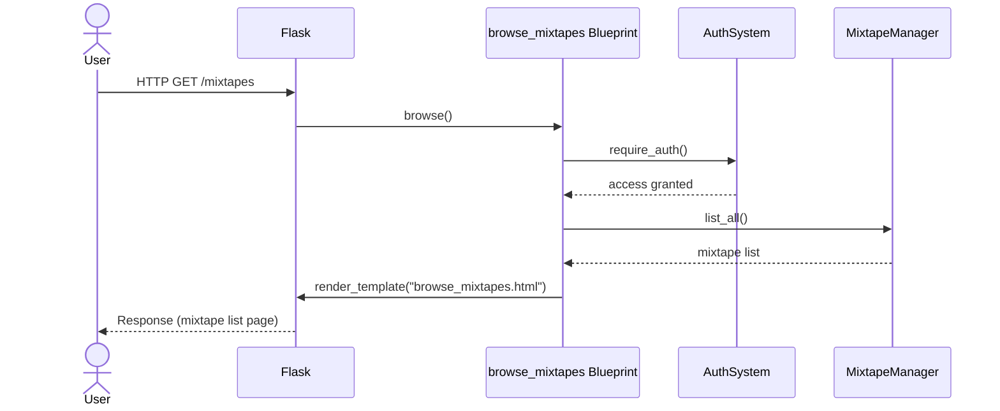
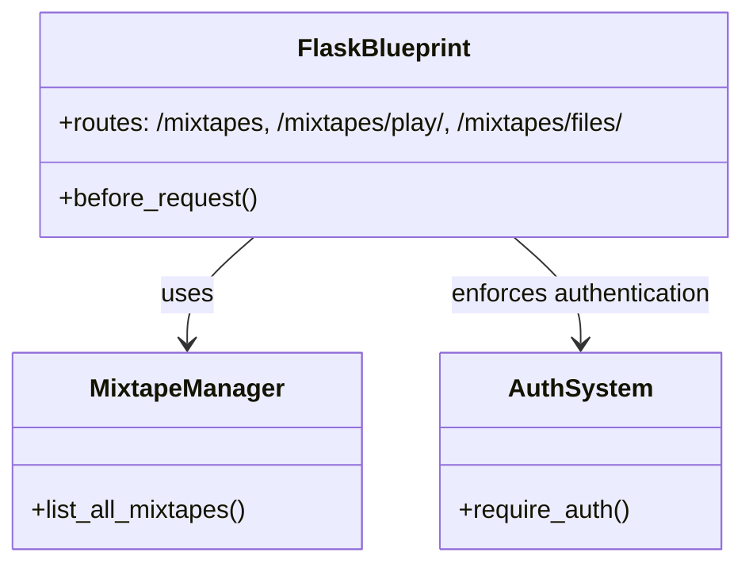

# Browse Mixtapes

The file `routes/browse_mixtapes.py` plays a central role in the user-facing browsing experience for mixtapes, enforcing access control and connecting the UI to the underlying mixtape data. It defines the browse_mixtapes Flask blueprint, which provides routes for browsing, playing, and serving mixtape files within a web application. It handles user authentication for protected routes, retrieves mixtape data, and serves static files related to mixtapes. The blueprint integrates with the application's authentication system and the MixtapeManager for data access.

## Key Components

* **Flask Blueprint** (browser)

    Organizes all routes related to browsing mixtapes, enabling modular and maintainable routing logic within the application.

* **Route**: `/mixtapes`:
    Protected by authentication, this route retrieves all available mixtapes using the MixtapeManager and renders them using the `browse_mixtapes.html` template.

* **Route**: `/mixtapes/play/<slug>`  Also protected by authentication, this route redirects users to a public play page for a specific mixtape, identified by its slug.
* **Route**: `/mixtapes/files/<path:filename>` Serves static mixtape files from the configured mixtape directory, allowing users to download or stream mixtape content.

* **Authentication Enforcement**

    Utilizes decorators like `@require_auth` and a `@browser.before_request` hook to ensure only authenticated users can access the browse and play routes. Unauthenticated users are redirected to the landing page.

* **Integration with MixtapeManager**

    Leverages the `MixtapeManager` class to abstract and handle the retrieval of mixtape data, keeping route handlers focused on request/response logic.

## Class diagram

## API

### ::: src.routes.browse_mixtapes
