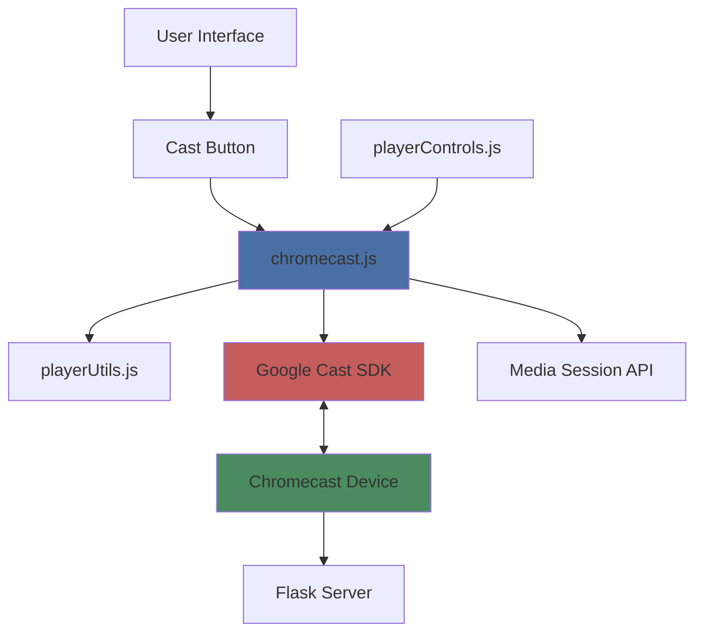
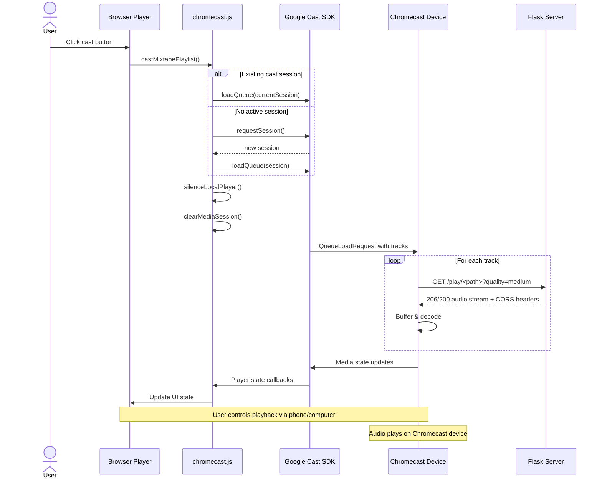

# Chromecast Integration

{ align=right width="90" }

Mixtape Society supports casting entire mixtapes to Chromecast devices, enabling users to play their curated music collections on TVs and speakers throughout their home with seamless queue management and unified controls.

---

## 🎯 Overview

Chromecast integration provides:

- **Full mixtape casting** - Load entire playlist as a queue
- **Unified controls** - Control Chromecast from phone, computer, or lock screen
- **Media Session sync** - Lock screen and notification controls mirror Chromecast state
- **Local player silencing** - Prevents duplicate media controls and battery drain
- **Quality-aware streaming** - Respects quality parameter for bandwidth management
- **Cover art display** - Shows mixtape and track artwork on TV/receiver

---

## 🏗️ Architecture

### System Components



### Data Flow



---

## 📦 Core Modules

### 1. chromecast.js

**Location:** `static/js/player/chromecast.js`

Main module handling all Chromecast interactions.

#### Initialization

```javascript
export function initChromecast()
```

**Responsibilities:**

- Loads Google Cast SDK from CDN
- Waits for `__onGCastApiAvailable` callback
- Calls `initializeCastApi()` when ready
- Dispatches `cast:ready` event for UI components

**Implementation:**

```javascript
function initChromecast() {
    if (typeof chrome === 'undefined' || !chrome.cast) {
        console.warn('Chrome Cast API not available');
        return;
    }

    window['__onGCastApiAvailable'] = function(isAvailable) {
        if (isAvailable) {
            initializeCastApi();
        }
    };

    // Load Cast SDK
    const script = document.createElement('script');
    script.src = 'https://www.gstatic.com/cv/js/sender/v1/cast_sender.js?loadCastFramework=1';
    document.head.appendChild(script);
}
```

#### Cast API Configuration

```javascript
function initializeCastApi()
```

**Configuration:**

- **Application ID:** `CC1AD845` (Default Media Receiver)
- **Auto Join Policy:** `TAB_AND_ORIGIN_SCOPED`
- **Language:** User's browser language
- **Resume Saved Session:** `true`

**Session Listeners:**

- `sessionListener()` - Handles new cast sessions
- `receiverListener()` - Monitors available cast devices

#### Session Management

**Starting a Session:**

```javascript
export function castMixtapePlaylist()
```

**Process:**

1. Check for existing session
2. Request new session if none active
3. Build queue from `window.__mixtapeData.tracks`
4. Load queue to Chromecast
5. Silence local player
6. Update UI state

**Stopping a Session:**

```javascript
export function stopCasting()
```

**Process:**

1. Stop current Chromecast media
2. End cast session
3. Restore local player controls
4. Clear Media Session
5. Reset UI state

#### Media Control Functions

```javascript
export function castPlay()
export function castPause()
export function castNext()
export function castPrevious()
export function castSeek(time)
export function castJumpToTrack(index)
export function castTogglePlayPause()
```

**Features:**

- Direct Chromecast control
- Error handling
- State validation
- Callback notifications

#### State Management

**Global State Variables:**

```javascript
export let globalCastingState = false;  // Is casting active?
let currentCastSession = null;          // Current Cast session
let currentMedia = null;                // Current media controller
let castPlayState = 'IDLE';             // Current play state
```

**State Change Callbacks:**

```javascript
let castControlCallbacks = {
    onTrackChange: null,
    onPlayStateChange: null,
    onTimeUpdate: null
};

export function setCastControlCallbacks(callbacks)
```

### 2. Media Session Integration

When casting is active, `chromecast.js` synchronizes the browser's Media Session API to mirror Chromecast state.

**Purpose:**

- Lock screen controls
- Notification media controls
- Hardware media keys
- Consistent UI across platforms

**Implementation:**

```javascript
function updateMediaSessionForCast(media) {
    if (!('mediaSession' in navigator)) return;

    const mediaInfo = media.media;
    const metadata = mediaInfo.metadata;

    navigator.mediaSession.metadata = new MediaMetadata({
        title: metadata.title,
        artist: metadata.artist,
        album: metadata.albumName,
        artwork: metadata.images
    });

    // Route all actions to Chromecast
    navigator.mediaSession.setActionHandler('play', () => castPlay());
    navigator.mediaSession.setActionHandler('pause', () => castPause());
    navigator.mediaSession.setActionHandler('previoustrack', () => castPrevious());
    navigator.mediaSession.setActionHandler('nexttrack', () => castNext());
    navigator.mediaSession.setActionHandler('seekto', (details) => {
        if (details.seekTime !== undefined) {
            castSeek(details.seekTime);
        }
    });

    // Update playback state
    const isPaused = media.playerState === chrome.cast.media.PlayerState.PAUSED;
    navigator.mediaSession.playbackState = isPaused ? 'paused' : 'playing';
}
```

### 3. Player Controls Integration

**Location:** `static/js/player/playerControls.js`

The player controls module checks `globalCastingState` to route commands appropriately.

**Example - Play Track:**

```javascript
import { globalCastingState, castJumpToTrack } from './chromecast.js';

function playTrack(index) {
    if (globalCastingState) {
        // Route to Chromecast
        castJumpToTrack(index);
        return;
    }

    // Local playback
    const track = window.__mixtapeData.tracks[index];
    const player = document.getElementById('main-player');
    player.src = `/play/${track.file_path}?quality=medium`;
    player.play();
}
```

**Example - Play/Pause:**

```javascript
function togglePlayPause() {
    if (globalCastingState) {
        castTogglePlayPause();
        return;
    }

    const player = document.getElementById('main-player');
    if (player.paused) {
        player.play();
    } else {
        player.pause();
    }
}
```

### 4. Local Player Management

**Location:** `static/js/player/playerUtils.js`

When casting starts, the local player must be silenced to prevent:

- Duplicate media controls
- Battery drain
- Conflicting Media Session handlers

**Silencing Local Player:**

```javascript
export function silenceLocalPlayer() {
    const player = document.getElementById('main-player');
    if (!player) return;

    // Pause and clear source
    player.pause();
    player.src = '';
    player.load();

    // Remove media attributes
    player.removeAttribute('controls');
    player.removeAttribute('autoplay');

    // Mute completely
    player.volume = 0;
    player.muted = true;

    // Remove from tab order
    player.setAttribute('tabindex', '-1');
}
```

**Restoring Local Player:**

```javascript
export function enableLocalPlayer() {
    const player = document.getElementById('main-player');
    if (!player) return;

    // Restore controls
    player.setAttribute('controls', '');

    // Restore volume
    player.volume = 1.0;
    player.muted = false;

    // Restore tab order
    player.removeAttribute('tabindex');
}
```

**Clearing Media Session:**

```javascript
export function clearMediaSession() {
    if (!('mediaSession' in navigator)) return;

    // Set state to 'none' FIRST (critical order)
    navigator.mediaSession.playbackState = 'none';

    // Clear metadata
    navigator.mediaSession.metadata = null;

    // Remove all action handlers
    const actions = [
        'play', 'pause', 'stop',
        'previoustrack', 'nexttrack',
        'seekbackward', 'seekforward', 'seekto'
    ];

    actions.forEach(action => {
        try {
            navigator.mediaSession.setActionHandler(action, null);
        } catch (e) {
            // Action may not be supported
        }
    });
}
```

---

## 🔌 Backend Requirements

### CORS Headers

Chromecast devices make cross-origin requests to the Flask server and require proper CORS headers.

**Implementation in `routes/play.py`:**

```python
@play.route("/play/<path:file_path>")
def stream_audio(file_path):
    # ... validation and file resolution ...

    response = send_file(serve_path, mimetype=mime_type)

    # CRITICAL: CORS headers for Chromecast
    response.headers["Access-Control-Allow-Origin"] = "*"
    response.headers["Access-Control-Expose-Headers"] = "Content-Type, Accept-Encoding, Range"

    return response
```

**Why these headers matter:**

| Header | Purpose |
| ------ | ------- |
| `Access-Control-Allow-Origin: *` | Allows Chromecast devices to fetch audio from your server |
| `Access-Control-Expose-Headers` | Exposes headers needed for range requests and seeking |

### Range Request Support

Chromecast uses HTTP range requests for seeking and buffering.

**Implementation:**

```python
def _handle_range_request(file_path, mime_type):
    """Handle HTTP Range requests for seeking"""
    range_header = request.headers.get("Range")
    if not range_header:
        return None

    size = os.path.getsize(file_path)
    match = re.match(r"bytes=(\d+)-(\d*)", range_header)

    if not match:
        return abort(416)  # Range Not Satisfiable

    start = int(match.group(1))
    end = int(match.group(2)) if match.group(2) else size - 1

    # Validate range
    if start >= size or end >= size or start > end:
        return abort(416)

    length = end - start + 1

    def generate():
        with open(file_path, "rb") as f:
            f.seek(start)
            remaining = length
            while remaining > 0:
                chunk_size = min(8192, remaining)
                chunk = f.read(chunk_size)
                if not chunk:
                    break
                remaining -= len(chunk)
                yield chunk

    response = Response(
        generate(),
        206,  # Partial Content
        mimetype=mime_type,
        direct_passthrough=True
    )

    response.headers["Content-Range"] = f"bytes {start}-{end}/{size}"
    response.headers["Content-Length"] = str(length)
    response.headers["Accept-Ranges"] = "bytes"

    # CORS headers
    response.headers["Access-Control-Allow-Origin"] = "*"
    response.headers["Access-Control-Expose-Headers"] = "Content-Range, Content-Length, Range"

    return response
```

### Quality Parameter Support

Chromecast respects the `quality` query parameter for bandwidth management.

**Example request:**

```text
GET /play/artist/album/track.flac?quality=medium
```

**Server behavior:**

1. Check if transcoded version exists in cache
2. Serve cached MP3 if available
3. Fall back to original file if cache miss

**Implementation in `_get_serving_path()`:**

```python
def _get_serving_path(full_path, quality):
    """Return cached file if available, otherwise original"""
    if quality and quality != 'original':
        cache_path = audio_cache.get_cache_path(full_path, quality)
        if os.path.exists(cache_path):
            return cache_path
    return full_path
```

---

## 🎨 UI Integration

### Cast Button

The cast button appears automatically when the Cast SDK loads successfully.

**HTML:**

```html
<button id="cast-button" class="btn btn-outline-secondary" hidden>
    <i class="bi bi-cast"></i>
    <span class="cast-label">Cast</span>
</button>
```

**JavaScript initialization:**

```javascript
document.addEventListener('cast:ready', () => {
    const castBtn = document.getElementById('cast-button');
    if (castBtn) {
        castBtn.hidden = false;
        castBtn.addEventListener('click', () => {
            if (castBtn.classList.contains('connected')) {
                stopCasting();
            } else {
                castMixtapePlaylist();
            }
        });
    }
});
```

**State classes:**

- `.connected` - Applied when casting is active
- Default state - Ready to cast

### Visual Feedback

**When casting starts:**

1. Cast button shows "connected" state
2. Local player UI dims/hides
3. "Casting to [Device Name]" indicator appears
4. Track controls remain active

**During playback:**

- Progress bar updates from Chromecast state
- Play/pause button reflects Chromecast state
- Track changes update UI automatically

---

## 📱 Platform Support

### Desktop (Chrome, Edge)

**Full support:**

- ✅ Cast button
- ✅ Device picker
- ✅ Full queue management
- ✅ Media Session controls
- ✅ Seeking and scrubbing

### Android

**Full support:**

- ✅ Native Cast integration
- ✅ Notification controls
- ✅ Lock screen controls
- ✅ Background playback
- ✅ Hardware button support

### iOS

**Limited support - requires workarounds:**

⚠️ **Safari limitations:**

- Cast SDK not supported in Safari
- Users must use Chrome for iOS

✅ **Chrome for iOS:**

- Full Cast support
- Requires Google Home app installed
- Both devices must be on same WiFi network

**Helper message for iOS users:**

```javascript
function showiOSCastHelp() {
    const helpHtml = `
        <div class="alert alert-info">
            <h6>📱 Casting from iPhone</h6>
            <small>
                <strong>To cast to Chromecast:</strong><br>
                1. Install Google Home app<br>
                2. Use Chrome browser (not Safari)<br>
                3. Connect to same WiFi network<br>
                <br>
                <strong>For best experience:</strong><br>
                Add this page to your Home Screen (PWA mode)
            </small>
        </div>
    `;
    // Display in modal or banner
}
```

**Detection and help display:**

```javascript
const iOS = detectiOS();
if (iOS && !('chrome' in window)) {
    // User is on iOS Safari - show help message
    showiOSCastHelp();
}
```

---

## 🔧 Configuration

### Cast Application ID

**Default Media Receiver:** `CC1AD845`

This is Google's standard receiver application for basic media playback.

**Set in `initializeCastApi()`:**

```javascript
const applicationID = chrome.cast.media.DEFAULT_MEDIA_RECEIVER_APP_ID;
const sessionRequest = new chrome.cast.SessionRequest(applicationID);
```

### Queue Configuration

**Settings:**

```javascript
const queueLoadRequest = new chrome.cast.media.QueueLoadRequest(queueItems);
queueLoadRequest.repeatMode = chrome.cast.media.RepeatMode.OFF;
queueLoadRequest.startIndex = window.currentTrackIndex || 0;
queueLoadRequest.autoplay = true;
queueLoadRequest.preloadTime = 5;  // Preload 5 seconds of next track
```

**Parameters:**

| Parameter | Value | Purpose |
| --------- | ----- | ------- |
| `repeatMode` | `OFF` | No automatic repeat |
| `startIndex` | Current track | Resume from current position |
| `autoplay` | `true` | Start playing immediately |
| `preloadTime` | `5` | Buffer next track 5s early |

---

## 🧪 Testing

### Testing Checklist

**Basic Functionality:**

- [ ] Cast button appears when Cast SDK loads
- [ ] Device picker opens on click
- [ ] Chromecast device is discoverable
- [ ] Connection establishes successfully
- [ ] Mixtape queue loads completely

**Playback:**

- [ ] First track plays automatically
- [ ] Audio quality is acceptable
- [ ] No audio stuttering or buffering issues
- [ ] Queue advances through all tracks
- [ ] Last track completes properly

**Controls:**

- [ ] Play/pause works from browser
- [ ] Play/pause works from lock screen
- [ ] Previous track button works
- [ ] Next track button works
- [ ] Seeking works (scrub bar)
- [ ] Volume control works

**State Management:**

- [ ] Local player is silenced when casting starts
- [ ] UI shows "Casting to [Device]" indicator
- [ ] Cast button shows "connected" state
- [ ] Progress bar updates during playback
- [ ] Track metadata displays correctly

**Disconnection:**

- [ ] Stop casting button works
- [ ] Local player controls restore
- [ ] Media Session clears properly
- [ ] UI returns to normal state
- [ ] Can restart casting immediately

**Edge Cases:**

- [ ] Network interruption handling
- [ ] Chromecast device disconnection
- [ ] Browser tab closed while casting
- [ ] Multiple browser tabs casting simultaneously
- [ ] Quality switching during playback

### Test Devices

**Recommended test targets:**

- Chromecast (Gen 3 or newer)
- Chromecast with Google TV
- Google Nest Audio / Home speakers
- Smart TVs with built-in Chromecast

### Debug Logging

Enable verbose Cast logging:

```javascript
// Add to chromecast.js initialization
window.__CHROMECAST_DEBUG__ = true;

if (window.__CHROMECAST_DEBUG__) {
    console.log('🎭 Cast session started:', session);
    console.log('🎵 Loading queue:', queueItems);
    console.log('📡 Current media:', currentMedia);
}
```

**Check browser console for:**

- Cast SDK load status
- Session establishment logs
- Media state changes
- Error messages

---

## 🐛 Troubleshooting

### Cast Button Not Appearing

**Symptoms:**

- Cast button remains hidden
- No `cast:ready` event fired

**Possible causes:**

1. **Cast SDK failed to load**

   ```text
   Check console: "Failed to load Cast SDK"
   Solution: Verify CDN accessibility
   ```

2. **Not in secure context**

   ```text
   Check console: "Cast SDK requires HTTPS"
   Solution: Access via HTTPS or localhost
   ```

3. **Cast API not available**

   ```javascript
   if (typeof chrome === 'undefined' || !chrome.cast) {
       console.error('Chrome Cast API not available');
   }
   ```

**Solution checklist:**

- ✅ Verify HTTPS connection
- ✅ Check browser console for errors
- ✅ Confirm `cast-framework.js` CDN is accessible
- ✅ Try different browser (Chrome/Edge recommended)
- ✅ Check network firewall settings

### Audio Not Playing on Chromecast

**Symptoms:**

- Cast session connects but no audio plays
- Chromecast shows "buffering" indefinitely

**Possible causes:**

1. **CORS headers missing**

   ```text
   Check network tab:
   Response: "Cross-origin request blocked"
   ```

   **Solution:** Verify CORS headers in Flask:

   ```python
   response.headers["Access-Control-Allow-Origin"] = "*"
   ```

2. **Wrong audio URL format**

   ```javascript
   // ❌ Wrong - relative URL
   src: 'audio/track.mp3'

   // ✅ Correct - absolute URL
   src: 'https://yourdomain.com/play/artist/album/track.mp3'
   ```

3. **MIME type incorrect**

   ```text
   Check response headers:
   Content-Type: application/octet-stream  ❌
   Content-Type: audio/mpeg  ✅
   ```

4. **File not accessible**

   ```text
   Check server logs:
   404 Not Found
   403 Forbidden
   ```

**Solution checklist:**

- ✅ Verify CORS headers present
- ✅ Confirm audio URLs are absolute
- ✅ Check MIME types are correct
- ✅ Test audio URL directly in browser
- ✅ Review server logs for errors

### Seeking Not Working

**Symptoms:**

- Seek bar doesn't respond
- Tapping seek position has no effect
- Range requests failing

**Possible causes:**

1. **Range requests not supported**

   ```text
   Check response:
   Accept-Ranges: none  ❌
   Accept-Ranges: bytes  ✅
   ```

2. **CORS headers incomplete**

   ```python
   # Must expose Range header
   response.headers["Access-Control-Expose-Headers"] = "Content-Range, Content-Length, Range"
   ```

3. **Wrong HTTP status code**

   ```text
   Response: 200 OK  ❌ (should be 206)
   Response: 206 Partial Content  ✅
   ```

**Solution checklist:**

- ✅ Verify `_handle_range_request()` is called
- ✅ Check 206 responses in network tab
- ✅ Confirm `Accept-Ranges: bytes` header
- ✅ Verify `Access-Control-Expose-Headers` includes "Range"

### Lock Screen Controls Not Working

**Symptoms:**

- Lock screen shows controls but they don't work
- Notification controls unresponsive

**Possible causes:**

1. **Media Session not updated**

   ```javascript
   // Check if being called
   updateMediaSessionForCast(media);
   ```

2. **Action handlers not set**

   ```javascript
   // Verify all handlers are set
   navigator.mediaSession.setActionHandler('play', () => castPlay());
   navigator.mediaSession.setActionHandler('pause', () => castPause());
   ```

3. **Conflicting local Media Session**

   ```javascript
   // Make sure local session is cleared
   clearMediaSession();
   ```

**Solution checklist:**

- ✅ Verify `updateMediaSessionForCast()` called on track change
- ✅ Check action handlers are set to cast functions
- ✅ Confirm local Media Session is cleared
- ✅ Test with browser DevTools Media panel

### iOS Casting Issues

**Symptoms:**

- Cast button not appearing on iOS
- "Chromecast not found" error

**Common causes:**

1. **Using Safari browser**

   ```text
   Safari doesn't support Cast SDK
   Solution: Switch to Chrome for iOS
   ```

2. **Google Home app not installed**

   ```text
   Required for iOS Chromecast support
   Solution: Install Google Home app
   ```

3. **Different WiFi networks**

   ```text
   iPhone and Chromecast must be on same network
   Solution: Connect both to same WiFi
   ```

**Solution checklist:**

- ✅ Switch to Chrome for iOS
- ✅ Install Google Home app
- ✅ Verify same WiFi network
- ✅ Show helper message for iOS users
- ✅ Recommend PWA mode for better experience

### Queue Not Loading Completely

**Symptoms:**

- Only first few tracks load
- Queue stops mid-playlist

**Possible causes:**

1. **Track data malformed**

   ```javascript
   // Check window.__mixtapeData.tracks
   console.log(window.__mixtapeData.tracks);
   ```

2. **Invalid audio URLs**

   ```javascript
   // Verify URL construction
   const url = `/play/${track.file_path}?quality=medium`;
   ```

3. **Cover art missing**

   ```javascript
   // Check artwork array
   artwork: track.cover ? [{
       url: `${window.location.origin}/covers/${track.cover}`
   }] : []
   ```

**Solution checklist:**

- ✅ Validate track data structure
- ✅ Check audio URL construction
- ✅ Verify cover art URLs
- ✅ Test with smaller playlist first
- ✅ Check browser console for errors

---

## 📚 Additional Resources

### Google Cast Documentation

- [Cast SDK Overview](https://developers.google.com/cast/docs/developers)
- [Chrome Sender API](https://developers.google.com/cast/docs/chrome_sender)
- [Media Player API](https://developers.google.com/cast/docs/reference/web_sender/chrome.cast.media)
- [Queue Management](https://developers.google.com/cast/docs/reference/web_sender/chrome.cast.media.QueueLoadRequest)

### Related Mixtape Society Documentation

- [Playback Routes](../routes/playback.md) - Audio streaming implementation
- [Android Auto Integration](../android-auto/backend-implementation.md) - Alternative casting method
- [Audio Caching](../audio_caching.md) - Quality management
- [Player Controls](../player/playerControls.md) - UI controls integration

### Media Session API

- [MDN Media Session API](https://developer.mozilla.org/en-US/docs/Web/API/Media_Session_API)
- [Web Media Session Spec](https://w3c.github.io/mediasession/)

---

## 🎯 Future Enhancements

### Planned Improvements

- **Custom receiver app** - Brand Mixtape Society receiver
- **Lyrics display** - Show synchronized lyrics on TV
- **Visualizer** - Audio visualizations during playback
- **Multi-room audio** - Cast to multiple devices simultaneously
- **Queue editing** - Reorder queue during casting
- **Collaborative casting** - Multiple users control same session

### Under Consideration

- **AirPlay support** - Parallel support for Apple devices
- **Spotify Connect style** - Persistent queue across devices
- **Cast group support** - Speaker groups in Google Home app
- **Background sync** - Offline queue preparation
