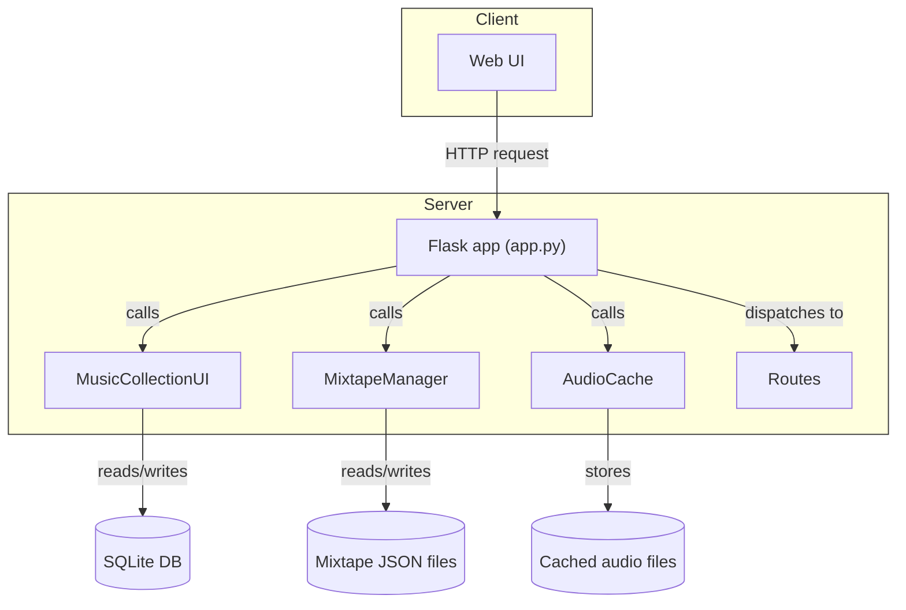

# Development Guide – Mixtape Society

{ align=right width="90" }

Welcome to the **Mixtape Society** development guide. This section explains how the project is organized, how to set up a local development environment, how to run tests, and where to find the architectural documentation.

---

## 📂 Project Structure

- 📁 **mixtape‑society/**
    - 👷‍♀️ **.github/**
        - ⚙️ **workflows/**
            * `docker-image.yml` – Build Docker images on GHCR
            * `docs.yml` – Publish GitHub Pages
    - 🐳 **docker/** – Dockerfiles & Compose configs
    - 📚 **docs/** – MkDocs source (this folder)
    - 📂 **src/**
        - `app.py` – Flask entry point
        - 📂 `audio_cache/` – Audio transcoding & caching
        - `auth.py` – Authentication utilities
        - 📂 `common/` – Infrastructure‑free abstractions
        - 📂 `config/` – Environment‑variable handling
        - 📂 `logtools/` – Structured logging helpers
        - 📂 `mixtape_manager/` – Mixtape persistence layer
        - 📂 `musiclib/` – Music indexing (TinyTag + SQLite)
        - 📂 `routes/` – Flask blueprints (browser, editor, …)
        - 📂 `static/`
            * 📂 `css/` – Stylesheets for Jinja2 templates
            * 📂 `js/` – Front‑end scripts
        - 📂 `templates/` – Jinja2 views
        - 📂 `utilities/` – Miscellaneous helper functions
    - 📄 `.gitignore` – Ignored files for Git
    - 📄 `LICENSE` – Project license
    - 📄 `mkdocs.yml` – MkDocs site configuration
    - 📄 `pyproject.toml` – Poetry‑style project metadata
    - 📄 `.python-version` – Python version pinning (3.13+)
    - 📄 `README.md` – Repository overview
    - 📄 `uv.lock` – uv‑managed lockfile

!!! TIP
    The `src/` package is deliberately **framework‑agnostic**; core modules (`musiclib`, `mixtape_manager`, `audio_cache`) contain no Flask imports, making them easy to unit‑test.

---

## 🛠️ Prerequisites

| Tool | Minimum Version | Install Command |
|------|----------------|-----------------|
| **Python** | 3.13+ (pinned in `.python-version`) | Use your system package manager or `pyenv` |
| **uv** (modern Python package manager) | Latest | `curl -LsSf https://astral.sh/uv/install.sh | sh` |
| **Docker** (optional, for containerised dev) | Engine ≥ 20.10 | Follow Docker’s official install guide |

**Why `uv`?** It resolves and installs dependencies **without a `requirements.txt`**, speeds up virtual‑environment creation, and produces a deterministic `uv.lock`.

---

## 🚀 Local Development Workflow (uv)

```bash
# 1️⃣ Install runtime dependencies
uv sync

# 2️⃣ Install development‑only dependencies (testing, linting, docs)
uv sync --extra dev

# 3️⃣ Run the Flask development server
uv run python -m app

# 4️⃣ Add a new runtime dependency (updates pyproject.toml & uv.lock)
uv add <package-name>
```

*All commands are executed from the repository root.*

The development server automatically reloads when you edit files (Flask’s built‑in reloader is enabled because `APP_ENV=development`).

## 🐳 Docker‑Based Development

The repository ships with a **Docker Compose** configuration for rapid iteration:

```bash
# Build the development image
docker compose -f docker/docker-compose.yml build

# Start the stack (Flask + optional reverse‑proxy)
docker compose -f docker/docker-compose.yml up -d
```

The compose file mounts the source code into the container, so you can edit files locally and see changes instantly (no hot‑reload inside the container, but the Flask dev server picks up changes).

### Useful shortcuts

| Command | What it does |
|--------|---------------|
| `docker compose logs -f mixtape` | Tail the Flask logs. |
| `docker compose exec mixtape bash` | Drop into the container shell. |
| `docker compose down -v` | Tear down and delete the persisted volume (useful for a clean start). |

## 🏛️ Architectural Documentation

This section dives into the inner workings of **Mixtape Society**. Each page focuses on a specific subsystem, explains its responsibilities, and shows how it interacts with the rest of the project.

---

### Core Modules

| Module | What it does |
|--------|--------------|
| **[Music Library (`musiclib`)](musiclib/intro.md)** | Handles scanning, indexing, and full‑text search of the audio collection (TinyTag + SQLite FTS5). |
| **[Mixtape Manager](mixtape_manager.md)** | Persists mixtape JSON files, manages cover images, and provides CRUD operations. |
| **[Audio Caching](audio_caching.md)** | Transcodes FLAC files to MP3/OGG on‑demand, stores them in a cache, and streams via HTTP range requests. |
| **[Progressive Web App (PWA)](pwa/pwa.md)** | Enables offline playback for public shared mixtapes via service workers, smart caching, and installable app features. |
| **[Configuration](configuration.md)** | Centralised environment‑variable handling, directory layout, and defaults. |
| **[Utilities](utilities.md)** | Helper functions (logging, image processing, misc tools). |

### Flask Application (Entry Point)

The **`app.py`** file wires everything together:

* Initializes the Flask app, CORS, and rate limiting.
* Sets up core services (`MusicCollectionUI`, `MixtapeManager`, `AudioCache`).
* Registers blueprints for **auth**, **browser**, **play**, **editor**, and **OG‑cover** routes.
* Provides global error handling (e.g., `DatabaseCorruptionError`).

📄 [**Read the full walkthrough**](app.md)

### Blueprint / Route Overview

| Blueprint | URL Prefix | Primary Concern |
|-----------|------------|-----------------|
| **Authentication** | `/auth` | Login / logout, session handling. |
| **Browser** | `/mixtapes` | List, play, delete, and serve static mixtape files. |
| **Play** | `/play` | Audio streaming endpoint (`/play/<slug>`), range requests, and public player page. |
| **Editor** | `/editor` | Mixtape creation / editing UI, JSON save, cover generation, and background caching trigger. |
| **OG‑Cover** | `/og` | Dynamic Open‑Graph images for social sharing. |

Each blueprint has its own Markdown file that details the routes, request flow, and any special middleware:

* [Browser UI & mixtape management](routes/browse_mixtapes.md)
* [Editor UI, save logic, and progress modal.](routes/editor/index.md)
* [Streaming, MIME detection, and range handling.](routes/play/index.md)
* [Session‑based login flow.](routes/authentication.md)
* [OG image generation.](routes/opengraph_images.md)

## 🔀 Data Flow Summary



*The diagram illustrates how a request travels from the browser through the Flask entry point, into the core services, and finally reaches the persistent storage.*

## 🛡️ Contributing Guidelines

1. Fork the repository and create a feature branch (`git checkout -b feature/awesome-feature`).
2. Install dev dependencies (`uv sync --extra dev`).
3. Lint & format (`uv run ruff check . && uv run ruff format .`).
4. Commit with a clear, conventional‑commit‑style message.
5. Open a Pull Request targeting `master`. Include:
    * A concise description of the change.
    * Screenshots or diagrams if UI is affected.
    * A reference to any related issue (Closes #123).

!!! TIP
    Code Style – Follow the existing codebase: type hints everywhere, use `logtools.get_logger` for logging, and keep Flask‑specific code inside the `routes/` package.

## 🧭 Where to Go Next?

* Deep dive into a module – Click any link in the tables above.
* Explore the code – All source files live under `src/` (e.g., `src/musiclib/reader.py`).
* Contribute – Follow the guidelines in this page and submit a PR.

Happy hacking! 🎧🚀