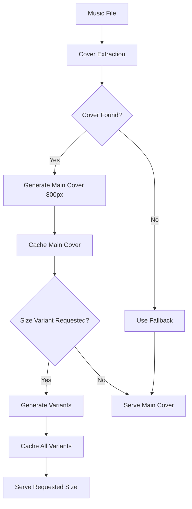
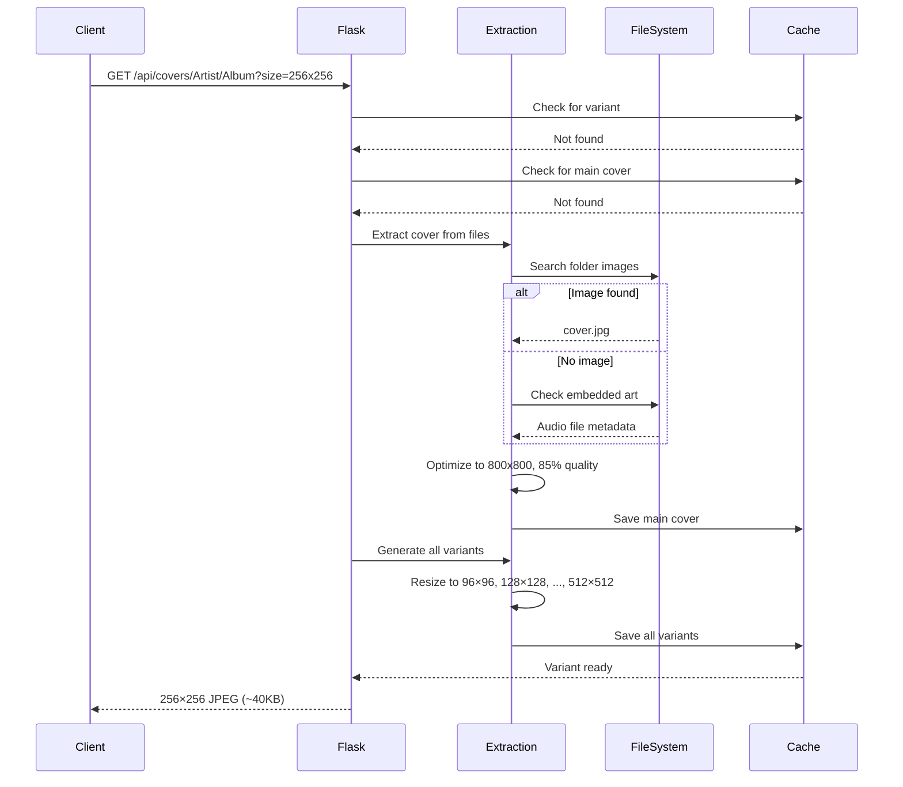
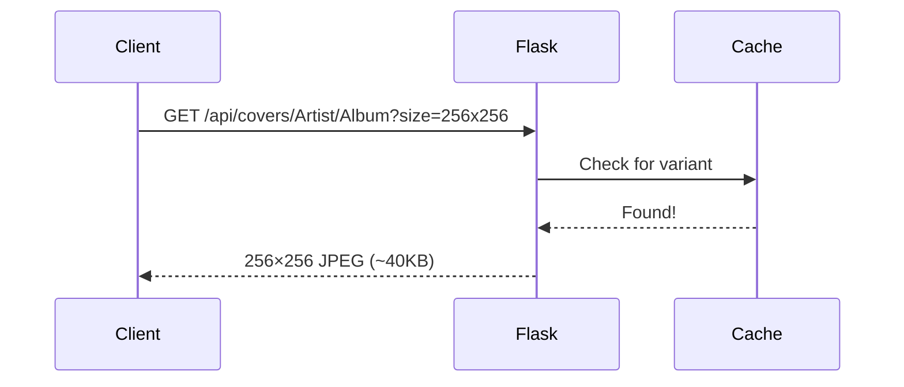

{ align=right width="90" }

# Cover Art System - Overview

## Purpose

The cover art system manages the extraction, optimization, caching, and serving of album artwork for the Mixtape Society application. It provides responsive, bandwidth-optimized images for different platforms and use cases.

---

## Key Features

- **Automatic Extraction** - Finds cover art from folder images or embedded metadata
- **Size Optimization** - Generates 6 standard sizes (96×96 to 512×512)
- **Lazy Generation** - Creates variants only when requested
- **Permanent Caching** - Stores optimized images for fast subsequent loads
- **Fallback Handling** - Graceful degradation when covers unavailable
- **Platform Optimization** - Serves appropriate sizes for iOS, Android Auto, and desktop

---

## System Architecture



---

## Components

### 1. Extraction (`reader.py`)

Located in `src/musiclib/reader.py`, the `MusicCollection` class handles cover extraction:

**Methods:**

- `get_cover(release_dir)` - Returns single cover URL
- `get_cover_sizes(release_dir)` - Returns all size variants
- `_extract_cover(release_dir, target_path)` - Extracts from files
- `_generate_cover_variants(release_dir, slug)` - Creates size variants

**Extraction Priority:**

1. Common image files (`cover.jpg`, `folder.jpg`, `album.jpg`)
2. Embedded artwork from audio files
3. Fallback image

**Optimization:**

- Resizes to max 800×800px
- Converts to RGB JPEG
- Compresses to 85% quality
- Limits file size to 500KB

### 2. Storage

**Cache Directory:** `DATA_ROOT/cache/covers/`

**File Naming:**

```bash
{slug}.jpg              # Main cover (800px max)
{slug}_96x96.jpg        # Thumbnail variant
{slug}_128x128.jpg      # Small variant
{slug}_192x192.jpg      # Medium variant
{slug}_256x256.jpg      # Android Auto optimal
{slug}_384x384.jpg      # High-DPI variant
{slug}_512x512.jpg      # Full-screen variant
_fallback.jpg           # Default when no cover found
```

**Slug Generation:**

- Sanitizes release directory to safe filename
- Replaces special characters with underscores
- Truncates long paths (>200 chars)
- Adds hash suffix for collision avoidance

### 3. Serving (`app.py`)

Two Flask routes serve cover images:

**Direct Serving:** `/covers/<filename>`

- Original endpoint (unchanged)
- Serves cached files directly
- Simple, fast file delivery

**API Serving:** `/api/covers/<release_dir>?size=`

- New size-parameterized endpoint
- Generates variants on-demand
- Returns appropriate size or fallback

See: [Cover Art Routes](../routes.md)

---

## Standard Sizes

| Size | Dimensions | Use Case | Typical Size |
| ---- | --------- | -------- | ------------ |
| Tiny | 96×96 | Thumbnails in lists | 5-8 KB |
| Small | 128×128 | Small tiles | 8-12 KB |
| Small-Medium | 192×192 | Medium tiles | 15-20 KB |
| Medium | 256×256 | **Android Auto optimal** | 30-50 KB |
| Large | 384×384 | High-DPI displays | 60-90 KB |
| Extra Large | 512×512 | Full-screen player | 100-150 KB |

---

## Workflow

### First Request (Cold Cache)



**Total time:** ~150-300ms (one-time cost)

### Subsequent Requests (Warm Cache)



**Total time:** ~5-10ms (served from cache)

---

## Performance Characteristics

### Storage Impact

**Per album:**

- Main cover: 300-500 KB
- All 6 variants: 50-150 KB
- **Total increase:** ~50-150 KB per album

**For 1000 albums:**

- Main covers: ~400 MB
- All variants: ~100 MB
- **Total:** ~500 MB

### Bandwidth Savings

**Android Auto (256×256):**

- Before: 400 KB per cover
- After: 40 KB per cover
- **Savings: 90%**

**Mobile Web (128×128):**

- Before: 400 KB per cover
- After: 12 KB per cover
- **Savings: 97%**

**10-track mixtape on Android Auto:**

- Before: 4 MB
- After: 400 KB
- **Savings: 90%**

### Generation Performance

| Operation | First Request | Cached Request |
| --------- | ------------ | -------------- |
| Main cover extraction | 50-100ms | 0ms |
| Variant generation | 100-200ms | 0ms |
| File serving | 5-10ms | 5-10ms |
| **Total** | **150-300ms** | **5-10ms** |

---

## Platform Optimization

The system automatically selects appropriate sizes based on the requesting platform:

### iOS

Prioritizes larger sizes for high-quality lock screen display:

- 512×512 (primary)
- 256×256 (secondary)
- 192×192 (fallback)

### Android Auto

Provides full spectrum for optimal selection:

- 96×96 (minimum required)
- 128×128, 192×192, 256×256 (optimal range)
- 384×384, 512×512 (high quality)

### Desktop

Simplified set for standard displays:

- 192×192 (thumbnails/tiles)
- 512×512 (full player)

---

## Error Handling

### Extraction Failures

**No cover found:**

1. Search common image files → Not found
2. Check embedded artwork → Not found
3. **Result:** Return `_fallback.jpg`

**Extraction error:**

1. Log warning message
2. Return `_fallback.jpg`
3. **Result:** User never sees broken image

### Generation Failures

**Variant generation fails:**

1. Log warning message
2. Return main cover (800px) instead
3. Retry on next request
4. **Result:** Slightly larger file, but still functional

### Missing Files

**Requested file doesn't exist:**

1. Try to generate from main cover
2. If main cover missing, extract from audio
3. If extraction fails, return fallback
4. **Result:** Multiple fallback levels ensure images always load

---

## Integration Points

### Backend (Python)

```python
from musiclib import MusicCollection

# Initialize collection
mc = MusicCollection(music_root="/music", db_path="/data/music.db")

# Get single cover URL (original behavior)
cover_url = mc.get_cover("Artist/Album")
# Returns: "covers/artist_album.jpg"

# Get all size variants (new behavior)
cover_sizes = mc.get_cover_sizes("Artist/Album")
# Returns: {
#   "96x96": "covers/artist_album_96x96.jpg",
#   "256x256": "covers/artist_album_256x256.jpg",
#   ...
# }
```

### Frontend (JavaScript)

```javascript
// Extract metadata with platform-optimized artwork
const metadata = extractMetadataFromDOM(trackElement);

// metadata.artwork contains size-specific URLs:
// [
//   { src: "/covers/slug_96x96.jpg", sizes: "96x96", type: "image/jpeg" },
//   { src: "/covers/slug_256x256.jpg", sizes: "256x256", type: "image/jpeg" },
//   ...
// ]

// Update MediaSession
navigator.mediaSession.metadata = new MediaMetadata({
    title: metadata.title,
    artist: metadata.artist,
    artwork: metadata.artwork  // Browser picks best size
});
```

### Flask Routes

```python
# Direct file serving (existing)
@app.route("/covers/<filename>")
def serve_album_cover(filename):
    return send_from_directory(covers_dir, filename)

# Size-parameterized API (new)
@app.route("/api/covers/<path:release_dir>")
def serve_cover_by_size(release_dir):
    size = request.args.get('size')  # e.g., "256x256"
    # ... generate if needed, return appropriate file
```

---

## Related Documentation

**Technical Details:**

- [Size Optimization Implementation](../../media-assets/cover-art/optimization.md) - Code-level details
- [API Reference](api.md) - Complete API documentation

**Integrated with:**

- [Cover Art Routes](routes.md) - HTTP endpoint documentation
- [Playback Routes](../../audio-playback/backend/audio-streaming.md) - Audio streaming context
- [Android Auto](../../device-integration/android-auto/backend.md)

---

## Future Enhancements

Potential improvements to the cover art system:

- [ ] **WebP format support** - Better compression for modern browsers
- [ ] **AVIF format support** - Next-gen image format
- [ ] **Automatic format selection** - Serve WebP/AVIF to supporting browsers
- [ ] **Custom size requests** - Allow arbitrary dimensions with limits
- [ ] **Bulk pre-generation** - Background job for popular albums
- [ ] **CDN integration** - Serve from CDN for better global performance
- [ ] **Smart caching** - Delete unused variants after N days
- [ ] **Analytics** - Track most-requested sizes
- [ ] **Color extraction** - Dominant colors for UI theming
- [ ] **Multiple covers** - Support for disc-specific artwork
