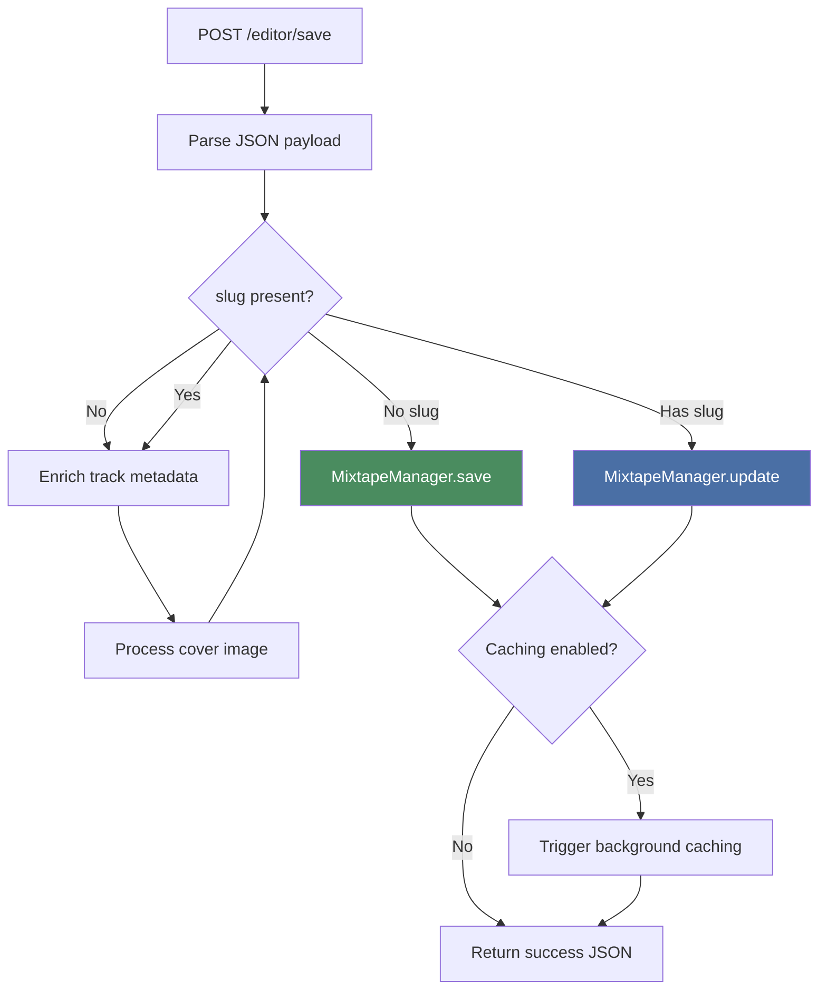

# Editor Backend API

{ align=right width="90" }

> Part of [Mixtape Editor](index.md)

This page documents the Flask backend routes, server-side logic, and API contracts for the Mixtape Editor. All routes are protected by authentication and handle mixtape creation, editing, search, and cover generation.

---

## 🎯 Overview

The editor backend (`routes/editor.py`) provides:

- **Mixtape CRUD operations** - Create, read, update mixtapes
- **Library search integration** - Full-text search via `MusicCollectionUI`
- **Cover image handling** - Upload processing and composite generation
- **Progress streaming** - Server-Sent Events for background operations
- **Data persistence** - JSON files on disk via `MixtapeManager`

**Flask Blueprint:** `editor`
**URL Prefix:** `/editor/*`
**Authentication:** All routes use `@require_auth` decorator

---

## 🔒 Authentication

### @require_auth Decorator

All editor routes require authentication:

```python
from src.routes.authentication import require_auth

@editor.route("/")
@require_auth
def new_mixtape():
    # Only accessible to authenticated users
    pass
```

**Behavior:**

- Checks session for authentication
- Redirects to `/auth/login` if not authenticated
- Sets `next` parameter for post-login redirect
- Returns to requested page after login

See: [Authentication Routes](../authentication.md)

---

## 🗺️ Routes Reference

### Mixtape Management

| HTTP | URL Pattern | Handler | Purpose |
| ---- | ----------- | ------- | ------- |
| `GET` | `/editor/` | `new_mixtape()` | Render blank editor for new mixtape |
| `GET` | `/editor/<slug>` | `edit_mixtape(slug)` | Load existing mixtape for editing |
| `POST` | `/editor/save` | `save_mixtape()` | Create new or update existing mixtape |

### Library Search

| HTTP | URL Pattern | Handler | Purpose |
| ---- | ----------- | ------- | ------- |
| `GET` | `/editor/search?q=` | `search()` | Search library (50 results max) |
| `GET` | `/editor/artist_details?artist=` | `artist_details()` | Get artist's albums and tracks |
| `GET` | `/editor/album_details?release_dir=` | `album_details()` | Get album's tracks and metadata |

### Cover & Progress

| HTTP | URL Pattern | Handler | Purpose |
| ---- | ----------- | ------- | ------- |
| `POST` | `/editor/generate_composite` | `generate_composite()` | Create composite cover from track art |
| `GET` | `/editor/progress/<slug>` | `progress_stream(slug)` | SSE progress updates for caching |

### QR Codes

| HTTP | URL Pattern | Handler | Purpose |
| ---- | ----------- | ------- | ------- |
| `GET` | `/qr/<slug>.png` | `qr.generate_qr(slug)` | Simple QR code PNG |
| `GET` | `/qr/<slug>/download` | `qr.download_qr(slug)` | Enhanced QR with cover and title |

See: [QR Code Routes](../qr_codes.md) for QR documentation

---

## 📋 Route Handlers

### new_mixtape()

**Purpose:** Render blank editor for creating a new mixtape

**Route:**

```python
@editor.route("/")
@require_auth
def new_mixtape()
```

**Implementation:**

```python
def new_mixtape():
    """
    Render editor with empty mixtape template
    """
    # Build empty mixtape structure
    empty_mixtape = {
        'title': '',
        'cover': None,
        'liner_notes': '',
        'tracks': [],
        'slug': None,
        'created_at': None,
        'updated_at': None
    }

    return render_template(
        'editor.html',
        preload_mixtape=empty_mixtape
    )
```

**Template receives:**

```javascript
window.PRELOADED_MIXTAPE = {
    title: '',
    cover: null,
    liner_notes: '',
    tracks: [],
    slug: null
};
```

**Frontend behavior:**

- Generates new `client_id` via `crypto.randomUUID()`
- Stores in `localStorage['current_mixtape_client_id']`
- Used for idempotent creates (prevents duplicates)

### edit_mixtape(slug)

**Purpose:** Load existing mixtape for editing

**Route:**

```python
@editor.route("/<slug>")
@require_auth
def edit_mixtape(slug: str)
```

**Implementation:**

```python
def edit_mixtape(slug):
    """
    Load mixtape data and render pre-filled editor
    """
    mixtape_manager = current_app.mixtape_manager

    # Load mixtape from disk
    mixtape = mixtape_manager.get(slug)

    if not mixtape:
        logger.warning(f"Mixtape not found: {slug}")
        abort(404)

    # Render with pre-loaded data
    return render_template(
        'editor.html',
        preload_mixtape=mixtape
    )
```

**Returns 404 if:** Slug doesn't exist

**Template receives:**

```javascript
window.PRELOADED_MIXTAPE = {
    title: 'My Mixtape',
    cover: '/covers/slug.jpg',
    liner_notes: '# Notes here',
    tracks: [{...}, {...}],
    slug: 'my-mixtape',
    created_at: '2025-01-16T10:00:00',
    updated_at: '2025-01-16T15:30:00'
};
```

**Hidden input:**

```html
<input type="hidden" id="editing-slug" value="my-mixtape">
```

Frontend uses this to determine create vs update mode.

### save_mixtape()

**Purpose:** Create new mixtape or update existing one

**Route:**

```python
@editor.route("/save", methods=["POST"])
@require_auth
def save_mixtape()
```

**Request payload:**

```json
{
  "title": "My Summer Mix",
  "cover": "data:image/jpeg;base64,...",
  "liner_notes": "# Summer vibes\n\nTrack #1 is amazing!",
  "tracks": [
    {
      "artist": "The Beatles",
      "album": "Abbey Road",
      "track": "Come Together",
      "duration": "4:20",
      "path": "The Beatles/Abbey Road/01 Come Together.flac",
      "filename": "01 Come Together.flac",
      "cover": "/covers/abbey_road.jpg"
    }
  ],
  "slug": null,
  "client_id": "123e4567-e89b-12d3-a456-426614174000"
}
```

**Flow diagram:**



**Implementation:**

```python
def save_mixtape():
    """
    Save or update mixtape with background caching
    """
    data = request.get_json()

    # Extract data
    title = data.get('title', 'Unnamed Mixtape')
    cover = data.get('cover')
    liner_notes = data.get('liner_notes', '')
    tracks = data.get('tracks', [])
    slug = data.get('slug')
    client_id = data.get('client_id')

    # Enrich track metadata
    collection = current_app.music_collection
    for track in tracks:
        release_dir = Path(track['path']).parent
        track['cover'] = collection.get_cover(release_dir)

    # Process cover image
    cover_filename = None
    if cover and cover.startswith('data:image'):
        # Decode base64, resize, and save
        cover_filename = _process_cover_upload(cover, slug or client_id)

    # Create or update
    if slug:
        # Update existing
        mixtape_manager.update(slug, {
            'title': title,
            'cover': cover_filename,
            'liner_notes': liner_notes,
            'tracks': tracks,
            'client_id': client_id
        })
    else:
        # Create new (generates UUID slug)
        slug = mixtape_manager.save({
            'title': title,
            'cover': cover_filename,
            'liner_notes': liner_notes,
            'tracks': tracks,
            'client_id': client_id
        })

    # Trigger background caching
    if current_app.config.get('AUDIO_CACHE_PRECACHE_ON_UPLOAD'):
        _trigger_audio_caching_async(slug)

    return jsonify({
        'success': True,
        'slug': slug,
        'title': title,
        'client_id': client_id,
        'url': f'/editor/{slug}'
    })
```

**Key behaviors:**

1. **Track enrichment** - Refreshes cover paths from library
2. **Cover processing** - Decodes base64, resizes to max 1200px width
3. **Slug generation** - New mixtapes get UUID4 slug
4. **Timestamps** - `created_at` on create, `updated_at` on update
5. **Client-ID preservation** - Maintains idempotency token
6. **Background caching** - Optional async transcoding

**Response:**

```json
{
  "success": true,
  "slug": "my-summer-mix",
  "title": "My Summer Mix",
  "client_id": "123e4567-e89b-12d3-a456-426614174000",
  "url": "/editor/my-summer-mix"
}
```

**Error responses:**

- `400` - Invalid JSON or missing required fields
- `404` - Slug not found (on update)
- `500` - Server error (disk write failure, etc.)

### search()

**Purpose:** Search music library with highlighting

**Route:**

```python
@editor.route("/search")
@require_auth
def search()
```

**Query parameters:**

- `q` (required) - Search query (minimum 3 characters)

**Request:**

```text
GET /editor/search?q=beatles
```

**Implementation:**

```python
def search():
    """
    Full-text search with highlighting
    """
    query = request.args.get('q', '').strip()

    # Minimum query length
    if len(query) < 3:
        return jsonify([])

    # Search via MusicCollectionUI
    collection = current_app.music_collection
    results = collection.search_highlighting(query, limit=50)

    return jsonify(results)
```

**Response format:**

```json
[
  {
    "type": "artist",
    "artist": "The Beatles",
    "raw_artist": "The Beatles",
    "reasons": [{"type": "album", "text": "3 album(s)"}],
    "num_albums": 3,
    "albums": [],
    "load_on_demand": true,
    "clickable": true,
    "click_query": "artist:'The Beatles'"
  },
  {
    "type": "album",
    "artist": "The Beatles",
    "album": "Abbey Road",
    "raw_album": "Abbey Road",
    "cover": "/covers/abbey_road.jpg",
    "is_compilation": false,
    "reasons": [{"type": "track", "text": "17 track(s)"}],
    "num_tracks": 17,
    "tracks": [],
    "load_on_demand": true,
    "click_query": "release_dir:/The%20Beatles/Abbey%20Road/"
  },
  {
    "type": "track",
    "artist": "The Beatles",
    "album": "Abbey Road",
    "track": "Come Together",
    "duration": "4:20",
    "path": "The Beatles/Abbey Road/01 Come Together.flac",
    "filename": "01 Come Together.flac",
    "cover": "/covers/abbey_road.jpg",
    "highlighted_track": "<mark>Come</mark> <mark>Together</mark>"
  }
]
```

**Result types:**

- `artist` - Artist entry with album count
- `album` - Album entry with track count
- `track` - Individual track (immediately addable)

**Lazy loading:**

- Artists/albums have `load_on_demand: true`
- Details loaded via separate requests

### artist_details()

**Purpose:** Get full details for an artist (all albums and tracks)

**Route:**

```python
@editor.route("/artist_details")
@require_auth
def artist_details()
```

**Query parameters:**

- `artist` (required) - Artist name

**Request:**

```text
GET /editor/artist_details?artist=The%20Beatles
```

**Implementation:**

```python
def artist_details():
    """
    Get artist's albums and tracks
    """
    artist = request.args.get('artist')

    if not artist:
        return jsonify({'error': 'Missing artist parameter'}), 400

    collection = current_app.music_collection
    details = collection.get_artist_details(artist)

    return jsonify(details)
```

**Response:**

```json
{
  "artist": "The Beatles",
  "albums": [
    {
      "album": "Abbey Road",
      "cover": "/covers/abbey_road.jpg",
      "tracks": [
        {
          "track": "Come Together",
          "duration": "4:20",
          "path": "The Beatles/Abbey Road/01 Come Together.flac"
        }
      ],
      "is_compilation": false
    }
  ]
}
```

### album_details()

**Purpose:** Get full track list for an album

**Route:**

```python
@editor.route("/album_details")
@require_auth
def album_details()
```

**Query parameters:**

- `release_dir` (required) - Album directory path

**Request:**

```text
GET /editor/album_details?release_dir=/The%20Beatles/Abbey%20Road/
```

**Implementation:**

```python
def album_details():
    """
    Get album's tracks and metadata
    """
    release_dir = request.args.get('release_dir')

    if not release_dir:
        return jsonify({'error': 'Missing release_dir parameter'}), 400

    collection = current_app.music_collection
    details = collection.get_album_details(release_dir)

    return jsonify(details)
```

**Response:**

```json
{
  "artist": "The Beatles",
  "album": "Abbey Road",
  "cover": "/covers/abbey_road.jpg",
  "is_compilation": false,
  "tracks": [
    {
      "track": "Come Together",
      "duration": "4:20",
      "path": "The Beatles/Abbey Road/01 Come Together.flac",
      "filename": "01 Come Together.flac"
    }
  ]
}
```

### generate_composite()

**Purpose:** Create composite cover from multiple track covers

**Route:**

```python
@editor.route("/generate_composite", methods=["POST"])
@require_auth
def generate_composite()
```

**Request payload:**

```json
{
  "covers": [
    "/covers/album1.jpg",
    "/covers/album2.jpg",
    "/covers/album3.jpg",
    "/covers/album4.jpg"
  ]
}
```

**Implementation:**

```python
def generate_composite():
    """
    Generate grid composite from cover URLs
    """
    data = request.get_json()
    covers = data.get('covers', [])

    if not covers:
        return jsonify({'error': 'No covers provided'}), 400

    try:
        # Generate composite using CoverCompositor
        compositor = CoverCompositor()
        composite_data = compositor.generate_grid_composite(covers)

        return jsonify({
            'data_url': composite_data  # data:image/png;base64,...
        })
    except Exception as e:
        logger.error(f"Composite generation failed: {e}")
        return jsonify({'error': str(e)}), 500
```

**Response:**

```json
{
  "data_url": "data:image/png;base64,iVBORw0KGgoAAAANSUhEUg..."
}
```

**Grid layout:**

- 1-4 covers: 2x2 grid
- Resizes images to fit
- Equal spacing
- Transparent background for odd counts

### progress_stream(slug)

**Purpose:** Server-Sent Events for background caching progress

**Route:**

```python
@editor.route("/progress/<slug>")
@require_auth
def progress_stream(slug: str)
```

**Request:**

```text
GET /editor/progress/my-mixtape
Accept: text/event-stream
```

**Implementation:**

```python
def progress_stream(slug):
    """
    SSE stream of caching progress
    """
    audio_cache = current_app.audio_cache
    tracker = audio_cache.get_progress_tracker(slug)

    def generate():
        # Send connected event
        yield f"data: {json.dumps({'type': 'connected'})}\n\n"

        # Stream progress updates
        for event in tracker.events():
            yield f"data: {json.dumps(event)}\n\n"

    return Response(
        generate(),
        mimetype='text/event-stream',
        headers={
            'Cache-Control': 'no-cache',
            'X-Accel-Buffering': 'no'  # Disable nginx buffering
        }
    )
```

**Event format:**

```json
{
  "type": "progress",
  "step": "caching",
  "status": "in_progress",
  "message": "Caching 3/12 files...",
  "current": 3,
  "total": 12
}
```

**Progress steps:**

- `initializing` - Setting up caching job
- `analyzing` - Checking which files need transcoding
- `caching` - Transcoding files
- `completed` - All done
- `error` - Failed

**Status values:**

- `pending` - Not started
- `in_progress` - Currently running
- `completed` - Successfully finished
- `failed` - Error occurred
- `skipped` - Not needed

See: [Frontend Modules](frontend-modules.md#progressmodaljs) for client implementation

---

## 🔧 Helper Functions

### _process_cover_upload()

**Purpose:** Decode and save uploaded cover image

```python
def _process_cover_upload(data_url: str, identifier: str) -> str:
    """
    Process base64 cover upload

    Args:
        data_url: data:image/jpeg;base64,...
        identifier: slug or client_id

    Returns:
        Filename (e.g., "my-mixtape.jpg")
    """
    # Decode base64
    header, encoded = data_url.split(',', 1)
    image_data = base64.b64decode(encoded)

    # Open and resize
    image = Image.open(BytesIO(image_data))

    # Resize to max 1200px width (maintain aspect ratio)
    max_width = 1200
    if image.width > max_width:
        ratio = max_width / image.width
        new_height = int(image.height * ratio)
        image = image.resize((max_width, new_height), Image.LANCZOS)

    # Save as JPEG
    cover_dir = current_app.config['COVER_DIR']
    filename = f"{identifier}.jpg"
    filepath = Path(cover_dir) / filename

    image.save(filepath, 'JPEG', quality=90)

    return filename
```

### _trigger_audio_caching_async()

**Purpose:** Launch background transcoding job

```python
def _trigger_audio_caching_async(slug: str):
    """
    Start background caching in daemon thread
    """
    def cache_job():
        audio_cache = current_app.audio_cache
        mixtape_manager = current_app.mixtape_manager

        mixtape = mixtape_manager.get(slug)
        if not mixtape:
            return

        # Schedule caching for all tracks
        schedule_mixtape_caching(
            mixtape,
            audio_cache,
            logger
        )

    # Start daemon thread (dies with main process)
    thread = threading.Thread(target=cache_job, daemon=True)
    thread.start()
```

---

## 📄 API Contracts

### Save Request Schema

```typescript
interface SaveRequest {
  title?: string;              // Default: "Unnamed Mixtape"
  cover?: string | null;       // data:image/*;base64,... or null
  liner_notes?: string;        // Markdown
  tracks: Track[];
  slug?: string | null;        // Present for updates
  client_id: string;           // UUID from frontend
}

interface Track {
  artist: string;
  album: string;
  track: string;
  duration: string;            // "MM:SS" or seconds
  path: string;                // Relative to MUSIC_ROOT
  filename: string;
  cover?: string | null;       // Relative URL
}
```

### Save Response Schema

```typescript
interface SaveResponse {
  success: boolean;
  slug: string;
  title: string;
  client_id: string;
  url: string;                 // /editor/<slug>
}

interface SaveError {
  error: string;
  details?: any;
}
```

### Search Response Schema

```typescript
type SearchResult = ArtistResult | AlbumResult | TrackResult;

interface ArtistResult {
  type: 'artist';
  artist: string;
  raw_artist: string;
  reasons: Reason[];
  num_albums: number;
  albums: any[];               // Empty, loaded on demand
  load_on_demand: boolean;
  clickable: boolean;
  click_query: string;
}

interface AlbumResult {
  type: 'album';
  artist: string;
  album: string;
  raw_album: string;
  cover: string;
  is_compilation: boolean;
  reasons: Reason[];
  num_tracks: number;
  tracks: any[];               // Empty, loaded on demand
  load_on_demand: boolean;
  click_query: string;
}

interface TrackResult {
  type: 'track';
  artist: string;
  album: string;
  track: string;
  duration: string;
  path: string;
  filename: string;
  cover: string;
  highlighted_track?: string;  // With <mark> tags
}

interface Reason {
  type: 'album' | 'track';
  text: string;
}
```

### Progress Event Schema

```typescript
interface ProgressEvent {
  type: 'connected' | 'progress';
  step?: 'initializing' | 'analyzing' | 'caching' | 'completed' | 'error';
  status?: 'pending' | 'in_progress' | 'completed' | 'failed' | 'skipped';
  message?: string;
  current?: number;
  total?: number;
}
```

---

## ⚠️ Error Handling

### Status Codes

| Code | Situation | Response |
| ---- | --------- | -------- |
| 200 | Success | JSON response with data |
| 400 | Bad Request | Missing required parameters, invalid JSON |
| 404 | Not Found | Mixtape slug doesn't exist |
| 500 | Server Error | Disk write failure, transcoding error |

### Error Response Format

```json
{
  "error": "Error message",
  "details": "Additional context (optional)"
}
```

### Common Errors

**Missing parameters:**

```json
{
  "error": "Missing artist parameter"
}
```

**Not found:**

```json
{
  "error": "Mixtape not found: invalid-slug"
}
```

**Server error:**

```json
{
  "error": "Failed to save mixtape",
  "details": "Disk full"
}
```

---

## 🧪 Testing

### Manual API Testing

**Create new mixtape:**

```bash
curl -X POST http://localhost:5000/editor/save \
  -H "Content-Type: application/json" \
  -H "Cookie: session=..." \
  -d '{
    "title": "Test Mix",
    "tracks": [],
    "client_id": "test-123"
  }'
```

**Search library:**

```bash
curl "http://localhost:5000/editor/search?q=beatles" \
  -H "Cookie: session=..."
```

**Get artist details:**

```bash
curl "http://localhost:5000/editor/artist_details?artist=The%20Beatles" \
  -H "Cookie: session=..."
```

**Watch progress stream:**

```bash
curl -N "http://localhost:5000/editor/progress/my-mixtape" \
  -H "Cookie: session=..." \
  -H "Accept: text/event-stream"
```

### Integration Testing

```python
def test_save_mixtape(client, auth):
    # Authenticate
    auth.login()

    # Create mixtape
    response = client.post('/editor/save', json={
        'title': 'Test',
        'tracks': [],
        'client_id': 'test-123'
    })

    assert response.status_code == 200
    data = response.get_json()
    assert data['success'] is True
    assert 'slug' in data
```

---

## 📚 Related Documentation

- **[Frontend Modules](frontend-modules.md)** - JavaScript implementation
- **[Mixtape Manager](../../mixtape_manager.md)** - Data persistence
- **[Music Library](../../musiclib/intro.md)** - Search integration
- **[Audio Caching](../../audio_caching.md)** - Background transcoding
- **[Authentication](../authentication.md)** - `@require_auth` decorator

---

*Implementation: `src/routes/editor.py`*
