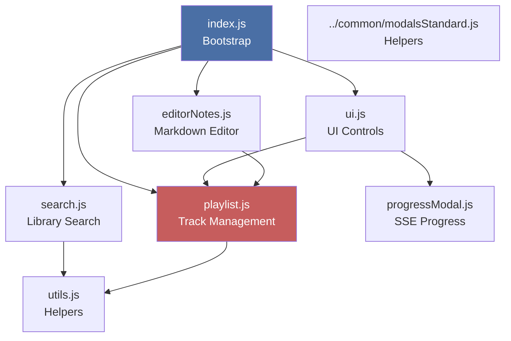
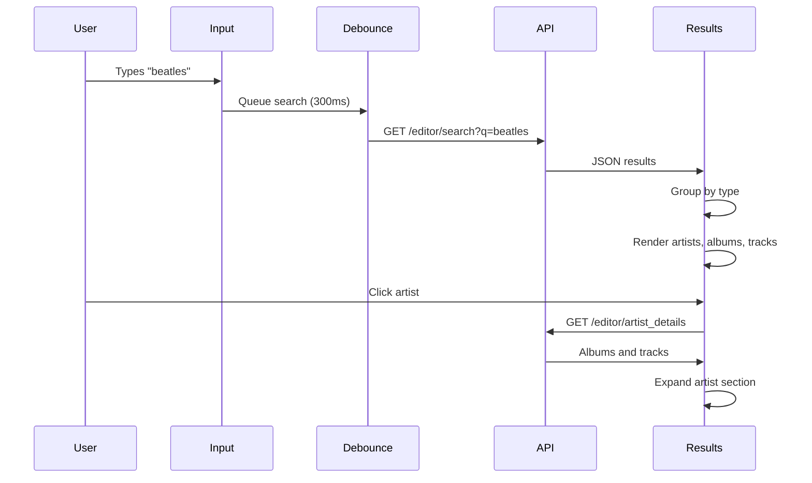
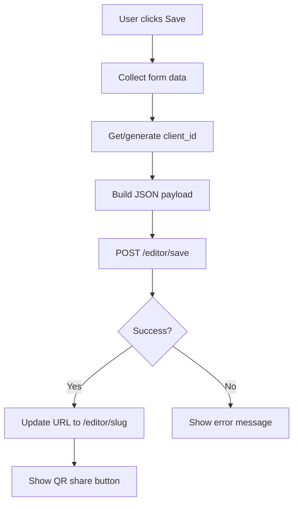

# Editor Frontend Modules

{ align=right width="90" }

This page documents the client-side JavaScript architecture for the Mixtape Editor. All modules use ES6 imports/exports and communicate via a shared playlist state and callback system.

---

## 🎯 Overview

The editor frontend consists of modular JavaScript files that handle:

- **Search** - Debounced library search with lazy-loaded details
- **Playlist** - Drag-and-drop track management and preview playback
- **Notes** - Markdown editor with track reference expansion
- **UI** - Cover upload, save button, unsaved changes detection
- **Progress** - Real-time SSE connection for background caching

**Location:** `static/js/editor/`
**Architecture:** ES6 modules with no circular dependencies
**State management:** Single source of truth (playlist array)

---

## 📦 Module Structure



---

## 📚 Core Modules

### index.js

**Purpose:** Bootstrap the entire editor page

**Responsibilities:**

- Load preloaded mixtape data from `window.PRELOADED_MIXTAPE`
- Initialize all other modules
- Set up initial state (playlist, cover, title)
- Activate appropriate liner notes tab

**Key code:**

```javascript
document.addEventListener("DOMContentLoaded", () => {
    // 1. Load preloaded data
    const preloadedMixtape = window.PRELOADED_MIXTAPE;

    // 2. Set playlist
    setPlaylist(preloadedMixtape.tracks || []);

    // 3. Initialize modules
    initSearch();
    initPlaylist();
    initEditorNotes(preloadedMixtape.liner_notes);
    initUI();

    // 4. Set initial UI state
    if (preloadedMixtape.cover) {
        document.getElementById('playlist-cover').src = preloadedMixtape.cover;
    }

    document.getElementById('playlist-title').value = preloadedMixtape.title;

    // 5. Activate notes tab
    activateInitialNotesTab(preloadedMixtape.liner_notes);
});
```

---

### search.js

**Purpose:** Library search with debounced input and lazy loading

**Exports:**

```javascript
export function initSearch()
```

**Features:**

- 300ms debounce on search input
- Minimum 3 character query length
- Grouped results by type (artist, album, track)
- Lazy loading of artist/album details
- Add buttons for immediate track addition
- Preview play/pause for tracks

**Search flow:**



**Key functions:**

```javascript
// Debounced search
function performSearch(query) {
    if (query.length < 3) return;

    fetch(`/editor/search?q=${encodeURIComponent(query)}`)
        .then(r => r.json())
        .then(results => renderResults(results));
}

// Render grouped results
function renderResults(results) {
    const artists = results.filter(r => r.type === 'artist');
    const albums = results.filter(r => r.type === 'album');
    const tracks = results.filter(r => r.type === 'track');

    // Render each group
}

// Lazy load details
function loadArtistDetails(artist) {
    fetch(`/editor/artist_details?artist=${encodeURIComponent(artist)}`)
        .then(r => r.json())
        .then(details => expandArtist(details));
}
```

---

### playlist.js

**Purpose:** Central playlist state management

**Exports:**

```javascript
export const playlist = [];  // Shared state
export function initPlaylist()
export function addToPlaylist(track)
export function setPlaylist(tracks)
export function registerUnsavedChangesCallback(callback)
export function registerToastCallback(callback)
```

**State management:**

The `playlist` array is the **single source of truth**:

```javascript
// Shared state (exported)
export const playlist = [];

// Add track
export function addToPlaylist(track) {
    playlist.push(track);
    renderPlaylist();
    notifyUnsavedChanges();
    showToast('Track added');
}

// Remove track
function removeTrack(index) {
    playlist.splice(index, 1);
    renderPlaylist();
    notifyUnsavedChanges();
    showToast('Track removed');
}

// Reorder (via drag-and-drop)
function reorderPlaylist(oldIndex, newIndex) {
    const [track] = playlist.splice(oldIndex, 1);
    playlist.splice(newIndex, 0, track);
    renderPlaylist();
    notifyUnsavedChanges();
}
```

**Drag-and-drop:**

Uses SortableJS for drag-and-drop:

```javascript
import Sortable from 'sortablejs';

function initPlaylist() {
    const playlistEl = document.getElementById('playlist');

    Sortable.create(playlistEl, {
        animation: 150,
        handle: '.drag-handle',
        onEnd: (evt) => {
            reorderPlaylist(evt.oldIndex, evt.newIndex);
        }
    });
}
```

**Preview playback:**

Tracks can be previewed before saving:

```javascript
function playPreview(index) {
    const track = playlist[index];
    const audio = document.getElementById('preview-audio');

    audio.src = `/play/${track.path}?quality=low`;
    audio.play();

    // Update UI
    updatePreviewDisplay(track);
}
```

---

### editorNotes.js

**Purpose:** Markdown editor with track reference expansion

**Exports:**

```javascript
export function initEditorNotes(initialNotes)
```

**Features:**

- EasyMDE markdown editor
- Custom preview rendering
- Track reference expansion (#1, #2-4)
- Write/Preview tabs

**Track reference syntax:**

```markdown
Check out track #1 - it's amazing!

The sequence from #3-5 is perfect.

My favorite is #12.
```

**Expansion logic:**

```javascript
function expandTrackReferences(markdown) {
    // #1 → [Track Title](artist)
    markdown = markdown.replace(/#(\d+)/g, (match, num) => {
        const index = parseInt(num) - 1;
        const track = playlist[index];
        return track ? `[${track.track}](${track.artist})` : match;
    });

    // #3-5 → [Track 3](artist), [Track 4](artist), [Track 5](artist)
    markdown = markdown.replace(/#(\d+)-(\d+)/g, (match, start, end) => {
        const tracks = [];
        for (let i = parseInt(start) - 1; i < parseInt(end); i++) {
            const track = playlist[i];
            if (track) {
                tracks.push(`[${track.track}](${track.artist})`);
            }
        }
        return tracks.join(', ');
    });

    return markdown;
}
```

**EasyMDE setup:**

```javascript
function initEditorNotes(initialNotes) {
    const easyMDE = new EasyMDE({
        element: document.getElementById('liner-notes'),
        initialValue: initialNotes || '',
        spellChecker: false,
        previewRender: (plainText) => {
            // Expand track references
            const expanded = expandTrackReferences(plainText);
            // Render markdown
            return marked.parse(expanded);
        }
    });
}
```

---

### ui.js

**Purpose:** UI interactions and state management

**Exports:**

```javascript
export function initUI()
export function activateInitialNotesTab(hasNotes)
```

**Responsibilities:**

- Cover upload and composite modal
- Save button with client-id handling
- Floating buttons (mobile)
- Unsaved changes detection
- Navigation guard (beforeunload)
- Bottom audio player

**Save flow:**



**Unsaved changes:**

```javascript
let hasUnsavedChanges = false;

// Register callback from playlist
registerUnsavedChangesCallback((changed) => {
    hasUnsavedChanges = changed;
    updateSaveButtonState();
});

// Warn before navigation
window.addEventListener('beforeunload', (e) => {
    if (hasUnsavedChanges) {
        e.preventDefault();
        e.returnValue = 'You have unsaved changes';
    }
});
```

**Cover upload:**

```javascript
function handleCoverUpload(file) {
    const reader = new FileReader();

    reader.onload = (e) => {
        const dataURL = e.target.result;

        // Display preview
        document.getElementById('playlist-cover').src = dataURL;

        // Will be sent in save payload
        coverData = dataURL;

        notifyUnsavedChanges();
    };

    reader.readAsDataURL(file);
}
```

---

### progressModal.js

**Purpose:** Display background caching progress via SSE

**Exports:**

```javascript
export function showProgressModal(slug)
```

**SSE connection:**

```javascript
export function showProgressModal(slug) {
    // Create modal
    const modal = createProgressModal();

    // Connect to SSE endpoint
    const eventSource = new EventSource(`/editor/progress/${slug}`);

    eventSource.onmessage = (event) => {
        const data = JSON.parse(event.data);

        if (data.type === 'connected') {
            updateStatus('Connected to server');
        } else if (data.type === 'progress') {
            updateProgress(data);
        }
    };

    eventSource.onerror = () => {
        updateStatus('Connection lost');
        eventSource.close();
    };
}
```

**Progress display:**

```javascript
function updateProgress(data) {
    const { step, status, message, current, total } = data;

    // Update progress bar
    const percent = (current / total) * 100;
    progressBar.style.width = `${percent}%`;

    // Update message
    messageEl.textContent = message;

    // Add to log
    logEl.innerHTML += `<div>${step}: ${message}</div>`;

    // Show close button when complete
    if (step === 'completed') {
        closeBtn.style.display = 'block';
    }
}
```

---

### utils.js

**Purpose:** Shared helper functions

**Exports:**

```javascript
export function escapeHtml(text)
export function escapeRegExp(text)
export function highlightText(text, query)
export function showAlert(message)
export function showConfirm(message)
export function renderTrackReferences(markdown, playlist)
export function htmlSafeJson(obj)
```

**Common helpers:**

```javascript
// HTML escaping
export function escapeHtml(text) {
    const div = document.createElement('div');
    div.textContent = text;
    return div.innerHTML;
}

// Highlight search terms
export function highlightText(text, query) {
    const escaped = escapeRegExp(query);
    const regex = new RegExp(`(${escaped})`, 'gi');
    return text.replace(regex, '<mark>$1</mark>');
}

// Modal dialogs
export function showAlert(message) {
    return new Promise((resolve) => {
        // Bootstrap modal
        const modal = new bootstrap.Modal(document.getElementById('appModal'));
        // ... setup and show
        modal.show();
    });
}
```

---

## 🔄 Communication Patterns

### Callback Registration

Modules communicate via registered callbacks:

```javascript
// playlist.js
const unsavedChangesCallbacks = [];
const toastCallbacks = [];

export function registerUnsavedChangesCallback(callback) {
    unsavedChangesCallbacks.push(callback);
}

function notifyUnsavedChanges() {
    unsavedChangesCallbacks.forEach(cb => cb(true));
}

// ui.js
registerUnsavedChangesCallback((changed) => {
    hasUnsavedChanges = changed;
    updateUI();
});
```

### Event Dispatching

Custom events for module communication:

```javascript
// Dispatch event
document.dispatchEvent(new CustomEvent('mixtape-saved', {
    detail: { slug: 'my-mixtape' }
}));

// Listen for event
document.addEventListener('mixtape-saved', (e) => {
    console.log('Mixtape saved:', e.detail.slug);
});
```

---

## 🎨 UI Components

### Track List Item

```html
<li class="track-item" data-index="0">
    <div class="drag-handle">⋮⋮</div>
    
    <div class="track-info">
        <div class="track-title">Come Together</div>
        <div class="track-artist">The Beatles • Abbey Road</div>
    </div>
    <div class="track-actions">
        <button class="preview-btn">▶️</button>
        <button class="remove-btn">✕</button>
    </div>
</li>
```

### Search Result (Track)

```html
<div class="search-result track">
    
    <div class="result-info">
        <div class="result-title">Come Together</div>
        <div class="result-artist">The Beatles • Abbey Road</div>
        <div class="result-duration">4:20</div>
    </div>
    <button class="add-btn">Add</button>
</div>
```

---

## 📊 State Management

### Playlist State

```javascript
// playlist.js - SINGLE SOURCE OF TRUTH
export const playlist = [
    {
        artist: 'The Beatles',
        album: 'Abbey Road',
        track: 'Come Together',
        duration: '4:20',
        path: 'The Beatles/Abbey Road/01 Come Together.flac',
        filename: '01 Come Together.flac',
        cover: '/covers/abbey_road.jpg'
    }
];
```

**All modules read from this shared array:**

- search.js - Checks for duplicates before adding
- editorNotes.js - Expands track references
- ui.js - Builds save payload
- No module owns exclusive write access

### Unsaved Changes

```javascript
// ui.js
let hasUnsavedChanges = false;
let savedPlaylistHash = '';

// Calculate hash on save
function onSaveSuccess() {
    savedPlaylistHash = hashPlaylist(playlist);
    hasUnsavedChanges = false;
}

// Check on changes
function checkForChanges() {
    const currentHash = hashPlaylist(playlist);
    hasUnsavedChanges = (currentHash !== savedPlaylistHash);
}
```

---

## 🧪 Testing

### Manual Testing

**Search:**

1. Type in search box
2. Verify debounce (300ms delay)
3. Check grouped results
4. Expand artist/album
5. Add track to playlist

**Playlist:**

1. Drag track to reorder
2. Click preview button
3. Remove track
4. Verify unsaved changes indicator

**Notes:**

1. Write markdown with track references
2. Switch to Preview tab
3. Verify references expand correctly

**Save:**

1. Make changes
2. Click Save
3. Verify progress modal
4. Check URL updates

### Console Debugging

```javascript
// Check playlist state
console.log('Playlist:', playlist);

// Monitor search
window.searchDebug = true;

// Track unsaved changes
window.addEventListener('unsaved-changes', (e) => {
    console.log('Unsaved:', e.detail);
});
```

---

## 📚 Related Documentation

- **[Backend API](editor-api.md)** - Flask routes and server logic
- **[Editor Overview](overview.md)** - Complete system architecture
- **[Player Controls](../audio-playback/frontend/player-controls.md)** - Preview playback
- **[QR Share](../web-application/routes/qr-codes.md)** - Shared QR functionality

---

*Implementation: `static/js/editor/`*
