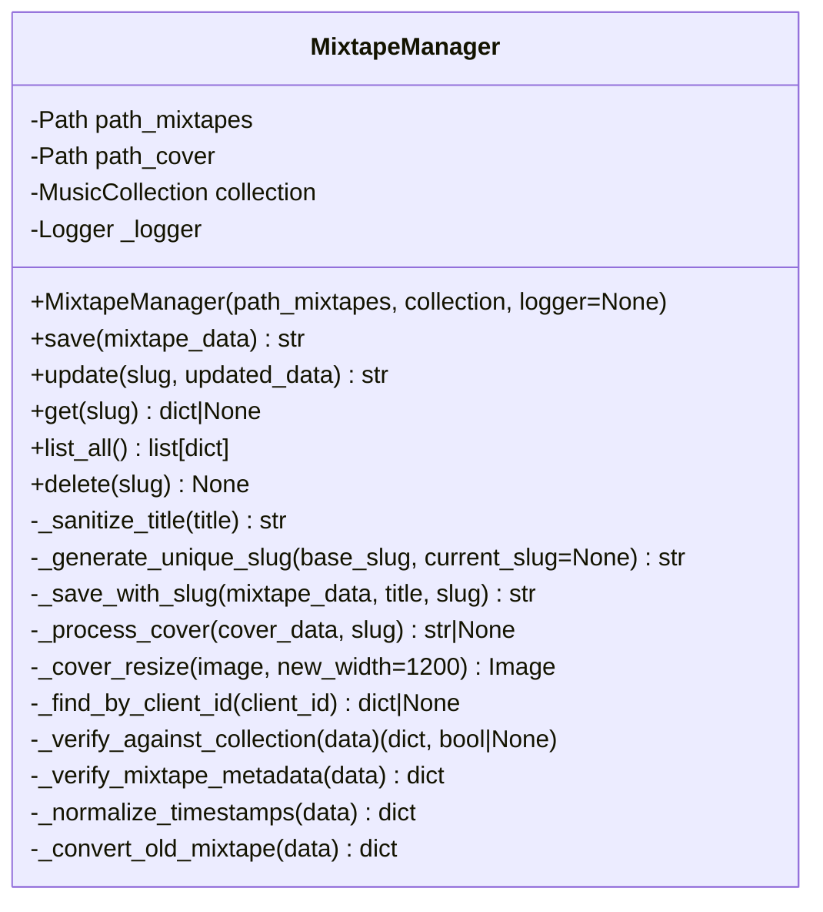

{ align=right width="90" }

# Mixtape Manager

The `mixtape_manager` package defines the `MixtapeManager` class, This class acts as the core data access and management layer for mixtape-related features in the larger system, abstracting away file system operations and data consistency concerns.

It is responsible for managing the storage, retrieval, and organization of mixtape data and their associated cover images on disk. It provides a high-level interface for saving, deleting, listing, and loading mixtape metadata, handling both JSON data and image files. The class ensures that mixtape data is consistently stored, cover images are processed from base64, and metadata is maintained for easy retrieval and display.

## 🏛️ Architecture Overview



* **Storage root** – `path_mixtapes` (provided by the caller).
* **Cover sub‑directory** – `path_cover = path_mixtapes / "covers"` (created automatically).
* **Dependency** – `Pillow` (`PIL.Image`) is required for cover‑image resizing.

## 📂 Filesystem Layout & JSON Schema

```bash
/path/to/mixtapes/
│
├─ my‑awesome‑mix.json          ← Mixtape metadata (UTF‑8 JSON)
├─ another‑mix.json
│
└─ covers/
   ├─ my‑awesome‑mix.jpg       ← JPEG cover (max width 1200 px, quality 100)
   └─ another‑mix.jpg
```

### Minimal JSON structure (all fields are optional unless noted)

| Field | Type | Description |
| ----- | ---- | ----------- |
| `title` | `str` | Human-readable title (used for slug generation). |
| `client_id` | `str` | Optional identifier that ties a mixtape to a specific client/device. |
| `created_at` | ISO-8601 `str` | Set on first save; auto-filled if missing. |
| `updated_at` | ISO-8601 `str` | Refreshed on every save or update. |
| `cover` | `str` | Relative path to the JPEG cover (`covers/<slug>.jpg`) or a data-URI (`data:image/...`). |
| `liner_notes` | `str` | Free-form notes; defaults to `""`. |
| `tracks` | `list[dict]` | Each entry must contain at least `path` (relative to the music root). Other keys (`artist`, `album`, `track`, `duration`, `filename`, `cover`) are filled/validated on read. |
| `slug` | `str` (added on output) | Filesystem-safe identifier derived from `title`, added by the manager on output. |

## ⚙️ Behavior Details

### Slug generation & uniqueness

* `_sanitize_title` removes any character that isn’t alphanumeric, hyphen, underscore, or space, then strips surrounding whitespace.
* `_generate_unique_slug` checks `path_mixtapes/*.json`. If a conflict exists it appends `-1`, `-2`, … until a free filename is found.
* When updating an existing mixtape you may pass `current_slug` so the method can reuse the same filename.

### Client‑ID reuse on save

* If `mixtape_data` contains a `client_id`, `save()` first calls `_find_by_client_id`.
* The first mixtape that matches that `client_id` is updated in‑place (the same slug is kept).
* If no match is found a brand‑new mixtape is created.

### Timestamp handling & legacy migration

* On first creation both `created_at` and `updated_at` are set to `datetime.now().isoformat()`.
* On every `update` only `updated_at` is refreshed.
* `_normalize_timestamps` migrates a historic `saved_at` field to `updated_at` and guarantees that `created_at` and `updated_at` are present (fills missing values with `None` or the current time).

### Cover image handling

| Helper | What it does | Important details |
| ----- | ------------ | ----------------- |
| `_process_cover(cover_data: str, slug: str) → str \| None` | Decodes a `data:image/...;base64,…` string, resizes the image, saves it as a JPEG under `covers/<slug>.jpg`, and returns the relative path (`covers/<slug>.jpg`). | Returns `None` on any error; the calling code keeps the original `cover` value. |
| `_cover_resize(image: Image, new_width: int = 1200) → Image` | Resizes the Pillow `Image` to a maximum width of `new_width` while preserving aspect ratio. | Uses `Image.LANCZOS` for high-quality down-sampling. |
| `_save_with_slug` | Handles cover persistence during save operations. | If `cover` starts with `data:image`, delegates to `_process_cover`. If it is a plain string (already a relative path), it is stored unchanged. Errors during cover processing are logged but do not abort the mixtape save. |

* The JPEG is saved with quality = 100 (lossless as far as JPEG permits).
* The filename on disk is exactly `covers/<slug>.jpg` – the method builds the relative path string for the JSON field.

### Verification against the music collection

* `get(slug)` loads the JSON, then calls `_verify_against_collection.`
* For each track it fetches the canonical record from the injected MusicCollection (`self.collection.get_track(path=Path(track* ["path"]))`).
* Missing or stale fields (`artist`, `album`, `track`, `filename`, `duration`, `cover`) are refreshed.
* If the collection cannot be accessed (e.g., DB corruption) the method falls back to the raw JSON and logs a warning.

### Legacy field conversion

* Older mixtapes stored a track title under the key `title`. `_convert_old_mixtape` renames that key to `track` so the rest of the code can rely on a uniform schema.

### Error handling & robustness

* **Corrupted JSON files** – both `list_all` and `_find_by_client_id` catch json.JSONDecodeError / OSError, log a warning, and simply skip the offending file.
* **Cover‑image failures** – `_process_cover` catches any exception, logs an error, and returns None. The mixtape is still saved; the `cover` field will be omitted or retain its previous value.
* **Missing slug on update** – `update` raises `FileNotFoundError` if the target JSON does not exist, making the failure explicit to the caller.

## 🔁 Sequence Diagram

```mermaid
sequenceDiagram
    participant Client
    participant MixtapeManager
    participant Disk
    participant MusicCollection

    Client->>MixtapeManager: save(mixtape_data)
    MixtapeManager->>Disk: Write JSON file (<slug>.json)
    alt cover is a data‑uri
        MixtapeManager->>Disk: Decode + resize + JPEG → covers/<slug>.jpg
    end
    MixtapeManager-->>Client: slug

    Client->>MixtapeManager: get(slug)
    MixtapeManager->>Disk: Read JSON file
    MixtapeManager->>MusicCollection: get_track for each track
    MusicCollection-->>MixtapeManager: track metadata
    MixtapeManager-->>Client: enriched mixtape dict

    Client->>MixtapeManager: list_all()
    MixtapeManager->>Disk: glob *.json, read each
    MixtapeManager-->>Client: sorted list of mixtapes

    Client->>MixtapeManager: delete(slug)
    MixtapeManager->>Disk: Delete JSON + optional cover
    MixtapeManager-->>Client: (none)
```



## 🔌 API

### ::: src.mixtape_manager.mixtape_manager.MixtapeManager
