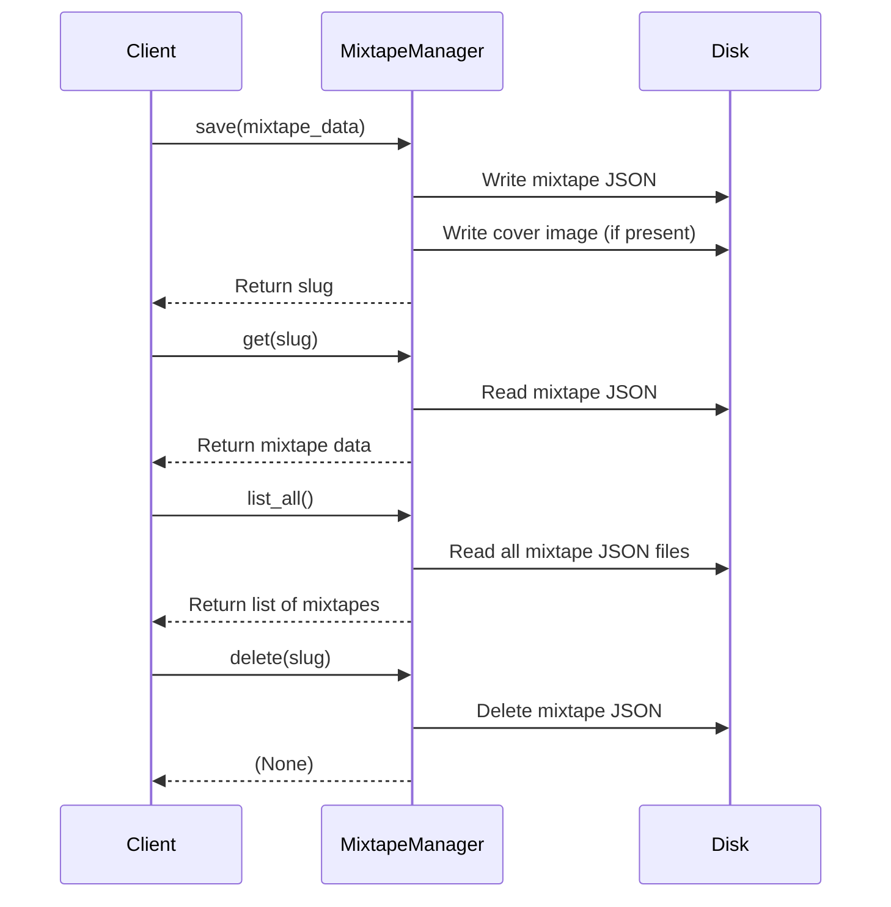

{ align=right width="90" }

# Mixtape Manager

The `mixtape_manager` package defines the `MixtapeManager` class, This class acts as the core data access and management layer for mixtape-related features in the larger system, abstracting away file system operations and data consistency concerns.

It is responsible for managing the storage, retrieval, and organization of mixtape data and their associated cover images on disk. It provides a high-level interface for saving, deleting, listing, and loading mixtape metadata, handling both JSON data and image files. The class ensures that mixtape data is consistently stored, cover images are processed from base64, and metadata is maintained for easy retrieval and display.

## Communication sequence

## Key Components

* **`MixtapeManager` Class**

    The central class encapsulating all mixtape management logic. It initializes storage directories, and exposes methods for CRUD operations on mixtapes.

* **Directory and File Management**

    Uses Python's pathlib for robust path handling, ensuring directories for mixtapes and covers exist.

* **Cover Image Handling**
    Decodes base64-encoded cover images and saves them as JPEG files, updating the mixtape data to reference the relative path.

* **Metadata Management**
    Automatically adds a saved_at timestamp and ensures each mixtape has a unique slug derived from its title.

## API

### ::: src.mixtape_manager.mixtape_manager.MixtapeManager
