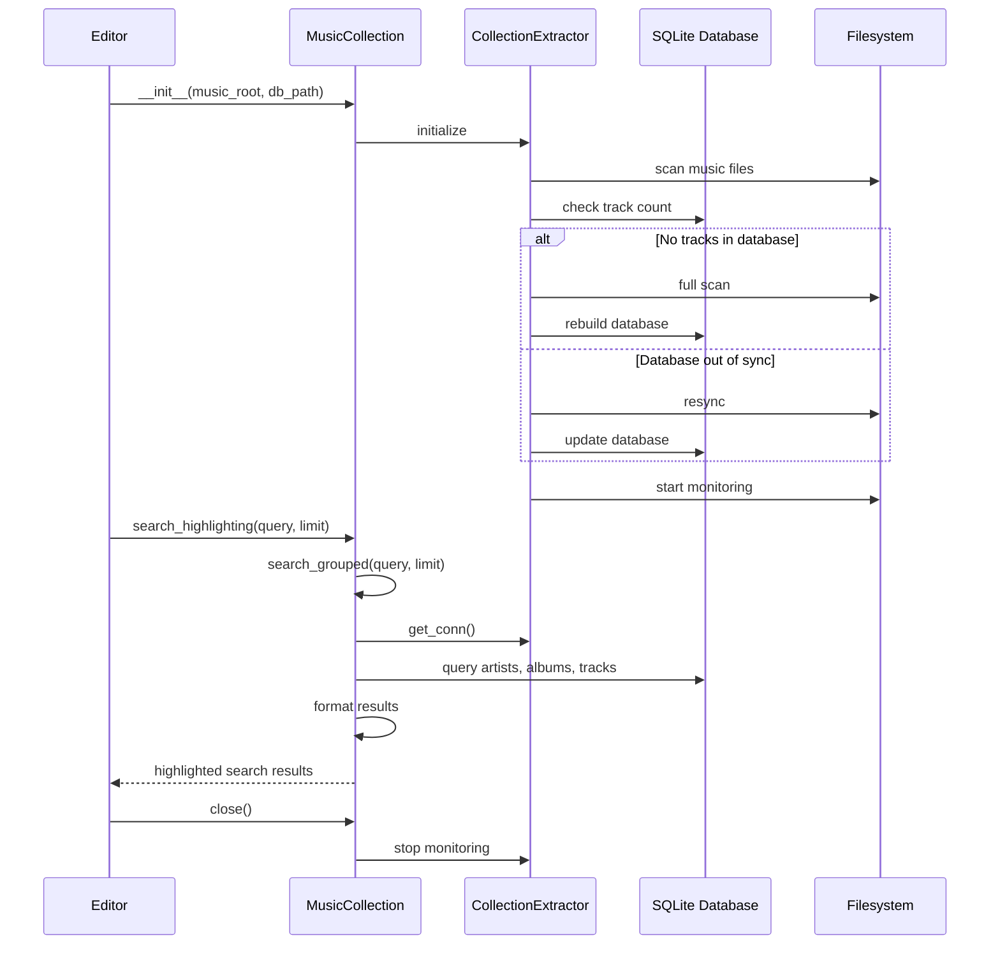
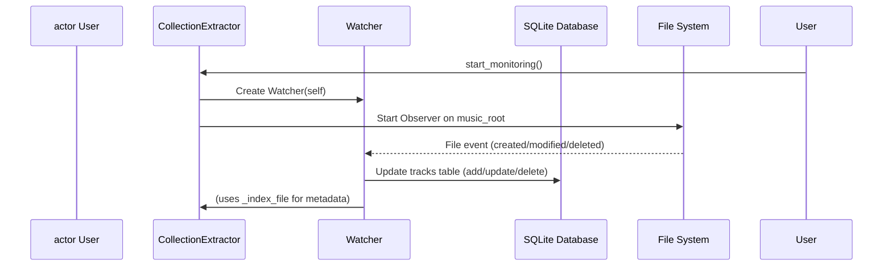

# Music Collection handling

{ align=right width="90" }

The `musiclib` module provides the `MusicCollection` class, which serves as a high-level interface for managing and querying a local music library. It abstracts the complexities of synchronizing a music collection stored on the filesystem with a backing SQLite database, providing search, indexing, and live monitoring capabilities. The class is designed to be used as the main entry point for applications or services that need to interact with a user's music library, offering methods for searching artists, albums, and tracks, as well as for maintaining the integrity and synchronization of the library.

Creating/maintaining the music collection database

Real-time file system monitoring and database update

## Key Components

* **`MusicCollection` Class**: Manages the music library, initialized with paths to music directories. It loads music files, extracts metadata, and provides methods for searching and retrieving tracks. Responsibilities include:
    * **Search Methods**
        * `search_highlighting(query, limit)`: Returns UI-friendly, highlighted search results for artists, albums, and tracks matching the query.
        * `search_grouped(query, limit)`: Returns grouped search results (artists, albums, tracks) as dictionaries, suitable for further processing or display.
        * Internal helper methods (`_search_artists`, `_search_albums`, `_search_tracks`, etc.) perform efficient, case-insensitive SQL queries and structure the results.
    * **Result Formatting**:
    Several private methods (`_format_artist_results`, `_format_album_results`, `_format_track_results`, etc.) process and format search results for UI consumption, including text highlighting and reason annotation.
    * **Utility Methods**:
        * `highlight_text`: Highlights occurrences of the search query in result strings.
        * `_format_relative_path`, `_format_duration`, `_safe_filename`: Helpers for formatting file paths, durations, and filenames for display or download.
    * **Maintenance & Lifecycle**:
        * `rebuild()`: Forces a full reindex of the music library.
        * `close()`: Stops background monitoring.
        * Context manager support (`__enter__`, `__exit__`) and destructor (`__del__`) ensure resources are cleaned up properly.
* **`CollectionExtractor` Class**:  Central class for managing the extraction, indexing, and synchronization of music metadata from the file system to a SQLite database. Responsibilities include:
    * Initializes and ensures the database schema.
    * Scans the music directory and indexes supported music files.
    * Extracts metadata (artist, album, title, year, duration, etc.) using the TinyTag library.
    * Provides methods for counting tracks, checking sync status, resyncing, and rebuilding the index.
    * Supports live monitoring of the music directory using the watchdog library.
* **`Watcher` Class**:  Handles file system events and updates the music database in response to changes. Responsibilities include:
    * Listens for file creation, modification, movement, and deletion events in the music directory.
    * Updates the database by adding, updating, or removing track records as needed.
    * Uses watchdog to observe changes in the music directory and trigger database updates in real time.

## API

### ::: src.musiclib.reader.MusicCollection

### ::: src.musiclib._extractor.EventType 

### ::: src.musiclib._extractor.IndexEvent 

### ::: src.musiclib._extractor.CollectionExtractor

### ::: src.musiclib._extractor._Watcher

