{ align=right width="90" }

# 🎵 Musiclib - Music Collection handling

## Overview and introduction

The musiclib package is the heart of the mixtape music‑collection service.
It turns a plain directory tree of audio files into a searchable, fully‑indexed library that can be queried instantly from the UI.

Below is a concise, high‑level walkthrough of the module’s responsibilities, its main components, and how they interact to deliver a robust “scan‑once‑search‑forever” experience.

---

### 1. What the module does

| Goal                         | How it’s achieved                                                                                                                                                     |
|------------------------------|-----------------------------------------------------------------------------------------------------------------------------------------------------------------------|
| Detect every supported audio file | A **watchdog observer** monitors the `music_root` directory in real time.                                                                                             |
| Extract reliable metadata    | `tinytag.TinyTag` reads ID3/metadata tags (artist, album, title, year, duration, etc.).                                                                            |
| Persist metadata efficiently | A **SQLite** database stores the canonical rows (`tracks` table) and an **FTS5** virtual table (`tracks_fts`) that mirrors the same columns for lightning‑fast full‑text search. |
| Keep the DB in sync          | A **single writer thread** serialises all write operations (adds, deletes, clears) via a thread‑safe `Queue[IndexEvent]`.                                             |
| Expose progress to the UI    | A tiny JSON file (`indexing_status.json`) is updated atomically during long‑running operations (rebuild, resync) so the front‑end can render progress bars.            |
| Provide a clean API for the UI | `MusicCollection` (in `reader.py`) builds the search expression, runs the query, groups results by release directory, and returns a ready‑to‑render structure (artists, albums, tracks) together with the list of terms that need highlighting. |

---

### 2. Core building blocks

| Module / Class          | Primary responsibility                                                                                                                                                                                                 |
|--------------------------|--------------------------------------------------------------------------------------------------------------------------------------------------------------------------------------------------------------------------|
| **`_extractor.py`**      | • Low‑level DB schema creation (`_init_db`). <br>• Full‑text table bootstrap (`_populate_fts_if_needed`). <br>• **`CollectionExtractor`** – orchestrates indexing, resync, rebuild, and live monitoring. <br>• **`IndexEvent` / `EventType`** – typed messages that drive the writer thread. <br>• **`_Watcher`** – translates filesystem events into `IndexEvent`s. |
| **`indexing_status.py`**| Helper functions that write/read the `indexing_status.json` file in an atomic, crash‑safe way (e.g., `set_indexing_status`, `clear_indexing_status`, `get_indexing_status`).                                                     |
| **`reader.py`**          | High‑level façade (**`MusicCollection`**) used by the UI. It parses user queries, builds the FTS/LIKE expression, runs the query, groups rows, and formats the result payload (artists, albums, tracks, and highlight terms).          |
| **`ui.py`**              | Extends `MusicCollection` with UI‑specific helpers: <br>• `_highlight_text` (term highlighting) <br>• `_safe_filename` (sanitising filenames) <br>• `_escape_for_query` (building click‑query strings) <br>• result shaping for the front‑end. |

---

### 3. Data flow – from file system to UI

1. **Startup** – `MusicCollection` creates a `CollectionExtractor`. The extractor initializes the SQLite schema and launches the writer thread.
1. **Initial population** – If the DB is empty, `MusicCollection` schedules a rebuild. The rebuild walks the entire `music_root`, enqueues an `INDEX_FILE` event for every supported file, and updates `indexing_status.json` so the UI can show progress.
1. **Live updates** – The `watchdog` observer fires on every create/modify/delete. `_Watcher` converts those into `IndexEvent`s, which the writer thread processes in order, keeping the DB and the FTS mirror perfectly aligned.
1. **Search** – When the UI calls `search_highlighting`, `MusicCollection` parses the query, builds an FTS‑compatible expression (or a fallback `LIKE` query), runs it against the DB, groups rows by release directory, and returns a dictionary of artists, albums, and tracks plus the list of parsed terms. Internally, searches use a multi-pass candidate scoring model with optional reuse of previous search sessions for fast refinements.
1. **Presentation** – `MusicCollectionUI` highlights the terms, builds click‑queries (`artist:…`, `release_dir:…`), and hands the ready‑to‑render JSON back to the front‑end. Lazy‑loading of an artist’s full discography or an album’s track list is done by re‑issuing `search_grouped` with the stored click‑query.

---

### 4. Why the design choices matter

| Design decision                                 | Benefit                                                                                                                                                              |
|-------------------------------------------------|----------------------------------------------------------------------------------------------------------------------------------------------------------------------|
| **Single writer thread + queue**                | Guarantees deterministic ordering of DB writes, avoids SQLite lock contention, and lets the UI stay responsive while heavy indexing runs in the background.            |
| **FTS5 virtual table with triggers**            | Provides sub‑millisecond full‑text look‑ups without having to maintain a separate index manually.                                                                    |
| **Atomic JSON status file**                     | Prevents corrupted progress information even if the process crashes mid‑write; the UI never sees a half‑written file.                                                  |
| **Watchdog‑driven live sync**                   | Users see newly added songs appear instantly; deletions are reflected without a full rescan.                                                                         |
| **Separation of concerns** (`_extractor` vs. `reader` vs. `ui`) | Keeps low‑level DB handling isolated from query parsing and UI formatting, making the code easier to test and extend.                                                |
| **Typed `IndexEvent` dataclass**                | Improves readability, reduces bugs caused by mismatched queue payloads, and makes future event types straightforward to add.                                          |

---

### 5. Quick mental model


*The arrow direction indicates the primary flow of data.*

The UI never talks directly to the filesystem; it always goes through MusicCollection, which in turn reads from the already‑indexed SQLite store.

---

### 6. Getting started (for developers)

1. Instantiate the high‑level class:

    ```python
    from musiclib import MusicCollectionUI
    mc = MusicCollectionUI(music_root="/path/to/music", db_path="/path/to/db.sqlite")
    ```

2. Run a query (the UI does this internally):

    ```python
    results, terms = mc.search_highlighting(qry="artist:'Radiohead' love")
    ```

3. Monitor progress (useful for CLI tools):

    ```python
    from musiclib.indexing_status import get_indexing_status
    status = get_indexing_status("/path/to/db_folder")
    print(status)   # → {'status': 'rebuilding', 'progress': 0.42, …}
    ```

4. Shut down cleanly when the program exits:

    ```python
    mc.close()   # stops the writer thread and the watchdog observer
    ```

---

### 7. Where to look next

* `_extractor.py` – for the low‑level DB schema, triggers, and the writer‑loop logic.
* `reader.py` – for the query parser (`parse_query`) and the grouping algorithm that decides which artists/albums/tracks to return.
* `ui.py` – for the presentation helpers (highlighting, safe filenames, click‑query generation).
* `indexing_status.py` – for the atomic JSON status handling used by the UI progress bar.

That’s the complete picture of the `musiclib` module: a tightly coupled pipeline that turns a folder of audio files into a fast, searchable, and continuously synchronized music library.

---

## Searching the music collection

The music collection supports a flexible, tag-based search language that can return **artists, albums, and tracks** in a single request.
Search results are **grouped, scored, highlighted**, and designed for **lazy navigation** via follow-up queries.

Searching is implemented in two layers:

* **Core search engine** – `MusicCollection.search_grouped(...)` (in `reader.py`)
* **UI-facing API** – `MusicCollectionUI.search_highlighting(...)` (in `ui.py`)

Most applications should call the UI-facing method.

---

### 1. Entry points

#### UI-facing search (recommended)

```python
results = mc_ui.search_highlighting(query, limit=30)
```

Returns a **single list of result objects**, ready for rendering in a UI.
Each result object has a `type` field (`artist`, `album`, or `track`) and includes highlighted text and navigation metadata.

#### Core grouped search (lower-level)

```python
grouped, terms = mc.search_grouped(query, limit=20)
```

Returns:

1. A dictionary with three lists: `artists`, `albums`, `tracks`
2. The parsed search terms, grouped by category

This method is primarily used internally by the UI layer.

---

### 2. Query language

The query parser recognizes **tagged terms** and **general free-text terms**.

#### Supported tags

| Tag                | Example                  | Meaning                               |
| ------------------ | ------------------------ | ------------------------------------- |
| `artist:`          | `artist:Prince`          | Restrict results to a specific artist |
| `album:`           | `album:"Purple Rain"`    | Restrict results to a specific album  |
| `track:` / `song:` | `track:"When Doves Cry"` | Restrict results to track titles      |

#### Free-text terms

Any term **not** prefixed by a tag is treated as free-text and matched against:

* artist
* album
* track title

Example:

```
love
```

#### Quoting and escaping

* Single or double quotes allow multi-word values

  ```
  artist:"The Beatles"
  ```
* Backslashes can escape special characters inside quoted values

---

### 3. Parsed term structure

The query is normalized into a dictionary:

```python
{
    "artist":  [...],
    "album":   [...],
    "track":   [...],
    "general": [...]
}
```

This structure is returned alongside the search results and reused for:

* scoring
* highlighting
* UI explanation (“why did this match?”)

---

### 4. Search execution model

#### Pass-one candidate collection

The search engine performs a **first pass** to collect candidates:

* Artists are scored by how well they match artist terms
* Albums are scored by album name and artist context
* Tracks are scored by title and tag matches

The engine may **reuse candidates from the previous search session** if the new query is a refinement (e.g. clicking an artist).

#### Scoring (simplified)

Matches are weighted using:

* Exact matches
* Prefix matches
* Substring matches
* Tag bonuses (explicit `artist:`, `album:`, `track:`)

This produces ranked candidate sets for artists, albums, and tracks.

---

### 5. Result grouping and hierarchy

After scoring, results are assembled into a hierarchical structure:

* Artists
* Albums
* Tracks

The engine decides which groups to include based on the query:

| Query type        | Included sections               |
| ----------------- | ------------------------------- |
| Free-text only    | Artists, albums, and tracks     |
| `artist:` present | Artists + related albums/tracks |
| `album:` present  | Albums + tracks                 |
| `track:` present  | Tracks only                     |

---

### 6. UI result model (`search_highlighting`)

The UI layer converts grouped results into a **single flat list** of result objects.

Each object has a `type` field and a shape appropriate for rendering.

#### Artist results

```json
{
  "type": "artist",
  "artist": "<mark>Prince</mark>",
  "raw_artist": "Prince",
  "reasons": [
    { "type": "album", "text": "3 album(s)" },
    { "type": "track", "text": "12 nummer(s)" }
  ],
  "load_on_demand": true,
  "clickable": true,
  "click_query": "artist:'Prince'"
}
```

**Characteristics**

* Summary only (no albums or tracks included)
* Always lazy-loaded
* Clicking triggers a new search using `click_query`

---

#### Album results

```json
{
  "type": "album",
  "artist": "Prince",
  "album": "<mark>Purple Rain</mark>",
  "is_compilation": false,
  "reasons": [
    { "type": "track", "text": "5 nummer(s)" }
  ],
  "load_on_demand": true,
  "clickable": true,
  "click_query": "release_dir:'/Prince/Purple Rain'"
}
```

**Characteristics**

* Summary only
* Tracks are loaded on demand
* Albums with tracks by more than three artists are shown as **“Various Artists”**

---

#### Track results

```json
{
  "type": "track",
  "artist": "Prince",
  "album": "Purple Rain",
  "track": "<mark>When Doves Cry</mark>",
  "duration": "5:54",
  "path": "Prince/Purple Rain/01 - When Doves Cry.flac",
  "artist_click_query": "artist:'Prince'",
  "album_click_query": "album:'Purple Rain'"
}
```

**Characteristics**

* Fully populated (no lazy loading)
* Includes navigation queries for artist and album

---

### 7. Lazy loading via `click_query`

Artist and album results include a `click_query` field.

When the user clicks such a result:

1. The UI issues a **new search**
2. Using the stored `click_query`
3. Which returns a more specific result set

This keeps the API stateless and avoids nested payloads.

---

### 8. Highlighting

All matched terms are automatically highlighted:

* Implemented in `_highlight_text(...)`
* Case-insensitive
* Wrapped in `<mark>...</mark>`

Highlighting applies to:

* Artist names
* Album titles
* Track titles

This behavior is **UI-specific** and not part of the core search engine.

---

### 9. Match explanations (`reasons`)

Each result may include a `reasons` list explaining *why* it matched:

* Matching artist name
* Number of matching albums
* Number of matching tracks

These are intended for UI hints, badges, or tooltips.

---

### 10. Summary

In short, searching works as follows:

1. Parse the query into tagged and free-text terms
2. Collect and score artist, album, and track candidates
3. Build hierarchical grouped results
4. Flatten results into UI-friendly objects
5. Highlight matches and attach navigation queries
6. Support lazy exploration through follow-up searches

This design allows the UI to deliver a fast, expressive, and navigable search experience without embedding deep hierarchies in a single response.

### API Searching

Only the following methods are considered stable public APIs:
`MusicCollection.search_grouped`, `MusicCollectionUI.search_highlighting`, `MusicCollection.rebuild`, `MusicCollection.resync`, `MusicCollection.close`.

#### ::: src.musiclib.reader.MusicCollection

#### ::: src.musiclib.ui.MusicCollectionUI

## Creating/maintaining the music collection database

### 1. High‑level picture

```
File system (music_root) ──► Watchdog events ──► IndexEvent queue ──► DB‑writer thread ──► SQLite DB (tracks + tracks_fts)
```

* **Watchdog** watches the music directory for creations, modifications, and deletions.
* Detected changes are turned into **IndexEvent** objects and placed on a thread‑safe `Queue`.
* A dedicated **writer thread** (`_db_writer_loop`) consumes those events and performs the actual SQLite writes.
* The database consists of a normal `tracks` table (metadata) and an FTS5 virtual table `tracks_fts` that mirrors the metadata for fast full‑text search.
* Helper functions in `indexing_status.py` keep a tiny JSON status file (`indexing_status.json`) that the UI can poll to show progress during a **rebuild** or **resync** operation.

### Core data structures

| Name                 | Type                                             | Purpose                                                                                                                                                     |
|----------------------|--------------------------------------------------|-------------------------------------------------------------------------------------------------------------------------------------------------------------|
| `IndexEvent`         | `@dataclass` with fields `type: EventType` and `path: Optional[Path]` | Represents a single action for the writer thread (index a file, delete a file, clear DB, signal rebuild/resync completion).                                   |
| `EventType`          | `Literal["INDEX_FILE", "DELETE_FILE", "CLEAR_DB", "REBUILD_DONE", "RESYNC_DONE"]` | Enumerates the possible actions.                                                                                                                            |
| `_write_queue`       | `queue.Queue[IndexEvent]`                        | Thread‑safe hand‑off from the watcher / public methods to the writer thread.                                                                               |
| `_writer_stop`       | `threading.Event`                               | Signals the writer thread to shut down cleanly.                                                                                                              |
| `tracks` table       | SQLite table with columns `path, filename, artist, album, title, albumartist, genre, year, duration, mtime` | Stores the canonical metadata for each audio file.                                                                                                          |
| `tracks_fts`         | SQLite FTS5 virtual table mirroring most columns of `tracks` | Enables fast full‑text search across artist, album, title, etc.

### 3. Database initialization (`_init_db`)

1. Opens a temporary connection (`sqlite3.connect(self.db_path)`).
2. Sets WAL journal mode and normal sync for better concurrency.
3. Creates the tracks `table` if it does not exist.
4. Creates three case‑insensitive indexes on `artist`, `album`, and `title`.
5. Creates the FTS5 virtual table `tracks_fts` with a Unicode tokenizer that removes diacritics.
6. Installs three triggers (`tracks_ai`, `tracks_ad`, `tracks_au`) that keep `tracks_fts` in sync with inserts, deletes, and updates on `tracks`.

Result: the DB is ready for both ordinary queries and full‑text search without any manual maintenance.

### 4. Full‑text table boot‑strap (`_populate_fts_if_needed`)

* Opens a read‑only connection.
* Checks `SELECT count(*) FROM tracks_fts`.
* If the count is zero, executes a single `INSERT … SELECT` that copies every row from `tracks` into `tracks_fts`.
* Commits the transaction.

This routine is called once after a fresh DB creation or after a manual purge of the FTS table.

### 5. Public connection helper (`get_conn`)

* Read‑only mode (`readonly=True`) uses the URI `file:<path>?mode=ro`.
* Write mode opens a normal connection.
* Both connections set `row_factory = sqlite3.Row` so callers can treat rows like dictionaries.

All higher‑level code (search, UI, etc.) obtains connections via this method.

### 6. Writer thread (`_db_writer_loop`)

* Runs forever until _writer_stop is set.
* Pulls an IndexEvent from _write_queue with a 0.5 s timeout (so it can notice the stop flag).
* Handles each event type:

    | Event type      | Action performed                                                                                                                   |
    |-----------------|------------------------------------------------------------------------------------------------------------------------------------|
    | `CLEAR_DB`      | `DELETE FROM tracks` (removes all rows).                                                                                          |
    | `INDEX_FILE`    | Calls `_index_file(conn, path)` – extracts metadata and `INSERT OR REPLACE` into `tracks`.                                          |
    | `DELETE_FILE`   | `DELETE FROM tracks WHERE path = ?`.                                                                                               |
    | `REBUILD_DONE` / `RESYNC_DONE` | `conn.commit()` – flushes any pending changes.                                                                          |

* After every 500 processed events it forces a commit to keep the transaction size reasonable.
* Errors are caught and logged via the injected Logger.
* When the loop exits, it commits any remaining work and closes the connection.

### 7. Metadata extraction (`_index_file`)

1. Calls TinyTag.get(path, tags=True, duration=True).
2. Safely extracts the following fields (fallbacks shown in parentheses):

    | Field   | Source                              | Fallback |
    |---------|-------------------------------------|----------|
    | `artist`| `tag.artist` → `tag.albumartist`   | `"Unknown"` |
    | `album` | `tag.album`                         | `"Unknown"` |
    | `title` | `tag.title` → `path.stem`          | `"Unknown"` |
    | `year`  | `int(str(tag.year)[:4])` (if parsable) | `None` |
    | `duration`| `tag.duration`                     | `None` |
    | `mtime` | `path.stat().st_mtime`              | – |

3. Executes a single INSERT OR REPLACE INTO tracks (…) VALUES (…) with the gathered values.
4. Because of the triggers defined in _init_db, the same row is automatically mirrored into tracks_fts.

---

### 8. Full rebuild (rebuild)

* **Purpose** – create a fresh DB from the current file system state.
* Steps:
    1. Write status rebuilding with `total = -1` (unknown) and `current = 0`.
    2. Enqueue a `CLEAR_DB` event (empties the DB).
    3. Recursively walk `music_root` (`rglob("*")`) and collect every file whose suffix is in `SUPPORTED_EXTS`.
    4. Update the status file with the exact `total` count.
    5. For each discovered file, enqueue `INDEX_FILE` events. Every 100 files the status file is refreshed (`set_indexing_status`).
    6. After the loop, enqueue `REBUILD_DONE` and call `join()` on the queue (wait until the writer thread finishes processing).
    7. Remove the status file (`clear_indexing_status`).

* The UI can poll `indexing_status.json` to display a progress bar that reflects the `total`/`current`/`progress` fields.

---

### 9. Incremental resynchronisation (resync)

* **Purpose** – bring the DB up‑to‑date after files have been added, removed, or renamed since the last run.
* Steps:
    1. Set status `resyncing` with unknown totals (`total = -1`).
    1. Build a set of absolute paths for all supported files currently on disk (`fs_paths`).
    1. Query the DB for all stored paths (`db_paths`).
    1. Compute `to_add = fs_paths - db_paths` and `to_remove = db_paths - fs_paths`.
    1. `total = len(to_add) + len(to_remove)` and update the status file.
    1. Enqueue `DELETE_FILE` events for each path in `to_remove`; every 100 deletions the status file is refreshed.
    1. Enqueue `INDEX_FILE` events for each path in `to_add`; every 100 additions the status file is refreshed.
    1. Enqueue `RESYNC_DONE`, clear the status file, and log a summary.

* As with `rebuild`, the writer thread processes the queued events sequentially, guaranteeing that the DB ends up exactly matching the file system.

---

### 10. Real‑time monitoring (`start_monitoring` / `_Watcher`)

* **`start_monitoring`** creates a `watchdog.observers.Observer` (if none exists), registers a `_Watcher` instance for the `music_root`, and starts the observer thread.

* **`_Watcher`** inherits from `FileSystemEventHandler`. Its `on_any_event` method:
    1. Ignores directory events.
    1. Filters out files whose extensions are not in `SUPPORTED_EXTS`.
    1. For `created` or `modified` events → enqueues `INDEX_FILE`.
    1. For `deleted` events → enqueues `DELETE_FILE`.

* This mechanism guarantees that any change made while the application is running is eventually reflected in the DB (subject to the writer thread’s batching policy).

---

### 11. Graceful shutdown (stop)

* Sets the `_writer_stop` flag, joins the writer thread (max 5 seconds).
* Stops and joins the watchdog observer if it was started.
* After this call the extractor is fully stopped and the SQLite connection is closed.

---

### 12. Indexing‑status helper (`indexing_status.py`)

| Function                                   | Role                                                                                                                                                                                                 |
|--------------------------------------------|------------------------------------------------------------------------------------------------------------------------------------------------------------------------------------------------------|
| `set_indexing_status(data_root, status, total, current)` | Computes progress (`current/total`), preserves the original `started_at` timestamp (or creates a new one), builds a dictionary with `status, started_at, updated_at, total, current, progress`, and writes it atomically to `indexing_status.json`. |
| `_atomic_write_json(status_file, data)`   | Writes JSON to a temporary file in the same directory, flushes, `fsync`s, then atomically renames the temp file onto the target. Guarantees that a partially‑written file never appears.                     |
| `_calculate_progress(total, current)`      | Returns a float in `[0.0, 1.0]`; guards against division by zero or negative totals.                                                                                                                  |
| `_get_started_at(status_file)`             | Reads the existing JSON (if any) and returns the original `started_at` value, allowing a rebuild/resync to keep the same start‑time across restarts.                                                    |
| `_build_status_data(...)`                  | Packages all fields into a plain dict ready for JSON serialization.                                                                                                                                 |
| `clear_indexing_status(data_root)`         | Deletes the JSON file if it exists.                                                                                                                                                                      |
| `get_indexing_status(data_root, logger=None)` | Reads and parses the JSON file, returning the dict or `None` on missing/corrupt files. Logs JSON decode errors via the supplied logger (defaults to `NullLogger`).                                        |

These utilities are deliberately lightweight: they operate purely on the filesystem and do not depend on the SQLite connection, making them safe to call from any thread (including the writer thread).

---

### 13. End‑to‑end flow for a typical user session

```mermaid
sequenceDiagram
    participant User as End‑User (UI)
    participant LUI as Lumo UI / Front‑end
    participant MC as MusicCollection (high‑level class)
    participant EX as CollectionExtractor
    participant DB as SQLite DB (tracks + tracks_fts)
    participant FS as File System (music_root)
    participant WS as Watchdog Observer
    participant Q as IndexEvent Queue
    participant WT as Writer Thread
    participant IS as indexing_status.json

    %% 1. Application start
    User->>LUI: Open application
    LUI->>MC: Instantiate MusicCollection(root, db)
    MC->>EX: Create CollectionExtractor
    EX->>EX: _init_db()           # create tables, triggers, indexes
    EX->>WT: Start writer thread (_db_writer_loop)
    EX->>WS: start_monitoring()
    WS->>EX: Register _Watcher

    %% 2. First launch – maybe empty DB
    MC->>MC: count() → 0?
    alt DB empty
        MC->>MC: schedule background rebuild
        MC->>EX: rebuild() (queued)
    else DB has data
        MC->>MC: schedule background resync (optional)
    end

    %% 3. Background rebuild (runs in writer thread)
    Note over EX,WT: Rebuild workflow
    EX->>Q: put(CLEAR_DB)
    EX->>FS: Walk music_root for supported files
    FS-->>EX: list of file paths
    EX->>Q: put(INDEX_FILE, path) for each file
    loop every 100 files
        EX->>IS: set_indexing_status(..., total, current)
    end
    EX->>Q: put(REBUILD_DONE)
    Q->>WT: consume events sequentially
    WT->>DB: DELETE FROM tracks          # CLEAR_DB
    loop for each INDEX_FILE event
        WT->>EX: _index_file(conn, path)
        EX->>DB: INSERT OR REPLACE INTO tracks (...)
        Note right of DB: Triggers auto‑mirror into tracks_fts
    end
    WT->>DB: COMMIT                      # REBUILD_DONE
    WT->>Q: task_done() (all events processed)
    Q->>EX: join()                       # wait for queue empty
    EX->>IS: clear_indexing_status()
    Note over IS: status file removed

    %% 4. UI polls progress (while rebuilding)
    loop while rebuilding
        LUI->>IS: read indexing_status.json
        IS-->>LUI: {status, progress, …}
        LUI->>LUI: update progress bar
    end

    %% 5. Normal operation – live updates
    WS->>FS: detects file created/modified/deleted
    WS->>EX: on_any_event(event)
    alt created or modified
        EX->>Q: put(INDEX_FILE, path)
    else deleted
        EX->>Q: put(DELETE_FILE, path)
    end
    Q->>WT: writer thread processes new events
    alt INDEX_FILE
        WT->>EX: _index_file(conn, path)
        EX->>DB: INSERT OR REPLACE INTO tracks (...)
    else DELETE_FILE
        WT->>DB: DELETE FROM tracks WHERE path = ?
    end
    WT->>DB: periodic COMMIT (every 500 events)

    %% 6. User initiates a search (no DB write)
    User->>LUI: type query & press Search
    LUI->>MC: search_highlighting(query, limit)
    MC->>EX: search_grouped(query, limit)
    EX->>DB: SELECT … (FTS MATCH or LIKE)
    DB-->>EX: rows
    EX->>EX: group by release_dir, detect compilations, sort, apply include_* logic
    EX-->>MC: ({artists, albums, tracks}, terms)
    MC->>LUI: results with <mark> highlights & click_query strings

    %% 7. User clicks an artist or album (lazy load)
    User->>LUI: click on artist/album entry
    LUI->>MC: search_grouped(click_query, limit)
    MC->>EX: same path as step 6 (but query is specific)
    EX->>DB: SELECT detailed rows for that artist/album
    DB-->>EX: detailed rows
    EX-->>MC: detailed dic
```



---

### API extractor/loader

#### ::: src.musiclib._extractor.EventType

#### ::: src.musiclib._extractor.IndexEvent

#### ::: src.musiclib._extractor.CollectionExtractor

#### ::: src.musiclib.indexing_status

#### ::: src.musiclib._extractor._Watcher


---

## Class diagram


