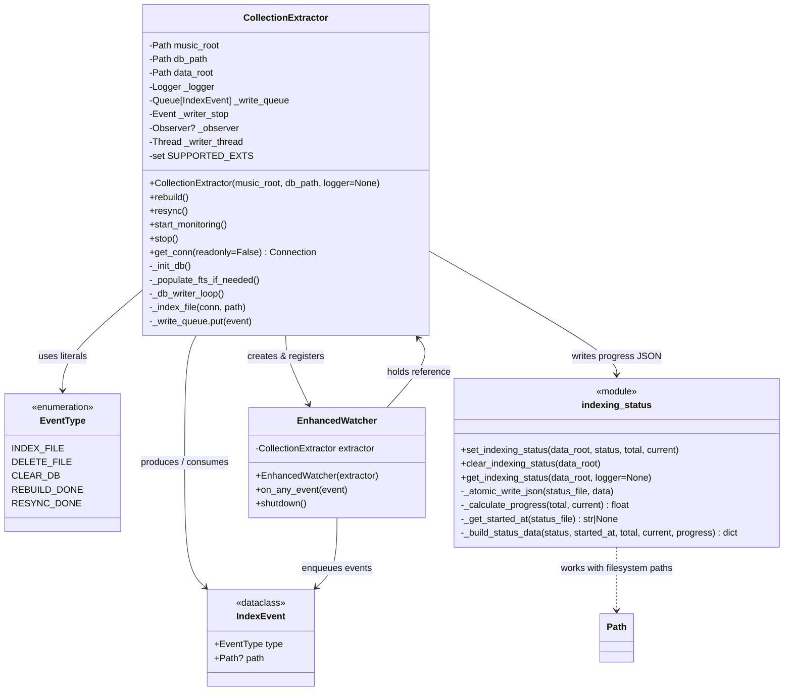
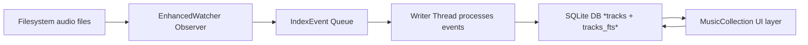

{ align=right width="90" }

# 🎵 Musiclib - Music Collection handling

## Overview and introduction

The musiclib package is the heart of the mixtape music‑collection service.
It turns a plain directory tree of audio files into a searchable, fully‑indexed library that can be queried instantly from the UI.

Below is a concise, high‑level walkthrough of the module’s responsibilities, its main components, and how they interact to deliver a robust “scan‑once‑search‑forever” experience.

### Class diagram



---

## 1. What the module does

| Goal                         | How it’s achieved                                                                                                                                                     |
|------------------------------|-----------------------------------------------------------------------------------------------------------------------------------------------------------------------|
| Detect every supported audio file | A **watchdog observer** (implemented as `EnhancedWatcher`) monitors the `music_root` directory in real time. It includes a 2 second debounce to coalesce rapid edits and avoid duplicate indexing. |
| Extract reliable metadata    | `tinytag.TinyTag` reads ID3/metadata tags (artist, album, title, year, duration, etc.).                                                                            |
| Persist metadata efficiently | A **SQLite** database stores the canonical rows (`tracks` table) and an **FTS5** virtual table (`tracks_fts`) that mirrors the same columns for lightning‑fast full‑text search. |
| Keep the DB in sync          | A **single writer thread** serialises all write operations (adds, deletes, clears) via a thread‑safe `Queue[IndexEvent]`.                                             |
| Expose progress to the UI    | A tiny JSON file (`indexing_status.json`) is updated atomically during long‑running operations (rebuild, resync) so the front‑end can render progress bars.            |
| Provide a clean API for the UI | `MusicCollection` (in `reader.py`) builds the search expression, runs the query, groups results by release directory, and returns a ready‑to‑render structure (artists, albums, tracks) together with the list of terms that need highlighting. |

---

## 2. Core building blocks

| Module / Class          | Primary responsibility                                                                                                                                                                                                 |
|--------------------------|--------------------------------------------------------------------------------------------------------------------------------------------------------------------------------------------------------------------------|
| **`_extractor.py`**      | • Low‑level DB schema creation (`_init_db`). <br>• Full‑text table bootstrap (`_populate_fts_if_needed`). <br>• **`CollectionExtractor`** – orchestrates indexing, resync, rebuild, and live monitoring. <br>• **`IndexEvent` / `EventType`** – typed messages that drive the writer thread. <br>• **`_Watcher`** – translates filesystem events into `IndexEvent`s. |
| **`indexing_status.py`**| Helper functions that write/read the `indexing_status.json` file in an atomic, crash‑safe way (e.g., `set_indexing_status`, `clear_indexing_status`, `get_indexing_status`).                                                     |
| **`reader.py`**          | High‑level façade (**`MusicCollection`**) used by the UI. It parses user queries, builds the FTS/LIKE expression, runs the query, groups rows, and formats the result payload (artists, albums, tracks, and highlight terms).          |
| **`ui.py`**              | Extends `MusicCollection` with UI‑specific helpers: <br>• `_highlight_text` (term highlighting) <br>• `_safe_filename` (sanitising filenames) <br>• `_escape_for_query` (building click‑query strings) <br>• result shaping for the front‑end. |

---

## 3. Data flow – from file system to UI

1. **Startup** – `MusicCollection` creates a `CollectionExtractor`. The extractor initializes the SQLite schema and launches the writer thread.
1. **Initial population** – If the DB is empty, `MusicCollection` schedules a rebuild. The rebuild walks the entire `music_root`, enqueues an `INDEX_FILE` event for every supported file, and updates `indexing_status.json` so the UI can show progress.
1. **Live updates** – The `watchdog` observer fires on every create/modify/delete. `_Watcher` converts those into `IndexEvent`s, which the writer thread processes in order, keeping the DB and the FTS mirror perfectly aligned.
1. **Search** – When the UI calls `search_highlighting`, `MusicCollection` parses the query, builds an FTS‑compatible expression (or a fallback `LIKE` query), runs it against the DB, groups rows by release directory, and returns a dictionary of artists, albums, and tracks plus the list of parsed terms. Internally, searches use a multi-pass candidate scoring model with optional reuse of previous search sessions for fast refinements.
1. **Presentation** – `MusicCollectionUI` highlights the terms, builds click‑queries (`artist:…`, `release_dir:…`), and hands the ready‑to‑render JSON back to the front‑end. Lazy‑loading of an artist’s full discography or an album’s track list is done by re‑issuing `search_grouped` with the stored click‑query.

---

## 4. Why the design choices matter

| Design decision                                 | Benefit                                                                                                                                                              |
|-------------------------------------------------|----------------------------------------------------------------------------------------------------------------------------------------------------------------------|
| **Single writer thread + queue**                | Guarantees deterministic ordering of DB writes, avoids SQLite lock contention, and lets the UI stay responsive while heavy indexing runs in the background.            |
| **FTS5 virtual table with triggers**            | Provides sub‑millisecond full‑text look‑ups without having to maintain a separate index manually.                                                                    |
| **Atomic JSON status file**                     | Prevents corrupted progress information even if the process crashes mid‑write; the UI never sees a half‑written file.                                                  |
| **Watchdog‑driven live sync**                   | Users see newly added songs appear instantly; deletions are reflected without a full rescan.                                                                         |
| **Separation of concerns** (`_extractor` vs. `reader` vs. `ui`) | Keeps low‑level DB handling isolated from query parsing and UI formatting, making the code easier to test and extend.                                                |
| **Typed `IndexEvent` dataclass**                | Improves readability, reduces bugs caused by mismatched queue payloads, and makes future event types straightforward to add.                                          |
| **Debouncing in the watcher** (`EnhancedWatcher`) | Prevents a flood of `INDEX_FILE` events when a user edits a file repeatedly (e.g., retagging). Guarantees only the final state is indexed, reducing DB churn and corruption risk. |

---

## 5. Quick mental model



*The arrow direction indicates the primary flow of data.*

The UI never talks directly to the filesystem; it always goes through MusicCollection, which in turn reads from the already‑indexed SQLite store.

---

## 6. Getting started (for developers)

1. Instantiate the high‑level class:

    ```python
    from musiclib import MusicCollectionUI
    mc = MusicCollectionUI(
        music_root="/path/to/music",
        db_path="/path/to/db.sqlite"
    )   # Starts the watchdog observer and, if the DB is empty, schedules an initial rebuild.
    ```

2. Run a query (the UI does this internally):

    ```python
    results, terms = mc.search_highlighting(qry="artist:'Radiohead' love")
    ```

3. Monitor progress (useful for CLI tools):

    ```python
    from musiclib.indexing_status import get_indexing_status
    status = get_indexing_status("/path/to/db_folder")
    print(status)   # → {'status': 'rebuilding', 'progress': 0.42, …}
    ```

4. Shut down cleanly when the program exits:

    ```python
    mc.close()   # stops the writer thread and the watchdog observer
    ```

---

## 7. Where to look next

* `_extractor.py` – for the low‑level DB schema, triggers, and the writer‑loop logic.
* `reader.py` – for the query parser (`parse_query`) and the grouping algorithm that decides which artists/albums/tracks to return.
* `ui.py` – for the presentation helpers (highlighting, safe filenames, click‑query generation).
* `indexing_status.py` – for the atomic JSON status handling used by the UI progress bar.
* `_watcher.py` – the `EnhancedWatcher` implementation that adds debouncing and graceful shutdown of pending events.

That’s the complete picture of the `musiclib` module: a tightly coupled pipeline that turns a folder of audio files into a fast, searchable, and continuously synchronized music library.
