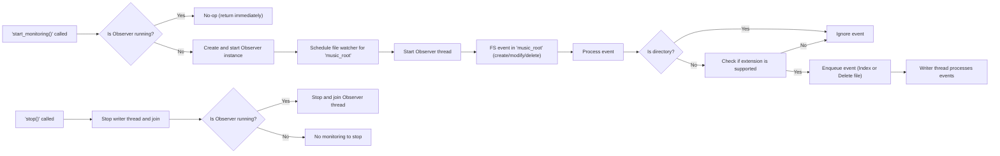
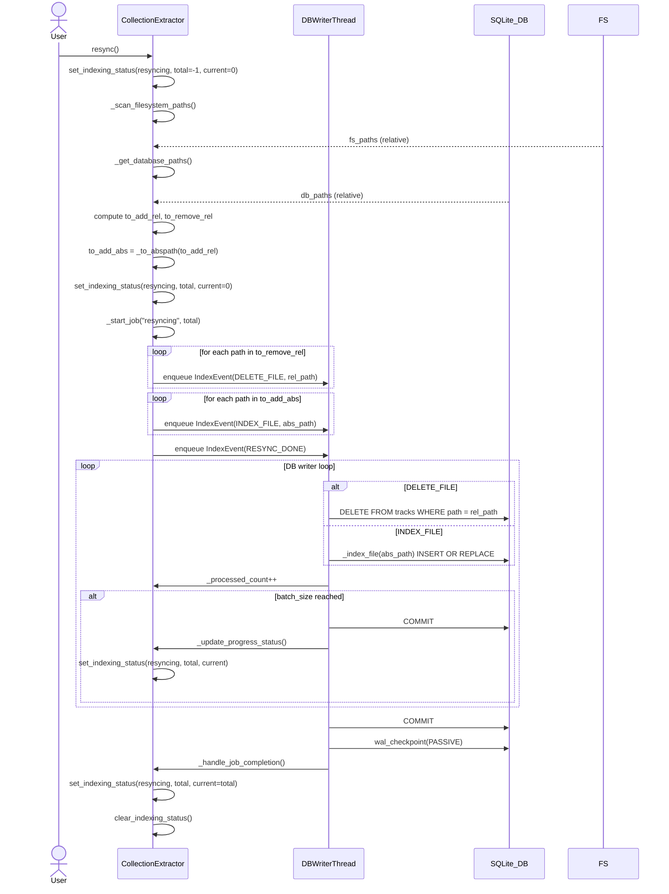

{ align=right width="90" }

# Creating/maintaining the music collection database

## 1. High‑level picture

* **Watchdog** watches the music directory for creations, modifications, and deletions.
* Detected changes are turned into **IndexEvent** objects and placed on a thread‑safe `Queue`.
* A dedicated **writer thread** (`_db_writer_loop`) consumes those events and performs the actual SQLite writes.
* The database consists of a normal `tracks` table (metadata) and an FTS5 virtual table `tracks_fts` that mirrors the metadata for fast full‑text search.
* Helper functions in `indexing_status.py` keep a tiny JSON status file (`indexing_status.json`) that the UI can poll to show progress during a **rebuild** or **resync** operation.

### Loading/resyncing process

```mermaid
flowchart LR
    A["User initiates process (rebuild() / resync())"] --> B["Log start and set indexing status"]
    B --> C{"Operation type?"}
    C -->|"'rebuild()'"| D["Clear database and prepare for file scan"]
    C -->|"'resync()'"| E["Scan filesystem and compare with DB"]

    D --> F["Scan music root for files to index"]
    E --> G["Identify changes: files to add or remove"]
    F --> H["Queue file operations to process"]
    G --> H

    H --> I["Start job, update counters & status"]
    I --> J["Process queued file operations (Delete/Index)"]

    J --> K{"Job complete?"}
    K -->|Yes| L["Finalize job, log completion, clear status"]
    K -->|No| J

    L --> M["Indexing complete, external indexing status cleared"]
```

### Monitoring process

## 2. Core data structures

| Name                 | Type                                             | Purpose                                                                                                                                                     |
|----------------------|--------------------------------------------------|-------------------------------------------------------------------------------------------------------------------------------------------------------------|
| `IndexEvent`         | `@dataclass` with fields `type: EventType` and `path: Optional[Path]` | Represents a single action for the writer thread (index a file, delete a file, clear DB, signal rebuild/resync completion).                                   |
| `EventType`          | `Literal["INDEX_FILE", "DELETE_FILE", "CLEAR_DB", "REBUILD_DONE", "RESYNC_DONE"]` | Enumerates the possible actions.                                                                                                                            |
| `_write_queue`       | `queue.Queue[IndexEvent]`                        | Thread‑safe hand‑off from the watcher / public methods to the writer thread.                                                                               |
| `_writer_stop`       | `threading.Event`                               | Signals the writer thread to shut down cleanly.                                                                                                              |
| `tracks` table       | SQLite table with columns `path, filename, artist, album, title, albumartist, genre, year, duration, mtime` | Stores the canonical metadata for each audio file.                                                                                                          |
| `tracks_fts`         | SQLite FTS5 virtual table mirroring most columns of `tracks` | Enables fast full‑text search across artist, album, title, etc.

## 3. Database initialization

Started in `_init_db`:

1. Opens a connection (`sqlite3.connect(self.db_path)`).
2. Sets WAL journal mode and normal sync for better concurrency.
3. Creates the tracks `table` if it does not exist.
4. Creates three case‑insensitive indexes on `artist`, `album`, and `title`.
5. Creates the FTS5 virtual table `tracks_fts` with a Unicode tokenizer that removes diacritics.
6. Installs three triggers (`tracks_ai`, `tracks_ad`, `tracks_au`) that keep `tracks_fts` in sync with inserts, deletes, and updates on `tracks`.

Result: the DB is ready for both ordinary queries and full‑text search without any manual maintenance.

## 4. Full‑text table boot‑strap

Starts in `_populate_fts_if_needed`

* Opens a read‑only connection.
* Checks `SELECT count(*) FROM tracks_fts`.
* If the count is zero, executes a single `INSERT … SELECT` that copies every row from `tracks` into `tracks_fts`.
* Commits the transaction.

This routine is called once after a fresh DB creation or after a manual purge of the FTS table.

## 5. Public connection helper

Function `get_conn`:

* Read‑only mode (`readonly=True`) uses the URI `file:<path>?mode=ro`.
* Write mode opens a normal connection.
* Both connections set `row_factory = sqlite3.Row` so callers can treat rows like dictionaries.

All higher‑level code (search, UI, etc.) obtains connections via this method.

## 6. Writer thread

Function `_db_writer_loop`

* Runs forever until _writer_stop is set.
* Pulls an IndexEvent from _write_queue with a 1.0 s timeout (so it can notice the stop flag).
* Handles each event type:

    | Event type      | Action performed                                                                                                                   |
    |-----------------|------------------------------------------------------------------------------------------------------------------------------------|
    | `CLEAR_DB`      | `DELETE FROM tracks` (removes all rows).                                                                                          |
    | `INDEX_FILE`    | Calls `_index_file(conn, path)` – extracts metadata and `INSERT OR REPLACE` into `tracks`.                                          |
    | `DELETE_FILE`   | `DELETE FROM tracks WHERE path = ?`.                                                                                               |
    | `REBUILD_DONE` / `RESYNC_DONE` | `conn.commit()` – flushes any pending changes.                                                                          |

* After every 50 processed events it forces a commit to keep the transaction size reasonable.
* Errors are caught and logged via the injected Logger.
* When the loop exits, it commits any remaining work and closes the connection.

## 7. Metadata extraction

Function `_index_file`:

1. Calls TinyTag.get(path, tags=True, duration=True).
2. Safely extracts the following fields (fallbacks shown in parentheses):

    | Field   | Source                              | Fallback |
    |---------|-------------------------------------|----------|
    | `artist`| `tag.artist` → `tag.albumartist`   | `"Unknown"` |
    | `album` | `tag.album`                         | `"Unknown"` |
    | `title` | `tag.title` → `path.stem`          | `"Unknown"` |
    | `year`  | `int(str(tag.year)[:4])` (if parsable) | `None` |
    | `duration`| `tag.duration`                     | `None` |
    | `mtime` | `path.stat().st_mtime`              | – |

3. Executes a single INSERT OR REPLACE INTO tracks (…) VALUES (…) with the gathered values.
4. Because of the triggers defined in _init_db, the same row is automatically mirrored into tracks_fts.

---

## 8. Full rebuild

Function: `rebuild`

* **Purpose** – create a fresh DB from the current file system state.
* Steps:
    1. Write status rebuilding with `total = -1` (unknown) and `current = 0`.
    2. Enqueue a `CLEAR_DB` event (empties the DB).
    3. Recursively walk `music_root` (`rglob("*")`) and collect every file whose suffix is in `SUPPORTED_EXTS`.
    4. Update the status file with the exact `total` count.
    5. For each discovered file, enqueue `INDEX_FILE` events. Every 100 files the status file is refreshed (`set_indexing_status`).
    6. After the loop, enqueue `REBUILD_DONE` and call `join()` on the queue (wait until the writer thread finishes processing).
    7. Remove the status file (`clear_indexing_status`).

* The UI can poll `indexing_status.json` to display a progress bar that reflects the `total`/`current`/`progress` fields.

---

## 9. Incremental resynchronisation

Function: `resync`

* **Purpose** – bring the DB up‑to‑date after files have been added, removed, or renamed since the last run.
* Steps:
    1. Set status `resyncing` with unknown totals (`total = -1`).
    1. Build a set of absolute paths for all supported files currently on disk (`fs_paths`).
    1. Query the DB for all stored paths (`db_paths`).
    1. Compute `to_add = fs_paths - db_paths` and `to_remove = db_paths - fs_paths`.
    1. `total = len(to_add) + len(to_remove)` and update the status file.
    1. Enqueue `DELETE_FILE` events for each path in `to_remove`; every 100 deletions the status file is refreshed.
    1. Enqueue `INDEX_FILE` events for each path in `to_add`; every 100 additions the status file is refreshed.
    1. Enqueue `RESYNC_DONE`, clear the status file, and log a summary.

* As with `rebuild`, the writer thread processes the queued events sequentially, guaranteeing that the DB ends up exactly matching the file system.

---

## 10. Real‑time monitoring

* **`start_monitoring`** creates a `watchdog.observers.Observer` (if none exists), registers a `EnhancedWatcher` instance for the `music_root`, and starts the observer thread.

* **`EnhancedWatcher `** inherits from `FileSystemEventHandler`. Its `on_any_event` method:
    1. Ignores directory events.
    1. Filters out files whose extensions are not in `SUPPORTED_EXTS`.
    1. For `created` or `modified` events → enqueues `INDEX_FILE`.
    1. For `deleted` events → enqueues `DELETE_FILE`.

* This mechanism guarantees that any change made while the application is running is eventually reflected in the DB (subject to the writer thread’s batching policy).

---

## 11. Graceful shutdown

Function `stop`

* Sets the `_writer_stop` flag, joins the writer thread (max 5 seconds).
* Stops and joins the watchdog observer if it was started.
* After this call the extractor is fully stopped and the SQLite connection is closed.

---

## 12. Indexing‑status helper

File `indexing_status.py`:

| Function                                   | Role                                                                                                                                                                                                 |
|--------------------------------------------|------------------------------------------------------------------------------------------------------------------------------------------------------------------------------------------------------|
| `set_indexing_status(data_root, status, total, current)` | Computes progress (`current/total`), preserves the original `started_at` timestamp (or creates a new one), builds a dictionary with `status, started_at, updated_at, total, current, progress`, and writes it atomically to `indexing_status.json`. |
| `_atomic_write_json(status_file, data)`   | Writes JSON to a temporary file in the same directory, flushes, `fsync`s, then atomically renames the temp file onto the target. Guarantees that a partially‑written file never appears.                     |
| `_calculate_progress(total, current)`      | Returns a float in `[0.0, 1.0]`; guards against division by zero or negative totals.                                                                                                                  |
| `_get_started_at(status_file)`             | Reads the existing JSON (if any) and returns the original `started_at` value, allowing a rebuild/resync to keep the same start‑time across restarts.                                                    |
| `_build_status_data(...)`                  | Packages all fields into a plain dict ready for JSON serialization.                                                                                                                                 |
| `clear_indexing_status(data_root)`         | Deletes the JSON file if it exists.                                                                                                                                                                      |
| `get_indexing_status(data_root, logger=None)` | Reads and parses the JSON file, returning the dict or `None` on missing/corrupt files. Logs JSON decode errors via the supplied logger (defaults to `NullLogger`).                                        |

These utilities are deliberately lightweight: they operate purely on the filesystem and do not depend on the SQLite connection, making them safe to call from any thread (including the writer thread).

---

## 13. End‑to‑end flow for a typical user session

---

## 14. API

### ::: src.musiclib._extractor.EventType

### ::: src.musiclib._extractor.IndexEvent

### ::: src.musiclib._extractor.CollectionExtractor

### ::: src.musiclib.indexing_status

### ::: src.musiclib._watcher.EnhancedWatcher
