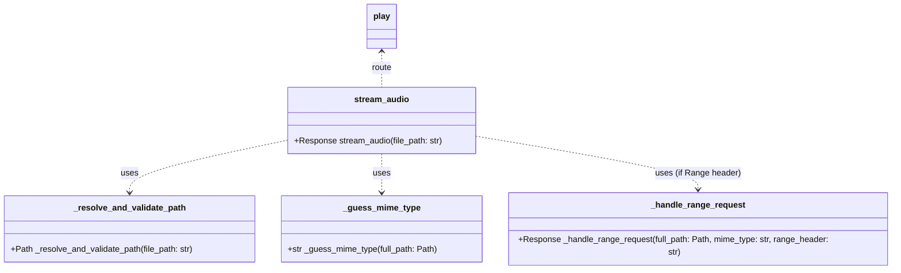

{ align=right width="90" }

# Mixtape playback

The file `routes/play.py`  is central to the application's audio streaming functionality, ensuring secure, standards-compliant delivery of music files to clients. Its primary responsibilities are:

* Validating and resolving requested file paths to prevent unauthorized access.
* Determining the correct MIME type for audio files.
* Supporting HTTP range requests, enabling efficient seeking and partial downloads for audio streaming.
* Returning appropriate error responses for invalid or unauthorized requests.

``` mermaid
sequenceDiagram
    actor Client
    participant FlaskApp
    participant "stream_audio()"
    participant "_resolve_and_validate_path()"
    participant "_guess_mime_type()"
    participant "_handle_range_request()"
    participant send_file

    Client->>FlaskApp: GET /<file_path> [with optional Range header]
    FlaskApp->>"stream_audio()": Call with file_path
    "stream_audio()"->>"_resolve_and_validate_path()": Validate and resolve file_path
    "_resolve_and_validate_path()"-->>"stream_audio()": Return full_path
    "stream_audio()"->>"_guess_mime_type()": Guess MIME type
    "_guess_mime_type()"-->>"stream_audio()": Return mime_type
    alt Range header present
        "stream_audio()"->>"_handle_range_request()": Handle range request
        "_handle_range_request()"-->>"stream_audio()": Return partial Response
        "stream_audio()"-->>FlaskApp: Return Response (206 Partial Content)
    else No Range header
        "stream_audio()"->>send_file: Send file
        send_file-->>"stream_audio()": Return full file Response
        "stream_audio()"-->>FlaskApp: Return Response (200 OK)
    end
    FlaskApp-->>Client: Stream audio file
```

## Key Components

* Flask Blueprint (`play`)
    Encapsulates the audio streaming routes, allowing modular organization of the application's endpoints.

* **Routes**
    * `stream_audio` Handles GET requests to `/play/<path:file_path>`.
        * Validates the requested file path.
        * Determines the MIME type.
        * Supports HTTP range requests for seeking.
        * Streams the audio file or returns an error if access is denied or the file is not found.
    * `/share/<slug>`: Renders a public playback page for a mixtape identified by a slug. If the mixtape does not exist, a 404 error is returned.
* **Functions**
    * `_resolve_and_validate_path`: Ensures the requested file is within the allowed music directory and exists as a file.
        * Prevents directory traversal attacks.
        * Returns 403 (Forbidden) or 404 (Not Found) errors as appropriate.
    * `_guess_mime_type`: Determines the MIME type of the requested file using the `mimetypes` module, with fallbacks for common audio formats.
    * `_handle_range_request`: Implements support for HTTP range requests, allowing clients to request specific byte ranges of audio files.

## Class diagram



## API

### ::: src.routes.play
