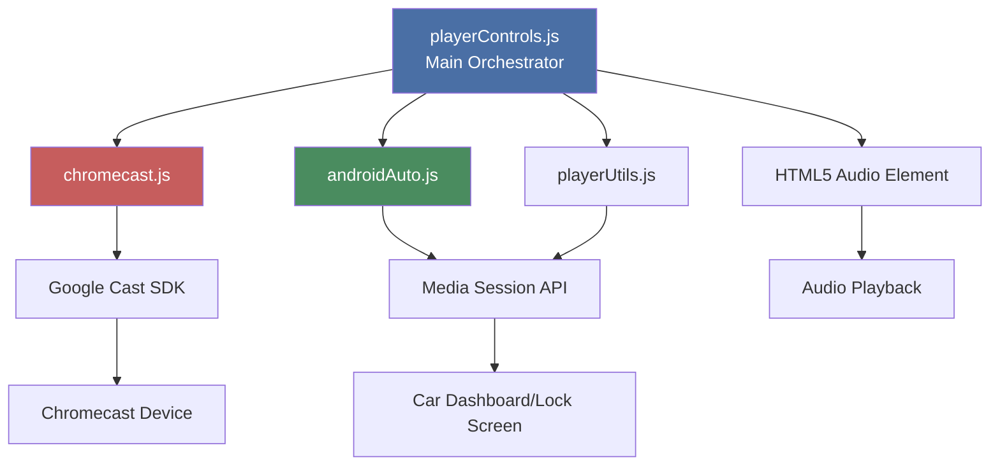
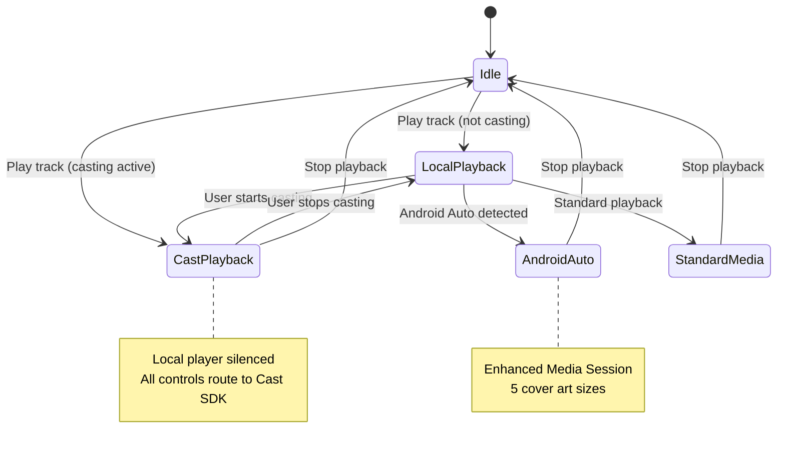
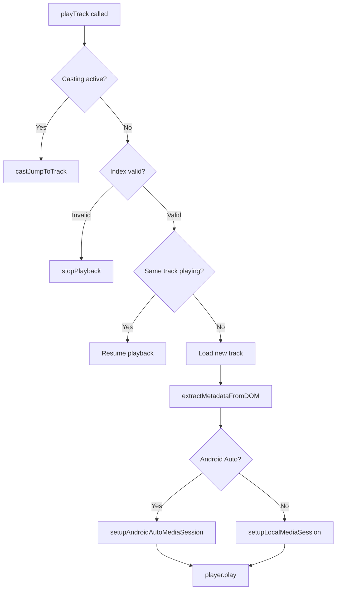

# Player Controls

{ align=right width="90" }

The `playerControls.js` module is the central orchestration layer for all playback controls in Mixtape Society. It coordinates between local playback, Chromecast casting, and Android Auto integration, ensuring a unified user experience across all playback modes.

---

## 🎯 Purpose

**Primary Responsibilities:**

- Coordinate playback across multiple modes (local, Chromecast, Android Auto)
- Manage track selection and queue navigation
- Handle quality settings and preferences
- Synchronize UI state across all controls
- Route user actions to appropriate playback system
- Prevent conflicting playback states

**Key Design Principle:**
Single source of truth for playback state that routes to the appropriate backend (local player, Cast SDK, or Media Session API).

---

## 🏗️ Architecture

### Component Relationships



### State Flow



---

## 🚀 Initialization

### Entry Point

```javascript
export function initPlayerControls()
```

**Called from:** `static/js/player/index.js` on `DOMContentLoaded`

**Initialization sequence:**

1. **Platform detection**

   ```javascript
   const iOS = detectiOS();
   const androidInfo = detectAndroid();
   logDeviceInfo();
   ```

2. **DOM element references**

   ```javascript
   const player = document.getElementById('main-player');
   const trackItems = document.querySelectorAll('.track-item');
   // ... more element references
   ```

3. **State initialization**

   ```javascript
   let currentIndex = -1;
   let currentQuality = localStorage.getItem('audioQuality') || 'medium';
   let isCurrentlyCasting = false;
   ```

4. **Quality selector setup**
   - Restore saved quality from localStorage
   - Initialize quality dropdown menu
   - Set up quality change listeners

5. **Audio control interception**
   - Block native audio events when casting
   - Route to Cast SDK instead

6. **Cast listeners**
   - Listen for `cast:started` and `cast:ended` events
   - Set up callbacks for track changes

7. **Event listeners**
   - Track item clicks
   - Play/pause buttons
   - Previous/next buttons
   - Audio element events

8. **Auto-start handling**
   - Check for `#play` hash in URL
   - Check sessionStorage for auto-play flag

---

## 🎮 Core Functions

### playTrack(index)

**Purpose:** Main playback function that routes to appropriate backend

**Parameters:**

- `index` (number) - Track index to play

**Logic flow:**



**Implementation:**

```javascript
const playTrack = (index) => {
    // 1. Check if casting - route to Chromecast
    if (checkCastingState()) {
        console.log('🎭 Routing to Chromecast');
        castJumpToTrack(index);
        return;
    }

    console.log('🔊 Playing locally');

    // 2. Handle same track resume
    if (index === currentIndex && player.src !== '') {
        player.play().catch(e => console.log('Autoplay prevented:', e));
        return;
    }

    // 3. Validate index
    if (index < 0 || index >= trackItems.length) {
        stopPlayback();
        return;
    }

    // 4. Load new track
    const track = trackItems[index];
    player.src = buildAudioUrl(track.dataset.path, currentQuality);

    // 5. Update UI
    updateUIForTrack(index);

    // 6. Setup Media Session based on platform
    const metadata = extractMetadataFromDOM(track);
    updateLocalMediaSession(metadata);

    // 7. Start playback
    player.play().catch(e => console.log('Autoplay prevented:', e));
}
```

### updateLocalMediaSession(metadata)

**Purpose:** Set up Media Session with platform-appropriate configuration

**Parameters:**

- `metadata` (object) - Track metadata with title, artist, album, artwork

**Logic:**

```javascript
const updateLocalMediaSession = (metadata) => {
    // Route to Android Auto enhanced setup if detected
    if (isAndroidAutoConnected()) {
        setupAndroidAutoMediaSession(
            metadata,
            playerControlsAPI,
            player
        );
    } else {
        // Standard Media Session for iOS/Desktop
        setupLocalMediaSession(metadata, playerControlsAPI);
    }
}
```

**Key difference:**

- Android Auto: Enhanced setup with position state, multiple artwork sizes
- Standard: Basic setup with single artwork, simple controls

### Quality Management

#### changeQuality(newQuality)

**Purpose:** Change audio quality and reload current track

**Parameters:**

- `newQuality` (string) - Quality level: 'high', 'medium', 'low', 'original'

**Quality levels:**

```javascript
const QUALITY_LEVELS = {
    high: { label: 'High (256k)', bandwidth: 'high' },
    medium: { label: 'Medium (192k)', bandwidth: 'medium' },
    low: { label: 'Low (128k)', bandwidth: 'low' },
    original: { label: 'Original', bandwidth: 'highest' }
};
```

**Behavior:**

1. Save quality to localStorage (persists across sessions)
2. Update UI to show new quality
3. If track is playing, reload with new quality
4. Preserve playback position and state
5. If casting, quality applies to Cast stream

**Implementation:**

```javascript
const changeQuality = (newQuality) => {
    currentQuality = newQuality;
    localStorage.setItem('audioQuality', newQuality);

    updateQualityButtonText();
    updateQualityMenuState(newQuality);

    // Reload current track with new quality
    if (currentIndex >= 0 && player.src && !checkCastingState()) {
        const wasPlaying = !player.paused;
        const {currentTime} = player;

        playTrack(currentIndex);

        // Restore position and playback state
        if (wasPlaying) {
            player.addEventListener('loadedmetadata', () => {
                player.currentTime = currentTime;
                player.play();
            }, { once: true });
        }
    }
}
```

### UI Synchronization

#### syncPlayIcons()

**Purpose:** Update all play/pause icons to reflect current state

**Logic:**

```javascript
const syncPlayIcons = () => {
    trackItems.forEach((item, idx) => {
        const icon = item.querySelector('.play-overlay-btn i');
        if (!icon) return;

        const isCurrentTrack = idx === currentIndex;
        const isPlaying = isCurrentTrack && (
            (checkCastingState() && isCastPlaying()) ||
            (!checkCastingState() && !player.paused)
        );

        if (isPlaying) {
            icon.classList.remove('bi-play-fill');
            icon.classList.add('bi-pause-fill');
        } else {
            icon.classList.remove('bi-pause-fill');
            icon.classList.add('bi-play-fill');
        }

        // Add/remove playing animation class
        item.classList.toggle('playing', isPlaying);
    });
}
```

**Handles:**

- Local playback state (`!player.paused`)
- Chromecast playback state (`isCastPlaying()`)
- Multiple tracks showing correct icon
- Playing animation on active track

---

## 🎭 Casting Coordination

### Casting State Management

**Global state check:**

```javascript
const checkCastingState = () => {
    return globalCastingState || isCurrentlyCasting;
}
```

**Two sources:**

- `globalCastingState` - from chromecast.js module
- `isCurrentlyCasting` - local tracking flag

### Audio Event Interception

**Problem:** When casting, the local `<audio>` element should not play, but browser may still trigger events.

**Solution:** Intercept and block audio events during casting

```javascript
const setupAudioControlInterception = () => {
    // Block play events - route to Cast instead
    player.addEventListener('play', (e) => {
        if (checkCastingState()) {
            e.preventDefault();
            e.stopPropagation();
            e.stopImmediatePropagation();
            player.pause();
            castPlay();
            return false;
        }
    }, true);

    // Block pause events - route to Cast
    player.addEventListener('pause', (e) => {
        if (checkCastingState()) {
            e.stopPropagation();
            castPause();
        }
    });

    // Block seeking while casting
    player.addEventListener('seeking', (e) => {
        if (checkCastingState()) {
            e.preventDefault();
            e.stopPropagation();
        }
    }, true);

    // Block metadata load while casting
    player.addEventListener('loadedmetadata', (e) => {
        if (checkCastingState()) {
            e.stopPropagation();
        }
    }, true);
}
```

**Key points:**

- Uses capture phase (`true` parameter)
- Prevents default behavior
- Stops event propagation
- Routes action to Cast SDK

### Cast Event Listeners

**Listens for custom events from chromecast.js:**

```javascript
const initCastListeners = () => {
    // Casting started
    document.addEventListener('cast:started', () => {
        isCurrentlyCasting = true;
        silenceLocalPlayer();

        // Clear local Media Session
        if (isAndroidAutoConnected()) {
            clearAndroidAutoMediaSession();
        } else {
            clearMediaSession();
        }

        syncPlayIcons();
    });

    // Casting ended
    document.addEventListener('cast:ended', () => {
        isCurrentlyCasting = false;
        enableLocalPlayer();

        // Restore local Media Session
        if (currentIndex >= 0) {
            const track = trackItems[currentIndex];
            const metadata = extractMetadataFromDOM(track);
            updateLocalMediaSession(metadata);
        }

        syncPlayIcons();
    });

    // Set callbacks for Cast state changes
    setCastControlCallbacks({
        onTrackChange: (index) => {
            updateUIForTrack(index);
        },
        onPlayStateChange: (state) => {
            syncPlayIcons();
        },
        onTimeUpdate: (time) => {
            // Chromecast handles progress
        }
    });
}
```

---

## 🔌 Player Controls API

**Exported interface for external modules:**

```javascript
const playerControlsAPI = {
    play: () => {
        if (player.paused) {
            player.play().catch(err => console.error("Play failed:", err));
        }
    },
    pause: () => {
        if (!player.paused) {
            player.pause();
        }
    },
    next: () => playTrack(currentIndex + 1),
    previous: () => playTrack(currentIndex - 1),
    jumpTo: (index) => playTrack(index)
};
```

**Used by:**

- `androidAuto.js` - Media Session action handlers
- `playerUtils.js` - setupLocalMediaSession
- `chromecast.js` - Cast control callbacks

---

## 🎨 Platform-Specific Features

### iOS Support

**Detection:**

```javascript
const iOS = detectiOS();
```

**iOS Cast Help:**

Shows helper message for Chromecast limitations on iOS:

```javascript
function showiOSCastHelp() {
    if (!iOS || iOSHelpInitialized) return;

    const helpHtml = `
        <div class="alert alert-info">
            <h6>📱 Casting from iPhone</h6>
            <small>
                <strong>To cast to Chromecast:</strong><br>
                1. Install Google Home app<br>
                2. Use Chrome browser (not Safari)<br>
                3. Connect to same WiFi network<br>
                <br>
                <strong>For AirPlay (recommended):</strong><br>
                Use Safari and tap the AirPlay icon
            </small>
        </div>
    `;

    // Show after cast button clicked
    castBtn.addEventListener('click', () => {
        setTimeout(() => {
            if (!isCasting()) {
                document.body.insertAdjacentHTML('afterbegin', helpHtml);
            }
        }, 3000);
    }, { once: true });
}
```

**Why delayed?**

- Gives Cast SDK 3 seconds to connect
- Only shows if connection fails
- One-time display (uses `once: true`)

### Android Auto Support

**Detection:**

```javascript
const androidInfo = detectAndroid();
if (androidInfo) {
    logAndroidAutoStatus();
}
```

**Enhanced features when Android Auto detected:**

- Multiple artwork sizes (96x96 to 512x512)
- Position state updates every second
- Seeking support via Media Session
- Enhanced action handlers

---

## 🔄 Event Handling

### Track Selection

```javascript
trackItems.forEach((item, i) => {
    const overlayBtn = item.querySelector('.play-overlay-btn');

    overlayBtn.addEventListener('click', (e) => {
        e.preventDefault();
        e.stopPropagation();
        e.stopImmediatePropagation();

        if (i === currentIndex) {
            togglePlayPause();  // Toggle if same track
        } else {
            playTrack(i);       // Play new track
        }
    });
});
```

**Stops propagation:** Prevents parent elements from handling click

### Audio Events

**Conditional execution based on casting state:**

```javascript
const onlyWhenNotCasting = (handler) => {
    return function (...args) {
        if (!checkCastingState()) {
            handler.apply(this, args);
        }
    };
}

// Usage:
player.addEventListener('play', onlyWhenNotCasting(() => {
    syncPlayIcons();
}));

player.addEventListener('timeupdate', onlyWhenNotCasting(updateAudioProgress));
```

**Why?** When casting, local audio events are irrelevant

### Position State Updates

**Throttled to once per second:**

```javascript
let lastPositionUpdate = 0;

player.addEventListener('timeupdate', onlyWhenNotCasting(() => {
    const now = Date.now();
    if (now - lastPositionUpdate >= 1000) {
        updatePositionState();
        lastPositionUpdate = now;
    }
}));
```

**Prevents:** Excessive Media Session API calls

---

## 🛠️ Helper Functions

### buildAudioUrl(path, quality)

**Purpose:** Construct audio URL with quality parameter

```javascript
const buildAudioUrl = (path, quality) => {
    const baseUrl = `/play/${path}`;
    return quality === 'original' ? baseUrl : `${baseUrl}?quality=${quality}`;
}
```

**Examples:**

- `buildAudioUrl('artist/album/track.flac', 'medium')` → `/play/artist/album/track.flac?quality=medium`
- `buildAudioUrl('artist/album/track.mp3', 'original')` → `/play/artist/album/track.mp3`

### updateUIForTrack(index)

**Purpose:** Update UI to reflect currently playing track

```javascript
const updateUIForTrack = (index) => {
    if (index < 0 || index >= trackItems.length) return;

    const track = trackItems[index];

    // Update bottom player
    bottomTitle.textContent = track.dataset.title;
    bottomArtistAlbum.textContent = `${track.dataset.artist} • ${track.dataset.album}`;
    container.style.display = 'block';

    // Update active track highlighting
    trackItems.forEach(t => t.classList.remove('active-track'));
    track.classList.add('active-track');

    // Update global state
    currentIndex = index;
    window.currentTrackIndex = index;
}
```

### stopPlayback()

**Purpose:** Stop playback and clean up state

```javascript
const stopPlayback = () => {
    player.pause();
    player.src = '';
    player.load();
    container.style.display = 'none';
    trackItems.forEach(t => t.classList.remove('active-track'));
    currentIndex = -1;

    // Clear appropriate Media Session
    if (isAndroidAutoConnected()) {
        clearAndroidAutoMediaSession();
    } else {
        clearMediaSession();
    }
}
```

---

## 🎯 Auto-Start Features

### URL Hash Detection

```javascript
if (window.location.hash === '#play') {
    setTimeout(() => playTrack(0), 500);
}
```

**Usage:** Share link with `#play` to auto-start playback

### Session Storage Flag

```javascript
if (sessionStorage.getItem('startPlaybackNow')) {
    sessionStorage.removeItem('startPlaybackNow');
    playTrack(0);
}
```

**Usage:** Set flag before page load to trigger auto-play

---

## 🔧 Configuration

### Quality Levels

```javascript
const QUALITY_LEVELS = {
    high: { label: 'High (256k)', bandwidth: 'high' },
    medium: { label: 'Medium (192k)', bandwidth: 'medium' },
    low: { label: 'Low (128k)', bandwidth: 'low' },
    original: { label: 'Original', bandwidth: 'highest' }
};

const DEFAULT_QUALITY = 'medium';
```

**Persistence:** Saved to `localStorage` as `audioQuality`

---

## 🧪 Debugging

### Console Logging

**Initialization:**

```text
🎮 PlayerControls initialized
```

**Platform detection:**

```text
📱 iOS Device Detected
   Version: iOS 17.2
   PWA Mode: Yes
   Media Session: Supported ✅
```

**Playback routing:**

```text
🔊 Playing locally
🎭 Routing to Chromecast
```

---

## 📊 Return Value

```javascript
return {
    playTrack,      // Play specific track
    syncPlayIcons,  // Update UI icons
    changeQuality,  // Change audio quality
};
```

**Currently not used externally** - functions are called internally

---

## 📚 Related Documentation

- **[Chromecast Integration](../chromecast/integration.md)** - Casting coordination
- **[Android Auto](../android-auto/integration-overview.md)** - Enhanced Media Session
- **[Player Utils](playerUtils.md)** - Shared utilities
- **[Playback Routes](../routes/play/index.md)** - Audio streaming backend

---

## 🎓 Usage Example

```javascript
// In static/js/player/index.js
import { initPlayerControls } from './playerControls.js';

document.addEventListener('DOMContentLoaded', () => {
    initPlayerControls();
});
```

**That's it!** The module is entirely self-contained and handles all playback coordination automatically.

---

*Source: `static/js/player/playerControls.js`*
