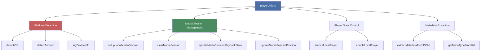
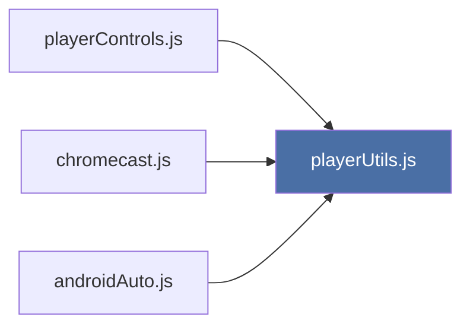

# Player Utilities

{ align=right width="90" }

The `playerUtils.js` module provides cross-cutting utilities for platform detection, Media Session management, player state control, and metadata extraction. It serves as a shared foundation for all player modules, enabling platform-specific optimizations and consistent behavior across different devices.

---

## 🎯 Purpose

**Core Responsibilities:**

- Detect iOS, Android, and Android Auto platforms
- Manage Media Session API (standard and enhanced)
- Control local player state (silence/enable)
- Extract and optimize track metadata
- Provide platform-specific artwork sizing
- Log device capabilities for debugging

**Design Philosophy:**
Centralize common utilities to avoid duplication and ensure consistent platform handling across playerControls, chromecast, and androidAuto modules.

---

## 🏗️ Architecture

### Module Structure



### Used By



---

## 📱 Platform Detection

### detectiOS()

**Purpose:** Detect iOS device and extract version information

**Returns:** Object or `null`

```javascript
export function detectiOS() {
    const ua = navigator.userAgent;
    const isIOS = /iPad|iPhone|iPod/.test(ua) && !window.MSStream;

    if (!isIOS) return null;

    // Extract iOS version
    const match = ua.match(/OS (\d+)_(\d+)/);
    const major = match ? parseInt(match[1], 10) : 0;
    const minor = match ? parseInt(match[2], 10) : 0;

    return {
        isIOS: true,
        version: major,
        versionString: `${major}.${minor}`,
        supportsMediaSession: major >= 15,
        isPWA: window.navigator.standalone === true ||
               window.matchMedia('(display-mode: standalone)').matches
    };
}
```

**Return value when iOS detected:**

```javascript
{
    isIOS: true,
    version: 17,                    // Major version number
    versionString: "17.2",          // Full version string
    supportsMediaSession: true,     // iOS 15+ supports Media Session API
    isPWA: false                    // Whether running as installed PWA
}
```

**Return value when not iOS:**

```javascript
null
```

**Key features:**

- **User agent parsing:** Extracts iOS version from UA string
- **Media Session support check:** iOS 15+ required
- **PWA detection:** Multiple methods (standalone + display-mode)
- **Excludes Windows Phone:** `!window.MSStream` check

**User agent patterns matched:**

```text
Mozilla/5.0 (iPhone; CPU iPhone OS 17_2 like Mac OS X)...
Mozilla/5.0 (iPad; CPU OS 16_5 like Mac OS X)...
Mozilla/5.0 (iPod touch; CPU iPhone OS 15_0 like Mac OS X)...
```

### detectAndroid()

**Purpose:** Detect Android device, version, and Android Auto connection

**Returns:** Object or `null`

```javascript
export function detectAndroid() {
    const ua = navigator.userAgent;
    const isAndroid = /android/i.test(ua);

    if (!isAndroid) return null;

    // Extract Android version
    const match = ua.match(/Android (\d+)\.?(\d+)?/);
    const major = match ? parseInt(match[1], 10) : 0;
    const minor = match ? parseInt(match[2], 10) : 0;

    // Check for Android Auto indicators
    const isAndroidAuto = ua.toLowerCase().includes('vehicle') ||
                         ua.toLowerCase().includes('automotive');

    return {
        isAndroid: true,
        version: major,
        versionString: `${major}.${minor}`,
        supportsMediaSession: major >= 5,  // Android 5.0+
        isAndroidAuto: isAndroidAuto,
        isPWA: window.matchMedia('(display-mode: standalone)').matches
    };
}
```

**Return value when Android detected:**

```javascript
{
    isAndroid: true,
    version: 13,                    // Major version number
    versionString: "13.0",          // Full version string
    supportsMediaSession: true,     // Android 5.0+ supports Media Session
    isAndroidAuto: false,           // Whether Android Auto is connected
    isPWA: false                    // Whether running as installed PWA
}
```

**Android Auto detection:**

User agent contains "vehicle" or "automotive":

```text
Mozilla/5.0 (Linux; Android 13; automotive) AppleWebKit/537.36...
```

**Key features:**

- **Version extraction:** Parses major and minor version
- **Media Session check:** Android 5.0+ (Lollipop) required
- **Android Auto detection:** User agent keywords
- **PWA detection:** Display mode check

### logDeviceInfo()

**Purpose:** Log comprehensive device and feature support information

**Returns:** `void`

**Console output examples:**

**iOS Device:**

```text
📱 iOS Device Detected
   Version: iOS 17.2
   PWA Mode: Yes
   Media Session: Supported ✅
   Media Session API: Available ✅
   Cast API: Not Available ❌
```

**Android Device (Android Auto):**

```text
🤖 Android Device Detected
   Version: Android 13.0
   PWA Mode: No
   Android Auto: Connected ✅
   Media Session: Supported ✅
   Media Session API: Available ✅
   Cast API: Available ✅
```

**Desktop:**

```text
💻 Desktop/Other Device
   Media Session API: Available ✅
   Cast API: Available ✅
```

**Usage:**

```javascript
// Called during playerControls initialization
logDeviceInfo();
```

**Checks:**

- Platform type (iOS, Android, Desktop)
- OS version
- PWA status
- Android Auto connection
- Media Session API availability
- Cast API availability

---

## 🎵 Media Session Management

### setupLocalMediaSession(metadata, playerControls)

**Purpose:** Configure standard Media Session for iOS and Desktop

**Parameters:**

- `metadata` (object) - Track metadata

  ```javascript
  {
      title: "Song Title",
      artist: "Artist Name",
      album: "Album Name",
      artwork: [
          { src: "/covers/slug_192x192.jpg", sizes: "192x192", type: "image/jpeg" },
          { src: "/covers/slug_512x512.jpg", sizes: "512x512", type: "image/jpeg" }
      ]
  }
  ```

- `playerControls` (object) - Control API with `play()`, `pause()`, `next()`, `previous()`

**Implementation:**

```javascript
export function setupLocalMediaSession(metadata, playerControls) {
    if (!('mediaSession' in navigator)) return;

    try {
        navigator.mediaSession.metadata = new MediaMetadata({
            title: metadata.title,
            artist: metadata.artist,
            album: metadata.album,
            artwork: metadata.artwork
        });

        navigator.mediaSession.setActionHandler('play', () => {
            playerControls.play();
        });

        navigator.mediaSession.setActionHandler('pause', () => {
            playerControls.pause();
        });

        navigator.mediaSession.setActionHandler('previoustrack', () => {
            playerControls.previous();
        });

        navigator.mediaSession.setActionHandler('nexttrack', () => {
            playerControls.next();
        });

        // Basic seeking support
        navigator.mediaSession.setActionHandler('seekto', (details) => {
            if (details.seekTime !== undefined) {
                const player = document.getElementById('main-player');
                if (player) {
                    player.currentTime = details.seekTime;
                }
            }
        });
    } catch (error) {
        console.warn('Error updating Media Session:', error);
    }
}
```

**Features:**

- Sets track metadata (title, artist, album, artwork)
- Configures 5 action handlers (play, pause, previous, next, seekto)
- Routes all actions to playerControls API
- Graceful error handling

**Difference from Android Auto:**

- Simpler setup (no position state)
- Fewer artwork sizes (2 vs 5)
- No position update interval
- No audio event listeners

### clearMediaSession()

**Purpose:** Completely remove all Media Session state and handlers

**Returns:** `void`

**Implementation:**

```javascript
export function clearMediaSession() {
    if (!('mediaSession' in navigator)) return;

    try {
        // CRITICAL: Set state to 'none' FIRST
        navigator.mediaSession.playbackState = 'none';

        // Clear metadata
        navigator.mediaSession.metadata = null;

        // Remove ALL action handlers
        const actions = [
            'play', 'pause', 'stop',
            'previoustrack', 'nexttrack',
            'seekbackward', 'seekforward',
            'seekto'
        ];

        actions.forEach(action => {
            try {
                navigator.mediaSession.setActionHandler(action, null);
            } catch (e) {
                // Action may not be supported, that's fine
            }
        });

        // Try to clear position state
        try {
            navigator.mediaSession.setPositionState(null);
        } catch (e) {
            // May not be supported
        }
    } catch (error) {
        console.warn('Error clearing Media Session:', error);
    }
}
```

**Why set playbackState to 'none' first?**

- Prevents brief flash of stale metadata in lock screen
- Signals to OS that media is truly stopped
- Required before clearing metadata

**When called:**

- User stops playback
- Chromecast session starts (local session must clear)
- Switching between playback modes

### updateMediaSessionPlaybackState(state)

**Purpose:** Update only the playback state without changing metadata

**Parameters:**

- `state` (string) - One of: `'none'`, `'paused'`, `'playing'`

**Implementation:**

```javascript
export function updateMediaSessionPlaybackState(state) {
    if (!('mediaSession' in navigator)) return;

    try {
        navigator.mediaSession.playbackState = state;
    } catch (e) {
        console.warn('Error updating playback state:', e);
    }
}
```

**Usage:**

```javascript
// Audio element events
player.addEventListener('play', () => {
    updateMediaSessionPlaybackState('playing');
});

player.addEventListener('pause', () => {
    updateMediaSessionPlaybackState('paused');
});
```

### updateMediaSessionPosition(currentTime, duration, playbackRate)

**Purpose:** Update position state for seeking and progress display

**Parameters:**

- `currentTime` (number) - Current playback position in seconds
- `duration` (number) - Total track duration in seconds
- `playbackRate` (number) - Playback speed (default: 1.0)

**Implementation:**

```javascript
export function updateMediaSessionPosition(currentTime, duration, playbackRate = 1.0) {
    if (!('mediaSession' in navigator) ||
        !('setPositionState' in navigator.mediaSession)) return;

    if (duration && !isNaN(duration) && isFinite(duration) && duration > 0) {
        try {
            navigator.mediaSession.setPositionState({
                duration: duration,
                playbackRate: playbackRate,
                position: Math.min(currentTime, duration)
            });
        } catch (error) {
            console.debug('Could not set position state:', error);
        }
    }
}
```

**Validation:**

- Checks `duration` is valid number
- Ensures `position` doesn't exceed `duration`
- Silently fails if API not available

**Called by:**

- `playerControls.js` on audio events (loadedmetadata, timeupdate, seeked)
- `androidAuto.js` for enhanced position tracking

---

## 🎛️ Player State Control

### silenceLocalPlayer()

**Purpose:** Completely disable local player when casting starts

**Returns:** `void`

**Implementation:**

```javascript
export function silenceLocalPlayer() {
    const player = document.getElementById('main-player');
    if (!player) return;

    // Pause and clear source
    player.pause();
    player.src = '';
    player.load();

    // Remove ALL player attributes that could trigger Media Session
    player.removeAttribute('controls');
    player.removeAttribute('autoplay');

    // Set volume to 0 as extra safety
    player.volume = 0;
    player.muted = true;

    // Remove from tab order
    player.setAttribute('tabindex', '-1');
}
```

**Why so aggressive?**

When Chromecast is active, the local player must be completely silenced to prevent:

- Duplicate audio playback
- Conflicting Media Session controls
- Battery drain from background audio processing
- UI confusion (two sets of media controls)

**What gets disabled:**

1. **Playback:** Pause and clear source
2. **UI controls:** Remove `controls` attribute
3. **Auto-play:** Remove `autoplay` attribute
4. **Audio:** Volume to 0 and mute
5. **Keyboard navigation:** Tab order removed

### enableLocalPlayer()

**Purpose:** Restore local player when casting ends

**Returns:** `void`

**Implementation:**

```javascript
export function enableLocalPlayer() {
    const player = document.getElementById('main-player');
    if (!player) return;

    // Restore controls
    player.setAttribute('controls', '');

    // Restore volume and unmute
    player.volume = 1.0;
    player.muted = false;

    // Restore to tab order
    player.removeAttribute('tabindex');
}
```

**Restoration:**

1. **UI controls:** Add back `controls` attribute
2. **Audio:** Full volume and unmute
3. **Keyboard navigation:** Back in tab order

**Note:** Does NOT restore `src` - that happens when user plays next track

---

## 🎨 Metadata Extraction

### extractMetadataFromDOM(trackElement)

**Purpose:** Extract track metadata with platform-optimized artwork

**Parameters:**

- `trackElement` (HTMLElement) - Track list item containing data attributes and cover image

**Returns:** Metadata object

**Implementation:**

```javascript
export function extractMetadataFromDOM(trackElement) {
    const iOS = detectiOS();
    const android = detectAndroid();
    const coverImg = trackElement.querySelector('.track-cover');
    let artwork = [];

    if (coverImg && coverImg.src) {
        const mimeType = getMimeTypeFromUrl(coverImg.src);

        // Parse cover URL to extract slug
        const coverUrl = new URL(coverImg.src, window.location.origin);
        const coverPath = coverUrl.pathname;
        const slug = coverPath.split('/').pop()
                              .replace('.jpg', '')
                              .replace(/_\d+x\d+$/, '');

        // Build size-optimized artwork URLs
        if (iOS) {
            // iOS optimization - prefers larger sizes for lock screen
            artwork = [
                {
                    src: `/covers/${slug}_512x512.jpg`,
                    sizes: '512x512',
                    type: mimeType
                },
                {
                    src: `/covers/${slug}_256x256.jpg`,
                    sizes: '256x256',
                    type: mimeType
                },
                {
                    src: `/covers/${slug}_192x192.jpg`,
                    sizes: '192x192',
                    type: mimeType
                }
            ];
        } else if (android && android.isAndroidAuto) {
            // Android Auto - requires full size spectrum
            artwork = [
                {
                    src: `/covers/${slug}_96x96.jpg`,
                    sizes: '96x96',
                    type: mimeType
                },
                {
                    src: `/covers/${slug}_128x128.jpg`,
                    sizes: '128x128',
                    type: mimeType
                },
                {
                    src: `/covers/${slug}_192x192.jpg`,
                    sizes: '192x192',
                    type: mimeType
                },
                {
                    src: `/covers/${slug}_256x256.jpg`,
                    sizes: '256x256',
                    type: mimeType
                },
                {
                    src: `/covers/${slug}_512x512.jpg`,
                    sizes: '512x512',
                    type: mimeType
                }
            ];
        } else {
            // Desktop/other - simpler set
            artwork = [
                {
                    src: `/covers/${slug}_192x192.jpg`,
                    sizes: '192x192',
                    type: mimeType
                },
                {
                    src: `/covers/${slug}_512x512.jpg`,
                    sizes: '512x512',
                    type: mimeType
                }
            ];
        }
    }

    return {
        title: trackElement.dataset.title || 'Unknown',
        artist: trackElement.dataset.artist || 'Unknown Artist',
        album: trackElement.dataset.album || '',
        artwork: artwork
    };
}
```

**Platform-specific artwork optimization:**

| Platform | Sizes | Reasoning |
| -------- | ----- | --------- |
| **iOS** | 512, 256, 192 | Lock screen prefers high resolution |
| **Android Auto** | 96, 128, 192, 256, 512 | Dashboard requires full spectrum |
| **Desktop** | 192, 512 | Simple set for browser controls |

**Slug extraction:**

```javascript
// Example: /covers/artist_album_192x192.jpg
const slug = "artist_album_192x192"
              .replace('.jpg', '')        // "artist_album_192x192"
              .replace(/_\d+x\d+$/, '');  // "artist_album"
```

**Data attributes expected on trackElement:**

```html
<div class="track-item"
     data-title="Song Title"
     data-artist="Artist Name"
     data-album="Album Name"
     data-path="artist/album/song.mp3">
    
</div>
```

### getMimeTypeFromUrl(url)

**Purpose:** Determine MIME type from file extension

**Parameters:**

- `url` (string) - Image URL

**Returns:** MIME type string

**Implementation:**

```javascript
export function getMimeTypeFromUrl(url) {
    const extension = url.split('.').pop()
                         .split('?')[0]    // Remove query params
                         .toLowerCase();

    const mimeMap = {
        'jpg': 'image/jpeg',
        'jpeg': 'image/jpeg',
        'png': 'image/png',
        'webp': 'image/webp',
        'gif': 'image/gif',
        'bmp': 'image/bmp',
    };

    return mimeMap[extension] || 'image/jpeg';
}
```

**Handles:**

- Query parameters (e.g., `/covers/image.jpg?v=123`)
- Case insensitivity
- Fallback to `image/jpeg`

**Examples:**

```javascript
getMimeTypeFromUrl('/covers/album.jpg')           // 'image/jpeg'
getMimeTypeFromUrl('/covers/album.PNG')           // 'image/png'
getMimeTypeFromUrl('/covers/album.webp?v=2')      // 'image/webp'
getMimeTypeFromUrl('/covers/album.unknown')       // 'image/jpeg' (fallback)
```

---

## 🔄 Integration Patterns

### With playerControls.js

```javascript
import {
    detectiOS,
    detectAndroid,
    logDeviceInfo,
    silenceLocalPlayer,
    enableLocalPlayer,
    clearMediaSession,
    setupLocalMediaSession,
    extractMetadataFromDOM
} from './playerUtils.js';

// During initialization
const iOS = detectiOS();
const androidInfo = detectAndroid();
logDeviceInfo();

// When track starts
const metadata = extractMetadataFromDOM(trackElement);
setupLocalMediaSession(metadata, playerControlsAPI);

// When casting starts
silenceLocalPlayer();
clearMediaSession();

// When casting ends
enableLocalPlayer();
const metadata = extractMetadataFromDOM(currentTrackElement);
setupLocalMediaSession(metadata, playerControlsAPI);
```

### With androidAuto.js

```javascript
import { extractMetadataFromDOM } from './playerUtils.js';

// Gets platform-optimized metadata
const metadata = extractMetadataFromDOM(trackElement);

// Android Auto detected, so metadata.artwork contains 5 sizes
setupAndroidAutoMediaSession(metadata, playerControls, audioElement);
```

### With chromecast.js

```javascript
import {
    silenceLocalPlayer,
    enableLocalPlayer,
    clearMediaSession,
    extractMetadataFromDOM
} from './playerUtils.js';

function onCastSessionStart() {
    silenceLocalPlayer();
    clearMediaSession();
    // Now only Chromecast controls are active
}

function onCastSessionEnd() {
    enableLocalPlayer();
    // Restore local Media Session if track is playing
}
```

---

## 🧪 Testing Utilities

### Debug Logging

All detection functions log to console:

```javascript
// Enable debug mode
window.__PLAYER_UTILS_DEBUG__ = true;

// Check detection
const iOS = detectiOS();
console.log('iOS detection:', iOS);

const android = detectAndroid();
console.log('Android detection:', android);
```

### Feature Detection

```javascript
// Check Media Session API
if ('mediaSession' in navigator) {
    console.log('✅ Media Session supported');

    if ('setPositionState' in navigator.mediaSession) {
        console.log('✅ Position state supported');
    }
}

// Check Cast API
if (typeof chrome !== 'undefined' && chrome.cast) {
    console.log('✅ Cast API available');
}
```

---

## 📊 API Reference

### Exports

```javascript
// Platform Detection
export function detectiOS()
export function detectAndroid()
export function logDeviceInfo()

// Media Session Management
export function setupLocalMediaSession(metadata, playerControls)
export function clearMediaSession()
export function updateMediaSessionPlaybackState(state)
export function updateMediaSessionPosition(currentTime, duration, playbackRate)

// Player Control
export function silenceLocalPlayer()
export function enableLocalPlayer()

// Metadata Utilities
export function extractMetadataFromDOM(trackElement)
export function getMimeTypeFromUrl(url)
```

### Type Definitions

**iOS Detection Result:**

```typescript
{
    isIOS: true,
    version: number,
    versionString: string,
    supportsMediaSession: boolean,
    isPWA: boolean
} | null
```

**Android Detection Result:**

```typescript
{
    isAndroid: true,
    version: number,
    versionString: string,
    supportsMediaSession: boolean,
    isAndroidAuto: boolean,
    isPWA: boolean
} | null
```

**Metadata Object:**

```typescript
{
    title: string,
    artist: string,
    album: string,
    artwork: Array<{
        src: string,
        sizes: string,
        type: string
    }>
}
```

---

## 🎯 Best Practices

### Always Check for API Support

```javascript
if ('mediaSession' in navigator) {
    setupLocalMediaSession(metadata, playerControls);
}
```

### Handle Platform Differences

```javascript
const iOS = detectiOS();
const android = detectAndroid();

if (iOS && !iOS.supportsMediaSession) {
    console.warn('Media Session not supported on this iOS version');
}

if (android && android.isAndroidAuto) {
    // Use enhanced setup
    setupAndroidAutoMediaSession(...);
} else {
    // Use standard setup
    setupLocalMediaSession(...);
}
```

### Clear Before Setting

```javascript
// When switching modes, always clear first
clearMediaSession();
// Then setup new mode
setupLocalMediaSession(newMetadata, controls);
```

---

## 📚 Related Documentation

- **[Player Controls](playerControls.md)** - Main orchestration layer
- **[Chromecast Integration](../chromecast/integration.md)** - Uses player control utilities
- **[Android Auto](../android-auto/integration-overview.md)** - Enhanced Media Session setup
- **[Playback Routes](../routes/play/index.md)** - Backend audio streaming

---

*Source: `static/js/player/playerUtils.js`*
