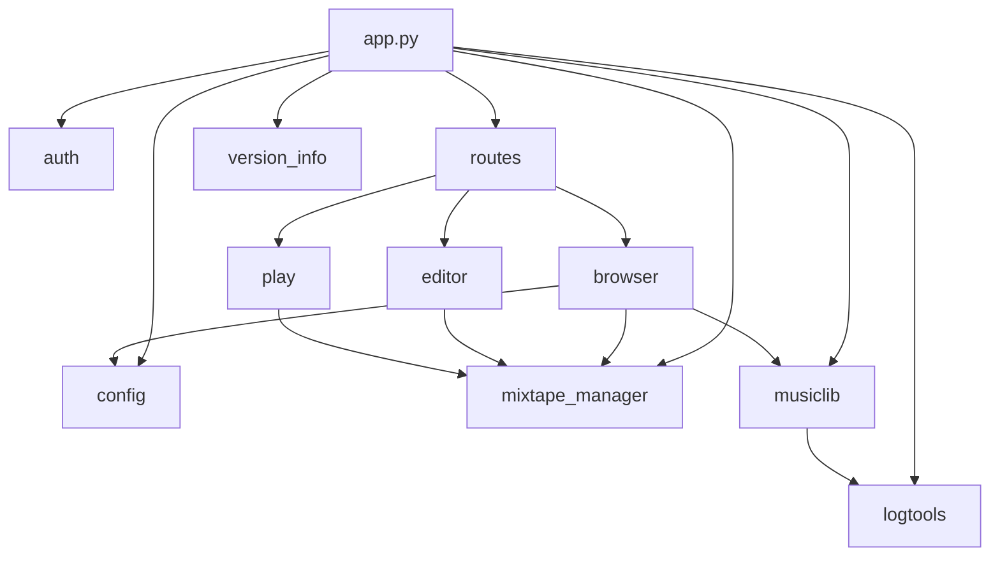

# Project modules

{ align=right width="90" }

- **auth**: Custom authentication logic for checking user credentials.
- **config**: Handles configuration for different environments (development, test, production), including directory setup and passwords.
- **logtools**: Custom logging setup and logger retrieval for the application.
- **mixtape_manager**: Manages mixtape storage, retrieval, and metadata.
- **musiclib**: Provides music collection management and indexing status.
- **routes**: Contains route blueprints for browser, editor, and play functionality.
- **version_info**: Retrieves the current application version.

- **browser, editor, play**: Flask blueprints for different parts of the web interface (browsing, editing, and playing mixtapes).

## Dependencies

