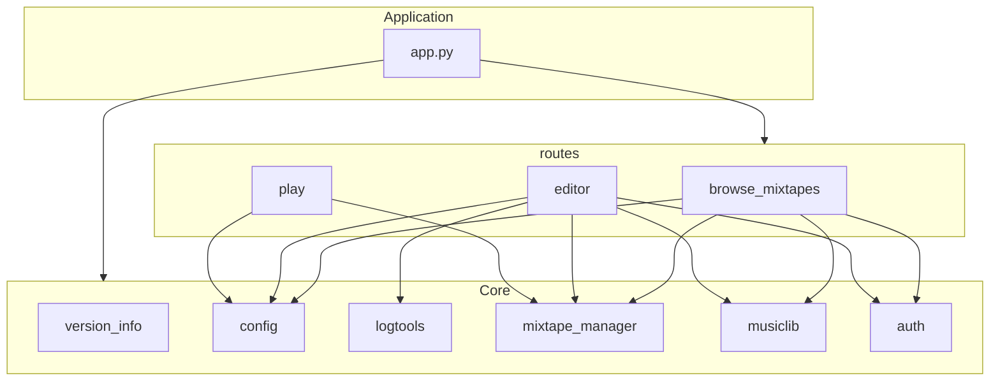

# Project modules

{ align=right width="90" }

This page provides an overview of the project’s Python modules and how they depend on each other. It describes the responsibilities of each module and visualizes their relationships to clarify the overall architecture. The goal is to make the structure of the codebase easier to understand for contributors and to highlight the separation between core functionality and the web interface.

## Module description

- **common** contains stable, infrastructure-free abstractions that may be used by all layers.

### Core modules

- **auth**: Custom authentication logic for checking user credentials.
- **config**: Environment-aware configuration and directory setup.
- **logtools**: Custom logging setup and logger retrieval for the application.
- **mixtape_manager**: Manages mixtape storage, retrieval, and metadata.
- **musiclib**: Manages the music collection and indexing state.
- **version_info**: Retrieves the current application version.

### Web / Flask modules

- **routes**: Registers and groups Flask blueprints.
- **browse_mixtapes**: Blueprint for browsing mixtapes.
- **editor**: Blueprint for editing mixtapes.
- **play**: Blueprint for playing mixtapes.

## Module dependencies

The diagram below shows module-level dependencies.
Arrows indicate "imports / uses".
Web-layer modules depend on core modules, but core modules do not depend on Flask or web logic.

### Entry point

- `app.py` is the application entry point and wires together configuration, logging, domain services, and routes.

### Design notes

- Core modules do not depend on Flask or blueprints.
- `logtools` is the only shared cross-cutting concern.
- `mixtape_manager` acts as the central domain service.

