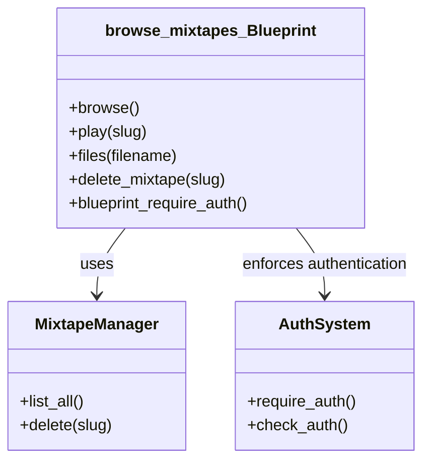
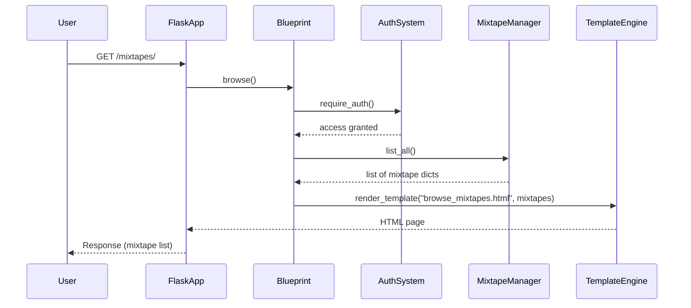
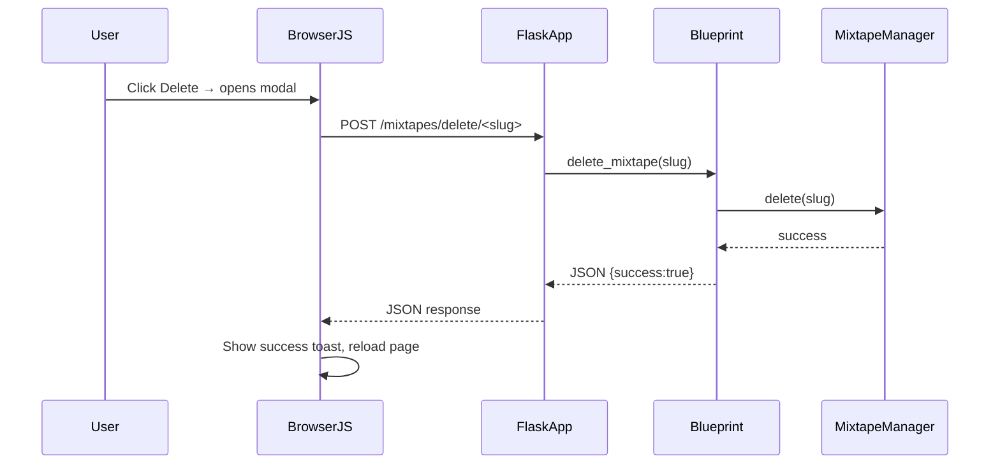

{ align=right width="90" }

# Browse Mixtapes

The `browse_mixtapes` Flask blueprint (`routes/browse_mixtapes.py`) that powers the Mixtapes listing page, file serving, and redirection to the public player. It explains the routes, authentication flow, interaction with MixtapeManager, and the front‑end assets (browse_mixtapes.html, CSS, and JavaScript).

## High‑Level Overview

| Component | Responsibility |
|-----------|----------------|
| `browse_mixtapes` Blueprint (`routes/browse_mixtapes.py`) | Registers all UI-facing routes under the `/mixtapes` prefix, enforces authentication, and delegates data access to `MixtapeManager`. |
| `MixtapeManager` (`mixtape_manager.py`) | Reads/writes mixtape JSON files, manages cover images, and provides `list_all()` for the browse view. |
| Templates (`templates/browse_mixtapes.html`) | Renders the list of mixtapes as cards, each with cover, meta info, and action buttons (edit, play, share, delete). |
| Static assets (`static/css/browse_mixtapes.css`, `static/js/browser/*.js`) | Provide responsive styling, copy-to-clipboard toast, and delete-confirmation modal logic. |
| Authentication (`auth.py`) | `@require_auth` decorator and `check_auth()` helper ensure only logged-in users can reach any route in this blueprint. |

## Blueprint & Route Map

| HTTP Method | URL Pattern                    | View Function               | Description |
|-------------|--------------------------------|-----------------------------|-------------|
| GET         | `/mixtapes/`                   | `browse()`                  | Retrieves all mixtapes (`MixtapeManager.list_all()`) and renders `browse_mixtapes.html`. |
| GET         | `/mixtapes/play/<slug>`        | `play(slug)`                | Redirect to the public player (`play.public_play`) for the given mixtape slug. |
| GET         | `/mixtapes/files/<path:filename>` | `files(filename)`          | Serves static files (JSON, cover images, etc.) from the configured `MIXTAPE_DIR`. |
| POST        | `/mixtapes/delete/<slug>`      | `delete_mixtape(slug)`      | Deletes the mixtape JSON and its cover image; returns JSON `{ success: true }` or an error. |
| `before_request` | –                          | `blueprint_require_auth()`  | Runs before every request in this blueprint; redirects unauthenticated users to the landing page (`url_for("landing")`). |

All routes are wrapped with `@require_auth` (except the `before_request` hook, which performs the same check).

## Authentication & Access Control

* **Decorator** – `@require_auth` (imported from `auth.py`) checks the session for a valid user. If the check fails, the decorator returns a redirect to the login page.
* **Blueprint‑wide guard** – `@browser.before_request` executes `check_auth()` for every request hitting this blueprint. This is a defensive second line; even if a route is accidentally left undecorated, the guard will still enforce authentication.

**Result**: Only logged‑in users can view the mixtape list, play a mixtape, download files, or delete a mixtape.

## Data Flow & Server‑Side Logic

### Listing Mixtapes (`GET` `/mixtapes/`)

1. **Request** → Flask routes the request to `browse()` (protected).
2. **Mixtape retrieval** – `mixtape_manager.list_all()` reads every `*.json` file in `app.config["MIXTAPE_DIR"]`, sorts them by `updated_at` (newest first), and returns a list of dicts:

    ```json
    [
        {
            "title": "My Summer Mix",
            "cover": "covers/abc123.jpg",
            "slug": "my-summer-mix",
            "tracks": [...],
            "created_at": "2024-09-01T12:34:56",
            "updated_at": "2024-09-15T09:21:00"
        },
        ...
    ]
    ```

3. **Template rendering** – `render_template("browse_mixtapes.html", mixtapes=mixtapes)` passes the list to Jinja.
4. **HTML output** – For each mixtape a card (**.mixtape-item**) is generated containing:
    * Cover image (` or a placeholder).
    * Title ({{ m.title }}).
    * Meta line (`{{ m.tracks|length }} tracks • Modified {{ m.updated_at[:10] }}`).
    * Action buttons: **Edit**, **Play**, **Share**, **Delete** (each with data attributes for JS).

### Playing a Mixtape (`GET` `/mixtapes/play/<slug>`)

* The view simply redirects to the public player route defined elsewhere (e.g. play.public_play).

    ```python
    return redirect(url_for("public_play", slug=slug))
    ```

* The client ends up on `/play/<slug>#play`, where the full mixtape UI is rendered.

### Serving Files (`GET` `/mixtapes/files/<filename>`)

* Uses Flask’s `send_from_directory` to serve any file under `app.config["MIXTAPE_DIR"]`.
* This includes the JSON file (`<slug>.json`) and cover images (`covers/<slug>.jpg`).

### Deleting a Mixtape (`POST` `/mixtapes/delete/<slug>`)

1. **Existence check** – Verifies that `<slug>.json` exists; if not, returns `404` with JSON error.
2. Calls `mixtape_manager.delete(slug)`, which removes the JSON file and any associated cover image (`covers/<slug>.jpg`).
3. Returns JSON `{ "success": true }` on success, or `{ "success": false, "error": "..."`}  with the appropriate HTTP status on failure.

### Error Handling

* All routes catch generic `Exception` and log the traceback via the injected `logger`.
* Errors are reported to the client as JSON with a descriptive `error` field and an appropriate HTTP status code (`400`, `404`, `500`).

## Template Rendering (`browse_mixtapes.html`)

| Section | Details |
|---------|---------|
| Header | Page title “My Mixtapes” and a New Mixtape button linking to `/editor`. |
| Mixtape Cards | Loop over mixtapes. Each card (`.mixtape-item`) contains: • Cover (`.mixtape-cover`). • Title (`.mixtape-title`). • Meta info (`.mixtape-meta`). • Action buttons (`.action-btn`): edit (`/editor/<slug>`), play (redirect), share (copies public URL to clipboard), delete (opens modal). |
| Empty State | If mixtapes is empty, shows a friendly “No mixtapes yet…” message with an icon. |
| Copy Toast | Bootstrap toast (`#copyToast`) displayed when a share button succeeds. |
| Delete Confirmation Modal | Modal (`#deleteConfirmModal`) that asks the user to confirm deletion; populated with the mixtape title via JS. |
| Delete Success Toast | Toast (`#deleteSuccessToast`) shown after a successful deletion. |
| JS Entry Point | At the bottom of the page: `<script type="module" src="{{ url_for('static', filename='js/browser/index.js') }}"></script>` – this module wires up copy-to-clipboard and delete-modal logic. |

All UI elements use **Bootstrap 5** utilities and custom CSS variables (`--bs-body-bg`, `--bs-border-color`) to stay theme‑aware (light/dark modes).

## Static Assets (CSS & JS)

### `browse_mixtapes.css`

* **Responsive card layout** – Flexbox with wrapping, subtle shadows, and a hover lift effect.
* **Action buttons** – Circular, color‑coded (edit = primary, play = success, share = info, delete = danger). Hover scales the button.
* **Mobile adjustments** – Smaller cover size, reduced button dimensions, and a stacked layout for very narrow viewports (`max-width: 480px`).

### JavaScript Modules

| File | Exported function(s) | Purpose |
|------|--------------------|---------|
| `copyToast.js` | `initCopyToast()` | Attaches click listeners to `.copy-btn` elements; on click copies `data-url` to the clipboard and shows the `#copyToast` toast. |
| `deleteMixtape.js` | `initDeleteMixtape()` | Handles the delete workflow: opens the confirmation modal, sends a POST `/mixtapes/delete/<slug>` request, shows success toast, and reloads the page. |
| `index.js` | – | Imports the two functions above and runs them on `DOMContentLoaded`. |

All scripts are ES6 modules (`type="module"`), ensuring they are loaded after the DOM is ready and that they don’t pollute the global namespace.

## Class & Sequence Diagrams

### Class Diagram



### Sequence Diagram - Listing Mixtapes



### Sequence Diagram - Deleting a Mixtape



## API

### ::: src.routes.browse_mixtapes
