{ align=right width="90" }

# Browse Mixtapes

The `browse_mixtapes` Flask blueprint (`routes/browse_mixtapes.py`) powers the Mixtapes listing page with advanced search and sorting capabilities, file serving, and redirection to the public player. It explains the routes, authentication flow, interaction with MixtapeManager, and the front-end assets (browse_mixtapes.html, CSS, and JavaScript).

## 🌐 High-Level Overview

| Component | Responsibility |
| --------- | -------------- |
| `browse_mixtapes` Blueprint (`routes/browse_mixtapes.py`) | Registers all UI-facing routes under the `/mixtapes` prefix, enforces authentication, handles search/sort parameters, and delegates data access to `MixtapeManager`. |
| `MixtapeManager` (`mixtape_manager.py`) | Reads/writes mixtape JSON files, manages cover images, and provides `list_all()` for the browse view. |
| Templates (`templates/browse_mixtapes.html`) | Renders the list of mixtapes with a compact search/sort bar and mixtape cards, each with cover, meta info, and action buttons (edit, play, share, delete). |
| Static assets (`static/css/browse_mixtapes.css`, `static/js/browser/*.js`) | Provide responsive styling, hybrid search functionality (instant title + deep track search), sorting logic, and delete-confirmation modal. |
| Authentication (`auth.py`) | `@require_auth` decorator and `check_auth()` helper ensure only logged-in users can reach any route in this blueprint. |

## 🗺️ Flask Blueprint & Routes

| HTTP Method | URL Pattern | View Function | Query Parameters | Description |
| ----------- | ----------- | ------------- | ---------------- | ----------- |
| `GET` | `/mixtapes/` | `browse()` | `sort_by`, `sort_order`, `search`, `deep` | Retrieves all mixtapes (`MixtapeManager.list_all()`), applies search/sort filters, and renders `browse_mixtapes.html`. |
| `GET` | `/mixtapes/play/<slug>` | `play(slug)` | - | Redirect to the public player (`play.public_play`) for the given mixtape slug. |
| `GET` | `/mixtapes/files/<path:filename>` | `files(filename)` | - | Serves static files (JSON, cover images, etc.) from the configured `MIXTAPE_DIR`. |
| `POST` | `/mixtapes/delete/<slug>` | `delete_mixtape(slug)` | - | Deletes the mixtape JSON and its cover image; returns JSON `{ success: true }` or an error. |
| `before_request` | — | `blueprint_require_auth()` | - | Runs before every request in this blueprint; redirects unauthenticated users to the landing page (`url_for("landing")`). |

All routes are wrapped with `@require_auth` (except the `before_request` hook, which performs the same check).

### Query Parameters

**Sort Parameters:**
- `sort_by`: Field to sort by (`updated_at`, `created_at`, `title`, `track_count`)
- `sort_order`: Sort direction (`asc`, `desc`)
- Default: `sort_by=updated_at&sort_order=desc` (most recently modified first)

**Search Parameters:**
- `search`: Search query string
- `deep`: Boolean (`true`/`false`) indicating deep search mode
  - `false` or absent: Client-side title filtering only
  - `true`: Server-side search through tracks, artists, albums, and liner notes

**Examples:**
```
/mixtapes/?sort_by=title&sort_order=asc
/mixtapes/?search=rock&deep=true&sort_by=track_count&sort_order=desc
```

## 🔒 Authentication & Access Control

* **Decorator** — `@require_auth` (imported from `auth.py`) checks the session for a valid user. If the check fails, the decorator returns a redirect to the login page.
* **Blueprint-wide guard** — `@browser.before_request` executes `check_auth()` for every request hitting this blueprint. This is a defensive second line; even if a route is accidentally left undecorated, the guard will still enforce authentication.

**Result**: Only logged-in users can view the mixtape list, play a mixtape, download files, or delete a mixtape.

## 🔍 Search & Sort Features

### Hybrid Search System

The browse page implements a two-tier search system:

**1. Instant Title Search (Client-Side)**
- Filters mixtapes by title as you type
- No server round-trip required
- Instant visual feedback
- Implemented in `static/js/browser/search.js`

**2. Deep Search (Server-Side)**
- Click "Tracks" button to search within:
  - Track names (song titles)
  - Artist names
  - Album names
  - Mixtape titles
  - Liner notes
- Implemented in `_deep_search_mixtapes()` helper function
- Returns filtered list to template

### Sorting System

Users can sort by 8 different combinations via a single dropdown:

**Date Options:**
- 📅 Recent First (updated_at desc)
- 📅 Oldest First (updated_at asc)
- 📅 Newest Created (created_at desc)
- 📅 Oldest Created (created_at asc)

**Name & Size Options:**
- 🔤 A → Z (title asc)
- 🔤 Z → A (title desc)
- 🎵 Most Tracks (track_count desc)
- 🎵 Fewest Tracks (track_count asc)

Sorting is applied **after** search filtering, so search results respect the selected sort order.

## 📄 Data Flow & Server-Side Logic

### Listing Mixtapes (`GET` `/mixtapes/`)

1. **Request** → Flask routes the request to `browse()` (protected).
2. **Parse parameters** — Extract `sort_by`, `sort_order`, `search`, and `deep` from query string.
3. **Mixtape retrieval** — `mixtape_manager.list_all()` reads every `*.json` file in `app.config["MIXTAPE_DIR"]` and returns a list of dicts.
4. **Apply search** — If `search` and `deep=true`, filter mixtapes using `_deep_search_mixtapes()`:
    ```python
    def _deep_search_mixtapes(mixtapes: list[dict], query: str) -> list[dict]:
        """Searches across mixtape metadata and all tracks"""
        query_lower = query.lower()
        results = []
        
        for mixtape in mixtapes:
            # Check title, liner notes
            if query_lower in mixtape.get('title', '').lower():
                results.append(mixtape)
                continue
            
            # Check all tracks (name, artist, album)
            for track in mixtape.get('tracks', []):
                if (query_lower in track.get('track', '').lower() or
                    query_lower in track.get('artist', '').lower() or
                    query_lower in track.get('album', '').lower()):
                    results.append(mixtape)
                    break
        
        return results
    ```
5. **Apply sorting** — Sort the filtered list based on `sort_by` and `sort_order`:
    ```python
    if sort_by == 'title':
        mixtapes.sort(key=lambda x: x.get('title', '').lower(), 
                     reverse=(sort_order == 'desc'))
    elif sort_by == 'track_count':
        mixtapes.sort(key=lambda x: len(x.get('tracks', [])), 
                     reverse=(sort_order == 'desc'))
    # ... etc
    ```
6. **Template rendering** — Pass `mixtapes`, `sort_by`, `sort_order`, `search_query`, and `search_deep` to template.
7. **HTML output** — Renders search/sort controls and filtered mixtape cards.

### Playing a Mixtape (`GET` `/mixtapes/play/<slug>`)

* The view simply redirects to the public player route defined elsewhere (e.g. play.public_play).
    ```python
    return redirect(url_for("public_play", slug=slug))
    ```
* The client ends up on `/play/<slug>#play`, where the full mixtape UI is rendered.

### Serving Files (`GET` `/mixtapes/files/<filename>`)

* Uses Flask's `send_from_directory` to serve any file under `app.config["MIXTAPE_DIR"]`.
* This includes the JSON file (`<slug>.json`) and cover images (`covers/<slug>.jpg`).

### Deleting a Mixtape (`POST` `/mixtapes/delete/<slug>`)

1. **Existence check** — Verifies that `<slug>.json` exists; if not, returns `404` with JSON error.
2. Calls `mixtape_manager.delete(slug)`, which removes the JSON file and any associated cover image (`covers/<slug>.jpg`).
3. Returns JSON `{ "success": true }` on success, or `{ "success": false, "error": "..." }` with the appropriate HTTP status on failure.

### Error Handling

* All routes catch generic `Exception` and log the traceback via the injected `logger`.
* Errors are reported to the client as JSON with a descriptive `error` field and an appropriate HTTP status code (`400`, `404`, `500`).

## 🖥️ UI Layout (Jinja Template — `browse_mixtapes.html`)

| Section | Details |
| ------- | ------- |
| Header | Compact header with "My Mixtapes" title and a "New" button linking to `/editor`. Responsive sizing (smaller on mobile). |
| Search & Sort Bar | Compact card containing: • Search input with clear button • "Tracks" button (with tooltip) for deep search • Combined sort dropdown (field + order in one) • Minimal vertical space (~50px desktop, ~70px mobile) • Bootstrap theme-aware styling |
| Search Result Banner | When search is active, shows info banner with query, result count, and "Clear Search" button. Distinguishes between title search and deep search results. |
| Mixtape Cards | Loop over filtered/sorted mixtapes. Each card (`.mixtape-item`) contains: • Cover (`.mixtape-cover`) • Title (`.mixtape-title`) • Meta info (`.mixtape-meta`) • Action buttons (`.action-btn`): edit, play, QR share, delete |
| Empty State | Context-aware: • No mixtapes: "No mixtapes yet..." • No search results: "No mixtapes found" with clear search button |
| Delete Confirmation Modal | Modal (`#deleteConfirmModal`) that asks the user to confirm deletion; populated with the mixtape title via JS. |
| Delete Success Toast | Toast (`#deleteSuccessToast`) shown after a successful deletion. |
| JS Entry Point | `<script type="module" src="{{ url_for('static', filename='js/browser/index.js') }}"></script>` — wires up search, sort, delete, QR share, and tooltip functionality. |

All UI elements use **Bootstrap 5** utilities and custom CSS variables (`--bs-body-bg`, `--bs-border-color`, `--bs-body-color`) to stay theme-aware (light/dark modes).

### Compact Search/Sort Bar Features

**Space Efficiency:**
- 60%+ vertical space reduction compared to separate cards
- Single card with all controls
- Mobile-optimized with reduced padding

**Responsive Layout:**
- **Desktop (≥992px):** Search input expands to fill space, Tracks + Sort align right
- **Tablet (768-991px):** Two-row layout with natural wrapping
- **Mobile (<768px):** Stacked controls, full-width inputs
- **Tiny (<576px):** Extra compact sizing

**Theming:**
- Search icon respects Bootstrap color variables
- No hardcoded colors (works in light/dark mode)
- Proper contrast in all themes

**Tooltips:**
- Tracks button has tooltip: "Search within song names, artists, and albums"
- Works on both enabled and disabled states
- Helps users understand deep search feature

## 🧱 Static Assets (CSS & JS)

### `browse_mixtapes.css`

**Search & Sort Styling:**
- Compact card with minimal padding (`p-2` on mobile, `p-md-3` on desktop)
- Theme-aware colors using CSS variables
- Input group styling with seamless borders
- Combined sort dropdown with emoji icons
- Responsive adjustments for all screen sizes

**Mixtape Cards:**
- **Responsive card layout** — Flexbox with wrapping, subtle shadows, and a hover lift effect
- **Action buttons** — Circular, color-coded (edit=primary, play=success, share=info, delete=danger). Hover scales the button
- **Mobile adjustments** — Smaller cover size, reduced button dimensions, and a stacked layout for very narrow viewports (`max-width: 480px`)

**Animations:**
- Slide-down animation for search result banner
- Smooth hover transitions on cards and buttons
- Subtle lift effect on card hover

### JavaScript Modules

| File | Exported function(s) | Purpose |
| ---- | -------------------- | ------- |
| `search.js` | `initSearch()` | Handles hybrid search: instant title filtering (client-side), deep search button click, clear search, and Enter key support. Disables client-side filtering when viewing deep search results. |
| `sorting.js` | `initSorting()` | Handles combined sort dropdown changes, updates URL with sort parameters, preserves search state during sort changes. |
| `deleteMixtape.js` | `initDeleteMixtape()` | Handles the delete workflow: opens the confirmation modal, sends a POST `/mixtapes/delete/<slug>` request, shows success toast, and reloads the page. |
| `index.js` | — | Imports and initializes all modules on `DOMContentLoaded`: search, sorting, delete, QR share, and Bootstrap tooltips. |

**Common Module (Shared):**
- `../common/qrShare.js` - Provides QR code generation, modal display, copy-to-clipboard, and download functionality. Used across browser, editor, and player pages.

All scripts are ES6 modules (`type="module"`), ensuring they are loaded after the DOM is ready and that they don't pollute the global namespace.

### Search Implementation Details

**Client-Side Title Search:**
```javascript
function filterByTitle(query) {
    // Skip if on deep search results page
    if (isDeepSearchActive) return;
    
    mixtapeItems.forEach(item => {
        const title = item.querySelector('.mixtape-title').textContent;
        if (title.toLowerCase().includes(query.toLowerCase())) {
            item.style.display = originalDisplays.get(item);
        } else {
            item.style.display = 'none';
        }
    });
}
```

**Deep Search Navigation:**
```javascript
deepSearchBtn.addEventListener('click', () => {
    const url = new URL(window.location.href);
    url.searchParams.set('search', query);
    url.searchParams.set('deep', 'true');
    // Preserve sort parameters
    window.location.href = url.toString();
});
```

**Key Features:**
- Instant filtering respects search state (doesn't interfere with server-side results)
- Clear button removes both client-side filters and navigates away from deep search
- Enter key triggers deep search
- URL parameters maintain complete state (search + sort)

## 📊 Class & Sequence Diagrams

### Class Diagram


### Sequence Diagram - Searching and Sorting Mixtapes


### Sequence Diagram - Deleting a Mixtape

```mermaid
sequenceDiagram
    participant User
    participant BrowserJS
    participant FlaskApp
    participant browse_mixtapes as Blueprint
    participant MixtapeManager

    User->>BrowserJS: Click Delete → opens modal
    BrowserJS->>FlaskApp: POST /mixtapes/delete/<slug>
    FlaskApp->>Blueprint: delete_mixtape(slug)
    Blueprint->>MixtapeManager: delete(slug)
    MixtapeManager-->>Blueprint: success
    Blueprint-->>FlaskApp: JSON {success:true}
    FlaskApp-->>BrowserJS: JSON response
    BrowserJS->>BrowserJS: Show success toast, reload page
```



## 🎯 User Experience Features

### Search Flow

1. **Quick Title Search:**
   - User types in search box
   - Results filter instantly (no page reload)
   - Clear button appears
   - Tracks button becomes enabled

2. **Deep Search:**
   - User clicks "Tracks" button (or presses Enter)
   - Page reloads with `?search=query&deep=true`
   - Server searches all metadata
   - Results include mixtapes with matching songs/artists/albums
   - Banner shows "Deep search results for: {query}"

3. **Clear Search:**
   - Click clear button (X)
   - Returns to full mixtape list
   - Preserves sort settings

### Sort Flow

1. **Select Sort Option:**
   - User selects from dropdown (e.g., "🎵 Most Tracks")
   - Page reloads with new sort parameters
   - Search state is preserved if active

2. **Combined with Search:**
   - Search results can be re-sorted
   - Sort order maintained during searches
   - URL reflects complete state

### Mobile Optimizations

- **Compact Controls:** 60% less vertical space than desktop
- **Touch-Friendly:** All buttons meet WCAG size standards
- **Smart Layout:** Inputs stack appropriately
- **Visual Clarity:** Emoji icons aid recognition
- **Performance:** Client-side filtering remains instant

## 📌 API

### ::: src.routes.browse_mixtapes

## 🔧 Configuration

The browse functionality relies on the following configuration values:

- `MIXTAPE_DIR`: Directory where mixtape JSON files and covers are stored
- `DATA_ROOT`: Root directory for application data
- Session configuration for authentication

## 🎨 Customization

### Adding New Sort Options

1. Add option to HTML template select dropdown
2. Update `browse()` function to handle new sort field
3. Ensure proper sorting logic (ascending/descending)

### Modifying Search Behavior

**Client-side (Title Search):**
- Edit `static/js/browser/search.js`
- Modify `filterByTitle()` function

**Server-side (Deep Search):**
- Edit `_deep_search_mixtapes()` in `routes/browse_mixtapes.py`
- Add or modify search fields

### Theming

All colors use CSS custom properties:
```css
.input-group-text {
    background-color: var(--bs-body-bg);
    color: var(--bs-body-color);
}
```

Override these in your theme CSS to customize appearance.

## 📱 Responsive Breakpoints

| Breakpoint | Width | Layout Changes |
| ---------- | ----- | -------------- |
| Desktop | ≥992px | Search expands, controls align right, single row |
| Tablet | 768-991px | Two-row layout, natural wrapping |
| Mobile | 576-767px | Stacked pairs, larger touch targets |
| Tiny | <576px | Full stack, extra compact sizing |
