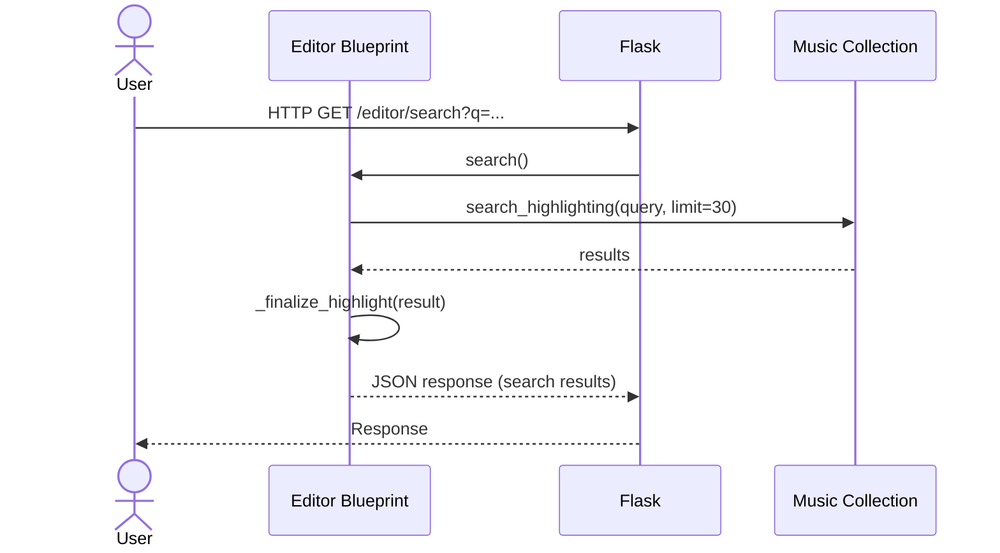
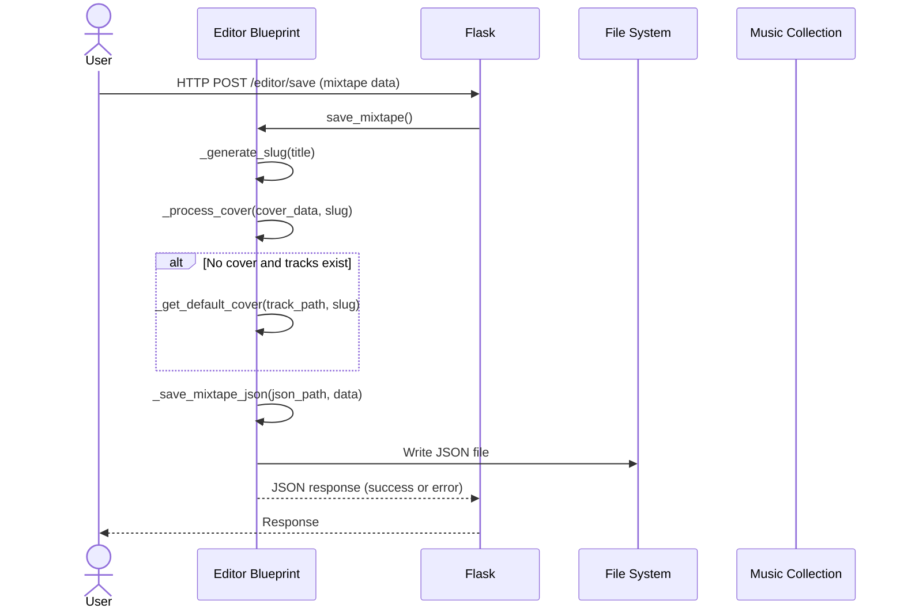
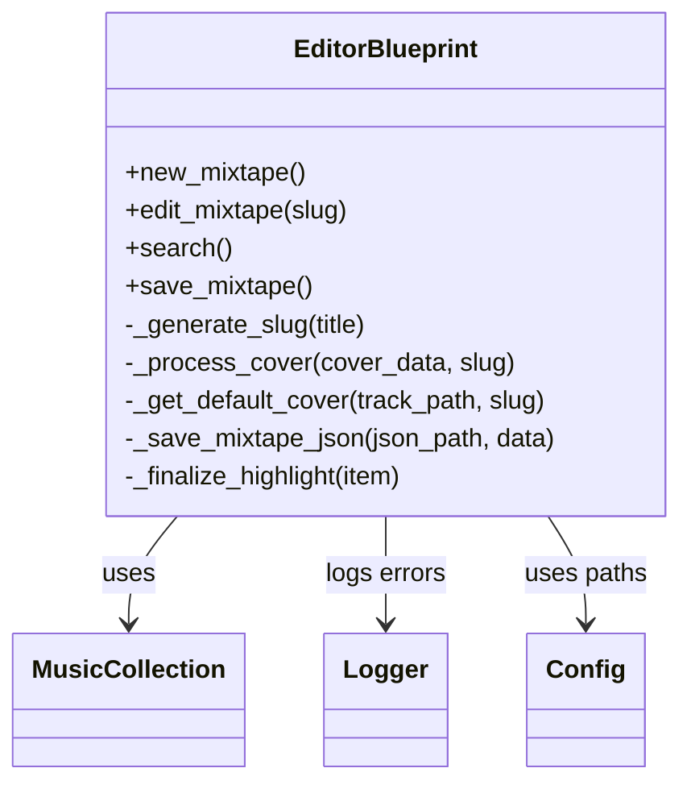

{ align=right width="90" }

# Mixtape editor

The file `routes/editor.py` acts as the backend interface for the mixtape editor UI, managing the lifecycle of mixtape creation and editing, integrating with the music library, and handling file storage for mixtape data and cover images. It ensures that only authenticated users can access editor functionality. Its primary responsibility is to provide endpoints for creating, editing, searching, and saving mixtapes, including handling cover images and metadata. The file uses authentication, interacts with a music collection, and manages mixtape data as JSON files on disk.

## Sequence diagrams

Searching the music collection via the editor blueprint

Saving a mixtape with the new editor blueprint:

## Key Components

* **Blueprint Definition** (editor): The file registers a Flask Blueprint named "editor" with a URL prefix /editor, grouping all editor-related routes.
* **Route**: `/editor/` (new_mixtape) Renders the page for creating a new mixtape.
* **Route**: `/editor/<slug>` (edit_mixtape) Loads an existing mixtape by its slug, reads its JSON data, and renders the editor page with the mixtape preloaded.
* **Route**: `/editor/search` (search) Accepts a search query, searches the music collection, and returns highlighted results as JSON.
* **Route**: `/editor/save` (save_mixtape) Handles POST requests to save a mixtape. Processes cover images, generates slugs and metadata, and writes the mixtape to a JSON file. Returns a JSON response indicating success or failure.

* **Helper Functions**
    * `_generate_slug(title)`: Creates a unique, URL-safe identifier for each mixtape.
    * `_process_cover(cover_data, slug)`: Decodes and saves a base64-encoded cover image.
    * `_get_default_cover(track_path, slug)`: Attempts to find and copy a default cover image from the track's album directory if no cover is provided.
    * `_save_mixtape_json(json_path, data)`: Serializes and writes mixtape data to a JSON file.
    * `_finalize_highlight(item)`: Placeholder for formatting search result items.
* **Authentication** All routes require authentication via the `@require_auth` decorator.
* **Configuration and Logging**: Uses a central configuration object for paths and a logger for error reporting.

## Class diagram

## API

### ::: src.routes.editor
