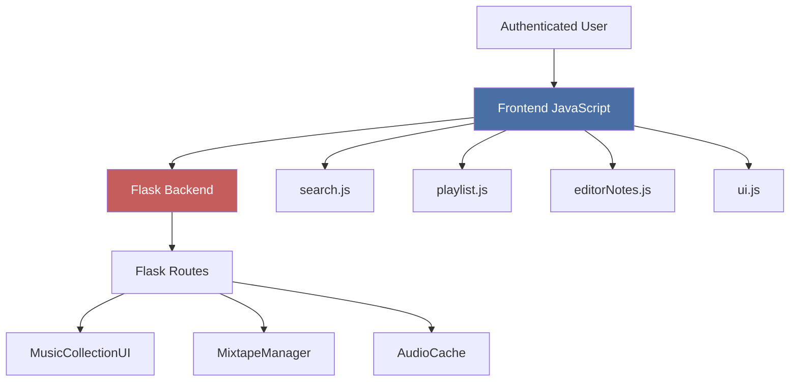
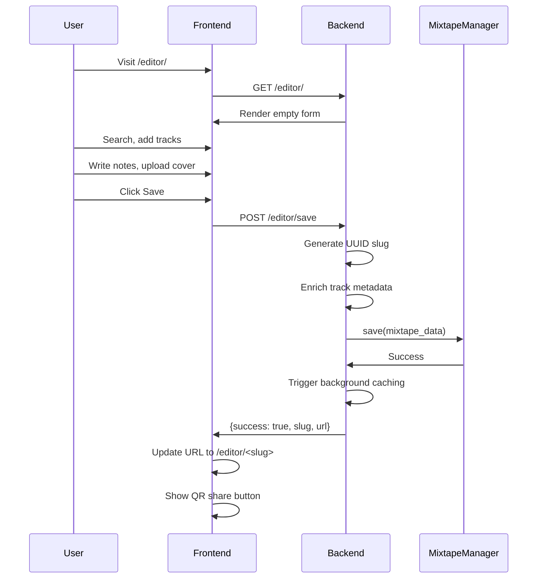
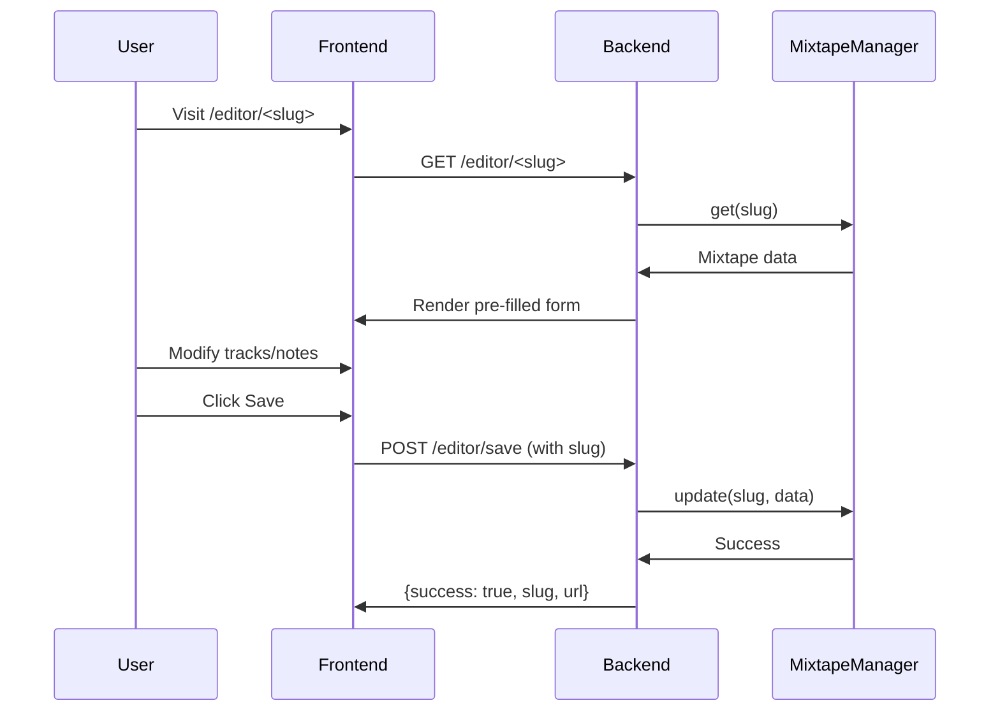

# Mixtape Editor Overview

{ align=right width="90" }

The Mixtape Editor is a full-featured web interface for creating and editing mixtapes. It combines a Flask backend for data persistence with a sophisticated JavaScript frontend for search, playlist management, and rich markdown editing.

---

## 🎯 Purpose

The editor provides authenticated users with tools to:

- **Search and discover** tracks from the music library
- **Build playlists** with drag-and-drop track management
- **Write liner notes** using markdown with track references
- **Design covers** by uploading images or generating composites
- **Share mixtapes** via QR codes
- **Track progress** of background audio caching

All functionality is protected by authentication and persists mixtapes as JSON files on disk.

---

## ✨ Features

| Feature | Description |
|---------|-------------|
| **Library Search** | Full-text search with highlighting powered by SQLite FTS5 |
| **Playlist Management** | Drag-and-drop reordering, preview playback, track removal |
| **Cover Handling** | Upload custom images or generate grid composites from track art |
| **Liner Notes** | Markdown editor (EasyMDE) with track reference syntax (#1, #2-4) |
| **Save/Update** | Creates new mixtapes or updates existing ones with timestamps |
| **QR Code Sharing** | Generate simple QR codes or enhanced versions with cover art |
| **Background Caching** | Automatic audio transcoding with real-time progress updates |
| **Unsaved Changes Detection** | Warns before leaving with unsaved work |

---

## 🏗️ Architecture

### System Overview



### Component Split

**Backend (Flask):**

- Route handlers for all editor operations
- Integration with music library search
- Mixtape data persistence (JSON files)
- Cover image processing and storage
- Background audio caching orchestration

**Frontend (JavaScript):**

- ES6 modules with clear responsibilities
- Real-time search with debouncing
- Drag-and-drop playlist management
- Markdown editor with custom preview
- Progress modal for long operations

---

## 🗺️ Quick Reference

### Flask Routes

| HTTP | URL Pattern | Handler | Purpose |
|------|-------------|---------|---------|
| `GET` | `/editor/` | `new_mixtape()` | Blank editor for new mixtape |
| `GET` | `/editor/<slug>` | `edit_mixtape(slug)` | Load existing mixtape for editing |
| `GET` | `/editor/search?q=` | `search()` | Search library (50 results max) |
| `GET` | `/editor/artist_details?artist=` | `artist_details()` | Get artist's albums |
| `GET` | `/editor/album_details?release_dir=` | `album_details()` | Get album's tracks |
| `POST` | `/editor/save` | `save_mixtape()` | Create or update mixtape |
| `GET` | `/editor/progress/<slug>` | `progress_stream(slug)` | SSE progress updates |
| `POST` | `/editor/generate_composite` | `generate_composite()` | Create cover from track art |

See: [Backend API Documentation](backend-api.md)

### JavaScript Modules

| Module | Responsibility |
|--------|---------------|
| `index.js` | Page initialization and bootstrapping |
| `search.js` | Debounced search, results rendering |
| `playlist.js` | Playlist state, drag-and-drop, track management |
| `editorNotes.js` | EasyMDE integration, track references |
| `ui.js` | Cover upload, save button, unsaved changes |
| `progressModal.js` | SSE connection, progress display |
| `utils.js` | Helper functions, HTML escaping, dialogs |

See: [Frontend Modules Documentation](frontend-modules.md)

---

## 🔄 Data Flow

### Creating a New Mixtape



### Editing an Existing Mixtape



---

## 🎨 UI Layout

### Main Components

```
┌─────────────────────────────────────────────────────────┐
│ Header: "Create Mixtape" or "Edit: Title"              │
├─────────────────────────────────────────────────────────┤
│ Search Bar: [🔍 Search library...] [ℹ️] [⟳]           │
├─────────────────────────────────────────────────────────┤
│                                                         │
│  ┌──────────────────┐  ┌──────────────────────────┐   │
│  │ Library Results  │  │ My Mixtape               │   │
│  │                  │  │                          │   │
│  │ • Artists        │  │ [Cover Image]            │   │
│  │ • Albums         │  │                          │   │
│  │ • Tracks         │  │ Title: [____________]    │   │
│  │                  │  │                          │   │
│  │ [Add buttons]    │  │ Tabs: [Tracks|Notes]    │   │
│  │                  │  │                          │   │
│  │ [Load more...]   │  │ 1. Track one             │   │
│  │                  │  │ 2. Track two             │   │
│  │                  │  │ 3. Track three           │   │
│  │                  │  │                          │   │
│  └──────────────────┘  │ [Clear Playlist]         │   │
│                        └──────────────────────────┘   │
│                                                         │
├─────────────────────────────────────────────────────────┤
│ Bottom Player: [▶️ Now Playing: Track • Artist]        │
└─────────────────────────────────────────────────────────┘
│ Floating: [💾 Save] [🎵 Tracks]  (mobile only)        │
└─────────────────────────────────────────────────────────┘
```

### Modals

- **Cover Options** - Upload image or generate composite
- **Progress Modal** - Background caching progress with log
- **QR Share Modal** - Display and download QR codes
- **Generic Alerts/Confirms** - User confirmations

---

## 🚀 Quick Start Guide

### For Backend Developers

**Understanding the API:**

1. Read [Backend API Documentation](backend-api.md)
2. Focus on route handlers section
3. Review API contracts (JSON schemas)
4. Check authentication requirements

**Common tasks:**

- Adding new search filters → Modify `search()` handler
- Changing save logic → Update `save_mixtape()`
- New metadata fields → Update JSON schema

### For Frontend Developers

**Understanding the modules:**

1. Read [Frontend Modules Documentation](frontend-modules.md)
2. Understand module relationships
3. Review state management (playlist array)
4. Check event flow diagrams

**Common tasks:**

- Adding UI feature → Extend `ui.js`
- Changing search behavior → Modify `search.js`
- Playlist customization → Update `playlist.js`

### For Both

**Full feature development:**

1. Design data flow (frontend → backend → storage)
2. Update API contract [backend](backend-api.md)
3. Implement backend route handler
4. Create/modify frontend module
5. Update both documentation pages

---

## 🔧 Common Development Tasks

### Adding a New Metadata Field

**Backend:**

```python
# In save_mixtape()
mixtape_data = {
    'title': data.get('title'),
    'new_field': data.get('new_field'),  # Add here
    # ... rest
}
```

**Frontend:**

```javascript
// In ui.js saveMixtape()
const payload = {
    title: titleInput.value,
    new_field: newFieldInput.value,  // Add here
    // ... rest
};
```

### Extending Search Results

**Backend:**

```python
# In search()
results = collection.search_highlighting(query, limit=50)
# Process results to add new fields
return jsonify(results)
```

**Frontend:**

```javascript
// In search.js renderResults()
results.forEach(result => {
    // Add new rendering logic
});
```

### Adding Progress Tracking

**Backend:**

```python
# In any long operation
tracker = audio_cache.get_progress_tracker(slug)
tracker.update(step='processing', current=5, total=10)
```

**Frontend:**

```javascript
// Progress modal automatically picks up SSE events
showProgressModal(slug);
```

---

## 📚 Detailed Documentation

### Backend Development

**[Backend API Documentation](backend-api.md)**

Complete guide to Flask routes, server-side logic, and API contracts:

- Route handlers and authentication
- Data flow for create/edit/save operations
- Helper functions and utilities
- JSON schemas for requests/responses
- Progress streaming (SSE)
- Cover generation
- Error handling
- Testing

### Frontend Development

**[Frontend Modules Documentation](frontend-modules.md)**

Complete guide to JavaScript architecture and modules:

- ES6 module structure
- Module responsibilities and relationships
- Search implementation
- Playlist management and drag-and-drop
- Markdown editor integration
- UI interactions and state management
- Progress modal and SSE connection
- Helper utilities

---

## 🧪 Testing

### Backend Testing

```bash
# Test new mixtape creation
curl http://localhost:5000/editor/

# Test search
curl "http://localhost:5000/editor/search?q=beatles"

# Test save (requires auth cookie)
curl -X POST http://localhost:5000/editor/save \
  -H "Content-Type: application/json" \
  -d '{"title":"Test","tracks":[]}'
```

### Frontend Testing

**Manual testing:**

1. Open `/editor/` in browser
2. Search for tracks
3. Add to playlist
4. Drag to reorder
5. Save mixtape
6. Verify progress modal appears

**Console debugging:**

```javascript
// Check playlist state
console.log(playlist);

// Monitor search
window.addEventListener('search:results', (e) => {
    console.log('Search results:', e.detail);
});
```

---

## 🔗 Related Documentation

### Core Systems

- **[Music Library](../../musiclib/intro.md)** - Search and metadata extraction
- **[Mixtape Manager](../../mixtape_manager.md)** - JSON file persistence
- **[Audio Caching](../../audio_caching.md)** - Background transcoding
- **[Cover Art System](../../cover-art/overview.md)** - Image processing

### Routes

- **[Browser Routes](../browse_mixtapes.md)** - Public mixtape browsing
- **[Playback Routes](../play/index.md)** - Audio streaming
- **[QR Code Routes](../qr_codes.md)** - QR generation

### Frontend

- **[Player Controls](../../player/playerControls.md)** - Preview playback
- **[PWA Features](../../pwa/pwa.md)** - Progressive web app

---

## 🎓 Learning Path

**New to the editor?**

1. **Start here** - This overview (you are here)
2. **Backend focus** - Read [Backend API](backend-api.md)
3. **Frontend focus** - Read [Frontend Modules](frontend-modules.md)
4. **Hands-on** - Create a test mixtape
5. **Deep dive** - Explore related systems

**Adding a feature?**

1. **Design** - Plan data flow (frontend → backend → storage)
2. **Backend** - Implement route handler (see [Backend API](backend-api.md))
3. **Frontend** - Update or create module (see [Frontend Modules](frontend-modules.md))
4. **Test** - Manual testing + console debugging
5. **Document** - Update both documentation pages

---

*The editor is the creative heart of Mixtape Society. For implementation details, see the Backend API and Frontend Modules documentation linked above.*
