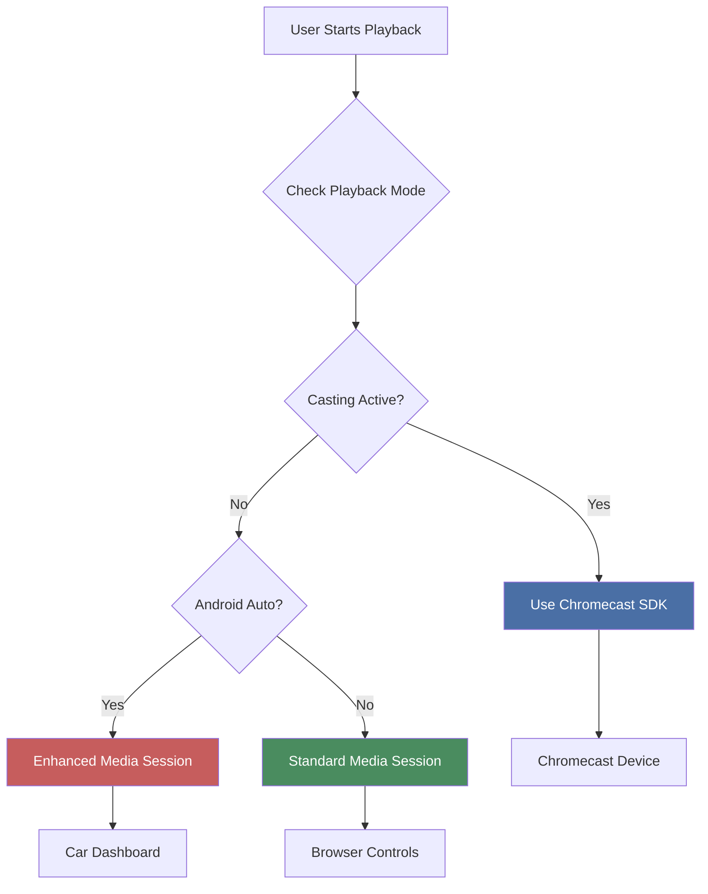
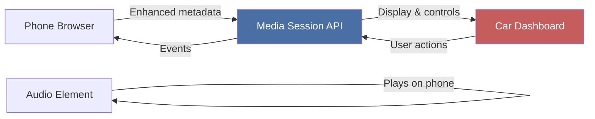

# Media Playback Integration

{ align=right width="90" }

> Part of [Playback Routes](index.md)

This page provides an overview of how the playback routes support different media playback technologies (local playback, Chromecast, Android Auto, AirPlay) and how they coordinate with each other.

---

## 🎯 Overview

Mixtape Society supports multiple playback methods to enable flexible listening experiences across different devices and contexts. The playback routes serve as the common backend for all these technologies.

---

## 📊 Playback Technologies

### Technology Comparison

| Technology | Type | Use Case | Server Requirements | Complexity |
| ---------- | ---- | -------- | ------------------- | ---------- |
| **Local Playback** | Standard HTML5 | Desktop, mobile browsers | Audio streaming | Low |
| **Chromecast** | Network casting | TVs, speakers | CORS + Range requests | High |
| **Android Auto** | Enhanced local | In-car dashboard | Cover optimization | Medium |
| **AirPlay** | Native iOS | Apple devices | Standard streaming | Low |

### When Each is Used



---

## 🔊 Local Playback

### Overview

Standard HTML5 audio playback in the browser.

**How it works:**

1. Browser requests audio file: `GET /play/path?quality=medium`
2. Server validates and serves file (200 or 206)
3. HTML5 `<audio>` element plays file
4. Media Session API provides lock screen controls

**Server requirements:**

- ✅ Audio streaming ([Audio Streaming](audio-streaming.md))
- ✅ Quality parameter ([Quality & Caching](quality-caching.md))
- ✅ Range requests optional ([Range Requests](range-requests.md))

**Frontend:**

- `playerControls.js` - Playback orchestration
- `playerUtils.js` - Media Session setup

### Advantages

- ✅ No setup required
- ✅ Works on all modern browsers
- ✅ Simple implementation
- ✅ No network complexity

### Limitations

- ❌ Single device only
- ❌ Basic UI controls
- ❌ Limited metadata display

---

## 📡 Chromecast

### Overview

Network-based casting to TVs and speakers. Browser acts as remote control while audio streams directly from server to Chromecast device.

**Architecture:**


**How it works:**

1. User clicks cast button
2. Browser sends queue to Chromecast via Cast SDK
3. Chromecast requests each track from server
4. Server streams audio with CORS headers
5. Browser controls playback via Cast SDK

**Server requirements:**

- ✅ CORS headers: `Access-Control-Allow-Origin: *`
- ✅ Range request support (required for seeking)
- ✅ Quality parameter support
- ✅ Proper MIME types

**Critical headers:**

```python
response.headers["Access-Control-Allow-Origin"] = "*"
response.headers["Access-Control-Expose-Headers"] = \
    "Content-Type, Accept-Encoding, Range"
response.headers["Accept-Ranges"] = "bytes"
```

See: [Chromecast Integration](../../chromecast/integration.md)

### Advantages

- ✅ Cast to multiple devices
- ✅ High-quality audio
- ✅ Works across home network
- ✅ Unified controls (lock screen, browser, TV remote)

### Limitations

- ❌ Requires Cast-enabled device
- ❌ Same WiFi network required
- ❌ More complex setup
- ❌ iOS has limited support

---

## 🚗 Android Auto

### Overview

Enhanced local playback with in-car dashboard integration. Audio plays on phone while controls and metadata display on car dashboard.

**Architecture:**



**How it works:**

1. Android Auto detected when phone connects to car
2. Enhanced Media Session setup with position state
3. Requests multiple cover art sizes (96x96 to 512x512)
4. Dashboard displays track info and controls
5. Steering wheel buttons/voice commands control playback

**Server requirements:**

- ✅ Cover art size optimization (5 sizes: 96, 128, 192, 256, 512)
- ✅ Standard audio streaming
- ❌ No CORS headers needed (local playback)
- ❌ No range requests needed (standard seeking)

**Key difference from Chromecast:**

| Aspect | Chromecast | Android Auto |
| ------ | --------- | ------------ |
| Network | WiFi casting | Local playback |
| Server Load | Direct stream to device | Stream to phone |
| CORS | Required | Not required |
| Range Requests | Required | Optional |
| Artwork | 1 size | 5 sizes |
| Complexity | High (SDK + server) | Medium (Media Session only) |

See: [Android Auto Integration](../../android-auto/integration-overview.md)

### Advantages

- ✅ Automatic connection (no user action)
- ✅ Safe driving interface
- ✅ Voice command support
- ✅ Steering wheel controls
- ✅ Dashboard display

### Limitations

- ❌ Android Auto car/device required
- ❌ Only works in car
- ❌ Single user (driver)

---

## 🍎 AirPlay

### Overview

Native iOS casting to AirPlay-enabled devices.

**How it works:**

1. Safari detects AirPlay-enabled devices
2. User taps AirPlay icon in audio controls
3. iOS handles streaming to AirPlay device
4. Standard playback routes serve audio

**Server requirements:**

- ✅ Standard audio streaming
- ✅ Quality parameter
- ❌ No special CORS requirements (handled by iOS)
- ❌ No range request requirements

### Advantages

- ✅ Native iOS integration
- ✅ Works with HomePod, Apple TV, AirPlay speakers
- ✅ Multi-room audio (AirPlay 2)
- ✅ Simple implementation (iOS handles everything)

### Limitations

- ❌ iOS/macOS only
- ❌ AirPlay-enabled device required
- ❌ Same network required

---

## 🔄 Mode Coordination

### Player Controls Routing

The `playerControls.js` module coordinates between playback modes:

```javascript
function playTrack(index) {
    // 1. Check if currently casting
    if (globalCastingState) {
        console.log('🎭 Routing to Chromecast');
        castJumpToTrack(index);
        return;
    }

    console.log('🔊 Playing locally');

    // 2. Local playback
    const track = trackItems[index];
    player.src = `/play/${track.dataset.path}?quality=medium`;
    player.play();

    // 3. Setup Media Session based on platform
    const metadata = extractMetadataFromDOM(track);

    if (isAndroidAutoConnected()) {
        // Enhanced Media Session for Android Auto
        setupAndroidAutoMediaSession(metadata, playerControls, player);
    } else {
        // Standard Media Session (iOS, Desktop)
        setupLocalMediaSession(metadata, playerControls);
    }
}
```

**Priority order:**

1. **Chromecast** (highest priority)
   - If casting is active, all commands route to Cast SDK
   - Local player is silenced

2. **Android Auto** (medium priority)
   - If detected and not casting
   - Enhanced Media Session with position state

3. **Standard Playback** (fallback)
   - Default for iOS, Desktop
   - Basic Media Session

### Mode Switching

**Chromecast Start:**

```javascript
function onCastSessionStart() {
    silenceLocalPlayer();      // Pause and mute local <audio>
    clearMediaSession();       // Remove local handlers
    updateMediaSessionForCast(); // Set Cast handlers
    globalCastingState = true;
}
```

**Chromecast Stop:**

```javascript
function onCastSessionEnd() {
    enableLocalPlayer();       // Restore local <audio>
    globalCastingState = false;

    // Restore appropriate Media Session
    if (isAndroidAutoConnected()) {
        setupAndroidAutoMediaSession(...);
    } else {
        setupLocalMediaSession(...);
    }
}
```

---

## 🎛️ Quality Parameter Usage

All playback modes respect the quality parameter:

### By Mode

| Mode | Quality Usage | Reason |
| ---- | ------------ | ------ |
| **Chromecast** | Always uses quality param | Network bandwidth optimization |
| **Android Auto** | Uses quality param | Car data connection limits |
| **Desktop** | Uses quality param | User preference |
| **Mobile (WiFi)** | Uses quality param | Battery and bandwidth |
| **Mobile (Cellular)** | Defaults to `low` | Data usage minimization |

### URL Construction

**Frontend (playerControls.js):**

```javascript
const currentQuality = localStorage.getItem('audioQuality') || 'medium';
const url = `/play/${track.path}?quality=${currentQuality}`;
```

**Chromecast (chromecast.js):**

```javascript
const mediaInfo = new chrome.cast.media.MediaInfo(
    `${baseUrl}/play/${track.file_path}?quality=medium`,
    'audio/mpeg'
);
```

See: [Quality & Caching](quality-caching.md)

---

## 🛠️ Server Requirements Summary

### Required for All Modes

```python
@play.route("/play/<path:file_path>")
def stream_audio(file_path):
    # ✅ Path validation
    full_path = _resolve_and_validate_path(file_path)

    # ✅ MIME type detection
    mime_type = _guess_mime_type(full_path)

    # ✅ Quality-aware caching
    quality = request.args.get("quality", "medium")
    serve_path = _get_serving_path(full_path, quality)

    # ✅ Serve file
    return send_file(serve_path, mimetype=mime_type)
```

### Additional for Chromecast

```python
    # ✅ CORS headers
    response.headers["Access-Control-Allow-Origin"] = "*"
    response.headers["Access-Control-Expose-Headers"] = \
        "Content-Type, Accept-Encoding, Range"

    # ✅ Range request handling
    if request.headers.get("Range"):
        return _handle_range_request(serve_path, mime_type)
```

### Additional for Android Auto

```python
# ✅ Cover art optimization (separate route)
@play.route("/covers/<slug>_<size>.jpg")
def serve_sized_cover(slug, size):
    # Returns optimized cover at requested size
    # Sizes: 96x96, 128x128, 192x192, 256x256, 512x512
    pass
```

---

## 📊 Use Case Recommendations

### Scenario-Based Recommendations

| Scenario | Recommended Method | Why |
| -------- | ----------------- | --- |
| **Living room TV** | Chromecast | Large screen, shared listening |
| **Car dashboard** | Android Auto | Automatic, safe driving UI |
| **Personal listening** | Standard | Simple, no setup |
| **Multi-room audio** | Chromecast | Cast to multiple devices |
| **Offline/low bandwidth** | Standard (cached) | No network needed |
| **Party/gathering** | Chromecast | Share control via QR code |
| **Work/background** | Standard | Desktop browser |
| **iOS user with HomePod** | AirPlay | Native iOS integration |

---

## 🔗 Detailed Documentation

For complete implementation details, see:

### Casting Technologies

- **[Chromecast Integration](../../chromecast/integration.md)** - Complete Cast SDK guide
  - SDK setup and initialization
  - Queue management
  - Media Session synchronization
  - CORS and range request requirements
  - Platform-specific guidance
  - Troubleshooting

- **[Android Auto Overview](../../android-auto/integration-overview.md)** - Enhanced Media Session guide
  - Architecture and detection
  - Enhanced Media Session setup
  - Artwork optimization (5 sizes)
  - Position state management
  - Testing procedures

### Frontend Integration

- **[Player Controls](../play/modules/playerControls.md)** - Playback orchestration
  - Mode coordination logic
  - Casting state management
  - Quality selector
  - Event handling

- **[Player Utilities](../play/modules/playerUtils.md)** - Shared utilities
  - Device detection
  - Media Session management
  - Player state control
  - Metadata extraction

### Backend Services

- **[Audio Streaming](audio-streaming.md)** - Core streaming implementation
- **[Range Requests](range-requests.md)** - Partial content support
- **[Quality & Caching](quality-caching.md)** - Quality management
- **[Cover Art System](../../cover-art/overview.md)** - Image optimization

---

## 🎓 For Developers

### Adding a New Playback Mode

**Steps:**

1. **Detect the new mode**

   ```javascript
   // In playerUtils.js
   export function detectNewMode() {
       // Detection logic
       return { isNewMode: true, ... };
   }
   ```

2. **Add mode check in playerControls**

   ```javascript
   if (globalCastingState) {
       // Chromecast
   } else if (isAndroidAutoConnected()) {
       // Android Auto
   } else if (isNewMode()) {
       // New mode
   } else {
       // Standard
   }
   ```

3. **Implement mode-specific setup**

   ```javascript
   // In newMode.js
   export function setupNewMode(metadata, controls) {
       // Mode-specific initialization
   }
   ```

4. **Update server if needed**

   ```python
   # Add any required headers or endpoints
   ```

### Debugging Playback Issues

**Check in this order:**

1. **Mode detection**

   ```javascript
   console.log('Casting:', globalCastingState);
   console.log('Android Auto:', isAndroidAutoConnected());
   ```

2. **Network requests**
   - Open DevTools → Network tab
   - Look for 200/206 responses
   - Check CORS headers

3. **Server logs**

   ```bash
   tail -f logs/app.log | grep "Streaming"
   ```

4. **Media Session**

   ```javascript
   // Check if active
   console.log('Media Session:', navigator.mediaSession.metadata);
   ```

---

*This overview connects all playback technologies. For implementation details, see the linked documentation.*
