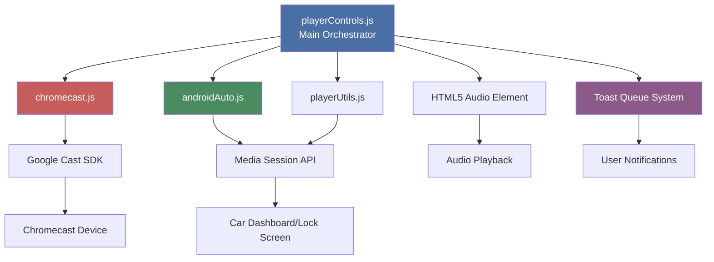
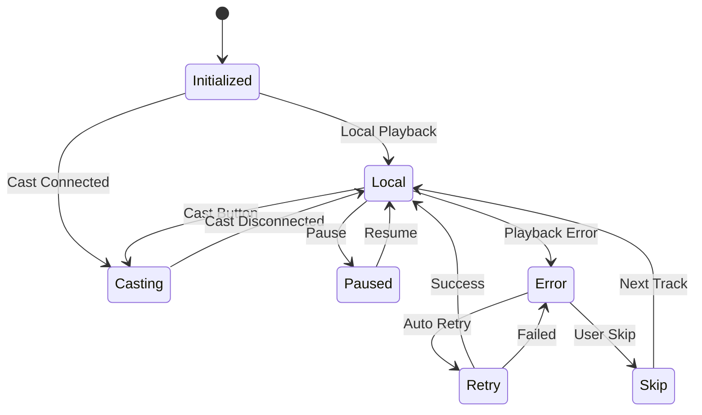

# Player Controls - Complete Documentation

{ align=right width="90" }

The `playerControls.js` module is the central orchestration layer for all playback controls in Mixtape Society. It coordinates between local playback, Chromecast casting, and Android Auto integration, ensuring a unified user experience across all playback modes.

---

## 🎯 Purpose

**Primary Responsibilities:**

- Coordinate playback across multiple modes (local, Chromecast, Android Auto)
- Manage track selection and queue navigation with shuffle and repeat modes
- Handle quality settings and preferences
- Synchronize UI state across all controls
- Route user actions to appropriate playback system
- Prevent conflicting playback states
- Provide non-blocking notifications via toast queue system
- Manage playback state persistence (resume on reload)
- Handle errors gracefully with recovery options
- Maintain wake lock during playback to prevent app suspension
- Ensure seamless auto-advance on mobile devices with autoplay restrictions

**Key Design Principle:**
Single source of truth for playback state that routes to the appropriate backend (local player, Cast SDK, or Media Session API).

---

## 🏗️ Architecture

### Component Relationships



### State Flow



---

## 🚀 Initialization

### Entry Point

```javascript
export function initPlayerControls() {
    // Initialization sequence:
    // 1. Get DOM elements
    // 2. Restore shuffle state
    // 3. Restore repeat mode (with context normalization)
    // 4. Initialize quality selector
    // 5. Set up event listeners
    // 6. Restore playback state (if available)
    // 7. Initialize casting
    // 8. Set up Media Session
}
```

### Initialization Steps

1. **DOM Element Acquisition**

   ```javascript
   const player = document.getElementById('main-player');
   const trackItems = document.querySelectorAll('.track-item');
   ```

2. **State Restoration**

   ```javascript
   restoreShuffleState();  // From localStorage
   restoreRepeatMode();    // With context validation
   ```

3. **Playback State Recovery**

   ```javascript
   restorePlaybackState();  // Resume from last session
   ```

4. **Event Listener Setup**

   ```javascript
   initEventListeners();  // All player and UI events
   ```

5. **Platform Detection**

   ```javascript
   const iOS = detectiOS();
   const androidInfo = detectAndroid();
   ```

---

## 🎮 Core Functions

### playTrack(index, isAutoAdvance = false)

**Purpose:** Primary function to start playback of a track.

**Parameters:**

- `index` - Track index to play
- `isAutoAdvance` - (Optional) True if this is an automatic track transition (not user-initiated)

**Behavior:**

- Routes to Chromecast if casting
- Updates UI to show active track
- Handles quality selection
- Prefetches next track when ready
- Saves playback state
- Uses enhanced mobile auto-advance strategy when `isAutoAdvance=true`

**Auto-Advance Strategy:**

When a track ends naturally on mobile devices, browsers may block the next track from auto-playing due to autoplay policies. The `isAutoAdvance` parameter enables special handling:

1. **Preload metadata** - Calls `player.load()` before attempting play
2. **Robust retry logic** - If initial play fails, attempts recovery via Media Session API
3. **Delayed retry** - Waits 100ms and retries if blocked by browser
4. **Media Session state sync** - Updates `playbackState` to 'playing' to enable notification controls

```javascript
const playTrack = (index, isAutoAdvance = false) => {
    if (checkCastingState()) {
        // Route to Chromecast
        castJumpToTrack(index);
        return;
    }

    // Local playback
    const track = trackItems[index];
    const audioUrl = buildAudioUrl(track.dataset.path, currentQuality);

    player.src = audioUrl;
    updateUIForTrack(index);

    const metadata = extractMetadataFromDOM(track);
    updateLocalMediaSession(metadata);

    // Enhanced mobile auto-advance handling
    if (isAutoAdvance) {
        console.log('📱 Auto-advance mode: using enhanced playback strategy');

        player.load(); // Ensure metadata ready

        player.play()
            .then(() => {
                console.log('✅ Auto-advance play successful');
            })
            .catch(e => {
                console.warn('⚠️ Auto-advance blocked:', e.message);

                // Fallback via Media Session
                if ('mediaSession' in navigator) {
                    navigator.mediaSession.playbackState = 'playing';

                    setTimeout(() => {
                        player.play().catch(err => {
                            console.error('❌ Second play attempt failed:', err.message);
                        });
                    }, 100);
                }
            });
    } else {
        // Manual track changes (user-initiated)
        player.play().catch(err => {
            console.error('❌ Playback failed:', err);
            showErrorToast(`Unable to play track`, {
                actions: [
                    {
                        label: 'Skip Track',
                        handler: () => playTrack(getNextTrackWithRepeat(index)),
                        primary: true
                    }
                ]
            });
        });
    }

    // Prefetch next track
    prefetchNextTrack(index);
};
```

**Error Handling:**

- Retries up to 2 times automatically
- Shows non-blocking error toast
- Provides "Skip Track" action button
- Saves state before handling error
- Special handling for mobile auto-advance failures (via Media Session API)

---

## 🎵 Playback Modes

### Shuffle Mode

**Purpose:** Randomize playback order

**Implementation:**

```javascript
const toggleShuffle = () => {
    isShuffled = !isShuffled;

    if (isShuffled) {
        shuffleOrder = generateShuffleOrder();
        showInfoToast('Shuffle enabled');
    } else {
        showInfoToast('Shuffle disabled');
    }

    updateShuffleButton();
    saveShuffleState();
};
```

**Key Features:**

- Fisher-Yates shuffle algorithm
- Preserves current track
- Persistent across sessions
- Works with repeat modes

**Shuffle Order Generation:**

```javascript
const generateShuffleOrder = () => {
    const order = Array.from({ length: trackItems.length }, (_, i) => i);

    // Fisher-Yates shuffle
    for (let i = order.length - 1; i > 0; i--) {
        const j = Math.floor(Math.random() * (i + 1));
        [order[i], order[j]] = [order[j], order[i]];
    }

    return order;
};
```

### Repeat Mode

**Purpose:** Control playlist looping behavior

**Modes:**

- **🔁 Repeat Off** - Play once, stop at end
- **🔁 Repeat All** - Loop entire playlist
- **🔁₁ Repeat One** - Loop current track

**Implementation:**

```javascript
const cycleRepeatMode = () => {
    const modes = Object.values(REPEAT_MODES);
    const currentIdx = modes.indexOf(repeatMode);
    const nextIdx = (currentIdx + 1) % modes.length;

    repeatMode = modes[nextIdx];
    updateRepeatButton();
    saveRepeatMode();

    showInfoToast(REPEAT_MODE_LABELS[repeatMode]);
};
```

**Normalization Logic:**

```javascript
const normalizeRepeatMode = () => {
    // Auto-correct repeat mode based on available tracks
    if (trackItems.length <= 1) {
        repeatMode = REPEAT_MODES.OFF;
        console.log('🔁 Normalized repeat to OFF (0-1 tracks)');
    }
};
```

---

## 📱 Toast Notifications

Player controls use the toast system for user feedback. See **[Toast System Reference](toast_system.md)** for complete documentation on toast types, options, and advanced usage.

### Player-Specific Usage

```javascript
import {
    showSuccessToast,
    showInfoToast,
    showWarningToast,
    showErrorToast,
    showPlaybackErrorToast
} from './common/toastSystem.js';

// Playback errors with skip functionality
showPlaybackErrorToast('Cannot play track', {
    isTerminal: true,
    onSkip: () => skipToNext()
});

// Mode changes
showInfoToast('Shuffle enabled');
showInfoToast('Repeat All');

// Success feedback
showSuccessToast('Quality changed to High');

// Network/loading issues
showWarningToast('Slow connection detected');

// Critical errors
showErrorToast('Failed to load track', {
    actions: [
        {
            label: 'Retry',
            handler: () => retryLoad(),
            primary: true
        }
    ]
});
```

### Common Player Toast Scenarios

| Scenario | Toast Type | Example |
| -------- | ---------- | ------- |
| Track changes | `showInfoToast()` | "Now playing: Track Name" |
| Playback errors | `showPlaybackErrorToast()` | "Cannot play track" with Skip button |
| Mode toggles | `showInfoToast()` | "Shuffle enabled", "Repeat One" |
| Quality changes | `showSuccessToast()` | "Quality changed to High" |
| Network issues | `showWarningToast()` | "Slow connection detected" |
| Critical failures | `showErrorToast()` | "Failed to load" with Retry button |

### Error Handling Pattern

```javascript
const loadTrack = async (index) => {
    try {
        await playTrack(index);
    } catch (err) {
        showPlaybackErrorToast('Unable to play track', {
            isTerminal: true,
            onSkip: () => {
                const nextIdx = getNextTrackWithRepeat(index);
                if (nextIdx >= 0) playTrack(nextIdx);
            }
        });
    }
};
```

---

## 🎨 UI State Management

### Active Track Highlighting

**Purpose:** Visual feedback for currently playing track

**Implementation:**

```javascript
const updateUIForTrack = (index) => {
    // Remove previous highlight
    document.querySelectorAll('.track-item').forEach(item => {
        item.classList.remove('active', 'highlight');
    });

    // Add new highlight
    const track = trackItems[index];
    track.classList.add('active', 'highlight');

    // Auto-remove highlight after delay
    setTimeout(() => {
        track.classList.remove('highlight');
    }, TIMING.HIGHLIGHT_DURATION);

    // Scroll into view
    track.scrollIntoView({ behavior: 'smooth', block: 'center' });
};
```

### Button States

**Shuffle Button:**

```javascript
const updateShuffleButton = () => {
    shuffleBtn.classList.toggle('active', isShuffled);
    shuffleBtn.setAttribute('aria-pressed', isShuffled);
};
```

**Repeat Button:**

```javascript
const updateRepeatButton = () => {
    const icon = repeatBtn.querySelector('i');
    icon.className = REPEAT_MODE_ICONS[repeatMode];

    repeatBtn.classList.toggle('active', repeatMode !== REPEAT_MODES.OFF);
    repeatBtn.setAttribute('aria-label', REPEAT_MODE_LABELS[repeatMode]);
};
```

**Play/Pause Button:**

```javascript
const updatePlayPauseButton = (isPlaying) => {
    const icon = playPauseBtn.querySelector('i');

    if (isPlaying) {
        icon.classList.remove('bi-play-fill');
        icon.classList.add('bi-pause-fill');
        playPauseBtn.setAttribute('aria-label', 'Pause');
    } else {
        icon.classList.remove('bi-pause-fill');
        icon.classList.add('bi-play-fill');
        playPauseBtn.setAttribute('aria-label', 'Play');
    }
};
```

---

## ⚙️ Quality Management

### Quality Selector

**Purpose:** Allow user to choose audio quality

**Available Qualities:**

- **High** - Original quality
- **Medium** - Balanced quality/size
- **Low** - Fastest streaming

**Implementation:**

```javascript
const changeQuality = (newQuality) => {
    if (newQuality === currentQuality) return;

    const wasPlaying = !player.paused;
    const currentTime = player.currentTime;

    currentQuality = newQuality;
    saveQuality();

    // If playing, reload at new quality
    if (currentIndex >= 0) {
        const track = trackItems[currentIndex];
        const audioUrl = buildAudioUrl(track.dataset.path, currentQuality);

        player.src = audioUrl;
        player.currentTime = currentTime;

        if (wasPlaying) {
            setTimeout(() => {
                player.play();
            }, TIMING.PLAYBACK_RESUME_DELAY);
        }
    }

    updateQualitySelector();
    showSuccessToast(`Quality changed to ${capitalizeFirst(newQuality)}`);
};
```

**Persistence:**

```javascript
const saveQuality = () => {
    try {
        localStorage.setItem('playerQuality', currentQuality);
    } catch (e) {
        console.warn('Failed to save quality:', e);
    }
};

const restoreQuality = () => {
    try {
        const saved = localStorage.getItem('playerQuality');
        if (saved) currentQuality = saved;
    } catch (e) {
        console.warn('Failed to restore quality:', e);
    }
};
```

---

## 💾 State Persistence

### Playback State

**Purpose:** Resume playback after page reload

**Saved State:**

```javascript
const state = {
    index: currentIndex,
    time: player.currentTime,
    isPlaying: !player.paused,
    timestamp: Date.now(),
    context: getCurrentContext()  // 'album', 'artist', etc.
};
```

**Save Trigger:**

- Every 5 seconds during playback (auto-save)
- When track changes
- When pausing
- When stopping

**Restoration Logic:**

```javascript
const restorePlaybackState = () => {
    try {
        const saved = localStorage.getItem('playbackState');
        if (!saved) return;

        const state = JSON.parse(saved);

        // Validate timestamp (within 24 hours)
        const age = Date.now() - state.timestamp;
        if (age > 24 * 60 * 60 * 1000) {
            console.log('State too old, ignoring');
            return;
        }

        // Validate context matches
        if (state.context !== getCurrentContext()) {
            console.log('Context changed, ignoring state');
            return;
        }

        // Restore position
        currentIndex = state.index;
        player.src = buildAudioUrl(trackItems[state.index].dataset.path, currentQuality);
        player.currentTime = state.time;

        updateUIForTrack(state.index);

        // Resume if was playing
        if (state.isPlaying) {
            setTimeout(() => {
                player.play();
            }, TIMING.UI_RESTORE_DELAY);
        }

        console.log('✅ Playback state restored');
    } catch (e) {
        console.warn('Failed to restore state:', e);
    }
};
```

---

## 🔄 Track Navigation

### Next Track Logic

**Purpose:** Determine next track respecting shuffle and repeat modes

**Implementation:**

```javascript
const getNextTrackWithRepeat = (currentIdx, options = {}) => {
    const { forPrefetch = false } = options;

    // Repeat One: stay on current track
    if (repeatMode === REPEAT_MODES.ONE && !forPrefetch) {
        return currentIdx;
    }

    // Get next index (shuffled or sequential)
    let nextIdx;
    if (isShuffled) {
        const currentShuffleIdx = shuffleOrder.indexOf(currentIdx);
        nextIdx = shuffleOrder[(currentShuffleIdx + 1) % shuffleOrder.length];
    } else {
        nextIdx = currentIdx + 1;
    }

    // Handle end of playlist
    if (nextIdx >= trackItems.length) {
        if (repeatMode === REPEAT_MODES.ALL) {
            return isShuffled ? shuffleOrder[0] : 0;
        }
        return -1; // End of playlist
    }

    return nextIdx;
};
```

### Previous Track Logic

```javascript
const getPreviousTrackWithRepeat = (currentIdx) => {
    // If >3s into track, restart current track
    if (player.currentTime > 3) {
        player.currentTime = 0;
        return currentIdx;
    }

    // Get previous index
    let prevIdx;
    if (isShuffled) {
        const currentShuffleIdx = shuffleOrder.indexOf(currentIdx);
        const prevShuffleIdx = currentShuffleIdx - 1;

        if (prevShuffleIdx < 0) {
            if (repeatMode === REPEAT_MODES.ALL) {
                prevIdx = shuffleOrder[shuffleOrder.length - 1];
            } else {
                return -1;
            }
        } else {
            prevIdx = shuffleOrder[prevShuffleIdx];
        }
    } else {
        prevIdx = currentIdx - 1;

        if (prevIdx < 0) {
            if (repeatMode === REPEAT_MODES.ALL) {
                prevIdx = trackItems.length - 1;
            } else {
                return -1;
            }
        }
    }

    return prevIdx;
};
```

---

## 🚀 Prefetching

### Purpose

Preload next track to enable instant playback when current track ends.

### Implementation

```javascript
const prefetchNextTrack = (currentIdx) => {
    const nextIdx = getNextTrackWithRepeat(currentIdx, { forPrefetch: true });

    if (nextIdx < 0 || nextIdx === currentIdx) {
        console.log('🔄 No track to prefetch');
        return;
    }

    const nextTrack = trackItems[nextIdx];
    const audioUrl = buildAudioUrl(nextTrack.dataset.path, currentQuality);

    // Use requestIdleCallback for low-priority prefetch
    if ('requestIdleCallback' in window) {
        requestIdleCallback(() => {
            fetch(audioUrl, { cache: 'force-cache' })
                .then(() => console.log('✅ Prefetched:', nextTrack.dataset.title))
                .catch(err => console.warn('⚠️ Prefetch failed:', err));
        });
    } else {
        setTimeout(() => {
            fetch(audioUrl, { cache: 'force-cache' })
                .then(() => console.log('✅ Prefetched:', nextTrack.dataset.title))
                .catch(err => console.warn('⚠️ Prefetch failed:', err));
        }, 100);
    }
};
```

### Triggers

- When track starts playing
- When quality changes
- When shuffle/repeat modes change

---

## 🔒 Wake Lock

### Purpose

Prevent device from sleeping during active playback, ensuring uninterrupted listening experience.

### Implementation

```javascript
let wakeLock = null;

const acquireWakeLock = async () => {
    if (!('wakeLock' in navigator)) {
        console.log('⚠️ Wake Lock API not supported');
        return;
    }

    try {
        wakeLock = await navigator.wakeLock.request('screen');
        console.log('🔒 Wake lock acquired');

        wakeLock.addEventListener('release', () => {
            console.log('🔓 Wake lock released');
        });
    } catch (err) {
        console.warn('⚠️ Wake lock failed:', err);
    }
};

const releaseWakeLock = async () => {
    if (wakeLock) {
        await wakeLock.release();
        wakeLock = null;
    }
};
```

### Lifecycle

```javascript
// Acquire on play
player.addEventListener('play', () => {
    if (!checkCastingState()) {
        acquireWakeLock();
    }
});

// Release on pause/stop
player.addEventListener('pause', releaseWakeLock);

// Re-acquire if system releases it
document.addEventListener('visibilitychange', () => {
    if (document.hidden) {
        console.log('📱 Page hidden');
        // Reinforce Media Session
        if ('mediaSession' in navigator && !player.paused) {
            navigator.mediaSession.playbackState = 'playing';
        }
    } else if (!player.paused && !wakeLock) {
        console.log('📱 Page visible - re-acquiring wake lock');
        acquireWakeLock();
    }
});
```

### Browser Support

- Chrome/Edge 84+
- Safari 16.4+
- Firefox: Not supported
- Gracefully degrades if unavailable

---

## 📡 Event Listeners

### Player Events

```javascript
const initEventListeners = () => {
    // Playback events
    player.addEventListener('play', onPlay);
    player.addEventListener('pause', onPause);
    player.addEventListener('ended', onEnded);
    player.addEventListener('timeupdate', onTimeUpdate);
    player.addEventListener('loadedmetadata', onLoadedMetadata);
    player.addEventListener('error', onError);
    player.addEventListener('canplay', onCanPlay);

    // Control events
    playPauseBtn.addEventListener('click', togglePlayPause);
    stopBtn.addEventListener('click', stopPlayback);
    nextBtn.addEventListener('click', () => playerControlsAPI.next());
    prevBtn.addEventListener('click', () => playerControlsAPI.previous());

    // Mode toggles
    shuffleBtn.addEventListener('click', toggleShuffle);
    repeatBtn.addEventListener('click', cycleRepeatMode);

    // Track selection
    trackItems.forEach((track, idx) => {
        track.addEventListener('click', () => playTrack(idx));
    });

    // Quality selector
    qualitySelect.addEventListener('change', (e) => {
        changeQuality(e.target.value);
    });

    // Volume controls
    volumeSlider.addEventListener('input', onVolumeChange);
    muteBtn.addEventListener('click', toggleMute);
};
```

### Event Handlers

```javascript
const onPlay = () => {
    updatePlayPauseButton(true);
    acquireWakeLock();
    startAutoSave();
};

const onPause = () => {
    updatePlayPauseButton(false);
    releaseWakeLock();
    savePlaybackState(); // Save immediately on pause
};

const onEnded = () => {
    const nextIdx = getNextTrackWithRepeat(currentIndex);

    if (nextIdx >= 0) {
        playTrack(nextIdx, true);  // isAutoAdvance = true
    } else {
        stopPlayback();
        showInfoToast('Playlist ended');
    }
};

const onTimeUpdate = () => {
    updateProgressBar();
    updateTimeDisplay();
};

const onError = (e) => {
    console.error('❌ Playback error:', e);

    if (retryCount < MAX_RETRIES) {
        retryCount++;
        console.log(`🔄 Retry ${retryCount}/${MAX_RETRIES}`);

        setTimeout(() => {
            player.load();
            player.play();
        }, 1000);
    } else {
        showPlaybackErrorToast('Cannot play track', {
            isTerminal: true,
            onSkip: () => {
                retryCount = 0;
                const nextIdx = getNextTrackWithRepeat(currentIndex);
                if (nextIdx >= 0) playTrack(nextIdx);
            }
        });
    }
};
```

---

## 🎬 Chromecast Integration

### Detection

```javascript
const checkCastingState = () => {
    return window.castSession && window.castSession.getSessionState() === 'SESSION_STARTED';
};
```

### Routing

**All playback commands route through playerControls first, then delegate to Chromecast if active:**

```javascript
const playTrack = (index, isAutoAdvance = false) => {
    if (checkCastingState()) {
        castJumpToTrack(index);
        return;
    }

    // Local playback logic...
};

const togglePlayPause = () => {
    if (checkCastingState()) {
        castTogglePlayPause();
        return;
    }

    // Local playback logic...
};
```

### State Sync

```javascript
// Chromecast notifies playerControls of state changes
window.addEventListener('cast-state-changed', (e) => {
    const { state, trackIndex } = e.detail;

    currentIndex = trackIndex;
    updateUIForTrack(trackIndex);

    if (state === 'PLAYING') {
        updatePlayPauseButton(true);
    } else {
        updatePlayPauseButton(false);
    }
});
```

---

## 🚗 Android Auto Integration

### Media Session Setup

**Purpose:** Provide controls in car dashboards, lock screens, and notification panels

**Implementation:**

```javascript
const updateLocalMediaSession = (metadata) => {
    if (!('mediaSession' in navigator)) return;

    navigator.mediaSession.metadata = new MediaMetadata({
        title: metadata.title,
        artist: metadata.artist,
        album: metadata.album,
        artwork: [
            { src: metadata.artwork, sizes: '512x512', type: 'image/jpeg' }
        ]
    });

    // Set up action handlers
    navigator.mediaSession.setActionHandler('play', () => {
        player.play();
    });

    navigator.mediaSession.setActionHandler('pause', () => {
        player.pause();
    });

    navigator.mediaSession.setActionHandler('previoustrack', () => {
        playerControlsAPI.previous();
    });

    navigator.mediaSession.setActionHandler('nexttrack', () => {
        playerControlsAPI.next();
    });

    navigator.mediaSession.setActionHandler('seekto', (details) => {
        player.currentTime = details.seekTime;
    });

    // Update playback state
    navigator.mediaSession.playbackState = player.paused ? 'paused' : 'playing';
};
```

### Position State

```javascript
const updatePositionState = () => {
    if (!('mediaSession' in navigator) || !('setPositionState' in navigator.mediaSession)) {
        return;
    }

    try {
        navigator.mediaSession.setPositionState({
            duration: player.duration || 0,
            playbackRate: player.playbackRate,
            position: player.currentTime || 0
        });
    } catch (e) {
        console.warn('Failed to update position state:', e);
    }
};
```

---

## 🎚️ Volume Control

### Volume Slider

```javascript
const onVolumeChange = (e) => {
    const volume = e.target.value / 100;
    player.volume = volume;
    saveVolume(volume);

    // Update mute button state
    if (volume === 0) {
        muteBtn.querySelector('i').className = 'bi bi-volume-mute-fill';
    } else if (volume < 0.5) {
        muteBtn.querySelector('i').className = 'bi bi-volume-down-fill';
    } else {
        muteBtn.querySelector('i').className = 'bi bi-volume-up-fill';
    }
};
```

### Mute Toggle

```javascript
const toggleMute = () => {
    if (player.volume > 0) {
        lastVolume = player.volume;
        player.volume = 0;
        volumeSlider.value = 0;
        muteBtn.querySelector('i').className = 'bi bi-volume-mute-fill';
    } else {
        player.volume = lastVolume || 0.5;
        volumeSlider.value = player.volume * 100;
        updateVolumeIcon();
    }

    saveVolume(player.volume);
};
```

### Persistence

```javascript
const saveVolume = (volume) => {
    try {
        localStorage.setItem('playerVolume', volume.toString());
    } catch (e) {
        console.warn('Failed to save volume:', e);
    }
};

const restoreVolume = () => {
    try {
        const saved = localStorage.getItem('playerVolume');
        if (saved) {
            const volume = parseFloat(saved);
            player.volume = volume;
            volumeSlider.value = volume * 100;
            updateVolumeIcon();
        }
    } catch (e) {
        console.warn('Failed to restore volume:', e);
    }
};
```

---

## 🎨 Progress Bar

### Update Logic

```javascript
const updateProgressBar = () => {
    if (!player.duration || isNaN(player.duration)) return;

    const percent = (player.currentTime / player.duration) * 100;
    progressBar.style.width = `${percent}%`;
};

const updateTimeDisplay = () => {
    currentTimeDisplay.textContent = formatTime(player.currentTime);
    durationDisplay.textContent = formatTime(player.duration);
};
```

### Seeking

```javascript
progressContainer.addEventListener('click', (e) => {
    const rect = progressContainer.getBoundingClientRect();
    const percent = (e.clientX - rect.left) / rect.width;
    const seekTime = percent * player.duration;

    if (checkCastingState()) {
        castSeek(seekTime);
    } else {
        player.currentTime = seekTime;
    }
});
```

### Time Formatting

```javascript
const formatTime = (seconds) => {
    if (!seconds || isNaN(seconds)) return '0:00';

    const mins = Math.floor(seconds / 60);
    const secs = Math.floor(seconds % 60);
    return `${mins}:${secs.toString().padStart(2, '0')}`;
};
```

---

## 📱 Mobile Considerations

### iOS Specifics

**Autoplay Restrictions:**

- First play must be user-initiated
- Subsequent plays (auto-advance) may be blocked
- Media Session API helps with lock screen playback

**Workaround:**

```javascript
if (isAutoAdvance && iOS) {
    player.load();  // Preload metadata
    player.play()
        .then(() => console.log('✅ Auto-advance successful'))
        .catch(() => {
            // Fallback: update Media Session state
            navigator.mediaSession.playbackState = 'playing';
            setTimeout(() => player.play(), 100);
        });
}
```

**Wake Lock Support:**

- Safari 16.4+ only
- Requires HTTPS

### Android Specifics

**Auto-Advance:**

- Generally better autoplay support than iOS
- Media Session API works well
- Wake Lock widely supported (Chrome 84+)

**Android Auto:**

- Full Media Session support
- Works seamlessly with car dashboards
- Position state updates for scrubbing

---

## 🎨 UI Components

### Bottom Player Bar

**Purpose:** Persistent playback controls visible across all pages

**Structure:**

```html
<div class="bottom-player-bar">
    <div class="track-info">
        <span class="track-title">–</span>
        <span class="artist-album">–</span>
    </div>
    <div class="player-controls">
        <button class="btn-prev"><i class="bi bi-skip-start-fill"></i></button>
        <button class="btn-play-pause"><i class="bi bi-play-fill"></i></button>
        <button class="btn-next"><i class="bi bi-skip-end-fill"></i></button>
    </div>
    <div class="additional-controls">
        <button class="btn-shuffle"><i class="bi bi-shuffle"></i></button>
        <button class="btn-repeat"><i class="bi bi-repeat"></i></button>
    </div>
</div>
```

**Update Logic:**

```javascript
const updateBottomPlayerBar = (index) => {
    const track = trackItems[index];

    if (!track) {
        bottomTitle.textContent = '–';
        bottomArtistAlbum.textContent = '–';
        return;
    }
    bottomTitle.textContent = track.dataset.title;
    bottomArtistAlbum.textContent = `${track.dataset.artist} • ${track.dataset.album}`;
};
```

---

## 🔌 Player Controls API

### Exported Interface

```javascript
export const playerControlsAPI = {
    playTrack,
    togglePlayPause,
    stop: stopPlayback,
    next: () => {
        const nextIdx = getNextTrackWithRepeat(currentIndex);
        if (nextIdx >= 0) playTrack(nextIdx);
    },
    previous: () => {
        const prevIdx = getPreviousTrackWithRepeat(currentIndex);
        if (prevIdx >= 0) playTrack(prevIdx);
    },
    setQuality: changeQuality,
    getCurrentTrack: () => currentIndex,
    getPlayer: () => player,
    getCurrentTime: () => player?.currentTime || 0,
    getDuration: () => player?.duration || 0,
    seek: (time) => {
        if (checkCastingState()) {
            castSeek(time);
        } else {
            player.currentTime = time;
        }
    },
    // Toast API
    showToast,
    showSuccessToast,
    showInfoToast,
    showWarningToast,
    showErrorToast
};
```

---

## 🎯 Keyboard Shortcuts

### Supported Shortcuts

| Key | Action |
| --- | ------ |
| **Space** | Toggle play/pause |
| **→** | Next track |
| **←** | Previous track |
| **↑** | Volume up |
| **↓** | Volume down |
| **S** | Toggle shuffle |
| **R** | Cycle repeat mode |
| **M** | Toggle mute |

### Implementation

```javascript
document.addEventListener('keydown', (e) => {
    // Don't trigger if typing in input
    if (e.target.tagName === 'INPUT' || e.target.tagName === 'TEXTAREA') {
        return;
    }

    switch (e.key) {
        case ' ':
            e.preventDefault();
            togglePlayPause();
            break;
        case 'ArrowRight':
            e.preventDefault();
            playerControlsAPI.next();
            break;
        case 'ArrowLeft':
            e.preventDefault();
            playerControlsAPI.previous();
            break;
        case 's':
        case 'S':
            e.preventDefault();
            toggleShuffle();
            break;
        case 'r':
        case 'R':
            e.preventDefault();
            cycleRepeatMode();
            break;
    }
});
```

---

## 📊 Constants & Configuration

### Timing Constants

```javascript
const TIMING = {
    AUTO_SAVE_INTERVAL: 5000,       // Save position every 5s
    UI_RESTORE_DELAY: 500,          // Delay before scrolling to restored track
    HIGHLIGHT_DURATION: 3000,       // Track highlight duration
    IOS_HELP_DISMISS: 10000,        // iOS help auto-dismiss
    PLAYBACK_RESUME_DELAY: 50,      // Delay before resuming after quality change
    AUTO_ADVANCE_RETRY_DELAY: 100   // Delay before retrying blocked auto-advance
};
```

### Repeat Mode Constants

```javascript
const REPEAT_MODES = {
    OFF: 'off',
    ALL: 'all',
    ONE: 'one'
};

const REPEAT_MODE_LABELS = {
    [REPEAT_MODES.OFF]: 'Repeat Off',
    [REPEAT_MODES.ALL]: 'Repeat All',
    [REPEAT_MODES.ONE]: 'Repeat One'
};

const REPEAT_MODE_ICONS = {
    [REPEAT_MODES.OFF]: 'bi-repeat',
    [REPEAT_MODES.ALL]: 'bi-repeat',
    [REPEAT_MODES.ONE]: 'bi-repeat-1'
};
```

---

## 🔧 Troubleshooting

### Playback Issues

**Problem:** Track won't play

- Check console for error messages
- Verify audio URL is valid
- Check network connectivity
- Try different quality setting
- Error toast will show with "Skip Track" option

**Problem:** Position not restored

- Check if saved state exists in localStorage
- Verify state timestamp is within 24 hours
- Check console for restoration logs
- State now saves correctly when paused!

### Shuffle/Repeat Issues

**Problem:** Repeat mode not working with 1 track

- By design: Repeat mode normalized to OFF for 0-1 tracks
- Check console for normalization log

**Problem:** Prefetch not respecting modes

- Fixed in v2.0: Prefetch now uses `getNextTrackWithRepeat()` with options
- Check console for prefetch logs showing correct mode

### Mobile Auto-Advance Issues

**Problem:** Playback stops after each track on mobile

- ✅ Fixed in v2.1: Enhanced auto-advance with Media Session fallback
- Check console for "Auto-advance mode" logs
- Verify wake lock is acquired (look for "🔒 Wake lock acquired")
- Ensure HTTPS is used (wake lock requires secure context)

**Problem:** Auto-advance works with screen on, fails when locked

- Check wake lock status in console
- Verify Media Session is being set up correctly
- On iOS, requires iOS 15+ for Media Session support
- On Android, should work on Android 5.0+

**Problem:** Browser shows "Autoplay prevented" errors

- This is expected - the code handles this gracefully
- Look for follow-up "Second play attempt" logs
- Media Session API provides fallback for auto-advance
- User can also use notification controls to resume

### Wake Lock Issues

**Problem:** Wake lock not acquired

- Requires HTTPS (secure context)
- Check browser support: Chrome 84+, Safari 16.4+, Firefox not supported
- Check console for wake lock warnings
- Gracefully degrades if unavailable

**Problem:** Playback suspends when screen locks

- Verify wake lock acquired before locking screen
- Check for "Page hidden" log when screen locks
- Media Session should be reinforced on visibility change
- May still require user interaction on first lock (browser policy)

### Toast Notification Issues

**Problem:** Toasts not appearing or behaving incorrectly

- See **[Toast System Reference](toast_system.md)** for troubleshooting
- Check browser console for errors
- Verify toast system is imported correctly

---

## 📈 Performance Considerations

### Optimizations

1. **Prefetch Strategy**
   - Uses `requestIdleCallback` for low-priority
   - Checks cache before fetching
   - Only prefetches actual next track

2. **State Persistence**
   - Auto-save throttled to every 5s
   - Try-catch around localStorage calls
   - Validates data before saving

3. **UI Updates**
   - Debounced position updates (1s)
   - Minimal DOM manipulation
   - Event delegation where possible

4. **Memory Management**
   - Guard flags prevent duplicate listeners
   - Toast elements cleaned up after dismiss
   - Timeouts properly cleared

5. **Power Management**
   - Wake lock only during active playback
   - Released immediately when paused
   - Automatically re-acquired if system releases it
   - Not held during casting (Chromecast handles this)

---

## 🔐 Security Considerations

### XSS Prevention

- ✅ **No innerHTML usage** - All content uses `textContent` or DOM creation
- ✅ **Safe DOM manipulation** - createElement + appendChild pattern
- ✅ **Input validation** - All user inputs validated

### Storage Safety

```javascript
// All storage wrapped in try-catch
try {
    localStorage.setItem(key, value);
} catch (e) {
    console.warn('Storage failed:', e);
    // Graceful degradation
}
```

---

## 📝 Summary

### Key Features

✅ **Unified Playback Control** across local, Chromecast, and Android Auto
✅ **Shuffle & Repeat Modes** with persistent state
✅ **Quality Management** with seamless switching
✅ **State Persistence** - Resume playback across sessions
✅ **Toast Queue System** - Non-blocking notifications
✅ **Error Recovery** - Automatic retries with user actions
✅ **Prefetch Intelligence** - Respects all playback modes
✅ **Keyboard Shortcuts** - Full keyboard control
✅ **Wake Lock Support** - Prevents app suspension during playback
✅ **Mobile Auto-Advance** - Reliable track transitions on all devices
✅ **Memory Safe** - No leaks, proper cleanup
✅ **XSS Protected** - Safe DOM manipulation throughout
