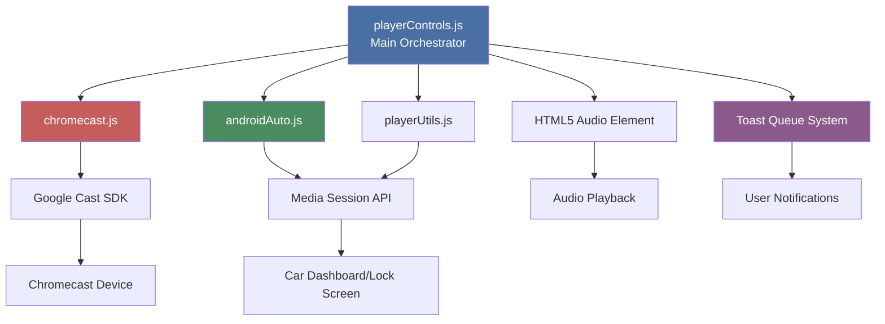
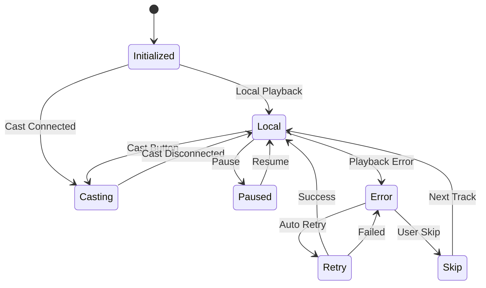

# Player Controls - Complete Documentation

{ align=right width="90" }

The `playerControls.js` module is the central orchestration layer for all playback controls in Mixtape Society. It coordinates between local playback, Chromecast casting, and Android Auto integration, ensuring a unified user experience across all playback modes.

**Version:** 2.0 (Updated January 2026)
**Recent Updates:** Toast queue system, error handling improvements, state management fixes

---

## 🎯 Purpose

**Primary Responsibilities:**

- Coordinate playback across multiple modes (local, Chromecast, Android Auto)
- Manage track selection and queue navigation with shuffle and repeat modes
- Handle quality settings and preferences
- Synchronize UI state across all controls
- Route user actions to appropriate playback system
- Prevent conflicting playback states
- Provide non-blocking notifications via toast queue system
- Manage playback state persistence (resume on reload)
- Handle errors gracefully with recovery options

**Key Design Principle:**
Single source of truth for playback state that routes to the appropriate backend (local player, Cast SDK, or Media Session API).

---

## 🏗️ Architecture

### Component Relationships



### State Flow



---

## 🚀 Initialization

### Entry Point

```javascript
export function initPlayerControls() {
    // Initialization sequence:
    // 1. Get DOM elements
    // 2. Restore shuffle state
    // 3. Restore repeat mode (with context normalization)
    // 4. Initialize quality selector
    // 5. Set up event listeners
    // 6. Restore playback state (if available)
    // 7. Initialize casting
    // 8. Set up Media Session
}
```

### Initialization Steps

1. **DOM Element Acquisition**

   ```javascript
   const player = document.getElementById('main-player');
   const trackItems = document.querySelectorAll('.track-item');
   ```

2. **State Restoration**

   ```javascript
   restoreShuffleState();  // From localStorage
   restoreRepeatMode();    // With context validation
   ```

3. **Playback State Recovery**

   ```javascript
   restorePlaybackState();  // Resume from last session
   ```

4. **Event Listener Setup**

   ```javascript
   initEventListeners();  // All player and UI events
   ```

5. **Platform Detection**

   ```javascript
   const iOS = detectiOS();
   const androidInfo = detectAndroid();
   ```

---

## 🎮 Core Functions

### playTrack(index)

**Purpose:** Primary function to start playback of a track.

**Behavior:**

- Routes to Chromecast if casting
- Updates UI to show active track
- Handles quality selection
- Prefetches next track when ready
- Saves playback state

```javascript
const playTrack = (index) => {
    if (checkCastingState()) {
        // Route to Chromecast
        castTrack(index);
        return;
    }

    // Local playback
    const track = trackItems[index];
    const audioUrl = buildAudioUrl(track.dataset.path, currentQuality);

    player.src = audioUrl;
    updateUIForTrack(index);

    player.play()
        .then(() => {
            console.log('✅ Playback started');
            updateLocalMediaSession(getTrackMetadata(index));
        })
        .catch(err => {
            console.error('❌ Playback failed:', err);
            showErrorToast(`Unable to play track`, {
                actions: [
                    {
                        label: 'Skip Track',
                        handler: () => playTrack(getNextTrackWithRepeat(index)),
                        primary: true
                    }
                ]
            });
        });
};
```

**Error Handling:**

- Retries up to 2 times automatically
- Shows non-blocking error toast
- Provides "Skip Track" action button
- Saves state before handling error

---

## 🎵 Playback Modes

### Shuffle Mode

**Purpose:** Randomize playback order

**Implementation:**

```javascript
const toggleShuffle = () => {
    isShuffled = !isShuffled;

    if (isShuffled) {
        shuffleOrder = generateShuffleOrder();
        showInfoToast('Shuffle enabled');
    } else {
        showInfoToast('Shuffle disabled');
    }

    updateShuffleButton();
    saveShuffleState();
};
```

**Key Features:**

- Fisher-Yates shuffle algorithm
- Preserves current track
- Persistent across sessions
- Works with repeat modes

**Shuffle Order Generation:**

```javascript
const generateShuffleOrder = () => {
    const order = Array.from({ length: trackItems.length }, (_, i) => i);

    // Fisher-Yates shuffle
    for (let i = order.length - 1; i > 0; i--) {
        const j = Math.floor(Math.random() * (i + 1));
        [order[i], order[j]] = [order[j], order[i]];
    }

    return order;
};
```

### Repeat Mode

**Purpose:** Control playlist looping behavior

**Modes:**

- **🔁 Repeat Off** - Play once, stop at end
- **🔁 Repeat All** - Loop entire playlist
- **🔁₁ Repeat One** - Loop current track

**Implementation:**

```javascript
const cycleRepeatMode = () => {
    const modes = Object.values(REPEAT_MODES);
    const currentIdx = modes.indexOf(repeatMode);
    const nextIdx = (currentIdx + 1) % modes.length;

    repeatMode = modes[nextIdx];
    updateRepeatButton();
    saveRepeatMode();

    const label = REPEAT_MODE_LABELS[repeatMode];
    showInfoToast(`Repeat: ${label}`);
};
```

**Context Normalization:**

```javascript
const normalizeRepeatModeForContext = (mode) => {
    // Force OFF when playlist has 0-1 tracks
    if (!Array.isArray(trackItems) || trackItems.length <= 1) {
        return REPEAT_MODES.OFF;
    }
    return mode;
};
```

**Next Track Logic:**

```javascript
const getNextTrackWithRepeat = (currentIndex, options = {}) => {
    const { skipRepeatOne = false } = options;

    // Repeat One (unless skipping for prefetch)
    if (repeatMode === REPEAT_MODES.ONE && !skipRepeatOne) {
        return currentIndex;
    }

    // Get next (shuffle-aware)
    let nextIndex = getNextTrackIndex(currentIndex);

    // Repeat All - loop back
    if (nextIndex === -1 && repeatMode === REPEAT_MODES.ALL) {
        return isShuffled && shuffleOrder.length > 0
            ? shuffleOrder[0]
            : 0;
    }

    return nextIndex;
};
```

**Key Features:**

- ✅ Centralized constants for modes
- ✅ Data-driven button updates
- ✅ Defensive programming with validation
- ✅ Context-aware restoration
- ✅ Persistent across sessions
- ✅ Works seamlessly with shuffle

---

## 🔔 Toast Notification System

### Overview

**Purpose:** Provide non-blocking, queued notifications to users

**Key Features:**

- **Queue Management** - Multiple toasts show sequentially
- **4 Toast Types** - Success, Info, Warning, Error
- **Action Buttons** - Interactive options
- **Auto-Hide Control** - Configurable per toast
- **Programmatic Control** - Dismiss via API

### Toast Types

#### SUCCESS (Green, 3s auto-hide)

```javascript
showSuccessToast('Track added to queue');
showSuccessToast('Quality changed to High');
```

#### INFO (Blue, 4s auto-hide)

```javascript
showInfoToast('Buffering track...');
showInfoToast('Shuffle enabled');
```

#### WARNING (Yellow, 5s auto-hide)

```javascript
showWarningToast('Slow network detected');
showWarningToast('Cache nearly full');
```

#### ERROR (Red, 8s, no auto-hide)

```javascript
showErrorToast('Playback failed');
showErrorToast('Unable to load track');
```

### Usage Examples

**Simple Toast:**

```javascript
showSuccessToast('Operation completed');
```

**Toast with Actions:**

```javascript
showErrorToast('Playback error', {
    actions: [
        {
            label: 'Retry',
            handler: () => retryPlayback(),
            primary: true
        },
        {
            label: 'Skip',
            handler: () => skipTrack()
        }
    ]
});
```

**Programmatic Control:**

```javascript
const loadingToast = showInfoToast('Loading track...');

loadTrack()
    .then(() => {
        loadingToast.dismiss();
        showSuccessToast('Track loaded!');
    })
    .catch(err => {
        loadingToast.dismiss();
        showErrorToast(`Failed: ${err.message}`);
    });
```

**Queue Behavior:**

```javascript
// All show sequentially, none replaced
showSuccessToast('Track 1 added');
showSuccessToast('Track 2 added');
showSuccessToast('Track 3 added');
// User sees all 3 notifications!
```

### Configuration

**Toast Types:**

```javascript
const TOAST_TYPES = {
    SUCCESS: 'success',
    INFO: 'info',
    WARNING: 'warning',
    ERROR: 'error'
};
```

**Toast Configuration:**

```javascript
const TOAST_CONFIG = {
    [TOAST_TYPES.SUCCESS]: {
        icon: 'bi-check-circle-fill',
        bgClass: 'bg-success',
        textClass: 'text-white',
        duration: 3000
    },
    // ... other types
};
```

---

## 🎚️ Quality Management

### changeQuality(newQuality)

**Purpose:** Switch audio quality for current track

**Implementation:**

```javascript
const changeQuality = (newQuality) => {
    currentQuality = newQuality;

    // Save preference
    try {
        localStorage.setItem('audioQuality', newQuality);
    } catch (e) {
        console.warn('Failed to save quality:', e);
    }

    updateQualityButtonText();
    updateQualityMenuState(newQuality);

    // Reload current track at new quality
    if (currentIndex >= 0 && player.src && !checkCastingState()) {
        const wasPlaying = !player.paused;
        const targetTime = player.currentTime;

        playTrack(currentIndex);

        // Restore position safely
        if (targetTime > 0) {
            seekWhenReady(targetTime);
        }

        // Resume playback if was playing
        if (wasPlaying) {
            setTimeout(() => {
                player.play().catch(err => {
                    console.warn('Failed to resume:', err);
                });
            }, TIMING.PLAYBACK_RESUME_DELAY);
        }
    }

    showSuccessToast(`Quality: ${QUALITY_LEVELS[newQuality].label}`);
};
```

**Quality Levels:**

```javascript
const QUALITY_LEVELS = {
    high: { label: 'High', bitrate: '256k' },
    medium: { label: 'Medium', bitrate: '192k' },
    low: { label: 'Low', bitrate: '128k' },
    original: { label: 'Original', bitrate: 'original' }
};
```

**Key Features:**

- ✅ Uses `seekWhenReady()` to handle metadata loading
- ✅ Validates duration before seeking
- ✅ Proper timing for auto-resume
- ✅ Toast notification on success
- ✅ Persistent preference

---

## 💾 State Persistence

### Save Playback State

**Purpose:** Remember playback position across sessions

**Implementation:**

```javascript
const savePlaybackState = () => {
    // Validate
    if (currentIndex < 0 || !player) return;
    if (!Number.isFinite(player.currentTime) || player.currentTime < 0) return;

    try {
        const trackElement = trackItems[currentIndex];
        const title = trackElement?.dataset.title || 'Unknown';

        localStorage.setItem(STORAGE_KEY_POSITION, JSON.stringify({
            track: currentIndex,
            time: player.currentTime,
            title: title,
            timestamp: Date.now(),
            paused: player.paused  // Track paused state
        }));

        console.debug(`💾 Saved: track ${currentIndex}, time ${Math.floor(player.currentTime)}s, paused: ${player.paused}`);
    } catch (e) {
        console.warn('Failed to save state:', e);
    }
};
```

**Key Changes:**

- ✅ **Removed `!player.paused` check** - Now saves when paused!
- ✅ Validates `currentTime` is finite and non-negative
- ✅ Tracks paused state for future use
- ✅ Debug logging for verification

**Auto-Save:**

```javascript
// Auto-save every 5 seconds while playing
player?.addEventListener('play', () => {
    startAutoSave();
});

// Save immediately on pause
player?.addEventListener('pause', () => {
    savePlaybackState();  // Now works!
    stopAutoSave();
});
```

### Restore Playback State

**Implementation:**

```javascript
const restorePlaybackState = () => {
    try {
        const savedPosition = localStorage.getItem(STORAGE_KEY_POSITION);
        if (!savedPosition) return false;

        const state = JSON.parse(savedPosition);

        // Only restore if saved within last 24 hours
        if (Date.now() - state.timestamp > 24 * 60 * 60 * 1000) {
            return false;
        }

        const trackIdx = state.track;
        if (trackIdx >= 0 && trackIdx < trackItems.length) {
            playTrack(trackIdx);

            if (state.time > 0) {
                seekWhenReady(state.time);
            }

            showInfoToast(`Resumed: ${state.title}`);
            return true;
        }
    } catch (e) {
        console.warn('Failed to restore state:', e);
    }
    return false;
};
```

---

## 🎯 Prefetch System

### Purpose

Prefetch the next track to ensure smooth transitions between tracks.

### Implementation

```javascript
const prefetchNextTrack = async (currentIdx) => {
    // Use options to skip Repeat One (no global mutation!)
    const nextIdx = getNextTrackWithRepeat(currentIdx, {
        skipRepeatOne: true
    });

    // Validate
    if (nextIdx < 0 || nextIdx >= trackItems.length || nextIdx === currentIdx) {
        console.log('🚫 No next track to prefetch');
        return;
    }

    const nextTrack = trackItems[nextIdx];
    const audioUrl = buildAudioUrl(nextTrack.dataset.path, currentQuality);

    const modeInfo = isShuffled ? '🔀 shuffle' : '▶️ sequential';
    console.log(`🔥 Prefetching next track (${modeInfo}):`, nextTrack.dataset.title);

    const doPrefetch = async () => {
        try {
            // Check cache first
            if ('caches' in window) {
                const cached = await caches.match(audioUrl);
                if (cached) {
                    console.log('✅ Already cached');
                    return;
                }
            }

            // Fetch to warm cache
            await fetch(audioUrl, {
                method: 'GET',
                credentials: 'include'
            });

            console.log('✅ Prefetch initiated');
        } catch (error) {
            console.warn('⚠️ Prefetch failed:', error.message);
        }
    };

    // Use requestIdleCallback for low-priority scheduling
    if ('requestIdleCallback' in window) {
        window.requestIdleCallback(() => doPrefetch());
    } else {
        setTimeout(() => doPrefetch(), 0);
    }
};
```

**Key Improvements:**

- ✅ **No global state mutation** - Uses options parameter
- ✅ **Respects shuffle and repeat** - Uses `getNextTrackWithRepeat()`
- ✅ **Proper low-priority** - Uses `requestIdleCallback` (not non-standard `priority: 'low'`)
- ✅ **Thread-safe** - No race conditions with user actions

---

## ⚠️ Error Handling

### Playback Error Handler

**Implementation:**

```javascript
let errorRetryCount = 0;
let hasShownTerminalErrorToast = false;
const MAX_RETRIES = 2;

player?.addEventListener('error', (e) => {
    const error = player?.error;
    if (!error) return;

    // Get track info safely
    const trackInfo = currentIndex >= 0 && trackItems[currentIndex]
        ? trackItems[currentIndex].dataset.title
        : 'Unknown track';

    console.error('🚫 Playback error:', {
        code: error.code,
        message: error.message,
        src: player?.src,
        track: trackInfo,
        trackIndex: currentIndex
    });

    // Save state before handling
    savePlaybackState();

    if (errorRetryCount < MAX_RETRIES) {
        errorRetryCount++;
        console.log(`🔄 Retrying (${errorRetryCount}/${MAX_RETRIES})...`);

        setTimeout(() => {
            player.load();
            player.play().catch(err => {
                if (errorRetryCount >= MAX_RETRIES && !hasShownTerminalErrorToast) {
                    hasShownTerminalErrorToast = true;
                    showErrorToast(
                        `Unable to play "${trackInfo}". Try skipping to another track.`,
                        {
                            autohide: false,
                            actions: [{
                                label: 'Skip Track',
                                handler: () => {
                                    const nextIdx = getNextTrackWithRepeat(currentIndex);
                                    if (nextIdx >= 0) playTrack(nextIdx);
                                },
                                primary: true
                            }]
                        }
                    );
                }
            });
        }, 1000);
    }
});

// Reset error state on successful playback
player?.addEventListener('playing', () => {
    errorRetryCount = 0;
    hasShownTerminalErrorToast = false;
});
```

**Key Features:**

- ✅ **Non-blocking toast** instead of blocking alert
- ✅ **Action button** - "Skip Track" for easy recovery
- ✅ **Single notification** - Flag prevents spam
- ✅ **Contextual message** - Shows track name
- ✅ **Auto-retry** - Up to 2 retries before showing error
- ✅ **State reset** - Flags reset on successful playback

---

## 🎨 UI Synchronization

### syncPlayIcons()

**Purpose:** Update play/pause icons across all track items

```javascript
const syncPlayIcons = () => {
    trackItems.forEach((item, idx) => {
        const icon = item.querySelector('.play-overlay-btn i');
        if (!icon) return;

        if (idx === currentIndex && !player.paused) {
            icon.className = 'bi bi-pause-fill';
        } else {
            icon.className = 'bi bi-play-fill';
        }
    });
};
```

### updateUIForTrack(index)

**Purpose:** Update UI when track changes

```javascript
const updateUIForTrack = (index) => {
    const track = trackItems[index];

    updateBottomPlayerInfo(track);
    container.style.display = 'block';

    setActiveTrack(track);

    currentIndex = index;
    window.currentTrackIndex = index;

    scrollToCurrentTrack(track);
};
```

**Helper Functions:**

```javascript
const setActiveTrack = (trackElement) => {
    trackItems.forEach(t => t.classList.remove('active-track'));
    if (trackElement) {
        trackElement.classList.add('active-track');
    }
};

const updateBottomPlayerInfo = (track) => {
    if (!track) {
        bottomTitle.textContent = '–';
        bottomArtistAlbum.textContent = '–';
        return;
    }
    bottomTitle.textContent = track.dataset.title;
    bottomArtistAlbum.textContent = `${track.dataset.artist} • ${track.dataset.album}`;
};
```

---

## 🔌 Player Controls API

### Exported Interface

```javascript
export const playerControlsAPI = {
    playTrack,
    togglePlayPause,
    stop: stopPlayback,
    next: () => {
        const nextIdx = getNextTrackWithRepeat(currentIndex);
        if (nextIdx >= 0) playTrack(nextIdx);
    },
    previous: () => {
        const prevIdx = getPreviousTrackWithRepeat(currentIndex);
        if (prevIdx >= 0) playTrack(prevIdx);
    },
    setQuality: changeQuality,
    getCurrentTrack: () => currentIndex,
    getPlayer: () => player,
    getCurrentTime: () => player?.currentTime || 0,
    getDuration: () => player?.duration || 0,
    seek: (time) => {
        if (checkCastingState()) {
            castSeek(time);
        } else {
            player.currentTime = time;
        }
    },
    // Toast API
    showToast,
    showSuccessToast,
    showInfoToast,
    showWarningToast,
    showErrorToast
};
```

---

## 🎯 Keyboard Shortcuts

### Supported Shortcuts

| Key | Action |
| --- | ------ |
| **Space** | Toggle play/pause |
| **→** | Next track |
| **←** | Previous track |
| **↑** | Volume up |
| **↓** | Volume down |
| **S** | Toggle shuffle |
| **R** | Cycle repeat mode |
| **M** | Toggle mute |

### Implementation

```javascript
document.addEventListener('keydown', (e) => {
    // Don't trigger if typing in input
    if (e.target.tagName === 'INPUT' || e.target.tagName === 'TEXTAREA') {
        return;
    }

    switch (e.key) {
        case ' ':
            e.preventDefault();
            togglePlayPause();
            break;
        case 'ArrowRight':
            e.preventDefault();
            playerControlsAPI.next();
            break;
        case 'ArrowLeft':
            e.preventDefault();
            playerControlsAPI.previous();
            break;
        case 's':
        case 'S':
            e.preventDefault();
            toggleShuffle();
            break;
        case 'r':
        case 'R':
            e.preventDefault();
            cycleRepeatMode();
            break;
    }
});
```

---

## 📊 Constants & Configuration

### Timing Constants

```javascript
const TIMING = {
    AUTO_SAVE_INTERVAL: 5000,       // Save position every 5s
    UI_RESTORE_DELAY: 500,          // Delay before scrolling to restored track
    HIGHLIGHT_DURATION: 3000,       // Track highlight duration
    IOS_HELP_DISMISS: 10000,        // iOS help auto-dismiss
    PLAYBACK_RESUME_DELAY: 50       // Delay before resuming after quality change
};
```

### Repeat Mode Constants

```javascript
const REPEAT_MODES = {
    OFF: 'off',
    ALL: 'all',
    ONE: 'one'
};

const REPEAT_MODE_LABELS = {
    [REPEAT_MODES.OFF]: 'Repeat Off',
    [REPEAT_MODES.ALL]: 'Repeat All',
    [REPEAT_MODES.ONE]: 'Repeat One'
};

const REPEAT_MODE_ICONS = {
    [REPEAT_MODES.OFF]: 'bi-repeat',
    [REPEAT_MODES.ALL]: 'bi-repeat',
    [REPEAT_MODES.ONE]: 'bi-repeat-1'
};
```

---

## 🔧 Troubleshooting

### Playback Issues

**Problem:** Track won't play

- Check console for error messages
- Verify audio URL is valid
- Check network connectivity
- Try different quality setting
- Error toast will show with "Skip Track" option

**Problem:** Position not restored

- Check if saved state exists in localStorage
- Verify state timestamp is within 24 hours
- Check console for restoration logs
- State now saves correctly when paused!

### Shuffle/Repeat Issues

**Problem:** Repeat mode not working with 1 track

- By design: Repeat mode normalized to OFF for 0-1 tracks
- Check console for normalization log

**Problem:** Prefetch not respecting modes

- Fixed in v2.0: Prefetch now uses `getNextTrackWithRepeat()` with options
- Check console for prefetch logs showing correct mode

### Toast Notification Issues

**Problem:** Toasts disappearing immediately

- Check toast type: Errors don't auto-hide by default
- Verify duration settings
- Check for JavaScript errors

**Problem:** Multiple toasts replacing each other

- Ensure using queue system (v2.0+)
- Toasts should show sequentially

---

## 📈 Performance Considerations

### Optimizations

1. **Prefetch Strategy**
   - Uses `requestIdleCallback` for low-priority
   - Checks cache before fetching
   - Only prefetches actual next track

2. **State Persistence**
   - Auto-save throttled to every 5s
   - Try-catch around localStorage calls
   - Validates data before saving

3. **UI Updates**
   - Debounced position updates (1s)
   - Minimal DOM manipulation
   - Event delegation where possible

4. **Memory Management**
   - Guard flags prevent duplicate listeners
   - Toast elements cleaned up after dismiss
   - Timeouts properly cleared

---

## 🔐 Security Considerations

### XSS Prevention

- ✅ **No innerHTML usage** - All content uses `textContent` or DOM creation
- ✅ **Safe DOM manipulation** - createElement + appendChild pattern
- ✅ **Input validation** - All user inputs validated

### Storage Safety

```javascript
// All storage wrapped in try-catch
try {
    localStorage.setItem(key, value);
} catch (e) {
    console.warn('Storage failed:', e);
    // Graceful degradation
}
```

---

## 📝 Summary

### Key Features

✅ **Unified Playback Control** across local, Chromecast, and Android Auto
✅ **Shuffle & Repeat Modes** with persistent state
✅ **Quality Management** with seamless switching
✅ **State Persistence** - Resume playback across sessions
✅ **Toast Queue System** - Non-blocking notifications
✅ **Error Recovery** - Automatic retries with user actions
✅ **Prefetch Intelligence** - Respects all playback modes
✅ **Keyboard Shortcuts** - Full keyboard control
✅ **Memory Safe** - No leaks, proper cleanup
✅ **XSS Protected** - Safe DOM manipulation throughout

### Recent Improvements (v2.0)

✅ Fixed 5 critical bugs (prefetch, error handler, repeat validation, memory leak, save on pause)
✅ Added comprehensive toast queue system
✅ Replaced blocking alerts with interactive toasts
✅ Improved error handling with recovery options
✅ Enhanced state persistence (saves when paused!)
✅ Better documentation with examples

---

**Version:** 2.0
**Last Updated:** January 2026
**Status:** Production Ready
**Dependencies:** Bootstrap 5, Chromecast SDK, Media Session API
