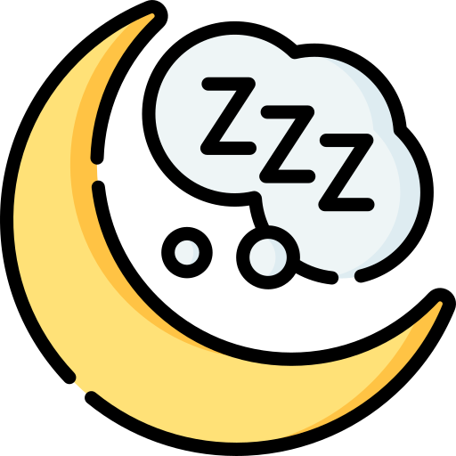
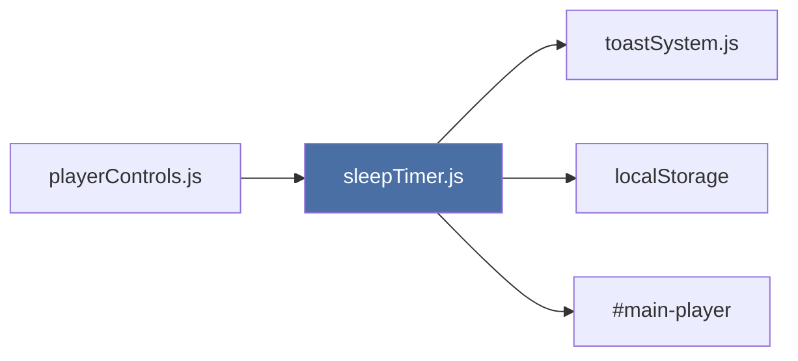
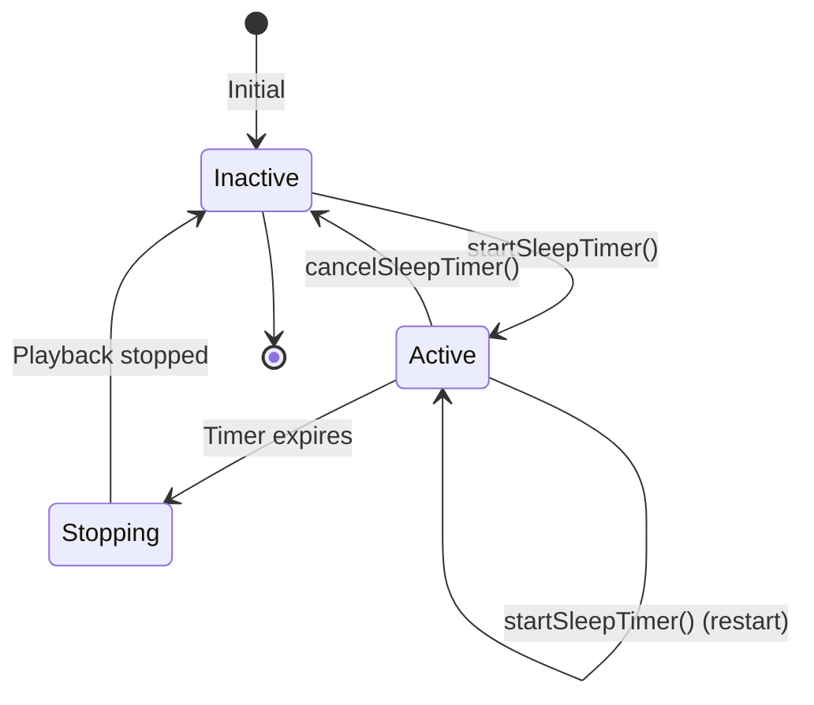

{ align=right width="90" }

# Sleep Timer Module

The `sleepTimer.js` module provides automatic playback shutdown functionality with configurable durations, graceful track-end handling, and persistent user preferences. It integrates seamlessly with the player controls and toast notification system to deliver a polished sleep timer experience.

---

## 🎯 Purpose

**Core Responsibilities:**

- Manage sleep timer state and countdown
- Provide modal UI for duration configuration
- Handle automatic playback shutdown
- Show periodic countdown notifications
- Persist user preferences across sessions
- Coordinate with player controls for graceful stops

**Design Philosophy:**
Offer a simple, non-intrusive timer that respects user preferences and integrates naturally with existing playback controls without disrupting other functionality.

---

## 🏗️ Architecture

### Module Structure

```mermaid
graph TB
    SleepTimer[sleepTimer.js]

    UI[Modal UI]
    Timer[Timer Management]
    Notifications[Toast Notifications]
    Persistence[Storage]

    SleepTimer --> UI
    SleepTimer --> Timer
    SleepTimer --> Notifications
    SleepTimer --> Persistence

    UI --> CreateModal[createSleepTimerModal]
    UI --> ShowModal[showSleepTimerModal]
    UI --> InitValues[initializeModalValues]

    Timer --> StartTimer[startSleepTimer]
    Timer --> StartCountdown[startCountdown]
    Timer --> StopPlayback[stopPlayback]
    Timer --> Cancel[cancelSleepTimer]
    Timer --> Cleanup[cleanupSleepTimer]

    Notifications --> Countdown[showCountdownNotification]
    Notifications --> UpdateButton[updateSleepTimerButton]

    Persistence --> GetDuration[getSavedDuration]
    Persistence --> SaveDuration[saveDuration]

    style SleepTimer fill:#4a6fa5,color:#fff
    style Timer fill:#c65d5d,color:#fff
    style Notifications fill:#4a8c5f,color:#fff
```



### Integration Points



---

## 📦 State Management

### Sleep Timer State

The module maintains a centralized state object:

```javascript
let sleepTimerState = {
    active: false,              // Is timer currently running?
    endTime: null,              // Timestamp when timer will expire (Date.now())
    duration: 30,               // Duration in minutes (for restoration)
    waitForTrackEnd: true,      // Wait for current track to finish?
    intervalId: null,           // setInterval ID for countdown
    lastNotificationTime: 0     // Timestamp of last notification (prevents duplicates)
};
```

**Field Details:**

| Field | Type | Purpose | Default |
| ----- | ---- | ------- | ------- |
| `active` | boolean | Timer running status | `false` |
| `endTime` | number\|null | Expiration timestamp (ms) | `null` |
| `duration` | number | User-selected duration (min) | `30` |
| `waitForTrackEnd` | boolean | Graceful track-end stop | `true` |
| `intervalId` | number\|null | Countdown interval ID | `null` |
| `lastNotificationTime` | number | Last toast timestamp | `0` |

**State Transitions:**



---

## ⏰ Timer Lifecycle

### Starting a Timer

**Function:** `startSleepTimer(minutes, waitForTrackEnd)`

**Parameters:**

- `minutes` (number) - Duration in minutes (5-120)
- `waitForTrackEnd` (boolean) - Whether to wait for track completion

**Process:**

```javascript
function startSleepTimer(minutes, waitForTrackEnd) {
    // 1. Cancel existing timer if any
    if (sleepTimerState.active) {
        cleanupSleepTimer();
    }

    // 2. Calculate expiration time
    const now = Date.now();
    const durationMs = minutes * 60 * 1000;
    const endTime = now + durationMs;

    // 3. Update state
    sleepTimerState.active = true;
    sleepTimerState.endTime = endTime;
    sleepTimerState.duration = minutes;
    sleepTimerState.waitForTrackEnd = waitForTrackEnd;
    sleepTimerState.lastNotificationTime = 0;

    // 4. Persist preference
    saveDuration(minutes);

    // 5. Start countdown
    startCountdown();

    // 6. Update UI
    updateSleepTimerButton();

    // 7. Show confirmation toast
    showSuccessToast(message, { actions: [...] });
}
```

**Example usage:**

```javascript
// Start 30-minute timer that waits for track end
startSleepTimer(30, true);

// Start 60-minute timer that stops immediately
startSleepTimer(60, false);
```

### Countdown Process

**Function:** `startCountdown()`

**Implementation:**

```javascript
function startCountdown() {
    // Clear any existing countdown
    if (sleepTimerState.intervalId) {
        clearInterval(sleepTimerState.intervalId);
    }

    // Check every second
    sleepTimerState.intervalId = setInterval(() => {
        const now = Date.now();
        const secondsRemaining = Math.ceil((sleepTimerState.endTime - now) / 1000);

        if (secondsRemaining <= 0) {
            // Timer expired
            stopPlayback();
            return;
        }

        // Show countdown notifications
        showCountdownNotification(secondsRemaining);

    }, 1000);
}
```

**Countdown interval:** 1 second (1000ms)

**Termination conditions:**

- Timer expires (`secondsRemaining <= 0`)
- Timer is cancelled (`cleanupSleepTimer()`)
- Page unloads (`beforeunload` event)

### Notification Schedule

**Function:** `showCountdownNotification(secondsRemaining)`

**Notification points:**

- 60 minutes remaining
- 30 minutes remaining
- 15 minutes remaining
- 10 minutes remaining
- 5 minutes remaining
- 1 minute remaining

**Duplicate prevention:**

30-second cooldown between notifications prevents spam if user rapidly toggles timer.

```javascript
function showCountdownNotification(secondsRemaining) {
    const minutesRemaining = Math.ceil(secondsRemaining / 60);

    // Check if this is a notification point
    const notificationPoints = [60, 30, 15, 10, 5, 1];

    if (notificationPoints.includes(minutesRemaining)) {
        const now = Date.now();

        // Prevent duplicates within 30 seconds
        if (now - sleepTimerState.lastNotificationTime < 30000) {
            return;
        }

        sleepTimerState.lastNotificationTime = now;

        // Show toast with actions
        showInfoToast(message, {
            duration: 4000,
            actions: [
                { label: 'Extend', handler: () => showSleepTimerModal() },
                { label: 'Cancel', handler: () => cancelSleepTimer() }
            ]
        });
    }
}
```

**Toast appearance:**

```text
ℹ️ Info
Playback will stop in 15m
[Extend] [Cancel]
```

### Stopping Playback

**Function:** `stopPlayback()`

**Two modes:**

#### Immediate Stop

When `waitForTrackEnd = false`:

```javascript
const player = document.getElementById('main-player');
if (player) {
    player.pause();
}
cleanupSleepTimer();
showSuccessToast('Sleep timer ended - playback stopped');
```

#### Graceful Stop (Wait for Track End)

When `waitForTrackEnd = true`:

```javascript
const player = document.getElementById('main-player');

if (player && !player.paused) {
    // Show waiting message
    showInfoToast('Waiting for current track to finish...');

    // Listen for track end
    const handleEnd = () => {
        player.pause();
        cleanupSleepTimer();
        showSuccessToast('Sleep timer ended - playback stopped');
        player.removeEventListener('ended', handleEnd);
    };

    player.addEventListener('ended', handleEnd, { once: true });
} else {
    // Already paused, stop immediately
    cleanupSleepTimer();
    showSuccessToast('Sleep timer ended - playback stopped');
}
```

**Track end handling:**

- Uses `{ once: true }` to auto-remove listener
- Prevents memory leaks
- Handles edge case of already-paused player

### Cancelling a Timer

**Function:** `cancelSleepTimer()`

**Process:**

```javascript
function cancelSleepTimer() {
    cleanupSleepTimer();
    showInfoToast('Sleep timer cancelled');
}
```

**User-initiated cancellation:**

- Click cancel in modal
- Click cancel in countdown toast
- Click pulsing timer button → modal → cancel

### Cleanup

**Function:** `cleanupSleepTimer()`

**Responsibilities:**

```javascript
function cleanupSleepTimer() {
    // Clear interval
    if (sleepTimerState.intervalId) {
        clearInterval(sleepTimerState.intervalId);
        sleepTimerState.intervalId = null;
    }

    // Reset state
    sleepTimerState.active = false;
    sleepTimerState.endTime = null;
    sleepTimerState.lastNotificationTime = 0;

    // Update UI
    updateSleepTimerButton();
}
```

**Called by:**

- `cancelSleepTimer()` - User cancellation
- `stopPlayback()` - Timer expiration
- `startSleepTimer()` - Restart with new duration
- `window.beforeunload` - Page unload

---

## 🎨 Modal UI

### Modal Structure

**Function:** `createSleepTimerModal()`

**Returns:** DOM element

**Modal HTML:**

```html
<div class="modal fade" id="sleepTimerModal">
    <div class="modal-dialog modal-dialog-centered">
        <div class="modal-content">
            <!-- Header -->
            <div class="modal-header border-bottom-0">
                <h5 class="modal-title">
                    <i class="bi bi-moon-stars me-2"></i>Sleep Timer
                </h5>
                <button class="btn-close" data-bs-dismiss="modal"></button>
            </div>

            <!-- Body -->
            <div class="modal-body">
                <!-- Large time display -->
                <div class="timer-display">30<span class="text-muted">min</span></div>

                <!-- Slider -->
                <input type="range" id="sleep-timer-slider"
                       min="5" max="120" step="5" value="30">
                <div class="d-flex justify-content-between small text-muted">
                    <span>5 min</span>
                    <span>2 hours</span>
                </div>

                <!-- Quick presets -->
                <div class="d-grid gap-2">
                    <button class="sleep-preset" data-minutes="15">15 minutes</button>
                    <button class="sleep-preset" data-minutes="30">30 minutes</button>
                    <button class="sleep-preset" data-minutes="45">45 minutes</button>
                    <button class="sleep-preset" data-minutes="60">1 hour</button>
                </div>

                <!-- Wait for track end option -->
                <div class="form-check">
                    <input type="checkbox" id="sleep-wait-track-end" checked>
                    <label>Wait until current track ends</label>
                </div>
            </div>

            <!-- Footer -->
            <div class="modal-footer border-top-0">
                <!-- Cancel button (only if timer active) -->
                <button class="btn btn-danger" id="sleep-cancel-btn">
                    Cancel Timer
                </button>
                <button class="btn btn-secondary" data-bs-dismiss="modal">Close</button>
                <button class="btn btn-success" id="sleep-start-btn">
                    Start Timer
                </button>
            </div>
        </div>
    </div>
</div>
```

**Key components:**

| Component | Element ID | Purpose |
| --------- | --------- | ------- |
| Time Display | `#sleep-timer-display` | Shows selected duration (30min) |
| Slider | `#sleep-timer-slider` | Fine control (5-120 min) |
| Preset Buttons | `.sleep-preset` | Quick selection (15/30/45/60) |
| Checkbox | `#sleep-wait-track-end` | Track-end wait toggle |
| Start Button | `#sleep-start-btn` | Activate timer |
| Cancel Button | `#sleep-cancel-btn` | Cancel active timer |

### Showing the Modal

**Function:** `showSleepTimerModal()`

**Process:**

```javascript
export function showSleepTimerModal() {
    // 1. Check if modal exists
    let modal = document.getElementById('sleepTimerModal');

    // 2. Create if needed (lazy loading)
    if (!modal) {
        modal = createSleepTimerModal();
        document.body.appendChild(modal);
    }

    // 3. Initialize with saved/active duration
    const duration = sleepTimerState.active
        ? sleepTimerState.duration
        : getSavedDuration();

    initializeModalValues(modal, duration, sleepTimerState.waitForTrackEnd);

    // 4. Show modal
    const bsModal = new bootstrap.Modal(modal);
    bsModal.show();
}
```

**Lazy loading:**

Modal is created only when first needed, reducing initial page load.

**State restoration:**

- **Active timer:** Shows current duration and settings
- **No timer:** Shows last used duration (from localStorage)

### Initializing Modal Values

**Function:** `initializeModalValues(modal, duration, waitForTrackEnd)`

**Parameters:**

- `modal` (HTMLElement) - Modal DOM element
- `duration` (number) - Initial duration in minutes
- `waitForTrackEnd` (boolean) - Initial checkbox state

**Responsibilities:**

```javascript
function initializeModalValues(modal, duration, waitForTrackEnd) {
    const slider = modal.querySelector('#sleep-timer-slider');
    const display = modal.querySelector('#sleep-timer-display');
    const checkbox = modal.querySelector('#sleep-wait-track-end');
    const startBtn = modal.querySelector('#sleep-start-btn');
    const cancelBtn = modal.querySelector('#sleep-cancel-btn');
    const presetBtns = modal.querySelectorAll('.sleep-preset');

    // Set initial values
    slider.value = duration;
    display.textContent = duration;
    checkbox.checked = waitForTrackEnd;

    // Slider listener
    slider.addEventListener('input', (e) => {
        display.textContent = e.target.value;
    });

    // Preset button listeners
    presetBtns.forEach(btn => {
        btn.addEventListener('click', () => {
            const minutes = parseInt(btn.dataset.minutes, 10);
            slider.value = minutes;
            display.textContent = minutes;
        });
    });

    // Start button listener
    startBtn.addEventListener('click', () => {
        const minutes = parseInt(slider.value, 10);
        const wait = checkbox.checked;
        startSleepTimer(minutes, wait);

        const bsModal = bootstrap.Modal.getInstance(modal);
        bsModal.hide();
    });

    // Cancel button listener (if present)
    if (cancelBtn) {
        cancelBtn.addEventListener('click', () => {
            cancelSleepTimer();
            const bsModal = bootstrap.Modal.getInstance(modal);
            bsModal.hide();
        });
    }
}
```

**Event listeners:**

- Slider: Updates display on input
- Presets: Set slider and display
- Start: Creates/updates timer and closes modal
- Cancel: Cancels timer and closes modal

---

## 🔘 Button State Management

### Sleep Timer Button

**Element ID:** `#sleep-timer-btn`

**Location:** Bottom player controls (between repeat and cast buttons)

**States:**

#### Inactive State

```javascript
sleepBtn.classList.remove('btn-warning');
sleepBtn.classList.add('btn-outline-light');
sleepBtn.title = 'Set sleep timer';

icon.className = 'bi bi-alarm';  // Outline icon
```

**Visual:** Outlined button, static alarm icon ⏰

#### Active State

```javascript
sleepBtn.classList.remove('btn-outline-light');
sleepBtn.classList.add('btn-warning');
sleepBtn.title = 'Sleep timer active - click to modify';

icon.className = 'bi bi-alarm-fill';  // Filled icon
```

**Visual:** Yellow button, filled alarm icon ⏰, pulsing animation

**CSS Animation:**

```css
#sleep-timer-btn.btn-warning {
    animation: pulse 2s infinite;
}

@keyframes pulse {
    0%, 100% { opacity: 0.8; }
    50%      { opacity: 1; }
}
```

### Update Function

**Function:** `updateSleepTimerButton()`

```javascript
function updateSleepTimerButton() {
    const sleepBtn = document.getElementById('sleep-timer-btn');
    if (!sleepBtn) return;

    const icon = sleepBtn.querySelector('i');

    if (sleepTimerState.active) {
        // Active state
        sleepBtn.classList.remove('btn-outline-light');
        sleepBtn.classList.add('btn-warning');
        sleepBtn.title = 'Sleep timer active - click to modify';

        if (icon) {
            icon.className = 'bi bi-alarm-fill';
        }
    } else {
        // Inactive state
        sleepBtn.classList.remove('btn-warning');
        sleepBtn.classList.add('btn-outline-light');
        sleepBtn.title = 'Set sleep timer';

        if (icon) {
            icon.className = 'bi bi-alarm';
        }
    }
}
```

**Called by:**

- `startSleepTimer()` - After timer starts
- `cleanupSleepTimer()` - After timer stops/cancels
- `initSleepTimer()` - On module initialization

---

## 💾 Persistence

### Storage Key

```javascript
const STORAGE_KEY_SLEEP_TIMER = 'sleep_timer_duration';
```

**Stores:** Last used duration in minutes (number)

**Scope:** Per-origin (shared across all mixtapes on same domain)

### Save Duration

**Function:** `saveDuration(minutes)`

```javascript
function saveDuration(minutes) {
    try {
        localStorage.setItem(STORAGE_KEY_SLEEP_TIMER, minutes.toString());
    } catch (e) {
        console.warn('Failed to save sleep timer duration:', e);
    }
}
```

**Error handling:** Gracefully degrades if localStorage blocked

**Called when:** User starts timer (saves their preference)

### Get Saved Duration

**Function:** `getSavedDuration()`

**Returns:** Number (minutes) or default (30)

```javascript
function getSavedDuration() {
    try {
        const saved = localStorage.getItem(STORAGE_KEY_SLEEP_TIMER);
        return saved ? parseInt(saved, 10) : 30;
    } catch (e) {
        console.warn('Failed to load sleep timer duration:', e);
        return 30;
    }
}
```

**Fallback:** 30 minutes if:

- No saved value exists
- localStorage access fails
- Saved value is invalid

**Called when:** Modal opens without active timer

---

## 🔄 Integration Patterns

### With Player Controls

```javascript
// In playerControls.js initialization
import { initSleepTimer } from './sleepTimer.js';

document.addEventListener('DOMContentLoaded', () => {
    // ... other initializations
    initSleepTimer();
});
```

**Button placement:**

```html
<!-- In bottom player controls -->
<button id="shuffle-btn-bottom">...</button>
<button id="repeat-btn-bottom">...</button>
<button id="sleep-timer-btn" class="btn btn-sm btn-outline-light">
    <i class="bi bi-alarm"></i>
</button>
<button id="cast-button">...</button>
```

### With Toast System

```javascript
import {
    showInfoToast,
    showSuccessToast
} from '../common/toastSystem.js';

// Confirmation toast
showSuccessToast('Sleep timer set for 30 minutes', {
    duration: 4000,
    actions: [
        { label: 'Cancel', handler: () => cancelSleepTimer() }
    ]
});

// Countdown toast
showInfoToast('Playback will stop in 15m', {
    duration: 4000,
    actions: [
        { label: 'Extend', handler: () => showSleepTimerModal() },
        { label: 'Cancel', handler: () => cancelSleepTimer() }
    ]
});
```

### With Audio Element

```javascript
const player = document.getElementById('main-player');

// Immediate stop
player.pause();

// Graceful stop (wait for track end)
player.addEventListener('ended', handleEnd, { once: true });
```

---

## 🛠️ Helper Functions

### Time Formatting

**Function:** `formatTimeRemaining(seconds)`

**Purpose:** Convert seconds to human-readable format

**Returns:** String

```javascript
function formatTimeRemaining(seconds) {
    const minutes = Math.ceil(seconds / 60);

    if (minutes < 60) {
        return `${minutes}m`;
    }

    const hours = Math.floor(minutes / 60);
    const remainingMinutes = minutes % 60;

    if (remainingMinutes === 0) {
        return `${hours}h`;
    }

    return `${hours}h ${remainingMinutes}m`;
}
```

**Examples:**

```javascript
formatTimeRemaining(300)   // "5m"
formatTimeRemaining(3600)  // "1h"
formatTimeRemaining(5400)  // "1h 30m"
formatTimeRemaining(7200)  // "2h"
```

---

## 🧪 Testing & Debugging

### Manual Testing

```javascript
// Enable sleep timer
import { showSleepTimerModal } from './sleepTimer.js';
showSleepTimerModal();

// Check state
console.log(sleepTimerState);

// Test immediate stop (set to 1 minute for quick testing)
// In modal: Set slider to 5 minutes, uncheck "wait for track end"

// Test graceful stop
// In modal: Set slider to 5 minutes, check "wait for track end"
```

### Console Logging

```javascript
// Start timer
console.log('⏰ Sleep timer started: 30 minutes, waitForTrackEnd: true');

// Countdown
// (Silent - only logs on expiration)

// Timer expired
console.log('⏰ Sleep timer expired - stopping playback');

// Cleanup
console.log('🛑 Sleep timer cleaned up');
```

### Edge Cases

**Test scenarios:**

1. **Multiple timer starts:** Should cancel previous and restart
2. **Page reload during timer:** Timer does not persist (by design)
3. **localStorage blocked:** Should use default duration (30 min)
4. **Track ends before timer:** Normal track change, timer continues
5. **Modal opened twice:** Should reuse existing modal
6. **Rapid button clicks:** Cooldown prevents duplicate notifications

---

## 📊 API Reference

### Public Exports

```javascript
// Initialization
export function initSleepTimer()

// Modal Control
export function showSleepTimerModal()
```

### Internal Functions

```javascript
// Storage
function getSavedDuration()
function saveDuration(minutes)

// Timer Management
function startSleepTimer(minutes, waitForTrackEnd)
function startCountdown()
function stopPlayback()
function cancelSleepTimer()
function cleanupSleepTimer()

// UI Updates
function updateSleepTimerButton()
function showCountdownNotification(secondsRemaining)
function formatTimeRemaining(seconds)

// Modal
function createSleepTimerModal()
function initializeModalValues(modal, duration, waitForTrackEnd)
```

### Constants

```javascript
const STORAGE_KEY_SLEEP_TIMER = 'sleep_timer_duration';
```

---

## 🌟 Best Practices

### Always Initialize in index.js

```javascript
import { initSleepTimer } from './sleepTimer.js';

document.addEventListener('DOMContentLoaded', () => {
    initSleepTimer();  // Initialize after DOM ready
});
```

### Use Exported Functions

```javascript
// ✅ Correct
import { showSleepTimerModal } from './sleepTimer.js';
showSleepTimerModal();

// ❌ Incorrect
// Don't call internal functions directly
```

### Handle Missing Elements

```javascript
const sleepBtn = document.getElementById('sleep-timer-btn');
if (!sleepBtn) {
    console.warn('Sleep timer button not found in DOM');
    return;
}
```

### Clean Up on Unload

```javascript
// Automatically handled by module
window.addEventListener('beforeunload', () => {
    cleanupSleepTimer();
});
```

---

## 🔗 Related Documentation

- **[Player Controls](playerControls.md)** - Main playback orchestration
- **[Toast System](../../common/toastSystem.md)** - Notification system
- **[Player Utilities](playerUtils.md)** - Shared player utilities
- **[Playback Routes](../index.md)** - Backend audio streaming

---

*Source: `static/js/player/sleepTimer.js`*
