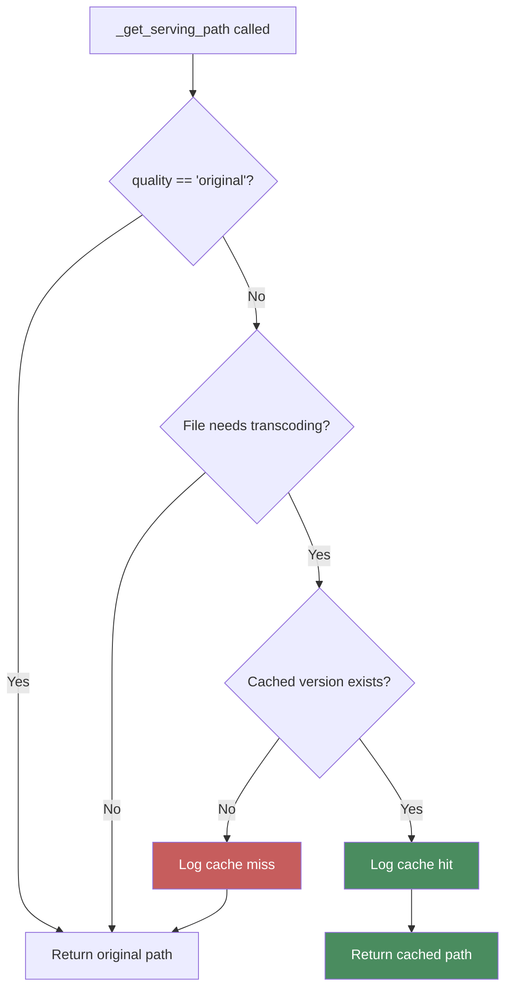

# Quality & Caching

{ align=right width="90" }

> Part of [Playback Routes](index.md) | Related: [Audio Streaming](audio-streaming.md)

The quality and caching system allows clients to request different audio quality levels while the server manages transcoded file caching for optimal performance.

---

## 🎯 Purpose

**Quality selection** enables:

- Bandwidth optimization for mobile/cellular connections
- User preference for quality vs. data usage
- Faster streaming on slower connections
- Battery savings on mobile devices

**Caching system** provides:

- Pre-transcoded files for instant delivery
- Reduced server CPU load (no real-time transcoding)
- Faster response times
- Lower latency for quality switching

---

## 📊 Quality Levels

### Available Qualities

| Quality | Bitrate | Format | Use Case |
| ------- | ------- | ------ | -------- |
| `original` | Varies | Original format (FLAC, MP3, etc.) | WiFi, audiophiles, local playback |
| `high` | 256 kbps | MP3 | High-quality wireless, good connections |
| `medium` | 192 kbps | MP3 | Default, balanced quality/bandwidth |
| `low` | 128 kbps | MP3 | Cellular, bandwidth-constrained |

### Quality Parameter

**URL format:**

```http
GET /play/<file_path>?quality=<level>
```

**Examples:**

```bash
/play/jazz/miles-davis/so-what.flac                    # original (no param)
/play/jazz/miles-davis/so-what.flac?quality=original   # original (explicit)
/play/jazz/miles-davis/so-what.flac?quality=high       # 256k MP3
/play/jazz/miles-davis/so-what.flac?quality=medium     # 192k MP3
/play/jazz/miles-davis/so-what.flac?quality=low        # 128k MP3
```

**Default:** `original` (when parameter omitted)

### Frontend Integration

**JavaScript:**

```javascript
const QUALITY_LEVELS = {
    high: { label: 'High (256k)', bandwidth: 'high' },
    medium: { label: 'Medium (192k)', bandwidth: 'medium' },
    low: { label: 'Low (128k)', bandwidth: 'low' },
    original: { label: 'Original', bandwidth: 'highest' }
};

// Get from localStorage
let currentQuality = localStorage.getItem('audioQuality') || 'medium';

// Build URL
const url = `/play/${track.path}?quality=${currentQuality}`;
```

See: [Player Controls](../../player/playerControls.md#quality-management)

---

## 🔧 Implementation

### _get_serving_path()

**Purpose:** Select which file to serve (original or cached)

**Signature:**

```python
def _get_serving_path(
    original_path: Path,
    quality: str,
    cache: AudioCache,
    logger: Logger
) -> Path
```

**Flow diagram:**



**Implementation:**

```python
def _get_serving_path(
    original_path: Path,
    quality: str,
    cache: AudioCache,
    logger: Logger
) -> Path:
    """
    Select file to serve: original or cached transcoded version

    Logic:
    1. If quality='original' → return original
    2. If file doesn't need transcoding (already MP3) → return original
    3. If cached version exists → return cached path
    4. Otherwise → return original (cache miss)
    """
    # Original quality requested
    if quality == "original":
        logger.debug(f"Serving original: {original_path.name}")
        return original_path

    # Check if file needs transcoding
    if not cache.should_transcode(original_path):
        logger.debug(
            f"File already compatible: {original_path.name} "
            f"(no transcode needed)"
        )
        return original_path

    # Check if cached version exists
    if cache.is_cached(original_path, quality):
        cached_path = cache.get_cache_path(original_path, quality)
        logger.info(
            f"Cache hit: {original_path.name} → {quality} quality"
        )
        return cached_path

    # Cache miss - serve original
    logger.warning(
        f"Cache miss: {original_path.name} ({quality}) - "
        f"serving original"
    )
    return original_path
```

### Transcoding Decision

**Files that need transcoding:**

- FLAC → MP3
- WAV → MP3
- OGG → MP3
- M4A → MP3

**Files that don't need transcoding:**

- MP3 → MP3 (already compressed)
- AAC → AAC (already compressed, different use case)

**Implementation:**

```python
# In AudioCache class
def should_transcode(self, file_path: Path) -> bool:
    """Check if file should be transcoded"""
    extension = file_path.suffix.lower()
    return extension in {'.flac', '.wav', '.ogg', '.m4a'}
```

---

## 💾 Cache Structure

### Directory Layout

```bash
cache/audio/
└── <relative_path>/
    ├── <filename>_high.mp3      # 256k version
    ├── <filename>_medium.mp3    # 192k version
    └── <filename>_low.mp3       # 128k version
```

**Example:**

```bash
Original: /music/jazz/miles-davis/so-what.flac

Cache:
cache/audio/jazz/miles-davis/
├── so-what_high.mp3      # 256kbps MP3
├── so-what_medium.mp3    # 192kbps MP3
└── so-what_low.mp3       # 128kbps MP3
```

### Cache Path Generation

**Method:**

```python
cache_path = cache.get_cache_path(original_path, quality)
```

**Implementation:**

```python
def get_cache_path(self, original_path: Path, quality: str) -> Path:
    """
    Generate cache file path for transcoded version

    Example:
        /music/jazz/album/song.flac + 'medium'
        → /cache/audio/jazz/album/song_medium.mp3
    """
    # Get relative path from MUSIC_ROOT
    relative = original_path.relative_to(MUSIC_ROOT)

    # Build cache path
    cache_dir = CACHE_DIR / relative.parent
    cache_file = f"{relative.stem}_{quality}.mp3"

    return cache_dir / cache_file
```

---

## 🔄 Cache Population

### Pre-caching Strategy

**Background job:** Periodically transcode popular/recent tracks

```python
# Example background job
def precache_mixtapes():
    """Pre-populate cache for all mixtapes"""
    mixtapes = mixtape_manager.get_all()

    for mixtape in mixtapes:
        for track in mixtape['tracks']:
            for quality in ['high', 'medium', 'low']:
                original = Path(MUSIC_ROOT) / track['file_path']

                # Check if needs caching
                if cache.should_transcode(original):
                    if not cache.is_cached(original, quality):
                        # Transcode in background
                        cache.transcode(original, quality)
```

**Triggers:**

- New mixtape created
- Track added to mixtape
- Scheduled background task (nightly)

See: [Audio Caching](../../audio_caching.md) for transcoding implementation

### On-Demand Transcoding

**Current status:** Commented out (prepared for future use)

```python
# Future: On-demand transcoding
# if not cache.is_cached(original_path, quality):
#     cache.transcode(original_path, quality)
#     cached_path = cache.get_cache_path(original_path, quality)
```

**Why disabled:**

- Real-time transcoding adds latency
- CPU-intensive operation
- Better to pre-cache popular tracks

**When to enable:**

- Low storage constraints
- Powerful server hardware
- Infrequent cache misses acceptable

---

## 📈 Cache Management

### Admin Endpoints

#### GET /admin/cache/stats

**Purpose:** Get cache statistics

**Response:**

```json
{
    "cache_size_bytes": 1234567890,
    "cache_size_mb": 1177.38,
    "cached_files": 1523,
    "cache_dir": "/app/cache/audio"
}
```

**Implementation:**

```python
@play.route("/admin/cache/stats")
def cache_stats():
    """Return cache statistics"""
    cache = current_app.audio_cache

    size_bytes = cache.get_cache_size()
    size_mb = round(size_bytes / (1024 * 1024), 2)
    file_count = cache.count_cached_files()

    return jsonify({
        "cache_size_bytes": size_bytes,
        "cache_size_mb": size_mb,
        "cached_files": file_count,
        "cache_dir": str(cache.cache_dir)
    })
```

#### POST /admin/cache/clear

**Purpose:** Clear cached files

**Query parameters:**

- `older_than_days` (optional) - Only delete files older than N days

**Request:**

```http
POST /admin/cache/clear
```

**Request with filter:**

```http
POST /admin/cache/clear?older_than_days=30
```

**Response:**

```json
{
    "deleted_files": 234,
    "message": "Cleared 234 cached files older than 30 days"
}
```

**Implementation:**

```python
@play.route("/admin/cache/clear", methods=["POST"])
def clear_cache():
    """Clear audio cache"""
    cache = current_app.audio_cache
    older_than_days = request.args.get("older_than_days", type=int)

    deleted_count = cache.clear_cache(older_than_days=older_than_days)

    if older_than_days:
        message = f"Cleared {deleted_count} cached files older than {older_than_days} days"
    else:
        message = f"Cleared all {deleted_count} cached files"

    logger.info(message)

    return jsonify({
        "deleted_files": deleted_count,
        "message": message
    })
```

---

## 📊 Performance Optimization

### Cache Hit Rate

**Metric:** Percentage of requests served from cache

```text
Cache Hit Rate = (Cache Hits / Total Requests) × 100%
```

**Monitoring:**

```python
# Log cache performance
logger.info(f"Cache hit: {file_path} → {quality}")    # Hit
logger.warning(f"Cache miss: {file_path} ({quality})")  # Miss
```

**Analyze logs:**

```bash
# Count cache hits vs misses
grep "Cache hit" logs/app.log | wc -l    # Hits
grep "Cache miss" logs/app.log | wc -l   # Misses
```

**Target hit rate:** 80%+ for optimal performance

### Cache Warming

**Strategy:** Pre-cache frequently accessed tracks

```python
def warm_cache():
    """Pre-cache popular tracks"""
    # Get recently played tracks
    popular_tracks = get_popular_tracks(limit=100)

    for track in popular_tracks:
        for quality in ['medium', 'high']:
            if cache.should_transcode(track.path):
                if not cache.is_cached(track.path, quality):
                    cache.transcode(track.path, quality)
```

**When to run:**

- Server startup
- Low-traffic periods (2-4 AM)
- After adding new mixtapes

### Storage Management

**Monitor disk usage:**

```bash
# Check cache directory size
du -sh /app/cache/audio
```

**Set cache size limits:**

```python
# Example: Limit cache to 10GB
MAX_CACHE_SIZE = 10 * 1024 * 1024 * 1024  # 10GB

if cache.get_cache_size() > MAX_CACHE_SIZE:
    # Clear oldest files
    cache.clear_cache(older_than_days=90)
```

**Cleanup strategies:**

- Delete files older than X days
- Delete least recently accessed files
- Delete least popular quality levels
- Keep only medium quality for space savings

---

## 🧪 Testing

### Manual Testing

**Test original quality:**

```bash
curl -I http://localhost:5000/play/artist/album/song.flac
# Should serve original FLAC
```

**Test medium quality:**

```bash
curl -I http://localhost:5000/play/artist/album/song.flac?quality=medium
# Should serve cached MP3 (if cached) or original
```

**Test cache stats:**

```bash
curl http://localhost:5000/admin/cache/stats
# Should return JSON with cache info
```

**Test cache clear:**

```bash
curl -X POST http://localhost:5000/admin/cache/clear
# Should return deleted file count
```

### Check Cache Directory

**View cached files:**

```bash
ls -lh /app/cache/audio/artist/album/
```

**Expected:**

```bash
song_high.mp3     (256k)
song_medium.mp3   (192k)
song_low.mp3      (128k)
```

**Check file sizes:**

```bash
# Original FLAC: ~40MB
# High MP3: ~10MB
# Medium MP3: ~7MB
# Low MP3: ~5MB
```

---

## 🔗 Configuration

### Environment Variables

```bash
# Audio cache directory
AUDIO_CACHE_DIR=/app/cache/audio

# Enable/disable caching
AUDIO_CACHE_ENABLED=true

# Pre-cache on mixtape upload
AUDIO_CACHE_PRECACHE_ON_UPLOAD=true
```

### Docker Volume Mapping

```yaml
# docker-compose.yml
services:
  mixtape:
    volumes:
      - mixtape_data:/app/collection-data
        # Cache is inside collection-data:
        # /app/collection-data/cache/audio/
```

**Persistence:** Cache survives container restarts

See: [Docker Deployment](../../../user/docker-deployment.md)

---

## 📚 Related Documentation

- **[Audio Streaming](audio-streaming.md)** - Uses _get_serving_path()
- **[Audio Caching](../../audio_caching.md)** - Transcoding implementation
- **[Player Controls](../../player/playerControls.md)** - Quality selector UI
- **[Configuration](../../configuration.md)** - Cache directory settings

---

## 💡 Best Practices

### For Users

**WiFi:**

- Use `high` or `original` quality
- Better audio quality
- No bandwidth concerns

**Cellular:**

- Use `medium` or `low` quality
- Save data usage
- Faster streaming

**Storage-constrained:**

- Use `low` quality
- Smallest cache size
- Adequate quality for most cases

### For Administrators

**Cache management:**

- Monitor cache size regularly
- Clear old files periodically
- Pre-cache popular mixtapes
- Balance quality vs storage

**Performance:**

- Warm cache on startup
- Schedule cleanup during low-traffic hours
- Monitor hit/miss ratio
- Adjust cache strategy based on usage

---

*Implementation: `src/routes/play.py::_get_serving_path()` and `src/audio_cache/`*
