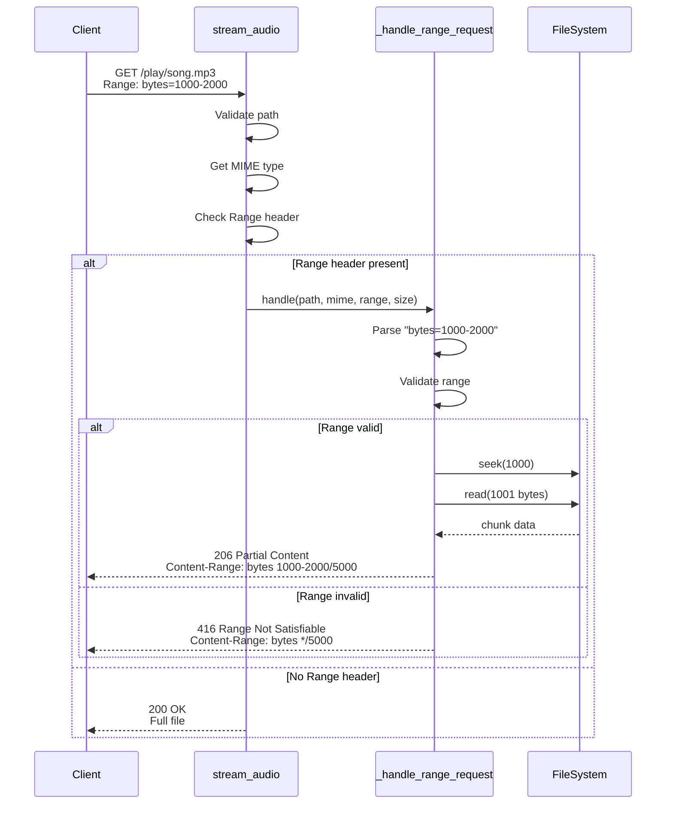

# HTTP Range Requests

{ align=right width="90" }

> Part of [Playback Routes](index.md) | Related: [Audio Streaming](audio-streaming.md)

HTTP range requests enable seeking in audio files by allowing clients to request specific byte ranges instead of entire files. This is essential for Chromecast seeking and HTML5 audio scrubbing.

---

## 🎯 Purpose

Range requests allow:

- **Seeking in audio player** - Jump to any position in track
- **Chromecast timeline scrubbing** - Seek from TV interface
- **Bandwidth optimization** - Download only needed portions
- **Resume downloads** - Continue from breakpoint

**Without range support:** Clients must download entire file before seeking
**With range support:** Jump instantly to any position

---

## 📋 HTTP Range Specification

### Range Header Format

**Request:**

```http
GET /play/artist/album/song.mp3 HTTP/1.1
Range: bytes=1000-2000
```

**Formats:**

| Format | Meaning | Example |
| ------ | ------- | ------- |
| `bytes=start-end` | Specific range | `bytes=1000-2000` (bytes 1000-2000) |
| `bytes=start-` | From start to EOF | `bytes=1000-` (byte 1000 to end) |
| `bytes=-end` | Last N bytes | `bytes=-1000` (last 1000 bytes) |
| `bytes=0-` | Entire file | `bytes=0-` (same as no Range header) |

**Multiple ranges** (not currently supported):

```text
Range: bytes=0-1000, 2000-3000
```

### Response Format

**206 Partial Content:**

```http
HTTP/1.1 206 Partial Content
Content-Type: audio/mpeg
Content-Range: bytes 1000-2000/5000000
Content-Length: 1001
Accept-Ranges: bytes
Access-Control-Allow-Origin: *
Access-Control-Expose-Headers: Content-Range, Content-Length, Range
Cache-Control: public, max-age=3600

[binary audio data: 1001 bytes]
```

**Header breakdown:**

| Header | Value | Meaning |
| ------ | ----- | ------- |
| Status | `206` | Partial Content (not 200) |
| `Content-Range` | `bytes 1000-2000/5000000` | Bytes 1000-2000 of 5,000,000 total |
| `Content-Length` | `1001` | Size of this chunk (end - start + 1) |
| `Accept-Ranges` | `bytes` | Server supports byte ranges |

---

## 🔧 Implementation

### _handle_range_request()

**Purpose:** Parse range header and serve partial content

**Signature:**

```python
def _handle_range_request(
    full_path: Path,
    mime_type: str,
    range_header: str,
    file_size: int
) -> Response
```

**Implementation:**

```python
def _handle_range_request(
    full_path: Path,
    mime_type: str,
    range_header: str,
    file_size: int
) -> Response:
    """
    Handle HTTP range request for audio seeking

    Returns 206 Partial Content or 416 Range Not Satisfiable
    """
    # Parse Range header: "bytes=start-end"
    import re
    match = re.match(r"bytes=(\d+)-(\d*)", range_header)

    if not match:
        logger.warning(f"Malformed range header: {range_header}")
        abort(416)  # Range Not Satisfiable

    # Extract start and end
    start = int(match.group(1))
    end_str = match.group(2)
    end = int(end_str) if end_str else file_size - 1

    # Validate range
    if start >= file_size or end >= file_size or start > end:
        logger.warning(
            f"Invalid range: bytes={start}-{end} "
            f"for file size {file_size}"
        )
        response = Response(status=416)
        response.headers["Content-Range"] = f"bytes */{file_size}"
        return response

    # Calculate chunk size
    length = end - start + 1

    # Stream chunk generator
    def generate():
        with open(full_path, "rb") as f:
            f.seek(start)
            remaining = length
            while remaining > 0:
                chunk_size = min(8192, remaining)  # 8KB chunks
                chunk = f.read(chunk_size)
                if not chunk:
                    break
                remaining -= len(chunk)
                yield chunk

    # Build 206 response
    response = Response(
        generate(),
        206,  # Partial Content
        mimetype=mime_type,
        direct_passthrough=True
    )

    # Set range headers
    response.headers["Content-Range"] = f"bytes {start}-{end}/{file_size}"
    response.headers["Content-Length"] = str(length)
    response.headers["Accept-Ranges"] = "bytes"

    # CORS headers (required for Chromecast)
    response.headers["Access-Control-Allow-Origin"] = "*"
    response.headers["Access-Control-Expose-Headers"] = \
        "Content-Range, Content-Length, Range"

    # Caching
    response.headers["Cache-Control"] = "public, max-age=3600"

    logger.info(
        f"Range request: {full_path.name} | "
        f"Bytes {start}-{end} ({length} bytes)"
    )

    return response
```

### Range Parsing

**Regular expression:** `r"bytes=(\d+)-(\d*)"`

**Capture groups:**

- Group 1: Start byte (required)
- Group 2: End byte (optional)

**Examples:**

```python
"bytes=1000-2000"  → start=1000, end=2000
"bytes=1000-"      → start=1000, end=file_size-1
"bytes=0-999"      → start=0, end=999
"bytes=-1000"      → Not supported (negative offset)
```

### Validation

**Checks performed:**

1. **Range format valid:** Matches regex pattern
2. **Start within bounds:** `start < file_size`
3. **End within bounds:** `end < file_size`
4. **Start before end:** `start <= end`

**Invalid range examples:**

```python
# File size: 1000 bytes
bytes=1000-2000   → Invalid (start >= file_size)
bytes=500-10000   → Invalid (end >= file_size)
bytes=500-100     → Invalid (start > end)
bytes=abc-def     → Invalid (not numbers)
```

---

## 🔄 Request Flow



---

## 📡 Chromecast Requirements

### Why Chromecast Needs Range Support

**Problem:** Chromecast uses range requests for seeking

**Without range support:** Seeking doesn't work on Chromecast

**With range support:** Full timeline scrubbing works

### Required Headers

**CORS headers are critical:**

```python
response.headers["Access-Control-Allow-Origin"] = "*"
response.headers["Access-Control-Expose-Headers"] = \
    "Content-Range, Content-Length, Range"
```

**Why `Access-Control-Expose-Headers`?**

Browsers hide certain headers from JavaScript by default. Chromecast needs to read:

- `Content-Range` - To know what bytes it received
- `Content-Length` - To know chunk size
- `Range` - To verify its request

### Testing with Chromecast

**Manual test:**

1. Start casting a mixtape
2. Use car dashboard/TV remote to scrub timeline
3. Should jump instantly to new position
4. Check network tab for 206 responses

**Debug logging:**

```log
INFO: Range request: song.mp3 | Bytes 1000000-2000000 (1000001 bytes)
INFO: Range request: song.mp3 | Bytes 3000000-4000000 (1000001 bytes)
```

**Common issues:**

| Symptom | Cause | Fix |
| ------- | ----- | --- |
| Seeking doesn't work | Missing CORS headers | Add Access-Control-* headers |
| Gets 416 errors | Invalid range calculation | Check end <= file_size |
| Seeking is slow | Not using ranges | Verify Range header is sent |

See: [Chromecast Integration](../../chromecast/integration.md#server-requirements)

---

## ⚠️ Error Handling

### 416 Range Not Satisfiable

**When:** Client requests invalid byte range

**Response:**

```http
HTTP/1.1 416 Range Not Satisfiable
Content-Range: bytes */5000000
```

**`Content-Range: bytes */5000000`** means:

- No valid range to return
- File size is 5,000,000 bytes
- Client should adjust request

**Causes:**

1. **Start beyond file size:**

   ```text
   File: 1000 bytes
   Request: bytes=2000-3000
   → 416
   ```

2. **End beyond file size:**

   ```text
   File: 1000 bytes
   Request: bytes=500-2000
   → 416
   ```

3. **Start after end:**

   ```text
   Request: bytes=500-100
   → 416
   ```

### Logging

**Valid range:**

```log
INFO: Range request: song.mp3 | Bytes 1000-2000 (1001 bytes)
```

**Invalid range:**

```log
WARNING: Invalid range: bytes=1000-2000 for file size 500
```

**Malformed header:**

```log
WARNING: Malformed range header: bytes=abc-def
```

---

## 🎨 Streaming Optimization

### Chunk Size

**Current implementation:** 8KB chunks

```python
chunk_size = min(8192, remaining)
```

**Why 8KB?**

- Balances memory usage vs. efficiency
- Small enough to not block event loop
- Large enough to minimize overhead
- Standard for HTTP streaming

**Alternative sizes:**

| Size | Use Case | Trade-off |
| ---- | -------- | --------- |
| 4KB | Low memory environments | More overhead |
| 8KB | Default (balanced) | Good for most cases |
| 64KB | High-speed networks | More memory usage |

### Generator Pattern

**Why use generator:**

```python
def generate():
    with open(full_path, "rb") as f:
        f.seek(start)
        remaining = length
        while remaining > 0:
            chunk = f.read(min(8192, remaining))
            if not chunk:
                break
            remaining -= len(chunk)
            yield chunk
```

**Benefits:**

- Streams data incrementally
- Doesn't load entire range into memory
- Client can start playing immediately
- Can be interrupted (if client disconnects)

**Memory usage:**

- Without generator: `length` bytes in memory
- With generator: `8KB` bytes in memory (max)

**For 10MB range:**

- Without: 10MB in memory
- With: 8KB in memory

---

## 📊 Examples

### Example 1: Seek to Middle of Track

**Request:**

```http
GET /play/jazz/miles-davis/so-what.mp3 HTTP/1.1
Range: bytes=2500000-
```

**Response:**

```http
HTTP/1.1 206 Partial Content
Content-Type: audio/mpeg
Content-Range: bytes 2500000-5000000/5000001
Content-Length: 2500001
Accept-Ranges: bytes
Access-Control-Allow-Origin: *

[2,500,001 bytes of audio data]
```

**What happened:**

- File is 5,000,001 bytes total
- Requested from byte 2,500,000 to end
- Served 2,500,001 bytes (half the file)

### Example 2: Small Range (Preview)

**Request:**

```http
GET /play/rock/the-beatles/hey-jude.mp3 HTTP/1.1
Range: bytes=0-1023
```

**Response:**

```http
HTTP/1.1 206 Partial Content
Content-Range: bytes 0-1023/7654321
Content-Length: 1024

[1,024 bytes of audio data]
```

**What happened:**

- Requested first 1KB of file
- Useful for preview/metadata extraction
- Minimal bandwidth usage

### Example 3: Invalid Range

**Request:**

```http
GET /play/classical/beethoven/symphony-9.mp3 HTTP/1.1
Range: bytes=10000000-20000000
```

**Response (if file is 5MB):**

```http
HTTP/1.1 416 Range Not Satisfiable
Content-Range: bytes */5000000
```

**What happened:**

- Requested bytes 10,000,000-20,000,000
- File is only 5,000,000 bytes
- Server returns 416 with file size

---

## 🧪 Testing

### Using curl

**Test basic range:**

```bash
curl -I \
  -H "Range: bytes=0-1023" \
  http://localhost:5000/play/artist/album/song.mp3
```

**Expected response:**

```http
HTTP/1.1 206 Partial Content
Content-Type: audio/mpeg
Content-Range: bytes 0-1023/5000000
Content-Length: 1024
Accept-Ranges: bytes
```

**Test full range:**

```bash
curl -I \
  -H "Range: bytes=1000-" \
  http://localhost:5000/play/artist/album/song.mp3
```

**Test invalid range:**

```bash
curl -I \
  -H "Range: bytes=9999999-" \
  http://localhost:5000/play/artist/album/song.mp3
```

**Expected:** `416 Range Not Satisfiable`

### Using Browser DevTools

**Steps:**

1. Open player page
2. Open DevTools (F12) → Network tab
3. Play a track
4. Seek to different position
5. Look for 206 responses

**What to check:**

- Request has `Range` header
- Response is `206 Partial Content`
- `Content-Range` header is present
- CORS headers are present

**Screenshot of successful range request:**

```
Request Headers:
  Range: bytes=1048576-2097151

Response Headers:
  HTTP/1.1 206 Partial Content
  Content-Range: bytes 1048576-2097151/5242880
  Content-Length: 1048576
  Accept-Ranges: bytes
  Access-Control-Allow-Origin: *
```

### Automated Testing

**Python test example:**

```python
import requests

def test_range_request():
    url = "http://localhost:5000/play/test/song.mp3"
    headers = {"Range": "bytes=0-1023"}

    response = requests.get(url, headers=headers)

    assert response.status_code == 206
    assert "Content-Range" in response.headers
    assert response.headers["Accept-Ranges"] == "bytes"
    assert len(response.content) == 1024

def test_invalid_range():
    url = "http://localhost:5000/play/test/song.mp3"
    headers = {"Range": "bytes=9999999-"}

    response = requests.get(url, headers=headers)

    assert response.status_code == 416
    assert "Content-Range" in response.headers
    assert response.headers["Content-Range"].startswith("bytes */")
```

---

## 📚 Related Documentation

- **[Audio Streaming](audio-streaming.md)** - Main streaming implementation
- **[Chromecast Integration](../../chromecast/integration.md)** - Cast requirements
- **[Player Controls](../../player/playerControls.md)** - Frontend seeking

---

## 🔗 References

- [RFC 7233: HTTP Range Requests](https://tools.ietf.org/html/rfc7233)
- [MDN: HTTP Range Requests](https://developer.mozilla.org/en-US/docs/Web/HTTP/Range_requests)
- [Chromecast Media Documentation](https://developers.google.com/cast/docs/media)

---

*Implementation: `src/routes/play.py::_handle_range_request()`*
