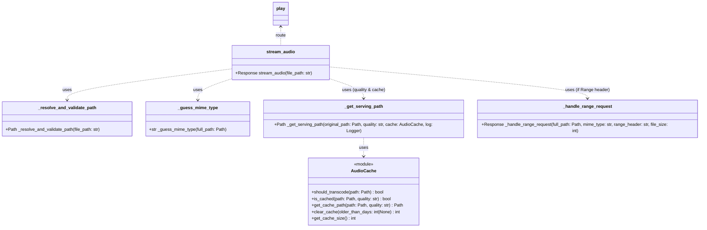

{ align=right width="90" }

**Purpose** – This document describes the **audio‑streaming subsystem** of the Mixtape Society web app.
It explains how the Flask blueprint (`play`) validates requests, resolves file paths, chooses the correct MIME type, handles quality‑aware caching, supports HTTP range requests, and serves the public mixtape page.
All statements below are verified against the current source files (`routes/play.py`, the static JavaScript/CSS assets, and the auxiliary `audio_cache` module).

## High‑Level Overview

| Responsibility                                                                 | Implementation                                      |
|---------------------------------------------------------------------------------|-----------------------------------------------------|
| Validate & resolve the requested audio file path (prevent directory-traversal) | `_resolve_and_validate_path()`                       |
| Determine MIME type (including custom audio extensions)                         | `_guess_mime_type()`                                 |
| Select the file to serve – original or a cached/transcoded version according to the quality query param | `_get_serving_path()` (uses `AudioCache`) |
| Serve full file or partial byte ranges (seeking)                                | `send_file()` for full files, `_handle_range_request()` for partial |
| Return appropriate HTTP status (200, 206, 403, 404, 416, 500)                    | `abort()` + explicit `Response` objects              |
| Render public mixtape page (`/share/<slug>`)                                    | `public_play()`                                     |
| Serve cover images (`/covers/<filename>`)                                       | `serve_cover()`                                     |
| Admin cache utilities (`/admin/cache/*`)                                        | `cache_stats()`, `clear_cache()`                     |
All routes live under the Flask Blueprint named `play`.

## Blueprint & Route Map

```python
play = Blueprint("play", __name__)   # registered in the main Flask app
```

| HTTP Method | URL Pattern               | Handler                 | Description                                                                 |
|-------------|---------------------------|--------------------------|-----------------------------------------------------------------------------|
| `GET`         | `/play/<path:file_path>`  | `stream_audio(file_path)` | Streams an audio file (original or cached) with optional quality & range support. |
| `GET`         | `/share/<slug>`           | `public_play(slug)`      | Renders `play_mixtape.html` for a public mixtape; 404 if slug not found.     |
| GET         | `/covers/<filename>`      | `serve_cover(filename)`  | Serves a cover image from the configured `COVER_DIR`.                        |
| `GET`         | `/admin/cache/stats`      | `cache_stats()`          | Returns JSON with cache size (bytes) and number of cached files.             |
| `POST`        | `/admin/cache/clear`      | `clear_cache()`          | Clears the audio cache; optional `older_than_days` query param.              |

## Request Flow (Detailed Sequence)

```mermaid
sequenceDiagram
    participant Client
    participant FlaskApp
    participant stream_audio()
    participant _resolve_and_validate_path()
    participant _guess_mime_type()
    participant _get_serving_path()
    participant AudioCache
    participant _handle_range_request()
    participant send_file

    Client->>FlaskApp: GET /play/<file_path>?quality=medium [& Range]
    FlaskApp->>stream_audio(): Call with file_path + query
    stream_audio()->>_resolve_and_validate_path(): Validate & resolve
    _resolve_and_validate_path()-->>stream_audio(): full_path (or abort 403/404)
    stream_audio()->>_guess_mime_type(): Guess MIME
    _guess_mime_type()-->>stream_audio(): mime_type
    stream_audio()->>_get_serving_path(): Choose original or cached file (quality)
    _get_serving_path()->>AudioCache: cache.is_cached / cache.get_cache_path
    AudioCache-->>_get_serving_path(): serve_path
    alt Range header present
        stream_audio()->>_handle_range_request(): Serve partial bytes
        _handle_range_request()-->>stream_audio(): 206 Partial Content response
        stream_audio-->>FlaskApp: Return 206
    else No Range header
        stream_audio->>send_file: Send full file
        send_file-->>stream_audio(): 200 OK response
        stream_audio-->>FlaskApp: Return 200
    end
    FlaskApp-->>Client: Stream audio bytes
```

*The diagram now includes the **quality / cache decision** step (`_get_serving_path`).*

## Core Helper Functions

| Function | Signature | What it does |
|---------|-----------|--------------|
| `_resolve_and_validate_path` | `Path _resolve_and_validate_path(file_path: str)` | Joins `MUSIC_ROOT + file_path`, resolves symlinks, ensures the result stays inside `MUSIC_ROOT`. Aborts with 403 (outside) or 404 (non-existent). |
| `_guess_mime_type` | `str _guess_mime_type(full_path: Path)` | Uses `mimetypes.guess_type`. If `None`, falls back to a hard-coded map for `.flac`, `.m4a`, `.aac`, `.ogg`, `.mp3`. |
| `_get_serving_path` | `Path _get_serving_path(original_path, quality, cache, logger)` | Quality handling: • If `quality == "original"` or the file does not need transcoding → return `original_path`. • If a cached version exists (`cache.is_cached`) → return that path (log a debug message). • Otherwise log a cache miss warning and fall back to the original file. (On-demand transcoding is commented out but ready for future use.) |
| `_handle_range_request` | `Response _handle_range_request(full_path, mime_type, range_header, file_size)` | Parses `Range: bytes=start-end`. Validates bounds, returns 206 with `Content-Range`, `Accept-Ranges`, `Content-Length`, plus CORS (`Access-Control-Allow-Origin: *`) and caching (`Cache-Control: public, max-age=3600`). Invalid ranges → 416. |
| `stream_audio` | `Response stream_audio(file_path)` | Orchestrates the steps above, adds `Accept-Ranges` header for full responses, and returns the appropriate Flask `Response`. |
| `public_play` | `Response public_play(slug)` | Retrieves mixtape JSON via `MixtapeManager.get(slug)`. 404 if missing. Renders `play_mixtape.html`. |
| `serve_cover` | `Response serve_cover(filename)` | Sends the requested cover from `app.config["COVER_DIR"]`. |
| `cache_stats` | `dict cache_stats()` | Returns `{ "cache_size_bytes": …, "cache_size_mb": …, "cached_files": … }`. |
| `clear_cache` | `dict clear_cache()` | Deletes cached files (optionally older than X days) and returns `{ "deleted_files": n, "message": … }`. |

##  Quality & Caching Logic

*Implemented in `routes/play.py` and the auxiliary `audio_cache.py` module.*


**Why this matters** – The client can request a lower bitrate to save bandwidth on mobile connections, while the server can pre‑populate the cache (via a background job) for faster subsequent deliveries.

## HTTP Range Support

Only activated when the request contains a `Range` header.

1. **Parse** – `bytes=start-end` (both start and end are optional).
2. **Validate** – start/end must be within `[0, file_size‑1]` and `start ≤ end`.
3. **Respond** –
    - Status **206 Partial Content**.
    - `Content‑Range: bytes start‑end/file_size`.
    - `Accept‑Ranges: bytes`.
    - `Content‑Length: (end‑start+1)`.
    - CORS & cache headers identical to the full‑file response.
4. **Error** – Out‑of‑bounds ranges → **416 Range Not Satisfiable**.

## Response Headers & Logging

| Header                         | Value (example)                          | Reason |
|--------------------------------|------------------------------------------|--------|
| `Accept-Ranges`                | `bytes`                                  | Advertise range support. |
| `Access-Control-Allow-Origin`  | `*`                                      | Allow any origin to embed the audio element (needed for cross-origin playback). |
| `Cache-Control`                | `public, max-age=3600`                   | Enable browsers/CDNs to cache the file for 1 hour. |
| `Content-Type`                 | MIME from `_guess_mime_type` (e.g., `audio/flac`) | Correct media type for the player. |
| `Content-Range` (partial)      | `bytes 0-1023/1234567`                   | Required for HTTP 206. |
| `Content-Length` (partial)     | `1024`                                   | Size of the delivered chunk. |

**Logging (via the injected `Logger`)**:

- **INFO** – Successful stream start, chosen quality, cache hit/miss.
- **WARNING** – Cache miss, malformed range header, missing file.
- **ERROR** – Exceptions while reading the file, transcoding failures, unexpected server errors.

All logs include the request path and the selected serving path, making troubleshooting straightforward.

## Error Handling & Status Codes

| Situation | Flask call | HTTP status | Log level |
|----------|------------|-------------|-----------|
| Requested file outside `MUSIC_ROOT` | `abort(403)` | 403 Forbidden | warning |
| File does not exist | `abort(404)` | 404 Not Found | warning |
| Invalid Range header (out of bounds) | `Response(..., 416)` | 416 Range Not Satisfiable | warning |
| Unexpected I/O error while reading the file | `abort(500)` (caught in `_handle_range_request`) | 500 Internal Server Error | error |
| General uncaught exception in `stream_audio` | Propagates → Flask’s default error handling | 500 | error |

## Static Assets that Complement the Endpoint

| Asset | Path | Role |
|-------|------|------|
| `index.js` | `static/js/player/index.js` | Bootstraps the player UI, adaptive theming, quality selector, and cassette-mode UI. |
| `playerControls.js` | `static/js/player/playerControls.js` | Implements the quality-selector dropdown, play/pause/skip logic, and UI-state synchronization with the Flask audio element. |
| `linerNotes.js` | `static/js/player/linerNotes.js` | Renders markdown liner notes (via marked + DOMPurify). |
| `shareToast.js` | `static/js/player/shareToast.js` | Copies the public URL to the clipboard and shows a toast. |
| `adaptiveTheming.js` | `static/js/player/adaptiveTheming.js` | Extracts dominant colors from the mixtape cover (Vibrant.js) and injects CSS custom properties for dynamic theming. |
| `cassettePlayer.js` | `static/js/player/cassettePlayer.js` | Provides the optional “retro cassette” UI (view-mode toggle, spinning reels, VU meters). |
| `play_mixtape.css` | `static/css/play_mixtape.css` | Adaptive background gradient, audio-control styling, mobile tweaks, quality-selector styling. |
| `cassette.css` | `static/css/cassette.css` | Full stylesheet for the cassette-mode UI (layout, animations, dark/light mode). |

These assets are loaded by `play_mixtape.html` (the template rendered by `public_play`). They rely on the **JSON API** exposed by the Flask routes (e.g., `/play/<file_path>` for streaming, `/covers/<filename>` for cover art).

## Class & Sequence Diagrams

### Blueprint/Class Diagram



## Updated Sequence Diagram

```mermaid
sequenceDiagram
    participant Client
    participant FlaskApp
    participant stream_audio()
    participant _resolve_and_validate_path()
    participant _guess_mime_type()
    participant _get_serving_path()
    participant AudioCache
    participant _handle_range_request()
    participant send_file

    Client->>FlaskApp: GET /play/<file_path>?quality=medium [& Range]
    FlaskApp->>stream_audio(): Call with file_path + query
    stream_audio->>_resolve_and_validate_path(): Validate & resolve
    _resolve_and_validate_path-->>stream_audio(): full_path (or abort 403/404)
    stream_audio->>_guess_mime_type(): Guess MIME
    _guess_mime_type-->>stream_audio(): mime_type
    stream_audio->>_get_serving_path(): Choose original or cached file (quality)
    _get_serving_path->>AudioCache: cache.is_cached / cache.get_cache_path
    AudioCache-->>_get_serving_path(): serve_path
    alt Range header present
        stream_audio->>_handle_range_request(): Serve partial bytes
        _handle_range_request-->>stream_audio(): 206 Partial Content response
        stream_audio-->>FlaskApp: Return 206
    else No Range header
        stream_audio->>send_file: Send full file
        send_file-->>stream_audio(): 200 OK response
        stream_audio-->>FlaskApp: Return 200
    end
    FlaskApp-->>Client: Stream audio bytes
```

## API

### ::: src.routes.play
