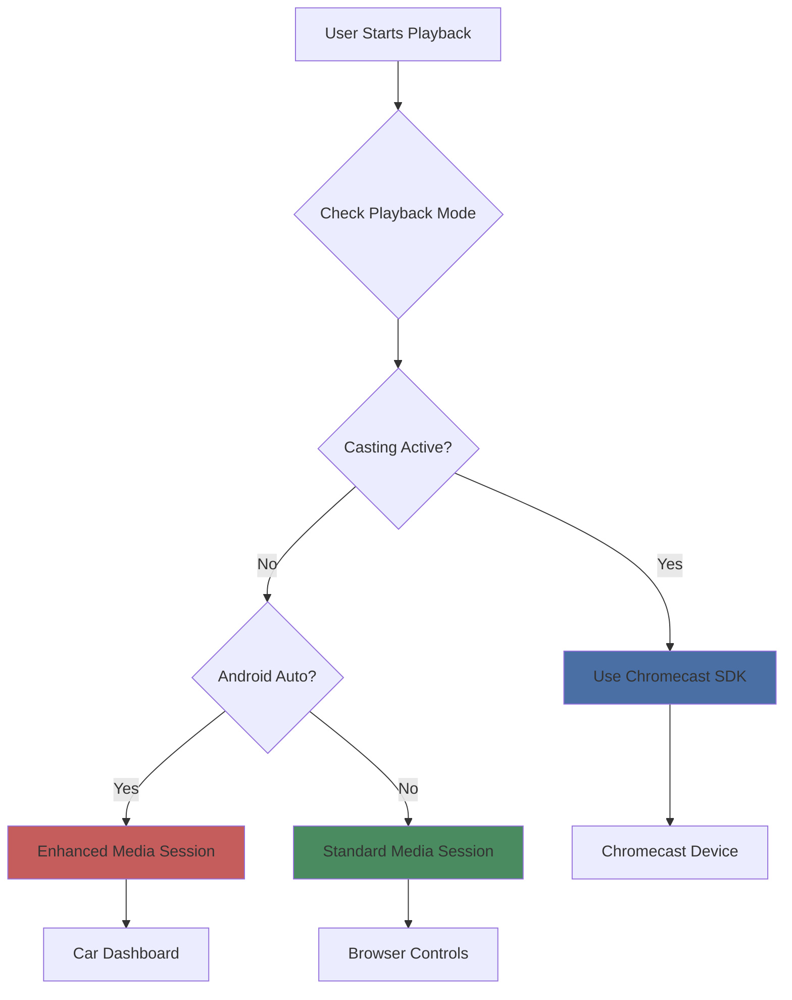
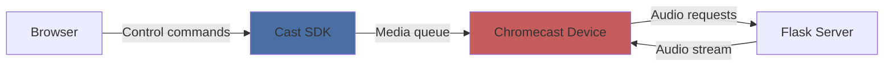
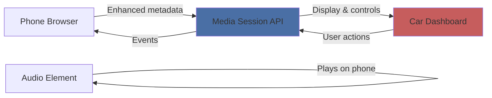
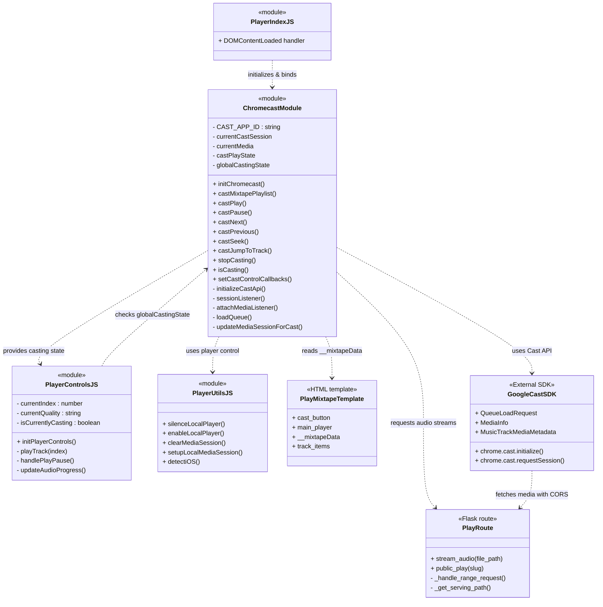

{ align=right width="90" }

**Purpose** – This document describes the **audio‑streaming subsystem** of the Mixtape Society web app.
It explains how the Flask blueprint (`play`) validates requests, resolves file paths, chooses the correct MIME type, handles quality‑aware caching, supports HTTP range requests, serves the public mixtape page, and integrates with **Chromecast for casting to external devices**.
All statements below are verified against the current source files (`routes/play.py`, the static JavaScript/CSS assets, and the auxiliary `audio_cache` module).

## 🌍 High‑Level Overview

| Responsibility | Implementation |
| -------------- | -------------- |
| Validate & resolve the requested audio file path (prevent directory-traversal) | `_resolve_and_validate_path()` |
| Determine MIME type (including custom audio extensions) | `_guess_mime_type()` |
| Select the file to serve – original or a cached/transcoded version  to the quality query param | `_get_serving_path()` (uses `AudioCache`) |
| Serve full file or partial byte ranges (seeking) | `send_file()` for full files, `_handle_range_request()` for partial |
| Return appropriate HTTP status (200, 206, 403, 404, 416, 500) | `abort()` + explicit `Response` objects |
| Render public mixtape page (`/share/<slug>`) | `public_play()` |
| Serve cover images (`/covers/<filename>`) | `serve_cover()` |
| Admin cache utilities (`/admin/cache/*`) | `cache_stats()`, `clear_cache()` |
| Generate QR code for sharing | `qr` blueprint (`/qr/<slug>.png`, `/qr/<slug>/download`) |
| Cast mixtapes to Chromecast devices | `chromecast.js` module + Google Cast SDK |

All routes live under the Flask Blueprint named `play`.

---

## 🗺️ Flask Blueprint & Routes

```python
play = Blueprint("play", __name__)   # registered in the main Flask app
```

| HTTP Method | URL Pattern | Handler | Description |
| ----------- | ----------- | ------- | ----------- |
| `GET` | `/play/<path:file_path>` | `stream_audio(file_path)` | Streams an audio file (original or cached) with optional quality & range support. |
| `GET` | `/share/<slug>` | `public_play(slug)` | Renders `play_mixtape.html` for a public mixtape; 404 if slug not found. |
| `GET` | `/covers/<filename>` | `serve_cover(filename)` | Serves a cover image from the configured `COVER_DIR`. |
| `GET` | `/qr/<slug>.png` | `qr.generate_qr(slug)` | Simple QR – returns a PNG QR code that encodes the public mixtape URL. Optional `size` and `logo` query params. |
| `GET` | `/qr/<slug>/download` | `qr.download_qr(slug)` | Enhanced QR – returns a PNG that includes the mixtape's cover art, title banner, and optional logo. Optional `size`, `include_cover`, `include_title` query params. |
| `GET` | `/admin/cache/stats` | `cache_stats()` | Returns JSON with cache size (bytes) and number of cached files. |
| `POST` | `/admin/cache/clear` | `clear_cache()` | Clears the audio cache; optional `older_than_days` query param. |

---

## 🔄 Request Flow (Detailed Sequence)

```mermaid
sequenceDiagram
    participant Client
    participant FlaskApp
    participant stream_audio()
    participant _resolve_and_validate_path()
    participant _guess_mime_type()
    participant _get_serving_path()
    participant AudioCache
    participant _handle_range_request()
    participant send_file
    participant QRBlueprint
    participant QRGen

    Client->>FlaskApp: GET /play/<file_path>?quality=medium [& Range]
    FlaskApp->>stream_audio(): Call with file_path + query
    stream_audio()->>_resolve_and_validate_path(): Validate & resolve
    _resolve_and_validate_path()-->>stream_audio(): full_path (or abort 403/404)
    stream_audio()->>_guess_mime_type(): Guess MIME
    _guess_mime_type()-->>stream_audio(): mime_type
    stream_audio()->>_get_serving_path(): Choose original or cached file (quality)
    _get_serving_path()->>AudioCache: cache.is_cached / cache.get_cache_path
    AudioCache-->>_get_serving_path(): serve_path
    alt Range header present
        stream_audio()->>_handle_range_request(): Serve partial bytes
        _handle_range_request()-->>stream_audio(): 206 Partial Content response
        stream_audio-->>FlaskApp: Return 206
    else No Range header
        stream_audio->>send_file: Send full file
        send_file-->>stream_audio(): 200 OK response
        stream_audio-->>FlaskApp: Return 200
    end
    FlaskApp-->>Client: Stream audio bytes

    %% QR flow -------------------------------------------------
    Client->>FlaskApp: GET /qr/<slug>.png?size=400&logo=true
    FlaskApp->>QRBlueprint: qr.generate_qr(slug)
    QRBlueprint->>QRGen: generate_mixtape_qr(...)
    QRGen-->>QRBlueprint: PNG bytes
    QRBlueprint-->>Client: 200 PNG (Cache‑Control: public, max‑age=3600)

    Client->>FlaskApp: GET /qr/<slug>/download?size=800&include_cover=true&include_title=true
    FlaskApp->>QRBlueprint: qr.download_qr(slug)
    QRBlueprint->>QRGen: generate_mixtape_qr_with_cover(...)
    QRGen-->>QRBlueprint: PNG bytes
    QRBlueprint-->>Client: 200 PNG (attachment filename="…-qr-code.png")
```

*The diagram now includes the **quality / cache decision** step (`_get_serving_path`).*

---

## 📦 QR‑Code Generation (Backend)

Implemented in `src/qr_generator/qr_generator.py` and exposed via the `qr` blueprint (`routes/qr_blueprint.py`).

See the dedicated **API reference** [page for the QR routes](qr_codes.md) for a full description of the two endpoints, query parameters, and error handling.

### Front‑End Integration (Editor & Player)

| Location | Trigger | What happens |
| -------- | ------- | ------------ |
| Editor page (`editor.html`) | Click the Share button (`#share-playlist`) | `static/js/editor/qrShare.js` fires → opens the QR Share Modal (`#qrShareModal`) → loads `/qr/<slug>.png` → shows a loading spinner → displays the QR image. The Download button calls `/qr/<slug>/download`. |
| Public player (`play_mixtape.html`) | Click the Share button (`#big-share-btn`) | `static/js/player/qrShare.js` performs the same flow as the editor, but uses the download endpoint by default (so the user gets a high-resolution QR with cover). |

Both modules also expose a `triggerShare()` helper that can be called programmatically (e.g., from a keyboard shortcut).

---

## 🔧 Core Helper Functions

| Function | Signature | What it does |
| -------- | --------- | ------------ |
| `_resolve_and_validate_path` | `Path _resolve_and_validate_path(file_path: str)` | Joins `MUSIC_ROOT + file_path`, resolves symlinks, ensures the result stays inside `MUSIC_ROOT`. Aborts with 403 (outside) or 404 (non-existent). |
| `_guess_mime_type` | `str _guess_mime_type(full_path: Path)` | Uses `mimetypes.guess_type`. If `None`, falls back to a hard-coded map for `.flac`, `.m4a`, `.aac`, `.ogg`, `.mp3`. |
| `_get_serving_path` | `Path _get_serving_path(original_path, quality, cache, logger)` | Quality handling: • If `quality == "original"` or the file does not need transcoding → return `original_path`. • If a cached version exists (`cache.is_cached`) → return that path (log a debug message). • Otherwise log a cache miss warning and fall back to the original file. (On-demand transcoding is commented out but ready for future use.) |
| `_handle_range_request` | `Response _handle_range_request(full_path, mime_type, range_header, file_size)` | Parses `Range: bytes=start-end`. Validates bounds, returns 206 with `Content-Range`, `Accept-Ranges`, `Content-Length`, plus CORS (`Access-Control-Allow-Origin: *`) and caching (`Cache-Control: public, max-age=3600`). Invalid ranges → 416. |
| `stream_audio` | `Response stream_audio(file_path)` | Orchestrates the steps above, adds `Accept-Ranges` header for full responses, and returns the appropriate Flask `Response`. |
| `public_play` | `Response public_play(slug)` | Retrieves mixtape JSON via `MixtapeManager.get(slug)`. 404 if missing. Renders `play_mixtape.html`. |
| `serve_cover` | `Response serve_cover(filename)` | Sends the requested cover from `app.config["COVER_DIR"]`. |
| `cache_stats` | `dict cache_stats()` | Returns `{ "cache_size_bytes": …, "cache_size_mb": …, "cached_files": … }`. |
| `clear_cache` | `dict clear_cache()` | Deletes cached files (optionally older than X days) and returns `{ "deleted_files": n, "message": … }`. |

---

## 💾 Quality & Caching Logic

*Implemented in `routes/play.py` and the auxiliary `audio_cache.py` module.*

**Why this matters** – The client can request a lower bitrate to save bandwidth on mobile connections, while the server can pre‑populate the cache (via a background job) for faster subsequent deliveries.

---

## 📶 HTTP Range Support

Only activated when the request contains a `Range` header.

1. **Parse** – `bytes=start-end` (both start and end are optional).
2. **Validate** – start/end must be within `[0, file_size‑1]` and `start ≤ end`.
3. **Respond** –
    - Status **206 Partial Content**.
    - `Content‑Range: bytes start‑end/file_size`.
    - `Accept‑Ranges: bytes`.
    - `Content‑Length: (end‑start+1)`.
    - CORS & cache headers identical to the full‑file response.
4. **Error** – Out‑of‑bounds ranges → **416 Range Not Satisfiable**.

---

## 📜 Response Headers & Logging

| Header | Value (example) | Reason |
| ------ | --------------- | ------ |
| `Accept-Ranges` | `bytes` | Advertise range support. |
| `Access-Control-Allow-Origin` | `*` | Allow any origin to embed the audio element (needed for cross-origin playback and **required for Chromecast**). |
| `Access-Control-Expose-Headers` | `Content-Type, Accept-Encoding, Range` | Required for Chromecast to access range information. |
| `Cache-Control` | `public, max-age=3600` | Enable browsers/CDNs to cache the file for 1 hour. |
| `Content-Type` | MIME from `_guess_mime_type` (e.g., `audio/flac`) | Correct media type for the player. |
| `Content-Range` (partial) | `bytes 0-1023/1234567` | Required for HTTP 206. |
| `Content-Length` (partial) | `1024` | Size of the delivered chunk. |

**Logging (via the injected `Logger`)**:

- **INFO** – Successful stream start, chosen quality, cache hit/miss.
- **WARNING** – Cache miss, malformed range header, missing file.
- **ERROR** – Exceptions while reading the file, transcoding failures, unexpected server errors.

All logs include the request path and the selected serving path, making troubleshooting straightforward.

---

## ⚠️ Error Handling & Status Codes

| Situation | Flask call | HTTP status | Log level |
| --------- | ---------- | ----------- | --------- |
| Requested file outside `MUSIC_ROOT` | `abort(403)` | 403 Forbidden | warning |
| File does not exist | `abort(404)` | 404 Not Found | warning |
| Invalid range request | `Response("Range Not Satisfiable", 416)` | 416 | warning |
| IO/system error while reading | `abort(500)` | 500 Internal Server Error | error |
| Mixtape slug not found | `abort(404)` | 404 Not Found | warning |
| ValueError or OSError in range handling | `abort(500)` | 500 Internal Server Error | error |

---

## 🎵 Media Playback Technologies

The Mixtape Society player supports multiple playback methods to enable flexible listening experiences across different devices and contexts.

### Overview

| Technology | Type | Use Case | Server Requirements | Complexity |
| ---------- | ---- | -------- | ------------------- | ---------- |
| **Local Playback** | Standard HTML5 | Desktop, mobile browsers | Audio streaming | Low |
| **Chromecast** | Network casting | TVs, speakers | CORS + Range requests | High |
| **Android Auto** | Enhanced local | In-car dashboard | Cover optimization | Medium |
| **AirPlay** | Native iOS | Apple devices | Standard streaming | Low |

### When Each is Used



---

## 📡 Chromecast Integration

### Overview

Chromecast enables **network-based casting** of entire mixtapes to TVs and speakers. The browser acts as a remote control while audio streams directly from the server to the Chromecast device.

### Quick Summary

**Key Features:**
- Full queue management
- Unified controls (lock screen, notifications, browser)
- Quality-aware streaming
- Multi-device support

**Server Requirements:**
- ✅ CORS headers (`Access-Control-Allow-Origin: *`)
- ✅ Range request support (HTTP 206)
- ✅ Quality parameter handling

**Frontend Components:**
- `chromecast.js` - Cast SDK integration
- `playerControls.js` - UI coordination
- `playerUtils.js` - Local player management

### Architecture



### Complete Documentation

For full implementation details, see:

**📘 [Chromecast Integration Guide](../chromecast/integration.md)**

Covers:
- Complete Cast SDK setup
- Media Session synchronization
- Queue management
- CORS and range request implementation
- Platform-specific guidance (iOS, Android, Desktop)
- Comprehensive troubleshooting
- Testing procedures

---

## 🚗 Android Auto Integration

### Overview

Android Auto enables **enhanced local playback** with in-car dashboard integration. Unlike Chromecast, there's no network casting—audio plays on the phone while controls and metadata display on the car dashboard.

### Quick Summary

**Key Features:**

- Dashboard integration
- Steering wheel controls
- Voice command support
- Position state and seeking
- Platform-optimized cover art

**Server Requirements:**

- ✅ Cover art optimization endpoints (`/covers/{slug}_{size}.jpg`)
- ❌ No CORS headers needed (local playback)
- ❌ No range requests needed (standard streaming)

**Frontend Components:**

- `androidAuto.js` - Detection and Media Session setup
- `playerUtils.js` - Platform detection and metadata
- `playerControls.js` - Control routing

### Architecture



### Complete Documentation

For full implementation details, see:

**📘 [Android Auto Integration Overview](../android-auto/integration-overview.md)**

Covers:
- Detection logic
- Enhanced Media Session setup
- Artwork optimization (5 sizes)
- Action handler configuration
- Position state management
- Testing in Android Auto environment

**Additional Guides:**

- **[Frontend Integration](../android-auto/frontend-integration.md)** - JavaScript implementation
- **[Backend Implementation](../android-auto/backend-implementation.md)** - Cover optimization
- **[Testing Guide](../android-auto/testing-guide.md)** - Validation procedures

---

## 🔄 Playback Mode Coordination

The player coordinates between different playback modes to prevent conflicts.

### State Management

```javascript
// From playerControls.js
function playTrack(index) {
    // 1. Check if currently casting
    if (globalCastingState) {
        // Route to Chromecast
        castJumpToTrack(index);
        return;
    }

    // 2. Local playback
    const track = window.__mixtapeData.tracks[index];
    const player = document.getElementById('main-player');
    player.src = `/play/${track.file_path}?quality=medium`;
    player.play();

    // 3. Detect platform for Media Session setup
    if (isAndroidAutoConnected()) {
        // Enhanced Media Session for Android Auto
        setupAndroidAutoMediaSession(metadata, playerControls, player);
    } else {
        // Standard Media Session (iOS, Desktop)
        setupLocalMediaSession(metadata, playerControls);
    }
}
```

### Priority Order

1. **Chromecast** (highest priority)
   - If casting is active, all commands route to Cast SDK
   - Local player is silenced
   - Media Session mirrors Chromecast state

2. **Android Auto** (medium priority)
   - If detected and not casting
   - Enhanced Media Session with position state
   - Multiple artwork sizes

3. **Standard Playback** (fallback)
   - Default for iOS, Desktop
   - Basic Media Session
   - Single artwork size

### Mode Switching

**Chromecast Start:**

```javascript
function onCastSessionStart() {
    silenceLocalPlayer();          // Pause and mute local <audio>
    clearMediaSession();           // Remove local handlers
    updateMediaSessionForCast();   // Set Cast handlers
    globalCastingState = true;
}
```

**Chromecast Stop:**

```javascript
function onCastSessionEnd() {
    enableLocalPlayer();           // Restore local <audio>
    globalCastingState = false;

    // Restore appropriate Media Session
    if (isAndroidAutoConnected()) {
        setupAndroidAutoMediaSession(...);
    } else {
        setupLocalMediaSession(...);
    }
}
```

---

## 🎯 Quality Parameter Support

All playback modes respect the `quality` query parameter for bandwidth management.

### Implementation

**URL format:**

```text
GET /play/artist/album/track.flac?quality=medium
```

**Supported values:**

- `original` - Original file (no transcoding)
- `high` - 320kbps MP3
- `medium` - 192kbps MP3 (default)
- `low` - 128kbps MP3

**Backend logic:**

```python
def _get_serving_path(full_path, quality):
    """Return cached file if available, otherwise original"""
    if quality and quality != 'original':
        cache_path = audio_cache.get_cache_path(full_path, quality)
        if os.path.exists(cache_path):
            return cache_path  # Serve transcoded
    return full_path  # Serve original
```

**How each mode uses it:**

| Mode | Quality Usage | Reason |
| ---- | ------------ | ------ |
| **Chromecast** | Always uses quality param | Network bandwidth optimization |
| **Android Auto** | Uses quality param | Car data connection limits |
| **Desktop** | Uses quality param | User preference |
| **Mobile (WiFi)** | Uses quality param | Battery and bandwidth |
| **Mobile (Cellular)** | Defaults to `low` | Data usage minimization |

---

## 📊 Comparison Table

### Technical Comparison

| Aspect | Chromecast | Android Auto | Standard |
| ------ | --------- | ------------ | -------- |
| **Network** | WiFi to device | Phone local | Phone local |
| **Audio source** | Server → Device | Server → Phone | Server → Phone |
| **Server load** | Direct stream | Standard | Standard |
| **CORS required** | Yes | No | No |
| **Range requests** | Yes | No | No |
| **Media Session** | Mirrored state | Enhanced | Basic |
| **Artwork sizes** | 1 size | 5 sizes | 1-2 sizes |
| **Seeking** | Range requests | Position state | Position state |
| **Setup** | Manual selection | Automatic | None |

### Use Case Comparison

| Scenario | Recommended Method | Why |
| -------- | ----------------- | --- |
| Living room TV | Chromecast | Large screen, shared listening |
| Car dashboard | Android Auto | Automatic, safe driving UI |
| Personal listening | Standard | Simple, no setup |
| Multi-room audio | Chromecast | Cast to multiple devices |
| Offline/low bandwidth | Standard (cached) | No network needed |

---

## 🔧 Server Requirements Summary

### Required for All Modes

```python
@play.route("/play/<path:file_path>")
def stream_audio(file_path):
    # ✅ Path validation
    full_path = _resolve_and_validate_path(file_path)

    # ✅ MIME type detection
    mime_type = _guess_mime_type(full_path)

    # ✅ Quality-aware caching
    quality = request.args.get("quality", "medium")
    serve_path = _get_serving_path(full_path, quality)
```

### Additional for Chromecast

```python
    # ✅ CORS headers
    response.headers["Access-Control-Allow-Origin"] = "*"
    response.headers["Access-Control-Expose-Headers"] = "Content-Type, Accept-Encoding, Range"

    # ✅ Range request handling
    if request.headers.get("Range"):
        return _handle_range_request(serve_path, mime_type)
```

### Additional for Android Auto

```python
# ✅ Cover art optimization (see cover-art documentation)
@play.route("/covers/<slug>_<size>.jpg")
def serve_sized_cover(slug, size):
    # Returns optimized cover at requested size
    # Sizes: 96x96, 128x128, 192x192, 256x256, 512x512
```

---

## 📚 Related Documentation

### Core Player Documentation

- **[Player Controls](../player/playerControls.md)** - UI control implementation
- **[Player Utils](../player/playerUtils.md)** - Shared utilities and device detection
- **[Audio Caching](../audio_caching.md)** - Quality management and transcoding

### Casting Technologies

- **[Chromecast Integration](../chromecast/integration.md)** - Complete Cast SDK guide
- **[Android Auto Overview](../android-auto/integration-overview.md)** - Enhanced Media Session guide
- **[Android Auto Frontend](../android-auto/frontend-integration.md)** - JavaScript implementation
- **[Android Auto Backend](../android-auto/backend-implementation.md)** - Cover optimization
- **[Android Auto Testing](../android-auto/testing-guide.md)** - Testing procedures

### Supporting Systems

- **[Cover Art System](../cover-art/overview.md)** - Image optimization
- **[QR Code Generation](../qr_generation.md)** - Sharing via QR codes
- **[Configuration](../configuration.md)** - Server configuration

---

## 🎓 For Developers

### Quick Start Checklist

**To understand the playback system:**

1. **Start here:** Read this overview
2. **Local playback:** Review `stream_audio()` route implementation
3. **Chromecast:** Read [Chromecast Integration Guide](../chromecast/integration.md)
4. **Android Auto:** Read [Android Auto Overview](../android-auto/integration-overview.md)
5. **Testing:** Follow platform-specific testing guides

### Code Navigation

**Backend (Flask):**

- Audio streaming: `src/routes/play.py`
- Cover serving: `src/routes/play.py` (covers)
- Cache management: `src/audio_cache/`

**Frontend (JavaScript):**

- Player controls: `static/js/player/playerControls.js`
- Chromecast: `static/js/player/chromecast.js`
- Android Auto: `static/js/player/androidAuto.js`
- Utilities: `static/js/player/playerUtils.js`

### Debug Logging

**Enable debug mode:**

```javascript
// In browser console:
window.__CHROMECAST_DEBUG__ = true;
window.__ANDROID_AUTO_DEBUG__ = true;
```

**Check logs:**

- Chromecast: Cast SDK events, session state
- Android Auto: Detection, Media Session setup
- Quality: Cache hits/misses

---

## 📐 Class & Sequence Diagrams

### Chromecast Architecture



### Blueprint/Class Diagram


### Sequence Diagram

```mermaid
sequenceDiagram
    participant Client
    participant FlaskApp
    participant stream_audio()
    participant _resolve_and_validate_path()
    participant _guess_mime_type()
    participant _get_serving_path()
    participant AudioCache
    participant _handle_range_request()
    participant send_file

    Client->>FlaskApp: GET /play/<file_path>?quality=medium [& Range]
    FlaskApp->>stream_audio(): Call with file_path + query
    stream_audio->>_resolve_and_validate_path(): Validate & resolve
    _resolve_and_validate_path-->>stream_audio(): full_path (or abort 403/404)
    stream_audio->>_guess_mime_type(): Guess MIME
    _guess_mime_type-->>stream_audio(): mime_type
    stream_audio->>_get_serving_path(): Choose original or cached file (quality)
    _get_serving_path->>AudioCache: cache.is_cached / cache.get_cache_path
    AudioCache-->>_get_serving_path(): serve_path
    alt Range header present
        stream_audio->>_handle_range_request(): Serve partial bytes
        _handle_range_request-->>stream_audio(): 206 Partial Content response
        stream_audio-->>FlaskApp: Return 206
    else No Range header
        stream_audio->>send_file: Send full file
        send_file-->>stream_audio(): 200 OK response
        stream_audio-->>FlaskApp: Return 200
    end
    FlaskApp-->>Client: Stream audio bytes
```

## 🔌 API

### ::: src.routes.play
