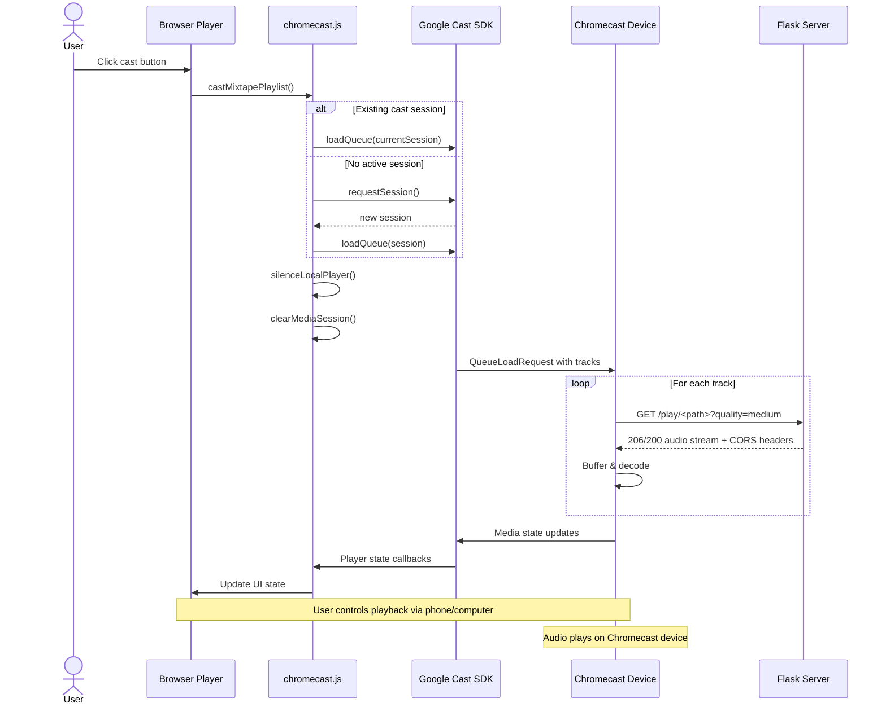
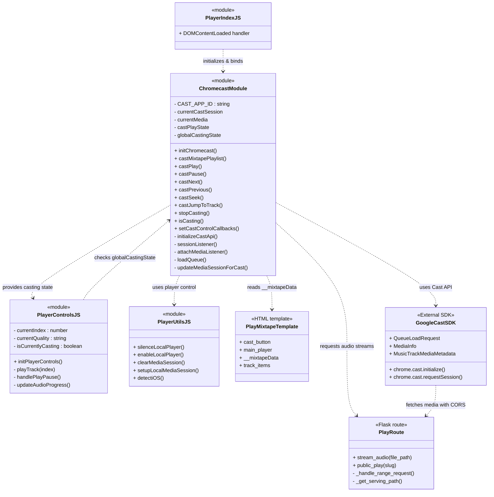

{ align=right width="90" }

**Purpose** – This document describes the **audio‑streaming subsystem** of the Mixtape Society web app.
It explains how the Flask blueprint (`play`) validates requests, resolves file paths, chooses the correct MIME type, handles quality‑aware caching, supports HTTP range requests, serves the public mixtape page, and integrates with **Chromecast for casting to external devices**.
All statements below are verified against the current source files (`routes/play.py`, the static JavaScript/CSS assets, and the auxiliary `audio_cache` module).

## 🌍 High‑Level Overview

| Responsibility | Implementation |
| -------------- | -------------- |
| Validate & resolve the requested audio file path (prevent directory-traversal) | `_resolve_and_validate_path()` |
| Determine MIME type (including custom audio extensions) | `_guess_mime_type()` |
| Select the file to serve – original or a cached/transcoded version  to the quality query param | `_get_serving_path()` (uses `AudioCache`) |
| Serve full file or partial byte ranges (seeking) | `send_file()` for full files, `_handle_range_request()` for partial |
| Return appropriate HTTP status (200, 206, 403, 404, 416, 500) | `abort()` + explicit `Response` objects |
| Render public mixtape page (`/share/<slug>`) | `public_play()` |
| Serve cover images (`/covers/<filename>`) | `serve_cover()` |
| Admin cache utilities (`/admin/cache/*`) | `cache_stats()`, `clear_cache()` |
| Generate QR code for sharing | `qr` blueprint (`/qr/<slug>.png`, `/qr/<slug>/download`) |
| Cast mixtapes to Chromecast devices | `chromecast.js` module + Google Cast SDK |

All routes live under the Flask Blueprint named `play`.

---

## 🗺️ Flask Blueprint & Routes

```python
play = Blueprint("play", __name__)   # registered in the main Flask app
```

| HTTP Method | URL Pattern | Handler | Description |
| ----------- | ----------- | ------- | ----------- |
| `GET` | `/play/<path:file_path>` | `stream_audio(file_path)` | Streams an audio file (original or cached) with optional quality & range support. |
| `GET` | `/share/<slug>` | `public_play(slug)` | Renders `play_mixtape.html` for a public mixtape; 404 if slug not found. |
| `GET` | `/covers/<filename>` | `serve_cover(filename)` | Serves a cover image from the configured `COVER_DIR`. |
| `GET` | `/qr/<slug>.png` | `qr.generate_qr(slug)` | Simple QR – returns a PNG QR code that encodes the public mixtape URL. Optional `size` and `logo` query params. |
| `GET` | `/qr/<slug>/download` | `qr.download_qr(slug)` | Enhanced QR – returns a PNG that includes the mixtape's cover art, title banner, and optional logo. Optional `size`, `include_cover`, `include_title` query params. |
| `GET` | `/admin/cache/stats` | `cache_stats()` | Returns JSON with cache size (bytes) and number of cached files. |
| `POST` | `/admin/cache/clear` | `clear_cache()` | Clears the audio cache; optional `older_than_days` query param. |

---

## 🔄 Request Flow (Detailed Sequence)

```mermaid
sequenceDiagram
    participant Client
    participant FlaskApp
    participant stream_audio()
    participant _resolve_and_validate_path()
    participant _guess_mime_type()
    participant _get_serving_path()
    participant AudioCache
    participant _handle_range_request()
    participant send_file
    participant QRBlueprint
    participant QRGen

    Client->>FlaskApp: GET /play/<file_path>?quality=medium [& Range]
    FlaskApp->>stream_audio(): Call with file_path + query
    stream_audio()->>_resolve_and_validate_path(): Validate & resolve
    _resolve_and_validate_path()-->>stream_audio(): full_path (or abort 403/404)
    stream_audio()->>_guess_mime_type(): Guess MIME
    _guess_mime_type()-->>stream_audio(): mime_type
    stream_audio()->>_get_serving_path(): Choose original or cached file (quality)
    _get_serving_path()->>AudioCache: cache.is_cached / cache.get_cache_path
    AudioCache-->>_get_serving_path(): serve_path
    alt Range header present
        stream_audio()->>_handle_range_request(): Serve partial bytes
        _handle_range_request()-->>stream_audio(): 206 Partial Content response
        stream_audio-->>FlaskApp: Return 206
    else No Range header
        stream_audio->>send_file: Send full file
        send_file-->>stream_audio(): 200 OK response
        stream_audio-->>FlaskApp: Return 200
    end
    FlaskApp-->>Client: Stream audio bytes

    %% QR flow -------------------------------------------------
    Client->>FlaskApp: GET /qr/<slug>.png?size=400&logo=true
    FlaskApp->>QRBlueprint: qr.generate_qr(slug)
    QRBlueprint->>QRGen: generate_mixtape_qr(...)
    QRGen-->>QRBlueprint: PNG bytes
    QRBlueprint-->>Client: 200 PNG (Cache‑Control: public, max‑age=3600)

    Client->>FlaskApp: GET /qr/<slug>/download?size=800&include_cover=true&include_title=true
    FlaskApp->>QRBlueprint: qr.download_qr(slug)
    QRBlueprint->>QRGen: generate_mixtape_qr_with_cover(...)
    QRGen-->>QRBlueprint: PNG bytes
    QRBlueprint-->>Client: 200 PNG (attachment filename="…-qr-code.png")
```

*The diagram now includes the **quality / cache decision** step (`_get_serving_path`).*

---

## 📦 QR‑Code Generation (Backend)

Implemented in `src/qr_generator/qr_generator.py` and exposed via the `qr` blueprint (`routes/qr_blueprint.py`).

See the dedicated **API reference** [page for the QR routes](qr_codes.md) for a full description of the two endpoints, query parameters, and error handling.

### Front‑End Integration (Editor & Player)

| Location | Trigger | What happens |
| -------- | ------- | ------------ |
| Editor page (`editor.html`) | Click the Share button (`#share-playlist`) | `static/js/editor/qrShare.js` fires → opens the QR Share Modal (`#qrShareModal`) → loads `/qr/<slug>.png` → shows a loading spinner → displays the QR image. The Download button calls `/qr/<slug>/download`. |
| Public player (`play_mixtape.html`) | Click the Share button (`#big-share-btn`) | `static/js/player/qrShare.js` performs the same flow as the editor, but uses the download endpoint by default (so the user gets a high-resolution QR with cover). |

Both modules also expose a `triggerShare()` helper that can be called programmatically (e.g., from a keyboard shortcut).

---

## 🔧 Core Helper Functions

| Function | Signature | What it does |
| -------- | --------- | ------------ |
| `_resolve_and_validate_path` | `Path _resolve_and_validate_path(file_path: str)` | Joins `MUSIC_ROOT + file_path`, resolves symlinks, ensures the result stays inside `MUSIC_ROOT`. Aborts with 403 (outside) or 404 (non-existent). |
| `_guess_mime_type` | `str _guess_mime_type(full_path: Path)` | Uses `mimetypes.guess_type`. If `None`, falls back to a hard-coded map for `.flac`, `.m4a`, `.aac`, `.ogg`, `.mp3`. |
| `_get_serving_path` | `Path _get_serving_path(original_path, quality, cache, logger)` | Quality handling: • If `quality == "original"` or the file does not need transcoding → return `original_path`. • If a cached version exists (`cache.is_cached`) → return that path (log a debug message). • Otherwise log a cache miss warning and fall back to the original file. (On-demand transcoding is commented out but ready for future use.) |
| `_handle_range_request` | `Response _handle_range_request(full_path, mime_type, range_header, file_size)` | Parses `Range: bytes=start-end`. Validates bounds, returns 206 with `Content-Range`, `Accept-Ranges`, `Content-Length`, plus CORS (`Access-Control-Allow-Origin: *`) and caching (`Cache-Control: public, max-age=3600`). Invalid ranges → 416. |
| `stream_audio` | `Response stream_audio(file_path)` | Orchestrates the steps above, adds `Accept-Ranges` header for full responses, and returns the appropriate Flask `Response`. |
| `public_play` | `Response public_play(slug)` | Retrieves mixtape JSON via `MixtapeManager.get(slug)`. 404 if missing. Renders `play_mixtape.html`. |
| `serve_cover` | `Response serve_cover(filename)` | Sends the requested cover from `app.config["COVER_DIR"]`. |
| `cache_stats` | `dict cache_stats()` | Returns `{ "cache_size_bytes": …, "cache_size_mb": …, "cached_files": … }`. |
| `clear_cache` | `dict clear_cache()` | Deletes cached files (optionally older than X days) and returns `{ "deleted_files": n, "message": … }`. |

---

## 💾 Quality & Caching Logic

*Implemented in `routes/play.py` and the auxiliary `audio_cache.py` module.*

**Why this matters** – The client can request a lower bitrate to save bandwidth on mobile connections, while the server can pre‑populate the cache (via a background job) for faster subsequent deliveries.

---

## 📶 HTTP Range Support

Only activated when the request contains a `Range` header.

1. **Parse** – `bytes=start-end` (both start and end are optional).
2. **Validate** – start/end must be within `[0, file_size‑1]` and `start ≤ end`.
3. **Respond** –
    - Status **206 Partial Content**.
    - `Content‑Range: bytes start‑end/file_size`.
    - `Accept‑Ranges: bytes`.
    - `Content‑Length: (end‑start+1)`.
    - CORS & cache headers identical to the full‑file response.
4. **Error** – Out‑of‑bounds ranges → **416 Range Not Satisfiable**.

---

## 📜 Response Headers & Logging

| Header | Value (example) | Reason |
| ------ | --------------- | ------ |
| `Accept-Ranges` | `bytes` | Advertise range support. |
| `Access-Control-Allow-Origin` | `*` | Allow any origin to embed the audio element (needed for cross-origin playback and **required for Chromecast**). |
| `Access-Control-Expose-Headers` | `Content-Type, Accept-Encoding, Range` | Required for Chromecast to access range information. |
| `Cache-Control` | `public, max-age=3600` | Enable browsers/CDNs to cache the file for 1 hour. |
| `Content-Type` | MIME from `_guess_mime_type` (e.g., `audio/flac`) | Correct media type for the player. |
| `Content-Range` (partial) | `bytes 0-1023/1234567` | Required for HTTP 206. |
| `Content-Length` (partial) | `1024` | Size of the delivered chunk. |

**Logging (via the injected `Logger`)**:

- **INFO** – Successful stream start, chosen quality, cache hit/miss.
- **WARNING** – Cache miss, malformed range header, missing file.
- **ERROR** – Exceptions while reading the file, transcoding failures, unexpected server errors.

All logs include the request path and the selected serving path, making troubleshooting straightforward.

---

## ⚠️ Error Handling & Status Codes

| Situation | Flask call | HTTP status | Log level |
| --------- | ---------- | ----------- | --------- |
| Requested file outside `MUSIC_ROOT` | `abort(403)` | 403 Forbidden | warning |
| File does not exist | `abort(404)` | 404 Not Found | warning |
| Invalid range request | `Response("Range Not Satisfiable", 416)` | 416 | warning |
| IO/system error while reading | `abort(500)` | 500 Internal Server Error | error |
| Mixtape slug not found | `abort(404)` | 404 Not Found | warning |
| ValueError or OSError in range handling | `abort(500)` | 500 Internal Server Error | error |

---

## 📡 Chromecast Integration

The Mixtape Society player supports casting entire mixtapes to Chromecast devices, allowing users to play their mixtapes on TVs and speakers throughout their home.

### Architecture Overview



### Key Components

#### 1. chromecast.js Module

Located at `static/js/player/chromecast.js`, this module handles all Chromecast interactions:

**Initialization:**
- `initChromecast()` - Loads Google Cast SDK and sets up API
- `initializeCastApi()` - Configures Cast API with app ID and session policies
- Dispatches `cast:ready` event when SDK is initialized

**Session Management:**
- `sessionListener()` - Handles new cast sessions
- `onCastSessionStart()` - Fires when casting begins
- `onCastSessionEnd()` - Cleans up when casting stops
- Sets `globalCastingState` flag for UI coordination

**Media Control:**
- `castPlay()` / `castPause()` - Playback control
- `castNext()` / `castPrevious()` - Track navigation
- `castSeek()` - Seek to specific time
- `castJumpToTrack()` - Jump to track by index
- `castTogglePlayPause()` - Toggle play/pause state

**Queue Management:**
- `castMixtapePlaylist()` - Loads entire mixtape as a queue
- `loadQueue()` - Builds queue from `window.__mixtapeData.tracks`
- Constructs proper audio URLs with quality parameter
- Includes metadata (title, artist, album, cover art)

#### 2. Media Session Integration

When casting is active, `chromecast.js` manages the browser's Media Session API:

```javascript
// Update Media Session to mirror Chromecast state
function updateMediaSessionForCast(media) {
    navigator.mediaSession.metadata = new MediaMetadata({
        title: metadata.title,
        artist: metadata.artist,
        album: metadata.albumName,
        artwork: metadata.images
    });
    
    // Set action handlers
    navigator.mediaSession.setActionHandler('play', () => castPlay());
    navigator.mediaSession.setActionHandler('pause', () => castPause());
    navigator.mediaSession.setActionHandler('previoustrack', () => castPrevious());
    navigator.mediaSession.setActionHandler('nexttrack', () => castNext());
    navigator.mediaSession.setActionHandler('seekto', (details) => {
        castSeek(details.seekTime);
    });
}
```

This allows users to control Chromecast playback from:
- Lock screen media controls
- Notification shade (Android)
- Control Center (iOS)
- Hardware media keys

#### 3. Player Controls Integration

The `playerControls.js` module checks `globalCastingState` to coordinate between local and cast playback:

```javascript
import { globalCastingState, isCasting, castPlay, castPause } from './chromecast.js';

function playTrack(index) {
    if (globalCastingState) {
        // Route to Chromecast
        castJumpToTrack(index);
        return;
    }
    // Local playback
    player.src = trackUrl;
    player.play();
}
```

#### 4. Local Player Management

When casting starts, `playerUtils.js` silences the local player:

```javascript
export function silenceLocalPlayer() {
    const player = document.getElementById('main-player');
    player.pause();
    player.src = '';
    player.load();
    player.removeAttribute('controls');
    player.volume = 0;
    player.muted = true;
}

export function clearMediaSession() {
    navigator.mediaSession.playbackState = 'none';
    navigator.mediaSession.metadata = null;
    // Remove all action handlers
}
```

This ensures:
- No duplicate media controls
- Only Chromecast controls are active
- Battery-efficient operation

### Server Requirements

For Chromecast to work properly, the Flask server must:

1. **CORS Headers** - Already implemented in `stream_audio()`:
   ```python
   response.headers["Access-Control-Allow-Origin"] = "*"
   response.headers["Access-Control-Expose-Headers"] = "Content-Type, Accept-Encoding, Range"
   ```

2. **Range Requests** - Chromecast uses range requests for seeking
   - Handled by `_handle_range_request()`
   - Returns 206 Partial Content responses

3. **Quality Support** - Chromecast respects quality parameter:
   ```
   GET /play/artist/album/track.flac?quality=medium
   ```
   - Returns transcoded MP3 if cached
   - Falls back to original if cache miss

### User Flow

1. **Cast Button Appears** - When Cast SDK loads successfully
2. **User Clicks Cast** - Opens Cast device picker
3. **Select Device** - User chooses Chromecast
4. **Queue Loads** - Entire mixtape loads to Chromecast
5. **Local Player Silenced** - Browser player pauses and hides controls
6. **Playback Begins** - Audio plays on Chromecast device
7. **Controls Unified** - Phone/computer controls Chromecast
8. **Stop Casting** - Restores local player when user stops

### iOS Support

Special considerations for iOS devices:

```javascript
function showiOSCastHelp() {
    const helpHtml = `
        <div class="alert alert-info">
            <h6>📱 Casting from iPhone</h6>
            <small>
                <strong>To cast to Chromecast:</strong><br>
                1. Install Google Home app<br>
                2. Use Chrome browser (not Safari)<br>
                3. Connect to same WiFi network<br>
                <br>
                <strong>For best experience:</strong><br>
                Add this page to your Home Screen (PWA mode)
            </small>
        </div>
    `;
}
```

iOS has limitations:
- Safari doesn't support Cast SDK (use Chrome)
- Requires Google Home app installed
- PWA mode recommended for better integration

### Technical Details

**Cast Application ID:** `CC1AD845` (Default Media Receiver)

**Queue Configuration:**
- `RepeatMode.OFF` - No repeat
- `startIndex` - Begins from current track (`window.currentTrackIndex`)
- `autoplay: true` - Tracks play sequentially
- `preloadTime: 5` - Preload 5 seconds of next track

**State Management:**
- `globalCastingState` - Boolean flag for casting status
- `currentCastSession` - Active Cast session object
- `currentMedia` - Current media controller
- `castPlayState` - Player state ('IDLE', 'PLAYING', 'PAUSED', 'BUFFERING')

**Callbacks:**
```javascript
setCastControlCallbacks({
    onTrackChange: (index) => { /* Update UI */ },
    onPlayStateChange: (state) => { /* Update buttons */ },
    onTimeUpdate: (time) => { /* Update progress */ }
});
```

### Testing Checklist

- [ ] Cast button appears when SDK loads
- [ ] Device picker opens on click
- [ ] Mixtape loads to Chromecast
- [ ] Local player silences when casting starts
- [ ] Play/pause controls work
- [ ] Previous/next track navigation works
- [ ] Seeking works via Media Session
- [ ] Lock screen controls work (mobile)
- [ ] Queue plays through entire mixtape
- [ ] Stopping cast restores local player
- [ ] Quality parameter respected
- [ ] Cover art displays on Chromecast
- [ ] Metadata shows correctly

### Troubleshooting

**Cast button not appearing:**
- Check browser console for Cast SDK load errors
- Verify `cast-framework.js` CDN is accessible
- Ensure HTTPS (Cast requires secure context)

**Audio not playing:**
- Check CORS headers in network tab
- Verify audio URLs are absolute (not relative)
- Confirm MIME types are correct
- Check server logs for 403/404 errors

**Seeking not working:**
- Verify Range header support in `_handle_range_request()`
- Check `Access-Control-Expose-Headers` includes "Range"
- Confirm 206 responses working correctly

**iOS issues:**
- User must use Chrome browser (not Safari)
- Google Home app required
- Both devices on same WiFi network
- Consider showing help message automatically

---

## 📐 Class & Sequence Diagrams

### Chromecast Architecture



### Blueprint/Class Diagram


### Sequence Diagram

```mermaid
sequenceDiagram
    participant Client
    participant FlaskApp
    participant stream_audio()
    participant _resolve_and_validate_path()
    participant _guess_mime_type()
    participant _get_serving_path()
    participant AudioCache
    participant _handle_range_request()
    participant send_file

    Client->>FlaskApp: GET /play/<file_path>?quality=medium [& Range]
    FlaskApp->>stream_audio(): Call with file_path + query
    stream_audio->>_resolve_and_validate_path(): Validate & resolve
    _resolve_and_validate_path-->>stream_audio(): full_path (or abort 403/404)
    stream_audio->>_guess_mime_type(): Guess MIME
    _guess_mime_type-->>stream_audio(): mime_type
    stream_audio->>_get_serving_path(): Choose original or cached file (quality)
    _get_serving_path->>AudioCache: cache.is_cached / cache.get_cache_path
    AudioCache-->>_get_serving_path(): serve_path
    alt Range header present
        stream_audio->>_handle_range_request(): Serve partial bytes
        _handle_range_request-->>stream_audio(): 206 Partial Content response
        stream_audio-->>FlaskApp: Return 206
    else No Range header
        stream_audio->>send_file: Send full file
        send_file-->>stream_audio(): 200 OK response
        stream_audio-->>FlaskApp: Return 200
    end
    FlaskApp-->>Client: Stream audio bytes
```

## 🔌 API

### ::: src.routes.play
