```mermaid
sequenceDiagram
    participant UI as Browser
    participant Flask as QR Blueprint
    participant MM as MixtapeManager
    participant FS as FileSystem (static folder)

    UI->>Flask: GET /qr/awesome-mixtape.png?size=400&logo=true
    Flask->>MM: mixtape_manager.get('awesome-mixtape')
    alt mixtape exists
        MM-->>Flask: mixtape dict
        Flask->>FS: Resolve logo.svg / logo.png (if requested)
        Flask->>QRGen: generate_mixtape_qr(...)
        QRGen-->>Flask: PNG bytes
        Flask-->>UI: 200 PNG (Cache‑Control: public, max‑age=3600)
    else
        Flask-->>UI: 404 “Mixtape not found”
    end
```

{ align=right width="90" }

# QR Codes

## 🌍 High‑Level Overview

The QR blueprint (qr_blueprint.py) provides two public endpoints that generate QR‑code images for a mixtape’s share URL:

| Feature | Description |
|--------|-------------|
| Simple QR (`/qr/<slug>.png`) | Returns a plain PNG QR code (optional logo overlay, configurable size). |
| Enhanced QR (`/qr/<slug>/download`) | Returns a QR code that can embed the mixtape’s cover art and title banner, and is served as a downloadable attachment. |
| Cache-Control | Both endpoints set `Cache-Control: public, max-age=3600` so browsers cache the image for one hour. |
| Graceful fallback | If the logo or cover image is missing, the generator falls back to a plain QR code. |
| Stateless | The blueprint only reads data from the injected MixtapeManager and Flask’s static folder; no session data is stored. |

## 🗺️ Flask Blueprint & Routes

### `/qr/<slug>.png`

| Method | Description |
|--------|-------------|
| `GET` | Returns a simple QR code PNG that encodes the public share URL for the mixtape identified by `<slug>`. |

Request flow (simplified)



### `/qr/<slug>/download`

| Method | Description |
|--------|-------------|
| `GET` | Returns an enhanced QR code PNG that can include the mixtape’s cover art and a title banner. The image is served as a downloadable attachment (`Content-Disposition: attachment`). |

Request flow (simplified)



```mermaid
sequenceDiagram
    participant UI as Browser
    participant Flask as QR Blueprint
    participant MM as MixtapeManager
    participant FS as FileSystem (static folder)

    UI->>Flask: GET /qr/awesome-mixtape/download?size=800&include_cover=true&include_title=true
    Flask->>MM: mixtape_manager.get('awesome-mixtape')
    alt mixtape exists
        MM-->>Flask: mixtape dict
        Flask->>FS: Resolve logo.svg / logo.png
        Flask->>FS: Resolve mixtape cover (if requested)
        Flask->>QRGen: generate_mixtape_qr_with_cover(...)
        QRGen-->>Flask: PNG bytes
        Flask-->>UI: 200 PNG (attachment filename="<title>-qr-code.png")
    else
        Flask-->>UI: 404 “Mixtape not found”
    end
```

## 🕵🏻‍♂️ Query Parameters

| Parameter | Endpoint | Type | Default | Allowed range / values | Description |
|----------|----------|------|---------|------------------------|-------------|
| `size` | both | integer | 400 (simple) / 800 (download) | 1–800 (simple), 1–1200 (download) | Pixel dimension of the generated QR code (square). |
| `logo` | simple | boolean-like string | `"true"` | `"true"` / `"false"` (case-insensitive) | Whether to overlay the site logo (SVG or PNG) in the centre of the QR. |
| `include_cover` | download | boolean-like string | `"true"` | `"true"` / `"false"` | Include the mixtape’s cover art in the QR (centered). |
| `include_title` | download | boolean-like string | `"true"` | `"true"` / `"false"` | Render the mixtape title as a banner underneath the QR. |

!!! Note
    All parameters are optional. Missing or malformed values fall back to the defaults.

## 🗨️ Response Details

| Status | Content-Type | Body | Headers |
| ------ | ------------ | ---- | ------- |
| **200 OK** | `image/png` | Raw PNG bytes (the QR code). | `Cache-Control: public, max-age=3600`<br>`Content-Disposition:`<br>• Simple QR – `inline; filename="<slug>-qr.png"`<br>• Download QR – `attachment; filename="<title>-qr-code.png"` |
| **404 Not Found** | `application/json` | `{ "error": "Mixtape not found" }` | — |
| **500 Internal Server Error** | `application/json` | `{ "error": "Failed to generate QR code" }` (or a more specific message if the `qrcode` library is missing). | — |

## ⚠️ Error Handling

The blueprint catches two main error families:

1. **Missing third‑party library** – If `qrcode` (or `Pillow`) is not installed, an `ImportError` is raised. The handler logs the error and returns **500** with a helpful message:

    ```text
    QR code generation not available. Install qrcode library.
    ```

2. **Unexpected runtime errors** – Any other exception is logged (`logger.exception`) and a generic 500 response is sent:

    ```text
    Failed to generate QR code
    ```

All 404 cases are handled by checking `mixtape_manager.get(slug)` and calling `abort(404, description="Mixtape not found")`.

## 🔀 Internal Workflow

```mermaid
sequenceDiagram
    participant UI as Browser
    participant Flask as QR Blueprint
    participant MM as MixtapeManager
    participant QRGen as QR Generator (qr_generator.py)
    participant FS as FileSystem (static folder)

    UI->>Flask: GET /qr/<slug>.png?size=400&logo=true
    Flask->>MM: mixtape_manager.get(slug)
    alt mixtape exists
        MM-->>Flask: mixtape dict
        Flask->>FS: Resolve logo.svg (fallback to logo.png)
        Flask->>QRGen: generate_mixtape_qr(url, title, logo_path, size)
        QRGen-->>Flask: PNG bytes
        Flask-->>UI: 200 PNG (Cache‑Control)
    else
        Flask-->>UI: 404
    end
```



*The **download** endpoint follows the same flow, with two extra steps: resolving the mixtape cover image and calling `generate_mixtape_qr_with_cover`.*

## 🔧 Configuration & Dependencies

| Setting | Where it lives | Default | Remarks |
| ------- | -------------- | ------- | ------- |
| **`qrcode`** (Python library) | `project.toml` / `uv.lock` | `>=7.4` | Required for both endpoints. |
| **`Pillow`** (image handling) | `project.toml` | `>=10.0` | Needed for compositing the logo/cover. |
| **Static logo files** | `static/logo.svg` or `static/logo.png` | — | The blueprint prefers SVG; falls back to PNG. |
| **Cover directory** | `app.config["COVER_DIR"]` (set in config.py) | `collection-data/mixtapes/covers` | Used only by the download endpoint. |
| **Cache-Control** | Hard-coded in the view (`public, max-age=3600`). | — | Adjust in the source if you need a different TTL. |

!!! Tip
    If you ever need to change the logo location, edit qr_blueprint.py where logo_path is resolved:

    ```python
    logo_path = Path(current_app.static_folder) / "logo.svg"
    if not logo_path.exists():
        logo_path = Path(current_app.static_folder) / "logo.png"
    ```

## 📌 Example Requests

### Simple QR (browser)

```bash
curl -L -o mixtape-qr.png \
  "http://localhost:5000/qr/awesome-mixtape.png?size=400&logo=true"
```

*Result*: `mixtape-qr.png` – a 400 × 400 PNG with the site logo in the centre.

### Enhanced QR (download)

```bash
curl -L -O \
  "http://localhost:5000/qr/awesome-mixtape/download?size=800&include_cover=true&include_title=true"
```

*Result*: The server sends a `Content‑Disposition: attachment` header; the file will be saved as something like `Awesome‑Mixtape-qr-code.png`.

### Using the QR from the Editor UI

The editor page (`editor.html`) contains a Share button (`#share-playlist`). When the user clicks it, the JavaScript module `static/js/editor/qrShare.js`:

1. Retrieves the current mixtape slug (from the hidden `#editing-slug` input or `window.PRELOADED_MIXTAPE`).
   1. Opens the **QR Share Modal** (`#qrShareModal`).
2. Sets the `` source to `/qr/<slug>.png?...`.
3. Shows a loading spinner until the image loads, then displays the QR.
4. You can see the full client‑side implementation in `editorQrShare.txt`.

### Using the QR from the Public Player UI

The public player page (`play_mixtape.html`) includes a Share button (`#big-share-btn`). Its logic lives in `static/js/player/qrShare.js`:

* The same modal (`#qrShareModal`) is reused, but the download endpoint is called (`/qr/<slug>/download`) when the user clicks the Download button.

Both modules share the same modal markup (see the bottom of `editor.html` and `play_mixtape.html`).

## 🖥️ Front‑End Integration

| File | Role |
|------|------|
| `editor.html` | Contains the Share button (`#share-playlist`) and the QR Share Modal markup (bottom of the file). |
| `static/js/editor/qrShare.js` | Handles the editor-side flow: shows the modal, builds the QR URL, loads the image, and implements the Download and Copy-link actions. |
| `play_mixtape.html` | Re-uses the same modal (`#qrShareModal`) and adds a Share button (`#big-share-btn`) in the player UI. |
| `static/js/player/qrShare.js` | Mirrors the editor logic for the public player (opens modal, loads QR, handles download/copy). |
| `qr_generator.py` (imported by the blueprint) | Provides `generate_mixtape_qr` and `generate_mixtape_qr_with_cover`. It uses the `qrcode` library + Pillow to compose the final PNG. |

!!! Important
    Both JS modules listen for a custom mixtape-saved event (dispatched by the editor after a successful save) to enable the **Share** button. If you add a new UI element that can trigger sharing, make sure to dispatch the same event or call `triggerShare()` exported from `editorQrShare.js`.

## 🔌 API

### ::: src.routes.qr_blueprint
