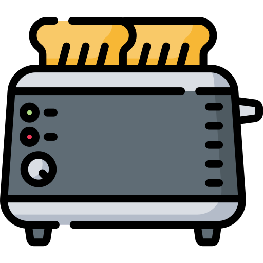

{ align=right width="90" }

# Toast System Quick Reference

## 📦 Import

```javascript
import {
    showSuccessToast,
    showInfoToast,
    showWarningToast,
    showErrorToast,
    showPWAToast,
    showPlaybackErrorToast,
    showToast,
    TOAST_TYPES
} from './common/toastSystem.js';
```

## 🚀 Quick Usage

```javascript
// ✅ Success (green, 3s)
showSuccessToast('Saved successfully!');

// ℹ️ Info (blue, 4s)
showInfoToast('Loading data...');

// ⚠️ Warning (yellow, 5s)
showWarningToast('Slow connection detected');

// ❌ Error (red, stays visible)
showErrorToast('Failed to save');

// 📱 PWA (blue, 3s, priority 10, z-index 9999)
showPWAToast('App installed successfully!');
```

## ⚙️ With Options

```javascript
// Custom duration
showInfoToast('Quick message', { duration: 2000 });

// Force auto-hide on error
showErrorToast('Minor error', { autohide: true });

// Prevent auto-hide
showWarningToast('Important!', { autohide: false });
```

## 🧩 With Actions

```javascript
showErrorToast('Connection lost', {
    actions: [
        {
            label: 'Retry',
            handler: () => retry(),
            primary: true  // Primary styling
        },
        {
            label: 'Cancel',
            handler: () => cancel()
        }
    ]
});
```

## 🎵 Playback Errors

```javascript
// Terminal error with skip button
showPlaybackErrorToast('Cannot play track', {
    isTerminal: true,
    onSkip: () => playNext()
});

// Non-terminal error (auto-hide)
showPlaybackErrorToast('Buffering issue', {
    isTerminal: false
});
```

## 📱 PWA System Toasts

```javascript
// High-priority PWA events (show immediately, z-index 9999)
showPWAToast('App installed successfully!');
showPWAToast('Update available');
showPWAToast('Back online');
showPWAToast('You are offline');

// Use for: Install, updates, connectivity changes
// Priority 10: Interrupts lower-priority toasts
// Z-index 9999: Appears above modals
```

## 🕹️ Programmatic Control

```javascript
// Get control object
const toast = showInfoToast('Processing...');

// Later, dismiss it
toast.dismiss();

// Example pattern
const loading = showInfoToast('Loading...');
doWork()
    .then(() => {
        loading.dismiss();
        showSuccessToast('Done!');
    })
    .catch(() => {
        loading.dismiss();
        showErrorToast('Failed');
    });
```

## 🧓 Legacy Compatibility

```javascript
import { showLegacyToast } from './common/toastSystem.js';

// Bootstrap type names
showLegacyToast('Success', 'success');
showLegacyToast('Error', 'danger');
showLegacyToast('Warning', 'warning');
showLegacyToast('Info', 'info');
```

## 🏷️ Toast Types

| Type | Color | Duration | Auto-hide | Priority | Icon |
| ---- | ----- | -------- | --------- | -------- | ---- |
| SUCCESS | Green | 3s | Yes | 1 | ✅ Check |
| INFO | Blue | 4s | Yes | 1 | ℹ️ Info |
| WARNING | Yellow | 5s | Yes | 1 | ⚠️ Warning |
| ERROR | Red | 8s | **No** | 2 | ❌ Triangle |
| PWA | Blue | 3s | Yes | 10 | 📱 App |

## 📬 Queue Behavior

- Toasts show one at a time
- New toasts queue automatically
- User can dismiss current toast early
- Next toast shows immediately after

## 🧠 Common Patterns

### Save Operation

```javascript
const save = async () => {
    const toast = showInfoToast('Saving...');
    try {
        await saveData();
        toast.dismiss();
        showSuccessToast('Saved!');
    } catch (err) {
        toast.dismiss();
        showErrorToast(`Failed: ${err.message}`);
    }
};
```

### Multiple Operations

```javascript
items.forEach(item => {
    processItem(item);
    showSuccessToast(`Processed ${item.name}`);
});
// All toasts show in sequence!
```

### Error with Recovery

```javascript
showErrorToast('Operation failed', {
    autohide: false,
    actions: [
        { label: 'Retry', handler: () => retry(), primary: true },
        { label: 'Cancel', handler: () => cancel() }
    ]
});
```

## 💡 Tips

✅ **DO**:

- Use appropriate type for message severity
- Keep messages brief (one sentence max)
- Provide actions for errors when possible
- Use queue naturally for sequential operations

❌ **DON'T**:

- Spam toasts rapidly (users can't read them)
- Make critical errors auto-hide
- Use long messages (keep under 50 chars)
- Nest toasts in loops without throttling

## 📁 Module Location

`/static/js/common/toastSystem.js`

## 🔗 Dependencies

- ES6 modules
- Bootstrap 5 (for styling)
