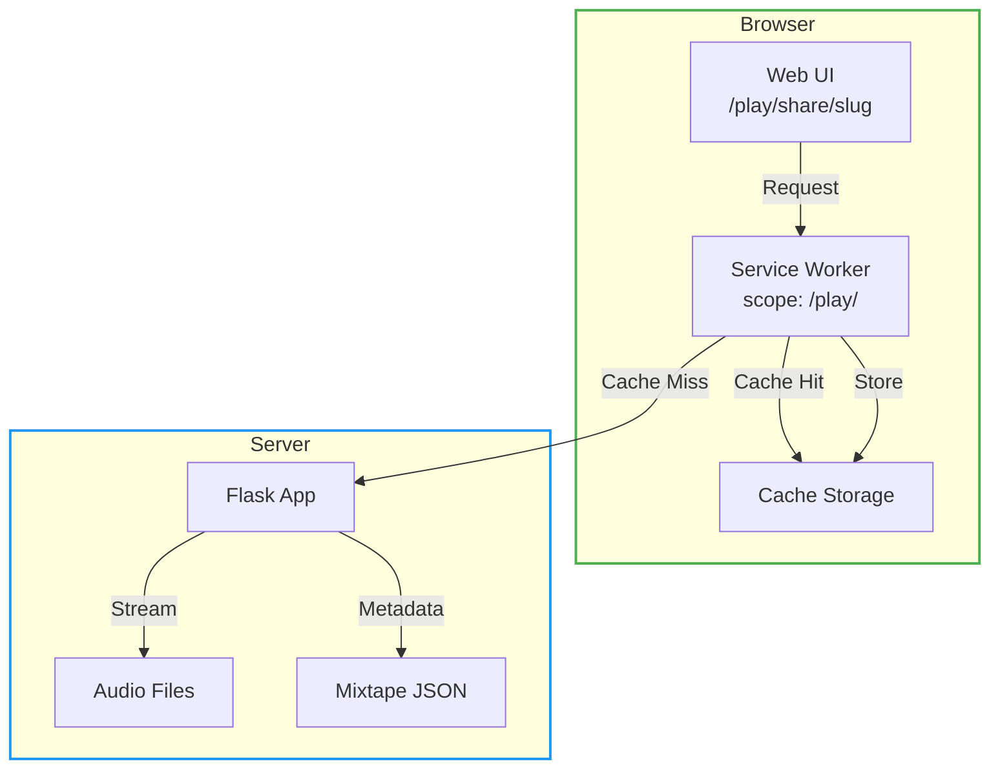
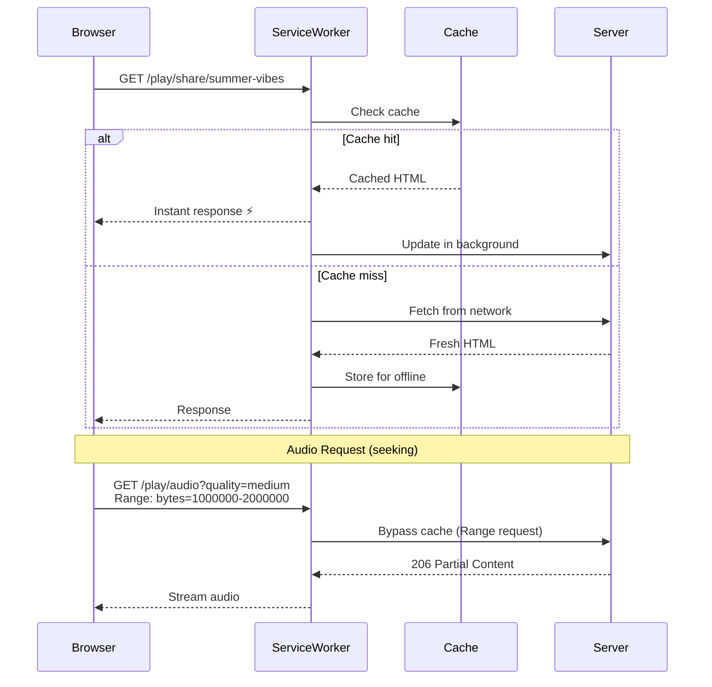

{ align=right width="90" }

**Purpose** — This document describes the **Progressive Web App (PWA) capabilities** of Mixtape Society's public sharing feature.
It explains how the service worker enables offline playback, how audio caching works with range requests, the installation flow, and how the manifest scopes the PWA to public routes only.
All statements below are verified against the current source files (`service-worker.js`, `static/js/pwa/pwa-manager.js`, and `manifest.json`).

## 🌍 High-Level Overview

| Responsibility | Implementation |
| -------------- | -------------- |
| Register service worker scoped to `/play/` | `pwa-manager.js` → `registerServiceWorker()` |
| Cache static assets (CSS, JS, images) | Service worker → `STATIC_ASSETS` array |
| Cache audio files for offline playback | Service worker → `handleAudioRequest()` |
| Handle HTTP range requests (seeking) | Service worker → bypass cache for 206 responses |
| Cache mixtape pages and metadata | Service worker → `handleMixtapePage()` |
| Manage cache storage and limits | `pwa-manager.js` → `getCacheSize()`, `clearCache()` |
| Handle app installation prompts | `pwa-manager.js` → `setupInstallPrompt()` |
| Detect online/offline status | `pwa-manager.js` → `setupNetworkDetection()` |

### Scope Restriction

The PWA functionality is intentionally scoped to `/play/` routes only. Authenticated routes (`/mixtapes`, `/editor`, etc.) always require live database access and are never cached.

## 🗺️ PWA Architecture



## 📦 Core Components

### 1. Service Worker (`service-worker.js`)

Located at app root, handles all offline caching logic.

#### Cache Strategy by Resource Type

| Resource Type | Strategy | Cache Name | Why |
| ------------- | -------- | ---------- | --- |
| Static assets (CSS/JS) | Cache-first | `mixtape-static-v1.0.0` | Instant page loads |
| Audio files | Cache-first | `mixtape-audio-v1.0.0` | Offline playback |
| Cover images | Cache-first | `mixtape-images-v1.0.0` | Fast thumbnails |
| Mixtape pages | Network-first | `mixtape-metadata-v1.0.0` | Fresh content when online |
| CDN resources | Cache-first | `mixtape-static-v1.0.0` | Bootstrap, Vibrant.js, etc. |

#### Range Request Handling

- Full file requests (no `Range` header) → Cached as 200 OK
- Partial requests (`Range` header present) → Bypass cache, serve 206 from server
- Seeking always requires network (Cache API limitation)

### 2. PWA Manager (`pwa-manager.js`)

Client-side orchestration of PWA features.

**Key Responsibilities:**

```javascript
class PWAManager {
    registerServiceWorker()      // Register SW with /play/ scope
    setupInstallPrompt()         // Capture beforeinstallprompt
    setupNetworkDetection()      // Online/offline indicators
    downloadMixtapeForOffline()  // Batch download tracks
    showCacheManagement()        // Storage UI modal
    clearCache(type)             // Delete cached resources
}
```

### 3. Manifest (Dynamic per Mixtape)

Each mixtape generates its own PWA manifest dynamically at `/play/share/{slug}/manifest.json`.

**Why Dynamic Manifests?**

- ✅ Each mixtape can be installed as its own PWA
- ✅ PWA icon shows the mixtape's cover art
- ✅ PWA name is the mixtape's title
- ✅ Opening the PWA goes directly to that specific mixtape
- ✅ No 404 errors when launching from home screen

**Example Dynamic Manifest:**

```json
{
  "name": "Summer Vibes 2024",
  "short_name": "Summer Vibe",
  "description": "A mixtape with 12 tracks",
  "start_url": "/play/share/summer-vibes-2024",
  "scope": "/play/",
  "display": "standalone",
  "background_color": "#198754",
  "theme_color": "#198754",
  "icons": [
    {
      "src": "/play/covers/summer-cover.jpg",
      "sizes": "512x512",
      "type": "image/jpeg",
      "purpose": "any maskable"
    }
  ]
}
```

**Backend Implementation:**

```python
# play.py - Dynamic manifest endpoint
@play.route("/share/<slug>/manifest.json")
def mixtape_manifest(slug: str) -> Response:
    """Generate dynamic PWA manifest for specific mixtape"""
    mixtape = mixtape_manager.get(slug)
    if not mixtape:
        abort(404)

    # Use mixtape cover as PWA icon
    icon_url = f"/play/covers/{mixtape['cover'].split('/')[-1]}" \
               if mixtape.get('cover') \
               else "/static/icons/icon-512.png"

    manifest = {
        "name": mixtape.get('title', 'Mixtape'),
        "short_name": mixtape.get('title', 'Mixtape')[:12],
        "description": f"A mixtape with {len(mixtape.get('tracks', []))} tracks",
        "start_url": f"/play/share/{slug}",
        "scope": "/play/",
        "display": "standalone",
        "background_color": "#198754",
        "theme_color": "#198754",
        "icons": [{
            "src": icon_url,
            "sizes": "512x512",
            "type": "image/jpeg" if mixtape.get('cover') else "image/png",
            "purpose": "any maskable"
        }]
    }

    return Response(json.dumps(manifest, indent=2),
                   mimetype='application/manifest+json',
                   headers={'Cache-Control': 'public, max-age=3600'})
```

**Template Integration:**

```html
<!-- play_mixtape.html - Dynamic manifest per mixtape -->
<link rel="manifest" href="/play/share/{{ mixtape.slug }}/manifest.json">
<meta name="apple-mobile-web-app-title" content="{{ mixtape.title }}">
```

**Scope Restriction:** All mixtapes share the `/play/` scope, which means:

- ✅ One service worker handles all mixtapes efficiently
- ✅ Public mixtape receivers get offline capabilities
- ✅ Authenticated creator tools always hit the database
- ✅ No stale data in admin interfaces
- ✅ Each mixtape still gets its own home screen icon and name

## 🔄 Request Flow (Offline-Capable)



## 🎵 Audio Caching with Range Requests

### The Challenge

HTTP range requests (used for audio seeking) return **206 Partial Content** responses, which the Cache API **cannot store**. Only full **200 OK** responses can be cached.

### The Solution

1. **Detect range requests:**

   ```javascript
   const isRangeRequest = request.headers.has('Range');
   if (isRangeRequest) {
       return fetch(request); // Bypass cache
   }
   ```

2. **Cache only full files:**

   ```javascript
   if (response.ok && response.status === 200) {
       cache.put(cacheKey, response.clone());
   }
   ```

3. **Background caching requests full files:**

   ```javascript
   // No Range header = get complete file
   const fullRequest = new Request(url, { method: 'GET' });
   ```

### User Experience Impact

| Scenario | Behavior |
| -------- | -------- |
| Playing uncached track | Streams from server, caches full file |
| Playing cached track | Instant playback from cache ⚡ |
| Seeking in uncached track | Fetches partial range from server |
| Seeking in cached track | Fetches partial range from server* |
| Download for offline | Downloads complete files (200 OK) |

**\*Why seek needs network:** Cache API limitation - cannot serve partial responses from cached full files.

## 📥 Download for Offline

**User Flow:**

1. User opens shared mixtape: `/play/share/summer-vibes`
2. Clicks "Download for Offline" button
3. PWA Manager downloads all tracks in parallel (3 at a time)
4. Progress indicator shows completion
5. All tracks now available offline

**Implementation:**

```javascript
async downloadMixtapeForOffline() {
    const tracks = window.__mixtapeData.tracks;
    const quality = localStorage.getItem('audioQuality') || 'medium';

    // Download in batches of 3
    for (let i = 0; i < tracks.length; i += 3) {
        const batch = tracks.slice(i, i + 3);
        await Promise.allSettled(
            batch.map(track => this.cacheAudioFile(track.path, quality))
        );
    }
}

async cacheAudioFile(path, quality) {
    // Send message to service worker
    return new Promise((resolve, reject) => {
        const messageChannel = new MessageChannel();
        messageChannel.port1.onmessage = (event) => {
            event.data.success ? resolve() : reject();
        };

        this.swRegistration.active.postMessage(
            { action: 'CACHE_AUDIO', data: { url: path, quality } },
            [messageChannel.port2]
        );
    });
}
```

## 🔧 Backend Integration

### Flask Routes

```python
# In app.py - serve PWA files

@app.route('/service-worker.js')
def service_worker():
    """Serve service worker with proper headers"""
    response = send_from_directory('.', 'service-worker.js',
                                   mimetype='application/javascript')
    response.headers['Cache-Control'] = 'no-cache, no-store, must-revalidate'
    response.headers['Service-Worker-Allowed'] = '/play/'  # Scope restriction
    return response

@app.route('/manifest.json')
def manifest():
    """Serve PWA manifest"""
    return send_from_directory('.', 'manifest.json',
                              mimetype='application/manifest+json')
```

### Template Integration

PWA features are loaded **only in `play_mixtape.html`**, not in `base.html`:

```html
<!-- play_mixtape.html only -->

    <link rel="manifest" href="/manifest.json">
    <meta name="theme-color" content="#198754">
    <meta name="apple-mobile-web-app-capable" content="yes">
    <meta name="mobile-web-app-capable" content="yes">



    <script type="module" src="{{ url_for('static', filename='js/pwa/pwa-manager.js') }}"></script>

```

This ensures PWA only activates for public mixtape pages, not authenticated routes.

## 📊 Cache Management

### Storage Limits

```javascript
// Check storage quota
const estimate = await navigator.storage.estimate();
console.log(`Using ${estimate.usage} of ${estimate.quota} bytes`);
// Typical: ~60% of free disk space on Chrome
```

### Cache Clearing

#### User Interface

- Storage management modal shows cache breakdown
- Clear buttons for specific cache types
- Automatic cleanup when quota reached

#### Programmatic

```javascript
// Clear audio cache only
await pwaManager.clearCache('audio');

// Clear everything
await pwaManager.clearCache('all');
```

## 🔄 Update Handling

### Service Worker Updates

#### Automatic Detection

```javascript
registration.addEventListener('updatefound', () => {
    const newWorker = registration.installing;
    newWorker.addEventListener('statechange', () => {
        if (newWorker.state === 'installed' && navigator.serviceWorker.controller) {
            // New version available!
            showUpdateNotification();
        }
    });
});
```

#### User Prompt

```html
<div class="update-notification">
    Update available
    <button onclick="updateServiceWorker()">Update Now</button>
</div>
```

### Mixtape Content Updates

When a mixtape changes (tracks added/removed/reordered), the service worker uses **network-first** strategy for mixtape pages:

1. Fetch from server (get latest version)
2. If successful, update cache
3. If offline, serve cached version
4. Show "viewing cached version" indicator

## 📱 Installation Flow (Per-Mixtape PWAs)

Each shared mixtape can be installed as its own standalone app with a unique icon and name.

### Desktop (Chrome/Edge)

1. User visits `/play/share/summer-vibes-2024`
2. Browser shows install icon in address bar
3. Click → "Install **Summer Vibes 2024**" (uses mixtape title)
4. App opens in standalone window
5. **Icon on taskbar shows mixtape cover art**

### Mobile (Android)

1. User visits shared mixtape link
2. Chrome shows "Add **Summer Vibes 2024** to Home Screen" banner
3. Or tap menu → "Install App"
4. **Icon appears on home screen with mixtape cover as icon**
5. Launches directly to that mixtape (no navigation needed)
6. **Can install multiple mixtapes** - each gets its own icon

### Mobile (iOS)

1. User visits shared mixtape link
2. Tap Share button
3. Select "Add to Home Screen"
4. **Edit name if desired** (defaults to mixtape title)
5. Icon appears on home screen
6. Opens directly to the mixtape

### Installation Benefits

**Before (Static Manifest):**

- ❌ 404 errors when launching from home screen
- ❌ Generic "Mixtape Society" icon
- ❌ Opens to main page, user has to navigate
- ❌ Confusing if multiple mixtapes installed

**After (Dynamic Manifests):**

- ✅ Direct launch to specific mixtape
- ✅ Unique cover art as icon
- ✅ Clear mixtape title as app name
- ✅ Can install many mixtapes without confusion
- ✅ Perfect for gift mixtapes - truly personal

### Multiple Installations

Users can install as many mixtapes as they want:

```text
Home Screen:
┌────────────┬────────────┬────────────┐
│ Summer     │ Road Trip  │ Chill      │
│ Vibes 2024 │ Mix        │ Sundays    │
│ [cover 1]  │ [cover 2]  │ [cover 3]  │
└────────────┴────────────┴────────────┘
```

Each opens directly to its own mixtape - no confusion!

## 🧪 Testing & Debugging

### Chrome DevTools

#### Application Tab

- Manifest: Verify icons and config
- Service Workers: Check registration status
- Cache Storage: Inspect cached resources
- Storage: Check quota usage

#### Offline Testing

1. Open DevTools → Application → Service Workers
2. Check "Offline" box
3. Reload page
4. Should still load from cache ✅

### Console Commands

```javascript
// Check SW status
navigator.serviceWorker.getRegistration().then(reg => {
    console.log('Scope:', reg.scope);
    console.log('Active:', reg.active?.state);
});

// Check cache contents
caches.keys().then(keys => {
    console.log('Caches:', keys);
    keys.forEach(key => {
        caches.open(key).then(cache => {
            cache.keys().then(reqs => {
                console.log(`${key}:`, reqs.length, 'items');
            });
        });
    });
});

// Check storage
navigator.storage.estimate().then(est => {
    const used = (est.usage / 1024 / 1024).toFixed(2);
    const total = (est.quota / 1024 / 1024).toFixed(2);
    console.log(`Storage: ${used} MB / ${total} MB`);
});
```

## ⚠️ Limitations & Known Issues

### What Works Offline

✅ View mixtape page and metadata
✅ See cover art and track list
✅ Play downloaded tracks
✅ Read liner notes

### What Requires Network

❌ Seeking in tracks (range requests)
❌ Downloading new tracks
❌ Checking for mixtape updates
❌ Authenticated routes (`/mixtapes`, `/editor`)

### Browser Support

| Browser | Service Workers | Install | Offline |
| ------- | --------------- | ------- | ------- |
| Chrome 90+ | ✅ | ✅ | ✅ |
| Edge 90+ | ✅ | ✅ | ✅ |
| Firefox 90+ | ✅ | ⚠️ Limited | ✅ |
| Safari 14+ | ✅ | ⚠️ Manual | ✅ |

## 📈 Performance Metrics

### Cache Hit Rates

- Static assets: ~95% (after first visit)
- Cover images: ~90%
- Audio files: ~60% (depends on downloads)
- Mixtape pages: ~80%

### Load Times

- First visit: ~2-3s (network dependent)
- Return visit (cached): ~100-300ms ⚡
- Offline visit: ~100ms ⚡

## 🔐 Security Considerations

### HTTPS Requirement

Service workers **require HTTPS** in production (localhost exempted for development).

### Scope Isolation

The `/play/` scope ensures authenticated routes cannot be hijacked or cached inappropriately.

### Content Security

- No user-generated code in service worker
- Cache keys validated before storage
- CORS headers properly configured

## 📚 Related Documentation

- [Audio Streaming](../../audio-playback/backend/audio-streaming.md) - How audio streaming works
- [Mixtape Manager](../../mixtape-system/manager-backend.md) - Mixtape data persistence
- [Configuration](../../configuration.md) - Environment setup

## 🔗 External Resources

- [MDN: Service Worker API](https://developer.mozilla.org/en-US/docs/Web/API/Service_Worker_API)
- [Web.dev: PWA Patterns](https://web.dev/offline-cookbook/)
- [Cache API Specification](https://w3c.github.io/ServiceWorker/#cache-interface)
