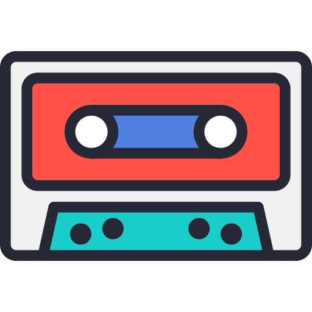

{ align=right width="90" }

# The Mixtape Editor

The Mixtape Editor lets you craft personal mixtapes by searching your music library, adding tracks, reordering them, and customizing the cover and title. It evokes the joy of making a real cassette for a friend—simple, intuitive, and fun.

## Features

- Live search with result highlighting
- Drag-and-drop track reordering (Sortable.js)
- Automatic cover extraction from the first track’s album
- Manual cover upload (drag or paste)
- Title auto-sanitizes to create clean URLs
- One-click “Save” → instantly get a public link

## How to Create a Mixtape

1. **Start a New Mixtape**

    Log in and click "New Mixtape" on the browse page. This opens the blank editor.

2. **Search and Add Tracks**

    Type in the search bar to find songs, artists, or albums. Results highlight matches live for quick scanning.

    Click a track to add it to your mixtape.

3. **Reorder Tracks**

    Drag and drop tracks in the playlist to perfect the flow (powered by Sortable.js).

4. **Customize the Cover Art**

    The app auto-extracts cover art from the first track's album.

    Upload manually.

5. **Add liner notes**

    What would you want your friend to know about the mixtape?

    You can refer to tracks by using `#1` or ranges of tracks `#1-4`, which will turn into track titles and artist names when viewing the mixtape.

6. **Add a Title and Save**

    Enter a title (it auto-generates a clean, URL-friendly slug).

    Click Save (or press Ctrl + Enter) – your mixtape saves instantly, and you get a public share link.

## Keyboard shortcuts

- `Ctrl + Enter` – Save mixtape
- `Escape` – Clear search field

!!! tip "Pro Tip"
    Start with a strong opener track—the app uses its album art as the default cover for that perfect first impression.

Once saved, head to the [Sharing page](sharing.md) to learn how to send your mixtape to friends. Enjoy the magic! 🚀
