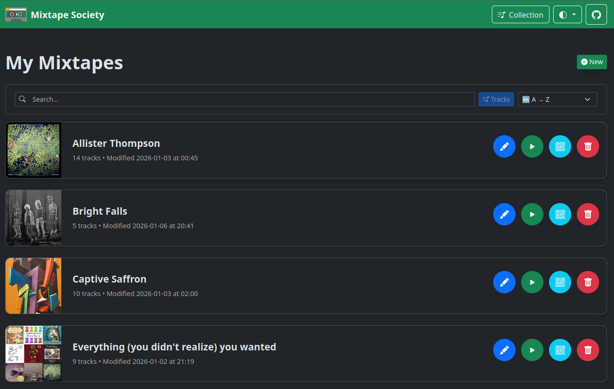
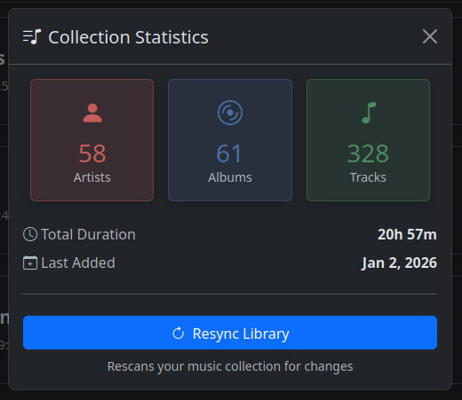
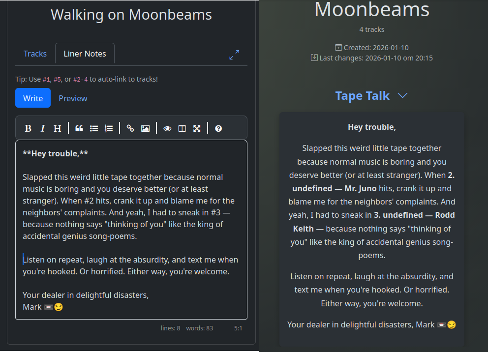
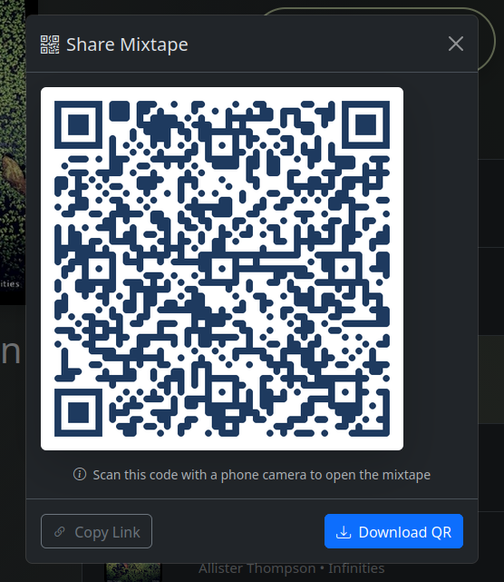
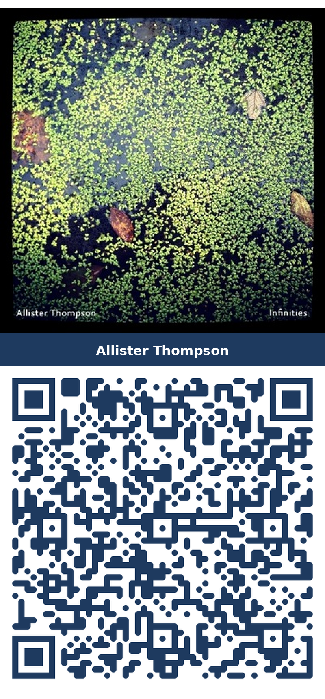
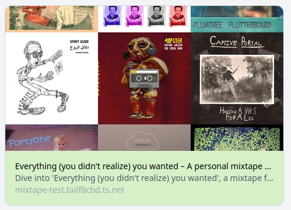
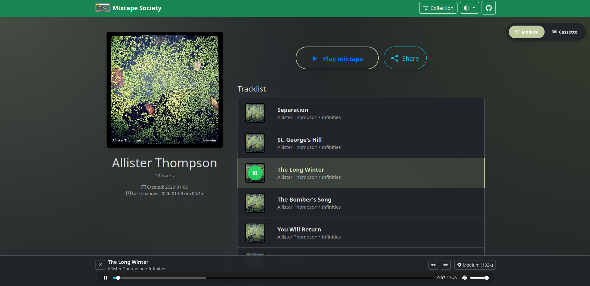
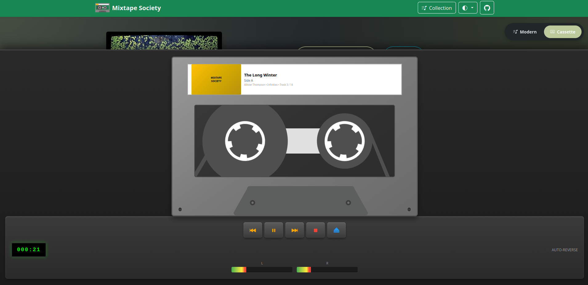
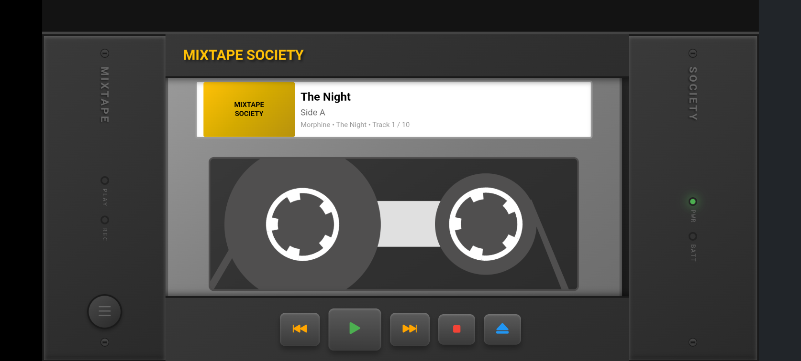

{ align=right width="90" }

# Introduction

Mixtape Society is a private, self‑hosted web app to create and share beautiful, ad-free music — the way mixtapes were exchanged on paper, but with today's digital convenience.

## 🎯 Why Mixtape Society?

- ✅ **No ads, no tracking, no accounts** – pure privacy.
- 🔗 **Public share links and QR codes** – anyone can listen without an account.
- 📼 **Cassette‑style experience** – nostalgic UI with modern tech.
- 📺 **Universal streaming** – Chromecast, AirPlay, and Android Auto support.

!!! TIP "Quick start"
    👉 [Read the full Getting Started guide](user/getting-started.md)

## 😎 The looks

### Mixtape editor user journey

  - { loading=lazy width="100%" }
    **Login page**

  - { loading=lazy width="100%" }
    **Manage your mixtape library** that's stored locally on your device. Browse, search, share and organize your mixtape collection with ease.

  - { loading=lazy width="100%" }
    **Manage your music collection** by reviewing statistics and monitoring filesystem changes.

  - { loading=lazy width="100%" }
    **Create or edit mixtapes** with a live search feature that highlights your tracks as you type

  - { loading=lazy width="100%" }
    **Add custom cover art** to your mixtapes for a unique look.

  - { loading=lazy width="100%" }
    **Add liner notes** to your mixtapes for a personal touch.

  - { loading=lazy width="100%" }
    **Generate a shareable link or use a QR code** for your mixtapes with ease.

  - { loading=lazy width="100%" }
    Use a **QR image** to include in physical gift.

### Mixtape receiver user journey

  - { loading=lazy width="100%" }
    **Receive your mixtape** with a public link

  - { loading=lazy width="100%" }
    **Listen to your mixtape** with a sleek, cassette-inspired player that supports full seeking for FLAC, MP3, M4A, and more.

  - { loading=lazy width="100%" }
    **Audio Cassette mode** for a nostalgic cassette-inspired player.

  - { loading=lazy width="100%" }
    Enjoy your mobile **nostalgic walkman** immersive experience.

## ✨ Key Features

### 🎵 For Mixtape Creators

- **Private music library** – Host your own collection (FLAC, MP3, M4A, AAC, OGG, WAV)
- **Beautiful editor** – Live search, drag-and-drop track ordering
- **Custom cover art** – Upload unique artwork for each mixtape
- **Liner notes** – Add personal messages with Markdown formatting
- **Quality control** – Multiple audio quality options (original to 128k)
- **Smart caching** – Pre-transcode for faster mobile streaming

### 🔗 For Sharing

- **Instant public links** – Share via URL or QR code
- **No accounts needed** – Recipients stream directly in browser
- **Permanent or temporary** – Links persist until you delete them
- **QR code generation** – Print-ready codes with cover art
- **Mobile responsive** – Perfect playback on any device
- **Chromecast support** – Cast to TVs and speakers with one tap

### 📱 For Listeners

- **No login required** – Just click and play
- **Full media controls** – Play, pause, seek, skip
- **Lock screen integration** – Control from phone notifications
- **Background playback** – Keep playing with screen off
- **Progressive Web App** – Add to home screen for app-like experience
- **Personalized PWA** – Each mixtape installs with its own icon and name
- **Cast anywhere** – Stream to Chromecast devices throughout your home

### 📺 Stream Everywhere

Recipients can stream shared mixtapes to any device using Chromecast, AirPlay, or Android Auto:

**Chromecast (Android/Chrome):**

- **Simple one-tap casting** – Cast button appears automatically
- **Full queue support** – Entire mixtape loads to Chromecast
- **Unified controls** – Control playback from phone, computer, or lock screen
- **Quality streaming** – Respects network conditions and quality settings
- **Track metadata** – Cover art, title, and artist display on TV
- **Seamless experience** – Continues playing when phone screen turns off

**AirPlay (Apple Devices):**

- **Native iOS integration** – Built into Safari, no setup required
- **One-tap streaming** – AirPlay icon in audio controls
- **System-wide controls** – Lock screen, Control Center, CarPlay
- **Lossless audio** – High-quality streaming to AirPlay devices
- **Multi-room** – Stream to multiple AirPlay 2 speakers simultaneously
- **Apple Watch** – Control from your wrist

**Android Auto (In-Car):**

- **Dashboard integration** – Control from car touchscreen
- **Voice commands** – "OK Google, pause", "next song"
- **Steering wheel controls** – Use physical car buttons
- **Safe driving mode** – Simplified, distraction-free interface
- **Full metadata** – Album art and track info on display
- **Automatic connection** – Works when phone connects to car

Perfect for:

- 🎉 **Parties** – Share the DJ duties via QR code
- 🏠 **Home audio** – Stream to whole-home speaker systems
- 🚗 **Road trips** – Perfect mixtapes for long drives
- 🎁 **Gifts** – Create physical cards with QR codes that stream anywhere
- 🎵 **Ambient listening** – Set the mood without managing your phone

## 👥 Get Involved

Interested in where this is headed?

- 💡 [Browse ideas being explored](project/ideas/ideas.md)
- 🎯 [See what's planned next](project/roadmap.md)
- 📝 [Read what's been shipped](project/changelog.md)
- 💬 Share thoughts on [GitHub Discussions](https://github.com/mark-me/mixtape-society/discussions)
- 🐛 Report issues or open an [issue](https://github.com/mark-me/mixtape-society/issues)

Pull requests welcome. Still early days, but contributions appreciated.

!!! INFO "Personal use only"
    This software is a tool for personal, non-commercial use with legally owned music files. No copyrighted music or artwork is included. You are solely responsible for the media you host and share.
