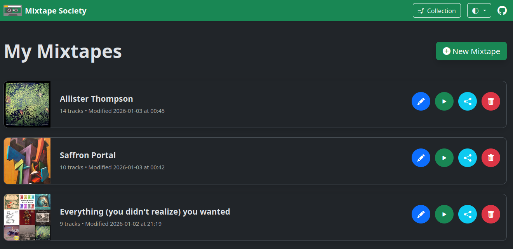
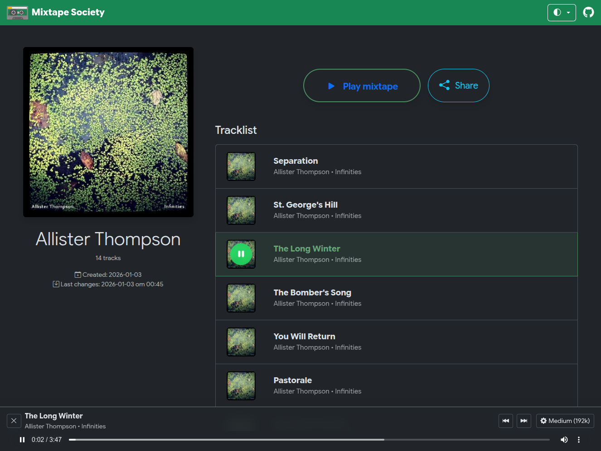

{ align=right width="90" }

# Mixtape Society

A private, self‑hosted web app to create and share beautiful, add-free music mixtapes.

!!! TIP "Quick start"
    1️⃣ Install the Docker image (see **Getting Started → Installation**).

    2️⃣ Run `docker compose up`.

    3️⃣ Open `http://localhost:8000` and create your first mixtape.

    👉 [Read the full Getting Started guide](getting-started.md)

## The looks

Manage your mixtape library that's stored locally on your device. Browse, search, share and organize your mixtape collection with ease.

Share mixtapes with friends and family. Recipients can listen to the mixtape directly in their web browser, no account or app required.

## Why Mixtape Society?

- ✅ **No ads, no tracking, no accounts** – pure privacy.
- 💾 **Works offline** after the first indexing.
- 🔗 **Public share links and QR codes** – anyone can listen without an account.
- 📼 **Cassette‑style experience** – nostalgic UI with modern tech.

Start with the [Getting Started](getting-started.md) guide.

## Get Involved

Interested in where this is headed?

- 💡 [Browse ideas being explored](project/ideas/ideas.md)
- 🎯 [See what's planned next](project/roadmap.md)
- 📝 [Read what's been shipped](project/changelog.md)
- 💬 Share thoughts on [GitHub Discussions](https://github.com/mark-me/mixtape-society/discussions)
- 🐛 Report issues or open an [issue](https://github.com/mark-me/mixtape-society/issues)

Pull requests welcome. Still early days, but contributions appreciated.
