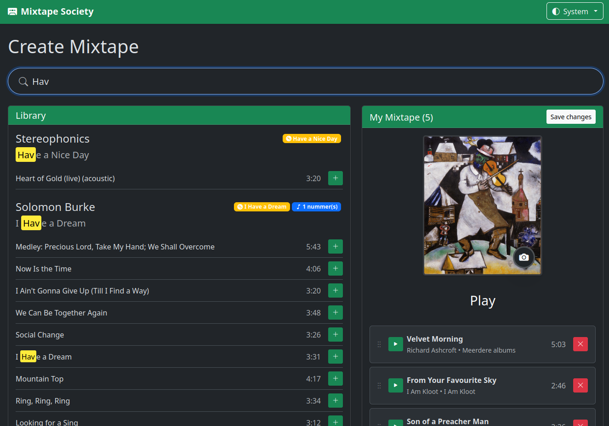
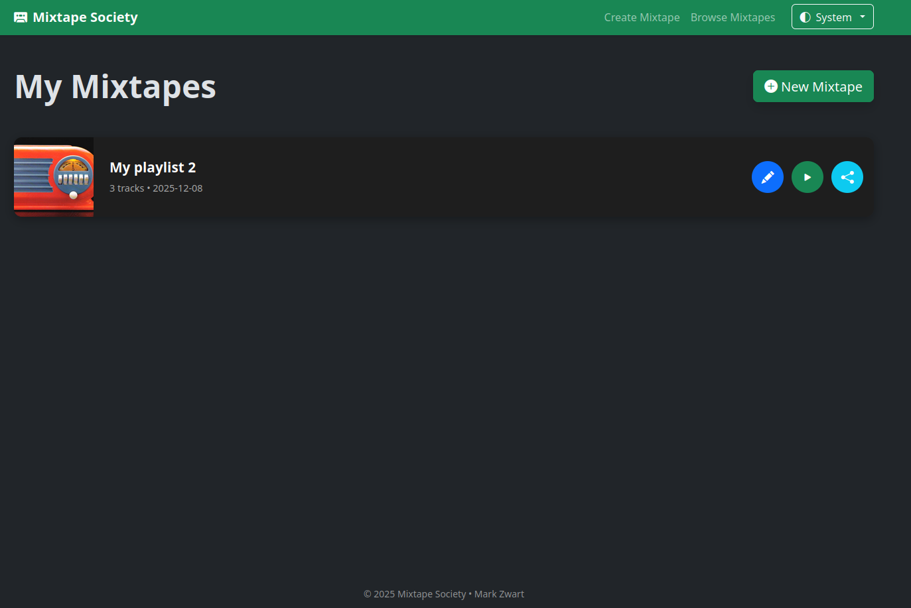
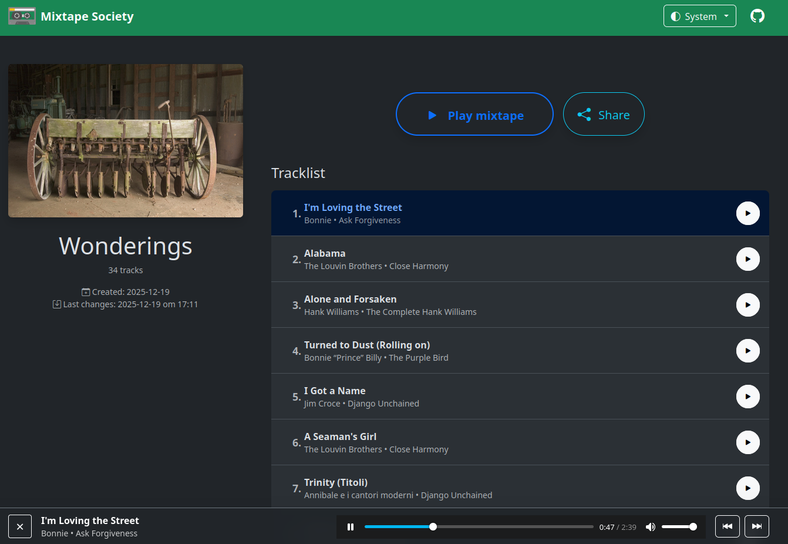

# Mixtape Society

{ align=right width="90" }

A private, self-hosted web app to create and share beautiful music mixtapes from your own library.

Create your own mixtapes from your music collection and share them with friends via public links. Recipients can listen to the mixtape directly in their web browser, no account or app required.

Creating a mixtape is as simple as dragging and dropping songs into a playlist. Customize the look and feel with themes and cover art, then share the link with anyone.

Manage your mixtape library that's stored locally on your device. Browse, search, share and organize your mixtape collection with ease.

Share mixtapes with friends and family. Recipients can listen to the mixtape directly in their web browser, no account or app required.

## Why Mixtape Society?

- No ads, no tracking, no accounts
- Works completely offline after the first indexing
- Public share links that anyone can open
- Feels like giving someone a real cassette

Start with the [Getting Started](getting-started.md) guide.
