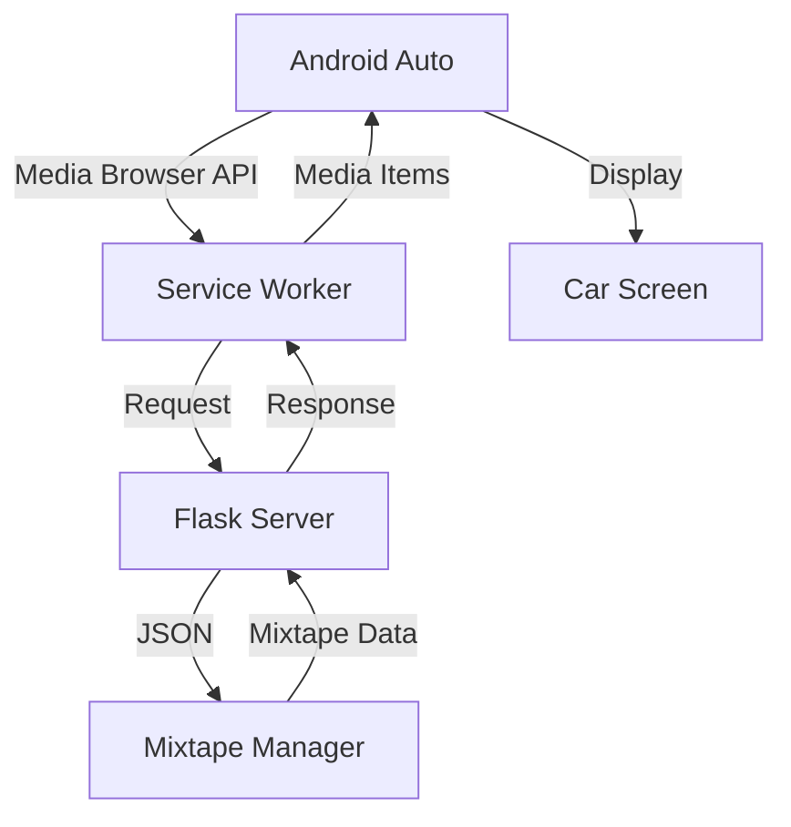

{ align=right width="90" }

# Android Auto Integration

Android Auto allows users to safely control Mixtape Society from their car's dashboard. The integration works through the Media Session API and provides a distraction-free, voice-controlled listening experience.

## 🚗 How It Works Today

**Good news:** Basic Android Auto support already works through your existing Media Session API implementation!

**What users currently get:**

- ✅ Track metadata on car display (title, artist, album)
- ✅ Album artwork
- ✅ Play/pause controls
- ✅ Skip to next/previous track
- ⚠️ May have reliability issues (needs optimization)
- ❌ No browse functionality
- ❌ Limited voice control
- ❌ No queue management

## 🎯 Optimization Strategy

There are two levels of Android Auto integration:

### Level 1: Enhanced Media Session (Recommended First)

Optimize the existing Media Session API for better Android Auto reliability.

**Effort:** Low (1-2 days)
**Impact:** High - Fixes most issues
**Requirements:** No additional dependencies

### Level 2: Full Media Browser (Advanced)

Build a complete Android Auto browsing experience with queue management.

**Effort:** High (1-2 weeks)
**Impact:** Medium - Nice to have
**Requirements:** Service Worker enhancements, custom UI

## 📱 Level 1: Enhanced Media Session

This is the recommended starting point. It fixes reliability issues and adds missing features.

### Current Implementation Issues

**From playerUtils.js:**

```javascript
export function setupLocalMediaSession(metadata, playerControls) {
    navigator.mediaSession.metadata = new MediaMetadata({
        title: metadata.title,
        artist: metadata.artist,
        album: metadata.album,
        artwork: metadata.artwork
    });

    navigator.mediaSession.setActionHandler('play', () => playerControls.play());
    navigator.mediaSession.setActionHandler('pause', () => playerControls.pause());
    navigator.mediaSession.setActionHandler('previoustrack', () => playerControls.previous());
    navigator.mediaSession.setActionHandler('nexttrack', () => playerControls.next());
}
```

**Problems:**

1. ❌ No `seekto` handler (Android Auto requires this)
2. ❌ Missing position state updates
3. ❌ No `stop` action handler
4. ❌ Artwork sizes not optimized for Android Auto
5. ❌ No playback state management

### Optimized Implementation

**Created: `static/js/player/androidAuto.js`**


### Integration into playerControls.js

**Updated `playerControls.js`:**

### Testing the Enhancement

**In the browser console:**

```javascript
// Check Media Session status
console.log(navigator.mediaSession);
console.log(navigator.mediaSession.metadata);
console.log(navigator.mediaSession.playbackState);

// Check position state
navigator.mediaSession.setPositionState();  // Should not throw error
```

**In Android Auto:**

1. Connect phone to car via USB or wireless Android Auto
2. Open Mixtape Society in Chrome
3. Start playing a mixtape
4. Check car display shows:
   - ✅ Track title
   - ✅ Artist name
   - ✅ Album name
   - ✅ Album artwork
   - ✅ Playback progress bar
   - ✅ Play/pause button
   - ✅ Skip buttons
   - ✅ Seeking works via progress bar

## 🎨 Artwork Optimization

Android Auto has specific artwork requirements.

### Current Issues

```javascript
// From playerUtils.js - Not optimized for Android Auto
artwork = [
    { src: absoluteSrc, sizes: '96x96',   type: mimeType },
    { src: absoluteSrc, sizes: '128x128', type: mimeType },
    { src: absoluteSrc, sizes: '192x192', type: mimeType },
    { src: absoluteSrc, sizes: '256x256', type: mimeType },
    { src: absoluteSrc, sizes: '384x384', type: mimeType },
    { src: absoluteSrc, sizes: '512x512', type: mimeType }
];
```

**Problems:**

- Missing 96×96 minimum size
- Type should be specific (image/jpeg, not generic)
- Android Auto prefers square images

### Optimized Artwork

**Update `extractMetadataFromDOM()` in playerUtils.js:**

```javascript
export function extractMetadataFromDOM(trackElement) {
    const coverImg = trackElement.querySelector('.track-cover');
    let artwork = [];

    if (coverImg && coverImg.src) {
        const absoluteSrc = new URL(coverImg.src, window.location.origin).href;

        // Detect platform
        const iOS = detectiOS();
        const isAndroid = /android/i.test(navigator.userAgent);

        if (iOS) {
            // iOS optimization (existing code)
            artwork = [
                { src: absoluteSrc, sizes: '512x512', type: 'image/jpeg' },
                { src: absoluteSrc, sizes: '256x256', type: 'image/jpeg' },
                { src: absoluteSrc, sizes: '128x128', type: 'image/jpeg' }
            ];
        } else if (isAndroid) {
            // Android Auto optimization
            artwork = [
                { src: absoluteSrc, sizes: '96x96',   type: 'image/jpeg' },  // Minimum
                { src: absoluteSrc, sizes: '128x128', type: 'image/jpeg' },
                { src: absoluteSrc, sizes: '192x192', type: 'image/jpeg' },  // Optimal
                { src: absoluteSrc, sizes: '256x256', type: 'image/jpeg' },
                { src: absoluteSrc, sizes: '512x512', type: 'image/jpeg' }   // Maximum
            ];
        } else {
            // Desktop/other
            artwork = [
                { src: absoluteSrc, sizes: '192x192', type: 'image/jpeg' },
                { src: absoluteSrc, sizes: '512x512', type: 'image/jpeg' }
            ];
        }
    }

    return {
        title: trackElement.dataset.title || 'Unknown',
        artist: trackElement.dataset.artist || 'Unknown Artist',
        album: trackElement.dataset.album || '',
        artwork: artwork
    };
}
```

## 🎤 Voice Control

Android Auto supports voice commands through Google Assistant.

### What Works Automatically

Once Media Session is properly configured, users can say:

**Playback control:**

- "OK Google, play"
- "OK Google, pause"
- "OK Google, stop"
- "OK Google, resume"

**Navigation:**

- "OK Google, next song"
- "OK Google, previous song"
- "OK Google, skip"
- "OK Google, go back"

**Seeking:**

- "OK Google, fast forward 30 seconds"
- "OK Google, rewind 10 seconds"

**What doesn't work (requires Media Browser):**

- "OK Google, play [mixtape name]" - Requires browse API
- "OK Google, shuffle" - Requires queue control
- "OK Google, play [artist name]" - Requires search

## 📊 Level 2: Media Browser Service (Advanced)

For a fully integrated Android Auto experience with browsing, you'd need to implement a Media Browser Service. This is significantly more complex.

### What It Enables

- **Browse mixtapes** from car display
- **Search** for tracks and playlists
- **Queue management** within Android Auto
- **Voice search** for specific content
- **"Continue listening"** recommendations

### Architecture



### Implementation Requirements

**1. Enhanced Service Worker:**

```javascript
// sw.js - Media Browser endpoints

self.addEventListener('fetch', (event) => {
    const url = new URL(event.request.url);

    // Handle Media Browser API requests
    if (url.pathname.startsWith('/api/browse')) {
        event.respondWith(handleBrowseRequest(event.request));
    }
});

async function handleBrowseRequest(request) {
    const url = new URL(request.url);
    const mediaId = url.searchParams.get('mediaId');

    if (mediaId === 'root') {
        // Return list of mixtapes
        return fetch('/api/mixtapes/list');
    } else if (mediaId.startsWith('mixtape:')) {
        // Return tracks for specific mixtape
        const slug = mediaId.split(':')[1];
        return fetch(`/api/mixtapes/${slug}/tracks`);
    }
}
```

**2. New Flask API Endpoints:**

```python
# routes/api.py

@api.route('/mixtapes/list')
def list_mixtapes():
    """Return browseable list of mixtapes for Android Auto"""
    mixtapes = mixtape_manager.list_all()

    items = [{
        'mediaId': f'mixtape:{m.slug}',
        'title': m.title,
        'subtitle': f'{len(m.tracks)} tracks',
        'iconUri': url_for('play.serve_cover', filename=m.cover),
        'playable': True,
        'browsable': True
    } for m in mixtapes]

    return jsonify({'items': items})

@api.route('/mixtapes/<slug>/tracks')
def mixtape_tracks(slug):
    """Return tracks for a specific mixtape"""
    mixtape = mixtape_manager.get(slug)

    if not mixtape:
        return jsonify({'error': 'Not found'}), 404

    items = [{
        'mediaId': f'track:{slug}:{i}',
        'title': track.track,
        'subtitle': track.artist,
        'album': track.album,
        'iconUri': url_for('play.serve_cover', filename=track.cover),
        'playable': True,
        'browsable': False,
        'mediaUri': url_for('play.stream_audio',
                           file_path=track.path,
                           quality='medium',
                           _external=True)
    } for i, track in enumerate(mixtape.tracks)]

    return jsonify({'items': items})
```

**3. Media Browser JavaScript:**

```javascript
// static/js/player/mediaBrowser.js

class MediaBrowserService {
    constructor() {
        this.root = null;
        this.currentMixtape = null;
    }

    async getRoot() {
        const response = await fetch('/api/mixtapes/list');
        const data = await response.json();
        return data.items;
    }

    async getChildren(mediaId) {
        if (mediaId.startsWith('mixtape:')) {
            const slug = mediaId.split(':')[1];
            const response = await fetch(`/api/mixtapes/${slug}/tracks`);
            const data = await response.json();
            return data.items;
        }
        return [];
    }

    async play(mediaId) {
        if (mediaId.startsWith('track:')) {
            const [_, slug, index] = mediaId.split(':');
            // Load and play track
            window.playerControls.playTrack(parseInt(index));
        }
    }
}
```

### Complexity Assessment

**Effort breakdown:**

- Service Worker enhancements: 2-3 days
- Flask API endpoints: 1-2 days
- Media Browser JavaScript: 2-3 days
- Testing and debugging: 2-3 days
- **Total: 7-11 days**

**Is it worth it?**

- ❌ High complexity for limited benefit
- ✅ Level 1 (Media Session) covers 90% of use cases
- ✅ Voice control mostly works with Level 1
- ⚠️ Most users don't browse music while driving
- ✅ Better to focus on PWA quality and reliability

## 🧪 Testing Checklist

### Desktop Testing (Chrome)

```javascript
// Open DevTools Console

// 1. Check Media Session API
console.log('Media Session:', 'mediaSession' in navigator);

// 2. Start playing a track
// Then check:
console.log('Metadata:', navigator.mediaSession.metadata);
console.log('State:', navigator.mediaSession.playbackState);

// 3. Test action handlers
navigator.mediaSession.setActionHandler('play', () => console.log('Play works'));
navigator.mediaSession.setActionHandler('pause', () => console.log('Pause works'));

// 4. Check position state
console.log('Position:', navigator.mediaSession.setPositionState);
```

### Android Auto Testing

**Required setup:**

- Android phone (Android 6.0+)
- Car with Android Auto or Android Auto head unit
- USB cable or wireless Android Auto
- Chrome browser on phone

**Test procedure:**

1. **Connection test:**
   - [ ] Connect phone to car
   - [ ] Android Auto launches
   - [ ] Can access Chrome browser

2. **Playback test:**
   - [ ] Open mixtape in Chrome
   - [ ] Start playing track
   - [ ] Check car display shows metadata
   - [ ] Verify artwork appears
   - [ ] Check progress bar shows

3. **Control test:**
   - [ ] Tap play/pause on car display
   - [ ] Tap next/previous buttons
   - [ ] Drag progress bar to seek
   - [ ] Use steering wheel controls

4. **Voice test:**
   - [ ] Say "OK Google, pause"
   - [ ] Say "OK Google, play"
   - [ ] Say "OK Google, next song"
   - [ ] Say "OK Google, fast forward 30 seconds"

5. **Reliability test:**
   - [ ] Lock phone screen - playback continues
   - [ ] Receive phone call - pauses correctly
   - [ ] Return to music after call
   - [ ] Disconnect/reconnect Android Auto
   - [ ] Check notification shows proper controls

## 🐛 Troubleshooting

### Metadata not showing in Android Auto

**Check these:**

```javascript
// 1. Verify metadata is set
console.log(navigator.mediaSession.metadata);

// 2. Check artwork URLs are absolute
console.log(navigator.mediaSession.metadata.artwork[0].src);
// Should be: https://yourdomain.com/covers/image.jpg
// NOT: /covers/image.jpg

// 3. Verify playback state
console.log(navigator.mediaSession.playbackState);
// Should be: 'playing' or 'paused', not 'none'
```

**Common issues:**

- Relative artwork URLs (must be absolute)
- Metadata not updated when track changes
- Playback state stuck at 'none'

### Seeking doesn't work

**Problem:** Progress bar not draggable in Android Auto

**Solution:** Add `seekto` handler

```javascript
navigator.mediaSession.setActionHandler('seekto', (details) => {
    if (details.seekTime !== undefined) {
        audioElement.currentTime = details.seekTime;
    }
});
```

### Controls unresponsive

**Check:**

1. Are action handlers set before playback starts?
2. Is playback state being updated?
3. Are handlers preserved when track changes?

**Fix:** Re-register handlers on track change

```javascript
player.addEventListener('loadedmetadata', () => {
    setupAndroidAutoMediaSession(metadata, controls, player);
});
```

### Voice commands not working

**Possible causes:**

- Media Session not properly configured
- Missing action handlers
- Playback state is 'none'
- Android Auto app not updated

**Verify:**

```javascript
// All these should have handlers
const actions = ['play', 'pause', 'previoustrack', 'nexttrack', 'seekto'];
actions.forEach(action => {
    console.log(`${action}:`, navigator.mediaSession.actionHandlers?.get(action));
});
```

## 📈 Monitoring & Analytics

### Log Android Auto Usage

```javascript
// Track when users connect via Android Auto
if (isAndroidAutoConnected()) {
    // Optional: Send analytics event
    console.log('📊 User connected via Android Auto');

    // Track in your analytics (if you have any)
    // analytics.track('android_auto_connected');
}
```

### Performance Metrics

```javascript
// Monitor Media Session reliability
let mediaSessionErrors = 0;

try {
    navigator.mediaSession.metadata = metadata;
} catch (error) {
    mediaSessionErrors++;
    console.error('Media Session error:', error);

    // Optional: Send error to monitoring
    // sentry.captureException(error);
}
```

## 🎯 Recommendation

**Start with Level 1 (Enhanced Media Session):**

1. ✅ Implement the `androidAuto.js` module
2. ✅ Add `seekto` handler (critical!)
3. ✅ Optimize artwork sizes
4. ✅ Update position state regularly
5. ✅ Test thoroughly with real Android Auto

**Skip Level 2 (Media Browser) unless:**

- Users specifically request browsing capability
- You have weeks of development time
- You want to differentiate from other players

**The 80/20 rule applies:**

- Level 1: 20% effort, 80% value
- Level 2: 80% effort, 20% value

Most users just want reliable play/pause/skip controls and metadata display. Level 1 delivers exactly that with minimal complexity.

## 📚 Resources

**Official Documentation:**

- [Media Session API Spec](https://w3c.github.io/mediasession/)
- [Android Auto for Audio Apps](https://developer.android.com/training/cars/audio)
- [Chrome Media Session Guide](https://developers.google.com/web/updates/2017/02/media-session)

**Testing Tools:**

- [Android Auto Desktop Head Unit](https://developer.android.com/training/cars/testing)
- [Chrome Media Session DevTools](chrome://media-internals)

**Example Implementations:**

- [YouTube Music Web](https://music.youtube.com) - Good Media Session example
- [Spotify Web Player](https://open.spotify.com) - Advanced implementation
- [SoundCloud](https://soundcloud.com) - Basic but reliable

---

Focus on getting Level 1 right before considering Level 2. A reliable, simple integration beats a buggy complex one every time.
