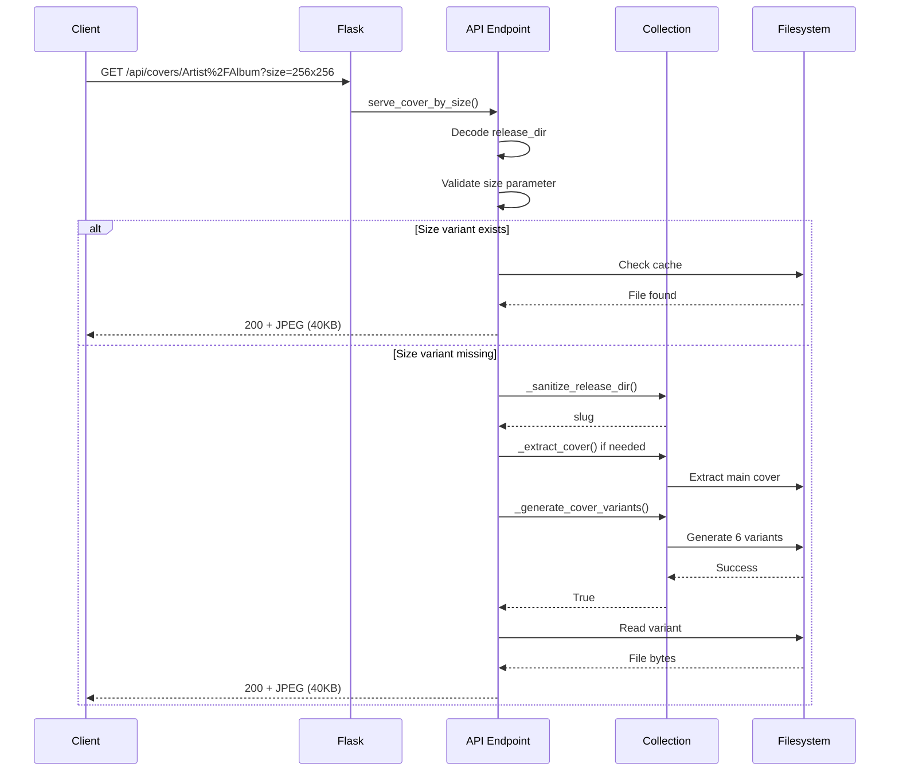

# Backend Implementation

This page documents the server-side changes required for Android Auto integration, focusing on size-optimized cover art generation and serving.

---

## 🎯 Goals

1. Generate multiple size variants of cover artwork
2. Serve size-specific covers via query parameters
3. Maintain backward compatibility with existing code
4. Optimize bandwidth for mobile/in-car use

---

## 📁 Modified Files

### `src/musiclib/reader.py`
Added two new methods to `MusicCollection` class:
- `_generate_cover_variants()` - Generates 6 size variants
- `get_cover_sizes()` - Returns URLs for all size variants

### `src/app.py`
Added new API endpoint:
- `/api/covers/<release_dir_encoded>?size=WxH` - Serves size-specific covers

---

## 🔧 Implementation Details

### 1. Cover Variant Generation

**Method:** `_generate_cover_variants(release_dir, slug)`

**Location:** `src/musiclib/reader.py` (added before `_extract_cover`)

```python
def _generate_cover_variants(self, release_dir: str, slug: str) -> bool:
    """Generates multiple size variants of a cover image for responsive serving.
    
    Creates optimized versions at standard sizes for efficient bandwidth usage.
    
    Args:
        release_dir: The release directory relative to the music root.
        slug: The sanitized slug identifier for the cover files.
    
    Returns:
        bool: True if at least one size variant was successfully generated.
    """
    # Standard sizes for responsive cover art
    sizes = [96, 128, 192, 256, 384, 512]
    
    # Generate main cover first (existing behavior)
    main_path = self.covers_dir / f"{slug}.jpg"
    if not self._extract_cover(release_dir, main_path):
        return False
    
    # Generate size variants from main cover
    try:
        with Image.open(main_path) as main_img:
            for size in sizes:
                variant_path = self.covers_dir / f"{slug}_{size}x{size}.jpg"
                
                # Skip if already exists
                if variant_path.exists():
                    continue
                
                # Resize maintaining aspect ratio
                img_copy = main_img.copy()
                img_copy.thumbnail((size, size), Image.Resampling.LANCZOS)
                
                # Save with appropriate quality
                quality = 85 if size >= 256 else 80
                img_copy.save(variant_path, 'JPEG', quality=quality, optimize=True)
                
                self._logger.debug(f"Generated {size}x{size} variant for {slug}")
        
        return True
    except Exception as e:
        self._logger.warning(f"Failed to generate cover variants: {e}")
        return False
```

**File naming convention:**
- Main cover: `{slug}.jpg` (e.g., `artist_album.jpg`)
- Variants: `{slug}_{size}x{size}.jpg` (e.g., `artist_album_256x256.jpg`)

**Standard sizes generated:**
- 96×96 px - Thumbnails (5-8 KB)
- 128×128 px - Small tiles (8-12 KB)
- 192×192 px - Medium tiles (15-20 KB)
- 256×256 px - Android Auto optimal (30-50 KB)
- 384×384 px - High-DPI displays (60-90 KB)
- 512×512 px - Full-screen player (100-150 KB)

---

### 2. Size URL Retrieval

**Method:** `get_cover_sizes(release_dir)`

**Location:** `src/musiclib/reader.py` (added after `get_cover`)

```python
def get_cover_sizes(self, release_dir: str) -> dict[str, str]:
    """Returns URLs for multiple size variants of a cover image.
    
    Generates size variants on-demand if not already cached.
    
    Args:
        release_dir: The release directory identifier.
    
    Returns:
        dict[str, str]: Dictionary mapping size strings (e.g., "96x96") to URLs.
    """
    if not release_dir:
        sizes = [96, 128, 192, 256, 384, 512]
        return {f"{s}x{s}": "covers/_fallback.jpg" for s in sizes}
    
    slug = self._sanitize_release_dir(release_dir)
    sizes = [96, 128, 192, 256, 384, 512]
    
    # Ensure main cover exists first
    main_path = self.covers_dir / f"{slug}.jpg"
    if not main_path.exists():
        if not self._extract_cover(release_dir, main_path):
            return {f"{s}x{s}": "covers/_fallback.jpg" for s in sizes}
    
    # Check if variants exist, generate if needed
    variants_exist = all(
        (self.covers_dir / f"{slug}_{s}x{s}.jpg").exists() for s in sizes
    )
    
    if not variants_exist:
        self._generate_cover_variants(release_dir, slug)
    
    # Build URL dictionary
    result = {}
    for size in sizes:
        variant_path = self.covers_dir / f"{slug}_{size}x{size}.jpg"
        if variant_path.exists():
            result[f"{size}x{size}"] = f"covers/{slug}_{size}x{size}.jpg"
        else:
            result[f"{size}x{size}"] = f"covers/{slug}.jpg"  # Fallback to main
    
    return result
```

**Return value example:**
```python
{
    "96x96": "covers/artist_album_96x96.jpg",
    "128x128": "covers/artist_album_128x128.jpg",
    "192x192": "covers/artist_album_192x192.jpg",
    "256x256": "covers/artist_album_256x256.jpg",
    "384x384": "covers/artist_album_384x384.jpg",
    "512x512": "covers/artist_album_512x512.jpg"
}
```

---

### 3. API Endpoint

**Route:** `/api/covers/<release_dir_encoded>`

**Location:** `src/app.py` (added after existing `/covers/<filename>` route)

```python
@app.route("/api/covers/<path:release_dir_encoded>")
def serve_cover_by_size(release_dir_encoded):
    """Serves cover art with optional size parameter.
    
    Supports ?size=WxH query parameter (e.g., ?size=256x256).
    Generates size variants on-demand and caches them.
    
    Args:
        release_dir_encoded: URL-encoded release directory path
        
    Query Parameters:
        size: Optional size in format WxH (e.g., 256x256)
              Valid: 96x96, 128x128, 192x192, 256x256, 384x384, 512x512
              
    Returns:
        Image file from cache directory
    """
    from urllib.parse import unquote
    
    release_dir = unquote(release_dir_encoded)
    requested_size = request.args.get('size', '').lower()
    
    valid_sizes = ['96x96', '128x128', '192x192', '256x256', '384x384', '512x512']
    covers_dir = app.config["DATA_ROOT"] / "cache" / "covers"
    
    if not requested_size:
        # No size specified, return main cover
        cover_url = collection.get_cover(release_dir)
        if cover_url:
            filename = cover_url.split('/')[-1]
            return send_from_directory(covers_dir, filename)
        abort(404)
    
    # Validate size parameter
    if requested_size not in valid_sizes:
        return jsonify({
            "error": "Invalid size parameter",
            "valid_sizes": valid_sizes
        }), 400
    
    # Get or generate size-specific cover
    slug = collection._sanitize_release_dir(release_dir)
    size_filename = f"{slug}_{requested_size}.jpg"
    size_path = covers_dir / size_filename
    
    # Generate if doesn't exist
    if not size_path.exists():
        main_path = covers_dir / f"{slug}.jpg"
        if not main_path.exists():
            collection._extract_cover(release_dir, main_path)
        
        if main_path.exists():
            collection._generate_cover_variants(release_dir, slug)
    
    # Serve size-specific cover
    if size_path.exists():
        return send_from_directory(covers_dir, size_filename)
    
    # Fallback to main cover
    main_filename = f"{slug}.jpg"
    main_path = covers_dir / main_filename
    if main_path.exists():
        return send_from_directory(covers_dir, main_filename)
    
    # Final fallback
    return send_from_directory(covers_dir, "_fallback.jpg")
```

**Usage examples:**
```bash
# Get 256×256 variant
GET /api/covers/Artist%2FAlbum?size=256x256

# Get main cover (no size)
GET /api/covers/Artist%2FAlbum

# Invalid size returns error
GET /api/covers/Artist%2FAlbum?size=999x999
# → {"error": "Invalid size parameter", "valid_sizes": [...]}
```

---

## 🔄 Request Flow



---

## 📊 Performance Characteristics

### Storage Impact
- **Main cover:** 300-500 KB per album
- **All 6 variants:** 50-150 KB total per album
- **Overhead:** ~15-25% of main cover size

### Generation Performance
- **First request:** +100-200ms (one-time)
- **Subsequent requests:** 0ms additional (served from cache)
- **Batch generation:** Can pre-generate for popular albums

### Caching Strategy
- **Lazy generation:** Only creates variants when requested
- **Permanent cache:** Variants never expire
- **No cleanup:** Variants remain until manual cleanup
- **Cache location:** `DATA_ROOT/cache/covers/`

---

## 🔙 Backward Compatibility

### Existing Routes Unchanged
✅ `/covers/<filename>` - Still works exactly as before
✅ `get_cover(release_dir)` - Returns single URL as always
✅ All existing templates - No changes required

### New Features Are Additive
- New API endpoint doesn't affect existing code
- `get_cover_sizes()` is additional, not replacement
- Variants generated only when needed
- Main cover extraction logic unchanged

### Migration Path
1. Deploy backend changes
2. No immediate action required
3. Update frontend when ready
4. Variants generate automatically

---

## 🧪 Testing

### Unit Tests
```python
def test_generate_cover_variants():
    """Test variant generation creates all sizes."""
    collection = MusicCollection(music_root, db_path)
    slug = "test_album"
    
    result = collection._generate_cover_variants("Artist/Album", slug)
    
    assert result == True
    assert (covers_dir / f"{slug}_96x96.jpg").exists()
    assert (covers_dir / f"{slug}_256x256.jpg").exists()
    assert (covers_dir / f"{slug}_512x512.jpg").exists()

def test_get_cover_sizes():
    """Test URL dictionary returns all sizes."""
    collection = MusicCollection(music_root, db_path)
    
    sizes = collection.get_cover_sizes("Artist/Album")
    
    assert "96x96" in sizes
    assert "256x256" in sizes
    assert sizes["256x256"].endswith("_256x256.jpg")
```

### Integration Tests
```bash
# Test API endpoint
curl "http://localhost:5000/api/covers/Artist%2FAlbum?size=256x256" -o test.jpg

# Verify file size
ls -lh test.jpg  # Should be ~40KB

# Test invalid size
curl "http://localhost:5000/api/covers/Artist%2FAlbum?size=999x999"
# Should return JSON error

# Test fallback
curl "http://localhost:5000/api/covers/NonExistent%2FAlbum?size=256x256"
# Should return fallback image
```

---

## 🐛 Troubleshooting

### Issue: Variants not generating
**Symptoms:** 404 on size-specific requests
**Check:** Main cover exists? PIL/Pillow installed?
**Solution:** Ensure `_extract_cover()` succeeds first

### Issue: Large file sizes
**Symptoms:** Variants larger than expected
**Adjust:** Quality setting in `_generate_cover_variants()`:
```python
quality = 90 if size >= 256 else 85  # Increase quality
```

### Issue: Slow first request
**Expected:** 100-200ms delay on first size request
**Solution:** Pre-generate for popular albums with background job

---

## 📝 API Documentation Update

Add to your API docs (`src/musiclib/reader.py` docstrings):

```python
def get_cover_sizes(self, release_dir: str) -> dict[str, str]:
    """Returns URLs for multiple size variants of a cover image.
    
    Generates size variants on-demand if not already cached.
    
    Args:
        release_dir: The release directory identifier for which to retrieve cover variants.
    
    Returns:
        dict[str, str]: Dictionary mapping size strings (e.g., "96x96") to relative URL paths.
        
    Example:
        >>> sizes = collection.get_cover_sizes("Prince/Purple Rain")
        >>> print(sizes["256x256"])
        'covers/prince_purplerain_256x256.jpg'
    """
```

---

## Next Steps

👉 **Continue to [Frontend Integration](frontend-integration.md)** to update the client-side code.
