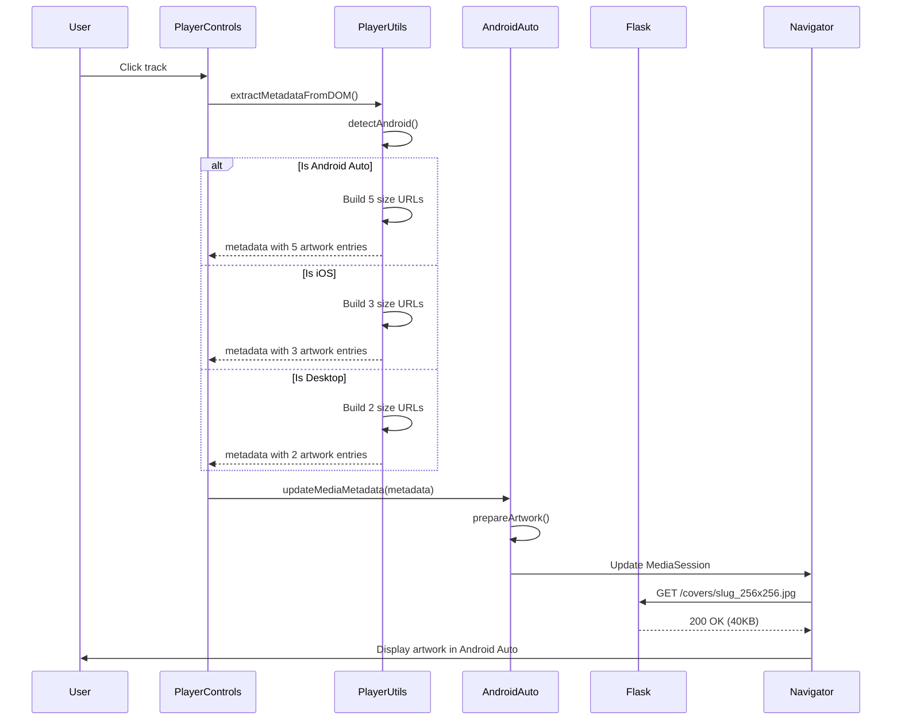

# Frontend Integration

This page documents the client-side JavaScript changes required for Android Auto integration.

---

## 🎯 Goals

1. Detect Android Auto environment accurately
2. Request size-optimized covers based on platform
3. Update MediaSession with proper artwork
4. Maintain backward compatibility

---

## 📁 Modified Files

### `static/js/player/playerUtils.js`
**Changed:** `extractMetadataFromDOM()` function
**Purpose:** Request size-appropriate covers based on platform

### `static/js/player/androidAuto.js`
**Changed:** Entire file replaced
**Purpose:** Fix detection and artwork handling

---

## 🔧 Implementation Details

### 1. Update Metadata Extraction

**File:** `static/js/player/playerUtils.js`

**Find this function** (around line 268):
```javascript
export function extractMetadataFromDOM(trackElement) {
    // ... existing code
}
```

**Replace with:**
```javascript
/**
 * Extract metadata from DOM track element with platform-optimized artwork sizes
 * Uses the new size-optimized cover API endpoints
 */
export function extractMetadataFromDOM(trackElement) {
    const iOS = detectiOS();
    const android = detectAndroid();
    const coverImg = trackElement.querySelector('.track-cover');
    let artwork = [];

    if (coverImg && coverImg.src) {
        const mimeType = getMimeTypeFromUrl(coverImg.src);
        
        // Extract slug from cover URL
        // Example: /covers/artist_album.jpg -> artist_album
        const coverUrl = new URL(coverImg.src, window.location.origin);
        const coverPath = coverUrl.pathname;
        const slug = coverPath.split('/').pop()
                              .replace('.jpg', '')
                              .replace(/_\d+x\d+$/, '');
        
        // Build size-optimized URLs based on platform
        if (iOS) {
            // iOS prefers larger sizes for lock screen
            artwork = [
                { src: `/covers/${slug}_512x512.jpg`, sizes: '512x512', type: mimeType },
                { src: `/covers/${slug}_256x256.jpg`, sizes: '256x256', type: mimeType },
                { src: `/covers/${slug}_192x192.jpg`, sizes: '192x192', type: mimeType }
            ];
        } else if (android && android.isAndroidAuto) {
            // Android Auto needs full spectrum
            artwork = [
                { src: `/covers/${slug}_96x96.jpg`, sizes: '96x96', type: mimeType },
                { src: `/covers/${slug}_128x128.jpg`, sizes: '128x128', type: mimeType },
                { src: `/covers/${slug}_192x192.jpg`, sizes: '192x192', type: mimeType },
                { src: `/covers/${slug}_256x256.jpg`, sizes: '256x256', type: mimeType },
                { src: `/covers/${slug}_512x512.jpg`, sizes: '512x512', type: mimeType }
            ];
        } else {
            // Desktop - simple set
            artwork = [
                { src: `/covers/${slug}_192x192.jpg`, sizes: '192x192', type: mimeType },
                { src: `/covers/${slug}_512x512.jpg`, sizes: '512x512', type: mimeType }
            ];
        }
    }

    return {
        title: trackElement.dataset.title || 'Unknown',
        artist: trackElement.dataset.artist || 'Unknown Artist',
        album: trackElement.dataset.album || '',
        artwork: artwork
    };
}
```

**What changed:**
- Extracts slug from cover URL
- Builds size-specific URLs based on platform detection
- Returns array of artwork objects with multiple sizes

---

### 2. Replace Android Auto Module

**File:** `static/js/player/androidAuto.js`

**Action:** Replace entire file with the new version

**Key changes in new version:**

#### A. Fixed Detection
```javascript
async detectAndroidAuto() {
    const userAgent = navigator.userAgent.toLowerCase();
    
    // Check for Android Automotive OS or Android Auto indicators
    const hasAutomotiveUA = userAgent.includes('android') && 
                           (userAgent.includes('automotive') || 
                            userAgent.includes('car'));
    
    // Check for fullscreen/standalone mode
    const isFullscreen = window.matchMedia('(display-mode: fullscreen)').matches ||
                       window.matchMedia('(display-mode: standalone)').matches;
    
    // Check for car-like display dimensions
    const hasCarDimensions = window.screen.width >= 800 && 
                            window.screen.height >= 480 &&
                            window.screen.width / window.screen.height > 1.5;
    
    // Android Auto WebView exposes specific APIs
    const hasAndroidAutoAPI = typeof window.AndroidAuto !== 'undefined';
    
    // Check if running in WebView
    const isWebView = userAgent.includes('wv');
    
    // Combine signals for reliable detection
    this.isAndroidAuto = hasAndroidAutoAPI || 
                        (hasAutomotiveUA && isFullscreen) ||
                        (isWebView && isFullscreen && hasCarDimensions);
    
    return this.isAndroidAuto;
}
```

**Why this fixes the bug:**
- ❌ Removed `getInstalledRelatedApps()` - caused false positives
- ✅ Added specific automotive indicators
- ✅ Requires multiple signals to match
- ✅ Validates display characteristics

#### B. Fixed Artwork Handling
```javascript
prepareArtwork(artworkArray) {
    if (!artworkArray || artworkArray.length === 0) {
        return this.getFallbackArtwork();
    }
    
    // Preserve the size-specific URLs from the backend
    // No longer duplicates a single URL
    return artworkArray.map(art => ({
        src: art.src,           // Keeps size-optimized URL
        sizes: art.sizes,       // Keeps declared size
        type: art.type || 'image/jpeg'
    }));
}
```

**Why this is important:**
- ❌ Old code duplicated one URL for all sizes
- ✅ New code preserves each size-specific URL
- ✅ Browser/Android Auto picks best size automatically

---

## 🔄 Integration Flow



---

## 📊 Platform-Specific Artwork

### Android Auto
**Sizes requested:** 96, 128, 192, 256, 512 px
```javascript
artwork = [
    { src: '/covers/slug_96x96.jpg', sizes: '96x96', type: 'image/jpeg' },
    { src: '/covers/slug_128x128.jpg', sizes: '128x128', type: 'image/jpeg' },
    { src: '/covers/slug_192x192.jpg', sizes: '192x192', type: 'image/jpeg' },
    { src: '/covers/slug_256x256.jpg', sizes: '256x256', type: 'image/jpeg' },
    { src: '/covers/slug_512x512.jpg', sizes: '512x512', type: 'image/jpeg' }
]
```
**Android Auto typically chooses:** 256×256 (optimal balance)

### iOS
**Sizes requested:** 192, 256, 512 px
```javascript
artwork = [
    { src: '/covers/slug_512x512.jpg', sizes: '512x512', type: 'image/jpeg' },
    { src: '/covers/slug_256x256.jpg', sizes: '256x256', type: 'image/jpeg' },
    { src: '/covers/slug_192x192.jpg', sizes: '192x192', type: 'image/jpeg' }
]
```
**iOS typically chooses:** 512×512 (lock screen prefers larger)

### Desktop
**Sizes requested:** 192, 512 px
```javascript
artwork = [
    { src: '/covers/slug_192x192.jpg', sizes: '192x192', type: 'image/jpeg' },
    { src: '/covers/slug_512x512.jpg', sizes: '512x512', type: 'image/jpeg' }
]
```
**Desktop typically chooses:** 512×512 (sufficient for most displays)

---

## 🧪 Testing in Browser

### Test Detection
Open browser console and run:
```javascript
// Test Android Auto detection
import { detectAndroid } from './playerUtils.js';
const android = detectAndroid();
console.log('Android Auto:', android?.isAndroidAuto);

// Test metadata extraction
const trackEl = document.querySelector('.track-item');
const metadata = extractMetadataFromDOM(trackEl);
console.log('Artwork sizes:', metadata.artwork.map(a => a.sizes));
```

### Expected Output

**On Android Auto:**
```javascript
{
  isAndroid: true,
  version: 11,
  isAndroidAuto: true,
  artwork: [
    { sizes: '96x96', ... },
    { sizes: '128x128', ... },
    { sizes: '192x192', ... },
    { sizes: '256x256', ... },
    { sizes: '512x512', ... }
  ]
}
```

**On Regular Mobile Chrome:**
```javascript
{
  isAndroid: true,
  version: 119,
  isAndroidAuto: false,  // ← Should be false!
  artwork: [
    { sizes: '192x192', ... },
    { sizes: '512x512', ... }
  ]
}
```

---

## 🔙 Backward Compatibility

### Existing Code Unaffected
✅ `playerControls.js` - No changes required
✅ `chromecast.js` - No changes required
✅ HTML templates - No changes required
✅ CSS styles - No changes required

### Progressive Enhancement
- Regular browsers get standard artwork
- Android Auto gets optimized artwork
- Fallback to main cover if variants missing
- No breaking changes to API

---

## 🐛 Troubleshooting

### Issue: Wrong platform detected
**Check:** Console logs from `detectAndroid()` and `detectiOS()`
**Solution:** Verify user agent contains expected strings

### Issue: All requests use same size
**Check:** Network tab - are URLs different?
**Solution:** Verify `extractMetadataFromDOM()` builds proper URLs

### Issue: Images not loading
**Check:** Browser console for 404 errors
**Solution:** Ensure backend generates variants on first request

### Issue: MediaSession not updating
**Check:** Does `navigator.mediaSession` exist?
**Solution:** Requires HTTPS or localhost for MediaSession API

---

## 📱 Mobile Testing

### Test on Real Android Device
1. Connect device with USB debugging
2. Open Chrome DevTools → Remote devices
3. Inspect your app's page
4. Check console logs and network requests

### Test on iOS Device
1. Enable Web Inspector on iOS device
2. Connect to Mac with Safari
3. Develop → Device → Your page
4. Check console for detection results

---

## 🎨 MediaSession Integration

The new `androidAuto.js` properly integrates with MediaSession API:

```javascript
updateMediaMetadata(metadata) {
    if (!this.mediaSession) return;

    try {
        // Prepare size-optimized artwork array
        const artwork = this.prepareArtwork(metadata.artwork);
        
        // Create MediaMetadata object
        this.currentMetadata = new MediaMetadata({
            title: metadata.title || 'Unknown Title',
            artist: metadata.artist || 'Unknown Artist',
            album: metadata.album || 'Unknown Album',
            artwork: artwork  // Multiple sizes for browser to choose
        });
        
        this.mediaSession.metadata = this.currentMetadata;
    } catch (error) {
        console.error('Failed to update MediaSession metadata:', error);
    }
}
```

**What happens:**
1. Artwork array has multiple sizes
2. Browser/Android Auto chooses best size
3. Only chosen size is downloaded
4. Bandwidth saved automatically

---

## 📈 Performance Monitoring

Add performance tracking:
```javascript
// In extractMetadataFromDOM()
const startTime = performance.now();
const metadata = extractMetadataFromDOM(trackElement);
const endTime = performance.now();
console.log(`Metadata extraction: ${endTime - startTime}ms`);

// Track artwork load times
metadata.artwork.forEach(art => {
    const img = new Image();
    const loadStart = performance.now();
    img.onload = () => {
        const loadTime = performance.now() - loadStart;
        console.log(`Loaded ${art.sizes}: ${loadTime}ms`);
    };
    img.src = art.src;
});
```

---

## Next Steps

👉 **Continue to [Testing Guide](testing-guide.md)** to verify your integration works correctly.
