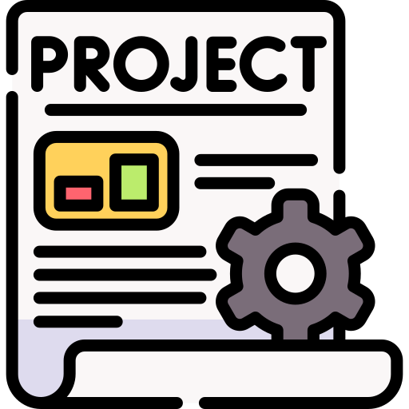

{ align=right width="90" }

# Project

Mixtape Society is still early days—a solo project that's finding its footing. This section covers where it's headed and how you can get involved if you're interested.

## 📣 What's Happening

- 🎯 [Roadmap](roadmap.md) - What I'm working on next
- 💡 [Ideas](ideas/ideas.md) - Things being explored (lots here!)
- 📝 [Changelog](changelog.md) - What's been shipped so far

---

## 💙 Get Involved

- 💬 [GitHub Discussions](https://github.com/mark-me/mixtape-society/discussions) - Share thoughts or ask questions
- 🐛 [Open an issue](https://github.com/mark-me/mixtape-society/issues) - Report bugs or suggest features
- 🤝 [Contributing guide](contributing.md) - How to help out

No pressure, but if something here resonates, feel free to jump in.

---

## 🧭 Core principles

- **No central-server accounts**
- **No Spotify / Apple Music integration**
- **No social features** (likes, comments, following)
- **No ads, analytics, or telemetry by default**

### Principle enforcement

- **No accounts** – Public routes (`/share/<slug>`, `/play/...`, `/qr/...`) have no `@login_required` decorators. The optional `authentication` blueprint is **not registered** in production.
- **No streaming‑service integration** – All audio files are served from `MUSIC_ROOT`; `play.py` never contacts Spotify, Apple Music, or any third‑party API.
- **No social features** – Search results, mixtape pages, and the editor contain no “like”, “comment”, or “follow” UI elements.
- **No ads / telemetry** – No analytics scripts, no tracking pixels, and all responses omit `Set‑Cookie` headers (except the optional session cookie for the admin UI).

---

## 📖 Project Terminology

| Term | Meaning (in this project) |
| ---- | ------------------------- |
| **Mixtape** | A JSON bundle (`mixtape.json`) plus optional cover image and audio files. |
| **Slug** | URL-safe identifier derived from the mixtape title (used in `/share/<slug>`). |
| **QR card** | Physical artifact that embeds a QR code pointing to the public mixtape URL. |
| **NFC tag** | Optional near-field-communication sticker that stores the same URL. |
| **Access policy** | Optional JSON field that controls time-based or “once-only” playback. |
| **QR blueprint** | Flask blueprint (`qr_blueprint.py`) that serves `/qr/<slug>.png` and `/qr/<slug>/download`. |
| **Editor blueprint** | Flask blueprint (`editor.py`) that handles creation, editing, and saving. |
| **Play blueprint** | Flask blueprint (`play.py`) that streams audio and renders the public page. |
