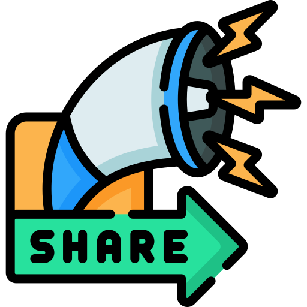

# Sharing Mixtapes

{ align=right width="90" }

Sharing a mixtape in Mixtape Society recreates the joy of handing over a physical cassette—personal, direct, and full of heart.

How Sharing Works

1. **Save Your Mixtape**

    In the editor, click **Save** (or **Ctrl** + **Enter**). The app instantly generates a unique, permanent public link.

2. **Copy the Link**

    After saving, a shareable URL appears (e.g., https://yourdomain.com/share/my-favorite-songs_20251217_abcd1234). Copy it to your clipboard.

3. **Send It Anywhere**

    Share via email, text, social media, or messaging apps—no app download or account required for recipients.

4. **What Recipients See**

    Anyone with the link opens a beautiful, standalone player: full tracklist, cover art, play/pause, seeking, and next/previous controls. It works perfectly on desktop, phone, or tablet.

## Key Features

- No login required — Recipients stream directly in their browser.
- Permanent links — They never expire (unless you delete the mixtape).
- Privacy control — Links are unguessable; only people you share with can access.
- Mobile-friendly — Responsive design for easy listening on the go.
- Future ideas → QR codes for quick scanning (coming soon!).

!!! tip "Pro Tip"
Pair your link with a personal message: "Made this mixtape thinking of you—hope it brings back good memories! 🎧"

Sharing is the heart of Mixtape Society. Go make someone's day with your perfect playlist! 🚀
