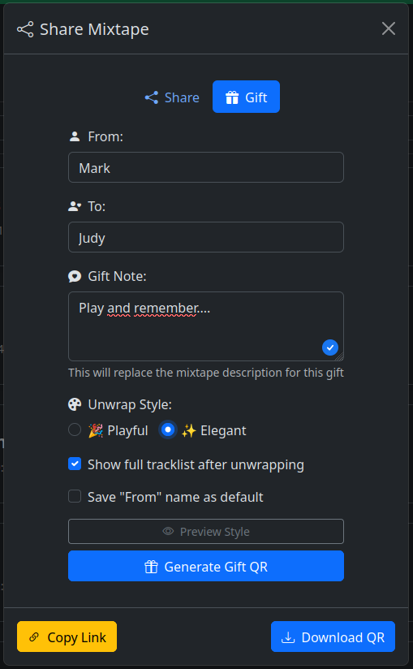

{ align=right width="90" }

# Sharing Your Mixtapes

You've created the perfect mixtape—now it's time to share it! Mixtape Society gives you flexible options to match any occasion, from casual links to beautifully themed gift experiences.

---

## 🎯 Quick Overview

After saving your mixtape, you have three sharing options:

| Method | Best For | Recipient Experience |
| ------ | -------- | ------------------- |
| **Quick Share** | Casual sharing, messaging apps | Direct to player |
| **Gift Experience** | Special occasions, surprises | Themed landing page |
| **QR Code** | Physical gifts, events | Scan to access |

---

## 📱 Getting Your Share Link

### Save Your Mixtape

1. In the editor, click **Save** (or press **Ctrl** + **Enter**)
2. The app generates a unique, permanent public link
3. The sharing modal appears automatically

### The Share Link Format

Your link will look like:

```
https://yourdomain.com/share/summer-vibes_20251217_abcd1234
```

- **Slug:** Human-readable title (`summer-vibes`)
- **Date:** When created (`20251217`)
- **ID:** Random unique identifier (`abcd1234`)

This format ensures:

- Links are memorable
- No conflicts with other mixtapes
- Privacy through unguessable IDs

---

## 🔗 Quick Share (Simple Link)

Perfect for everyday sharing via text, email, or messaging apps.

<figure markdown="span">
    
</figure>

### When to Use

- Sharing with friends casually
- Social media posts
- Quick "check this out" moments
- Group chats or Discord servers
- Email newsletters

### How It Works

1. Click **Copy Link** in the share modal
2. Paste anywhere you can share URLs
3. Recipients click and start listening immediately

### What Recipients See

- Direct access to the player
- Full track listing
- Cover art display
- All playback controls
- No login or signup required

### Sharing Tips

!!! tip "Add Context"
    When sharing links, add a personal message: "Made this thinking of our road trip! Hope you enjoy! 🎵"

---

## 🎁 Gift Experience (Themed Landing Page)

Transform your mixtape into a memorable gift with a beautiful themed landing page.

### Choosing a Theme

<figure markdown="span">
    
</figure>

#### Playful Theme

<figure markdown="span">
    
</figure>

**Best for:**

- Birthday mixtapes
- Party playlists
- Fun, upbeat collections
- Celebrations and happy occasions
- Friends and casual gifts

**Design characteristics:**

- Vibrant colors
- Energetic feel
- Casual, fun typography
- Playful animations

#### Elegant Theme

<figure markdown="span">
    
</figure>

**Best for:**

- Anniversary mixtapes
- Romantic collections
- Meaningful milestone gifts
- Heartfelt messages
- Sophisticated occasions

**Design characteristics:**

- Refined, minimalist design
- Elegant typography
- Subtle animations
- Timeless aesthetic

### How to Create a Gift Link

1. Save your mixtape
2. In the share modal, select **Gift Experience**
3. Choose **Playful** or **Elegant** theme
4. Copy the generated gift link
5. Share with your recipient

### What Recipients Experience

1. **Landing Page** - Beautiful themed page with your cover art
2. **Liner Notes** - Your personal message displayed prominently
3. **"Unwrap" Button** - Playful theme shows "Unwrap Your Gift"
4. **"Open" Button** - Elegant theme shows "Open Mixtape"
5. **Player Reveal** - Smooth transition to the full player

### Gift Link Tips

!!! tip "Maximize Impact"
    - Write heartfelt liner notes for the landing page
    - Choose cover art that complements the theme
    - Match the theme to the mixtape's emotional tone
    - Send with anticipation: "I made you something special..."

!!! example "Perfect Occasions"
    **Playful Theme:**
    - "Your 30th Birthday Bangers"
    - "Summer BBQ Essentials"
    - "Workout Energy Boost"
    - "Road Trip Mix Vol. 3"

    **Elegant Theme:**
    - "Our First Year Together"
    - "For Your Wedding Day"
    - "In Memory of..."
    - "Welcome to the World, Baby Emma"

---

## 📷 QR Codes

Perfect for bridging digital and physical sharing experiences.

### Download Options

When you select QR code sharing, you can download:

1. **Simple QR Code** - Black and white, for printing
2. **Enhanced QR Code** - Includes cover art and title

### Use Cases

#### Greeting Cards

1. Download enhanced QR code
2. Print on cardstock or photo paper
3. Include in birthday, anniversary, or thank-you card
4. Recipient scans with phone camera
5. Instant access to your mixtape

**Card ideas:**

- "Scan to hear why you're amazing"
- "Your birthday soundtrack awaits"
- "Open when you need a smile ♪"

#### Physical Gifts

**Gift Tags:**

- Attach QR code tag to wrapped presents
- Include with flower arrangements
- Add to gift baskets
- Accompany jewelry or other presents

**Printable Booklet:**

- Cover art on front
- QR code on back
- Track listing inside
- Liner notes with personal messages
- Song-by-song explanations

#### Events & Parties

**Party Materials:**

- Table tent cards with QR codes
- Guests scan to access party playlist
- Everyone can cast to speakers
- Creates shared listening experience

**Wedding Favors:**

- Custom cards for each guest table
- Reception playlist access
- Couple's love story in songs
- Memorable keepsake

**Venue Signage:**

- Large QR code prints
- Background music at gatherings
- Gallery opening soundtracks
- Pop-up shop ambiance

#### Creative Implementations

**Photo Album:**

- Add QR codes to physical photo albums
- "Soundtrack to Our Vacation"
- Each section has matching music

**Care Packages:**

- Include QR code in mail packages
- Adds emotional soundtrack
- Perfect for long-distance relationships

**Memory Books:**

- Scrapbooks with embedded QR codes
- Songs that capture moments
- Multi-sensory memories

### QR Code Tips

!!! tip "Print Quality"
    - Use high DPI (300+) for clarity
    - Test scan before mass printing
    - Ensure good contrast
    - Leave white border around QR code

!!! tip "Physical Placement"
    - Make QR codes prominent and obvious
    - Include text: "Scan me!" or "Tap to play"
    - Ensure good lighting where placed
    - Consider phone access angle

---

## 🔒 Privacy & Access Control

### What You Control

**Link Privacy:**

- Links use random IDs that can't be guessed
- No public directory of mixtapes
- Only people with the link can access
- Same link works for all sharing methods

**Lifetime Management:**

- Links are permanent by default
- Never expire automatically
- Delete mixtape to revoke all access
- No time limits or view counts

**Content Control:**

- Edit mixtape anytime
- Changes reflect immediately for all recipients
- Same link works after edits
- Update cover, tracks, or liner notes freely

### What Recipients See

**No Personal Data:**

- No tracking of who listens
- No analytics or view counts
- No IP address logging
- Complete privacy for recipients

**No Barriers:**

- No login required
- No account creation
- No email collection
- No cookies (beyond essential playback)

### Sharing Best Practices

!!! warning "Share Responsibly"
    While links are hard to guess, anyone who receives the link can access the mixtape. Only share with people you trust, or delete the mixtape when you want to revoke access.

!!! tip "Sensitive Content"
    If sharing mixtapes with personal or sensitive liner notes:
    - Consider who might forward the link
    - Use private communication channels
    - Remember that recipients can share further
    - Delete when no longer needed

---

## 🎨 Creative Sharing Ideas

### Occasions

**Birthdays:**

- Curate songs from their birth year
- Include memories from each decade
- Theme: their favorite genre journey
- Playful gift theme

**Anniversaries:**

- Songs from key relationship moments
- "Our Story in 15 Songs"
- Include first dance, first concert, etc.
- Elegant gift theme

**Graduations:**

- Motivational anthems
- Songs about new beginnings
- Advice in liner notes
- Playful theme with inspiring message

**New Baby:**

- Lullabies and soft songs
- Welcome messages in liner notes
- Gift QR code with baby blanket
- Elegant theme for sentimental touch

**Breakups/Support:**

- Healing playlist for friends
- Empowering anthems
- "You've Got This" message
- Simple link with supportive text

### Long Distance

**Monthly Musical Letters:**

- Create new mixtape each month
- Share your current mood through music
- Liner notes as voice memo-style updates
- Builds ongoing soundtrack to relationship

**Time Capsule:**

- Create mixtape of current favorites
- Seal with message: "Open in 5 years"
- Document this moment in time
- Use elegant theme for gravitas

### Work & Professional

**Team Building:**

- Collaborative office playlist
- QR codes at desks
- Shared listening during lunches
- Builds team culture

**Store/Business Ambiance:**

- Curated brand soundtrack
- QR code at entrance
- Customers can take the vibe home
- Memorable brand experience

---

## 🔄 After Sharing

### Editing Shared Mixtapes

**You can always:**

- Add or remove tracks
- Reorder the sequence
- Update cover art
- Revise liner notes
- Change the title

**Recipients see:**

- Updates immediately
- Same link continues working
- No re-sharing needed

### Managing Your Collection

**Track what you've shared:**

- Review all mixtapes in browse view
- See creation dates
- Organize by audience or occasion
- Delete when no longer needed

### Removing Access

**To stop sharing:**

1. Go to browse page
2. Find the mixtape
3. Click delete
4. Confirm deletion
5. All links immediately stop working

!!! info "Deletion is Permanent"
    Once deleted, the mixtape and all its data are gone. Recipients can no longer access it. There's no recovery—make sure you're ready!

---

## ❓ Common Questions

### How long do links last?

Links are permanent and never expire unless you delete the mixtape.

### Can I see who's listening?

No, we don't track listeners. Privacy is built-in for both you and recipients.

### Can I change a mixtape after sharing?

Yes! Edit anytime. The link stays the same, and recipients see updates immediately.

### Can I use multiple sharing methods for one mixtape?

Absolutely! Generate a simple link for one friend, a gift link for another, and a QR code for a card—all for the same mixtape.

### What if someone shares my link publicly?

Anyone with the link can access it. If this happens, delete the mixtape to revoke all access, then create a new one to share privately again.

### Can I password-protect a mixtape?

Not currently. Access control is through link privacy only (unguessable URLs).

### Do I need to reshare after editing?

No! Edits appear immediately for everyone who has the link. The URL never changes.

---

## 📚 Related Guides

- **[Editor Guide](editor.md)** - Learn to create amazing mixtapes
- **[Collection Management](collection-management.md)** - Manage your music library
- **[Recipient's Guide](../recipients/index.md)** - How friends experience your mixtapes

---

Share the joy of music! 🎵
