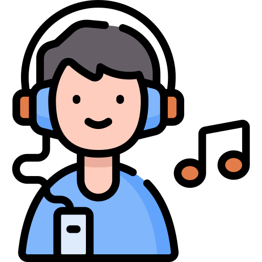
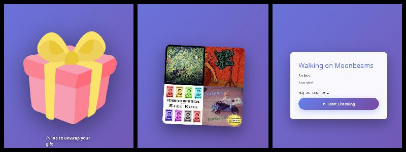
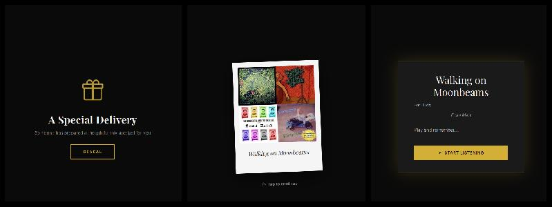

{ align=right width="90" }

# Getting Started for Recipients

Someone shared a mixtape with you! This quick guide will help you open it and start listening in seconds.

---

## 🎧 The Basics

### No Account Needed

**You don't need to:**

- ❌ Create an account
- ❌ Download an app
- ❌ Sign up for anything
- ❌ Enter personal information

**You just need to:**

- ✅ Click the link
- ✅ Press play
- ✅ Enjoy!

---

## 📱 Opening Your Mixtape

### Method 1: Direct Link

The most common way to receive a mixtape is through a simple link.

**You might receive it via:**

- Text message (SMS/iMessage/WhatsApp)
- Email
- Social media (Instagram, Facebook, Twitter)
- Messaging apps (Discord, Slack, Telegram)

**To open:**

1. **Tap or click the link**
2. Your browser opens automatically
3. The mixtape player loads
4. Hit **▶️ Play**

**Example link:**

```http
https://mixtape.example.com/share/summer-vibes_20251217_abcd1234
```

!!! tip "Works Everywhere"
    The link opens in any web browser on any device—phone, tablet, or computer. No special app needed!

---

### Method 2: Gift Landing Page

Some mixtapes come with a special themed landing page designed to feel like unwrapping a gift.

**What you'll see:**

<figure markdown="span">
    
</figure>

<figure markdown="span">
    
</figure>

**Two possible themes:**

**Playful Theme:**

- Bright, energetic design
- "Unwrap Your Gift" button
- Perfect for celebrations and fun occasions

**Elegant Theme:**

- Sophisticated, refined design
- "Open Mixtape" button
- Perfect for heartfelt or romantic occasions

**How it works:**

1. Click the link
2. See the beautiful landing page with cover art
3. Read the personal message (liner notes)
4. Click **"Unwrap Your Gift"** or **"Open Mixtape"**
5. The player appears and you can start listening

!!! note "Special Moment"
    The creator chose this gift experience to make receiving the mixtape feel special. Take a moment to appreciate the presentation!

---

### Method 3: QR Code

You might receive a QR code on a card, gift, or event material.

**How to scan:**

**iPhone/iPad:**

1. Open the **Camera** app
2. Point at the QR code
3. A notification appears at the top
4. Tap the notification
5. Mixtape opens in Safari

**Android:**

1. Open the **Camera** app (or Google Lens)
2. Point at the QR code
3. A link appears or notification pops up
4. Tap to open
5. Mixtape opens in Chrome

**No camera app working?**

- Try Google Lens app
- Many messaging apps can scan QR codes
- Ask the sender for the direct link instead

!!! tip "Test Your Scanner"
    If you've never scanned a QR code before, try scanning one now to test your camera app. Most modern phones can scan QR codes without any additional app.

---

## 🌐 Browser Compatibility

### Works Best In

**iPhone/iPad:**

- ✅ **Safari** (recommended for AirPlay)
- ✅ Chrome
- ✅ Firefox
- ✅ Edge

**Android:**

- ✅ **Chrome** (recommended for Chromecast)
- ✅ Firefox
- ✅ Edge
- ✅ Samsung Internet

**Desktop (Windows/Mac/Linux):**

- ✅ Chrome
- ✅ Firefox
- ✅ Safari (Mac)
- ✅ Edge
- ✅ Opera

### Browser Requirements

**Minimum versions:**

- Chrome 90+
- Firefox 88+
- Safari 14+
- Edge 90+

!!! warning "Update Your Browser"
    If the mixtape won't load, your browser might be outdated. Update to the latest version for the best experience.

---

## 📊 What You'll See

### The Player Interface

When the mixtape loads, you'll see:

**Main Elements:**

- 🎨 **Album art** - Cover image chosen by creator
- ▶️ **Play button** - Start/pause playback
- 📜 **Track listing** - All songs in the mixtape
- ⏱️ **Progress bar** - See how far through the track
- 🔊 **Volume control** - Adjust playback volume
- ⏭️ **Skip buttons** - Next/previous track

**Additional Features:**

- 🔀 Shuffle mode
- 🔁 Repeat options
- 📊 Quality settings
- 📡 Cast button (if available)

### Track Information

**For each track you'll see:**

- Track number
- Song title
- Artist name
- Album name (if available)
- Duration

**Currently playing:**

- Highlighted in track list
- Shows progress
- Displays on lock screen (mobile)

---

## 🎵 Your First Listen

### Recommended Steps

1. **Get comfortable**
   - Find a quiet moment
   - Put on headphones or connect to speakers
   - Settle in for the experience

2. **Read the liner notes** (if present)
   - The creator may have left a personal message
   - Explains why they made this mixtape
   - Adds context to song choices

3. **Listen in order** (first time)
   - The creator carefully arranged the flow
   - Songs transition with intention
   - Experience it as designed

4. **Enjoy!**
   - Relax and appreciate the music
   - Notice how songs connect
   - Let it play through

!!! tip "Save for Later"
    Love the mixtape? Bookmark the link or add it to your home screen so you can come back anytime!

---

## 📱 Add to Home Screen

Save the mixtape for quick access like an app.

### iPhone/iPad

1. Open the mixtape in **Safari**
2. Tap the **Share** button (square with arrow)
3. Scroll and tap **"Add to Home Screen"**
4. Name it (e.g., "Sarah's Mixtape")
5. Tap **Add**
6. Icon appears on your home screen

### Android

1. Open the mixtape in **Chrome**
2. Tap the **⋮ menu** (three dots)
3. Tap **"Add to Home screen"**
4. Name it and tap **Add**
5. Icon appears in your app drawer

**Benefits:**

- ✅ Quick access from home screen
- ✅ Looks like a real app
- ✅ No need to find the link again
- ✅ Full-screen experience

---

## 💡 Quick Tips

### For Best Quality

**On WiFi:**

- Use **Original** or **High** quality
- Better sound with good headphones
- Streams without buffering

**On Mobile Data:**

- Use **Medium** quality (default)
- Switch to **Low** if connection is slow
- Watch your data usage

### For Best Experience

**Headphones:**

- ✅ Use good quality headphones
- ✅ Ensure proper fit
- ✅ Try different EQ settings on your device

**Speakers:**

- ✅ Cast to Chromecast or AirPlay
- ✅ Connect via Bluetooth
- ✅ Use quality speakers when possible

**Environment:**

- ✅ Find a quiet space for first listen
- ✅ Minimize distractions
- ✅ Give it your full attention

---

## 🔊 Playing on Other Devices

Want to play on your TV or better speakers?

### Quick Options

**Chromecast** (Android/Chrome)

- Look for the cast icon (📡)
- Tap to select your device
- [Full Chromecast guide →](streaming.md#-chromecast)

**AirPlay** (iPhone/iPad/Mac)

- Tap the AirPlay icon
- Select your Apple TV or HomePod
- [Full AirPlay guide →](streaming.md#-airplay-apple-devices)

**Android Auto** (in car)

- Connect phone to car
- Mixtape appears automatically
- [Full Android Auto guide →](streaming.md#-android-auto)

---

## 📶 Connection Requirements

### Internet Connection

**You need:**

- Active internet connection (WiFi or mobile data)
- Stable connection for smooth playback

**Data usage:**

- **Original quality:** ~10MB per song
- **High quality:** ~7MB per song
- **Medium quality:** ~5MB per song
- **Low quality:** ~3MB per song

!!! warning "Offline Playback"
    Currently, mixtapes cannot be played offline. You must have an internet connection to stream.

### Speed Recommendations

**Minimum:**

- 1 Mbps for Low quality
- 2 Mbps for Medium quality

**Recommended:**

- 5 Mbps for High quality
- 10 Mbps for Original quality

**If playback stutters:**

- Switch to lower quality
- Move closer to WiFi router
- Close other apps using internet
- Pause and let it buffer

---

## ❓ Quick Troubleshooting

### Link Won't Open

**Try:**

1. Copy and paste link into browser directly
2. Try a different browser
3. Check your internet connection
4. Ask sender to re-send the link
5. Ensure link wasn't truncated in message

### Player Won't Load

**Try:**

1. Refresh the page
2. Clear browser cache
3. Update your browser
4. Try different browser
5. Disable browser extensions temporarily

### No Sound

**Check:**

1. Device volume is up
2. Not muted in browser
3. Headphones are plugged in correctly
4. Bluetooth is connected (if using wireless)
5. Browser has permission to play audio

### Playback Keeps Stopping

**Solutions:**

1. Switch to lower quality setting
2. Pause and let it buffer
3. Check internet connection
4. Close other apps/tabs
5. Move closer to WiFi router

---

## 🎁 Showing Appreciation

Love the mixtape? Let the creator know!

**Great ways to respond:**

- 💬 Send a thank you message
- 🎵 Share your favorite track
- ❤️ Tell them which moments hit hardest
- 🎨 Comment on their song choices
- 🎵 Create one back for them!

**Example messages:**

- "Track 5 made me cry. Thank you ❤️"
- "This is perfect for my morning runs!"
- "How did you know I needed this today?"
- "The flow from track 3 to 4 is *chef's kiss*"

---

## 📚 Learn More

**Next Steps:**

- **[Player Guide](player.md)** - Master all player features
- **[Streaming Guide](streaming.md)** - Cast to TVs and speakers
- **[FAQ](faq.md)** - Common questions answered

**Need Help?**

- Check the FAQ for common issues
- Ask the person who sent you the mixtape
- Ensure your browser is updated

---

## 💭 Want to Create Your Own?

Recipients can't create mixtapes—you'd need access to a Mixtape Society server.

**Your options:**

1. **Ask the creator** if you can use their server
2. **Set up your own** (requires music library and Docker)
3. **Find a friend** who runs a server

[Learn about becoming a creator →](../creators/index.md)

---

Enjoy your mixtape! 🎵
